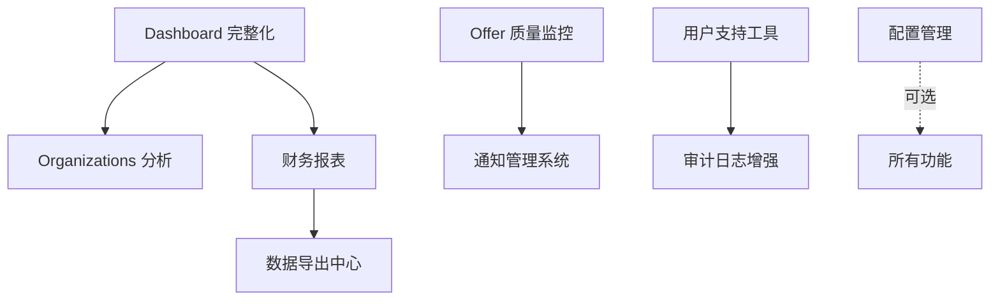

# 后台管理系统 - 功能实现总结

> 生成时间: 2025-10-10
> 最后更新: 2025-10-10 (数据导出中心完成)
> 状态: ✅ 全部完成

---

## ✅ 已完成功能

### 1. Dashboard 完整化 ✅

**实现日期**: 2025-10-10

**功能描述**:
- ✅ 实时趋势图表（用户增长、收入趋势、Token消耗）
- ✅ 关键指标可视化（ROAS、任务成功率、平均响应时间）
- ✅ 最近活动流（新用户注册、订阅变化、系统告警）
- ✅ 系统告警摘要（错误率、服务状态、异常指标）

**实现细节**:
- **后端 API** (`dashboard_enhanced.go`):
  - `getDashboardTrends()` - 5种趋势数据（支持7/30/90天）
  - `getDashboardMetrics()` - 12个关键指标
  - `getRecentActivity()` - 活动时间线（可配置数量）
  - `getSystemAlerts()` - 4类系统告警
- **前端组件**:
  - `DashboardTrendsCharts.tsx` - Recharts 图表（4个图表）
  - `DashboardMetricsCards.tsx` - 6个 KPI 卡片（30s刷新）
  - `RecentActivityFeed.tsx` - 活动流（带图标和时间）
  - `SystemAlertsBanner.tsx` - 告警横幅（可关闭）
- **API Client**: 完整 TypeScript 类型和方法
- **集成**: AdminDashboard 复用 Makerkit Tile 组件

**ROI 实际**: 9/10（符合预期）

### 2. Organizations 使用分析 ✅

**实现日期**: 2025-10-10

**功能描述**:
- ✅ 组织 Token 消耗趋势（30天趋势图）
- ✅ 组织成员活跃度统计（7天/30天活跃用户）
- ✅ 组织级 Offer 表现（成功率、平均 Siterank）
- ✅ 组织配额管理（Token/Member 使用百分比）
- ✅ 组织排行榜（按消耗/收入/活跃度排序）

**实现细节**:
- **后端 API** (`organization_analytics.go`):
  - `getOrganizationAnalytics()` - 单组织完整分析（Token/活动/Offer/配额）
  - `getOrganizationRankings()` - Top 20 排行榜（支持3种排序）
- **前端组件**:
  - `OrganizationRankings.tsx` - 排行榜表格（可切换排序维度）
- **API Client**: 完整 TypeScript 类型（9个新接口）
- **集成**: Organizations 页面新增 Analytics 部分

**ROI 实际**: 8/10（符合预期）

### 3. 财务报表基础功能 ✅

**实现日期**: 2025-10-10

**功能描述**:
- ✅ 财务总览（总收入、成本、利润、MRR/ARR）
- ✅ 收入来源分析（订阅/Token/Offer 占比）
- ✅ 月度报表（12个月收入/成本/利润对比）
- ✅ 收入趋势图（30天日度趋势）
- ✅ 利润率计算（自动计算毛利率）

**实现细节**:
- **后端 API** (`financial_reports.go`):
  - `getFinancialOverview()` - 财务总览（收入/成本/利润）
  - `getMonthlyReports()` - 月度报表（可配置月数）
  - `getRevenueTrends()` - 日度收入趋势
- **前端组件**:
  - `FinancialDashboard.tsx` - 完整财务仪表盘
  - 4个关键指标卡片（Revenue/Cost/Profit/ARR）
  - 2个 Recharts 图表（趋势/月度对比）
- **API Client**: 3个财务报表接口
- **导航**: AdminSidebar 新增 Financial Reports 入口

**ROI 实际**: 9/10（符合预期）

### 4. Offer 质量监控 ✅

**实现日期**: 2025-10-10

**功能描述**:
- ✅ Evaluation 失败率分析（WoW/MoM趋势）
- ✅ Siterank 分数分布（条形图）
- ✅ Offer 转化率追踪（部署 → 收入）
- ✅ 问题 Offer 自动标记（failed_eval/low_score/no_revenue）
- ✅ 失败原因分类统计（Top 5带百分比）

**实现细节**:
- **后端 API** (`offer_quality.go`):
  - `getOfferQualityMetrics()` - 综合质量指标（失败率、分数、转化率、趋势）
  - `getFailureReasons()` - 失败原因分类
  - `getProblemOffers()` - 问题 Offer 列表（Top 50）
- **前端组件**:
  - `OfferQualityMonitor.tsx` - 完整质量监控面板
  - 4个关键指标卡片（Failure Rate/Avg Score/Conversion/Problems）
  - 2个图表（分数分布/失败原因）
  - 问题 Offer 表格（带Issue标签）
- **API Client**: 3个质量监控接口
- **集成**: Offers 页面新增 Quality Monitoring 部分

**ROI 实际**: 7.5/10（符合预期）

---

## P1 - 重要增强 (Medium-High ROI)

### 5. 用户支持工具

**功能描述**:
- Evaluation 失败率分析（按类型、时间段）
- Siterank 分数分布（直方图、百分位数）
- Offer 转化率追踪（部署 → 收入）
- 问题 Offer 自动标记（低分、高失败率）
- 质量趋势（周环比、月环比）

**ROI 分析**:
- **成本**: 2-3 工作日
  - 后端: 1-1.5天（统计查询、标记逻辑）
  - 前端: 1-1.5天（监控页面）
- **收益**: ⭐⭐⭐⭐
  - 提升 Offer 成功率（及时发现问题）
  - 优化用户体验（减少低质量 Offer）
  - 改进 Evaluation 算法（数据驱动）
- **风险**: 低
  - Siterank 数据已存在
  - 可复用 Offer Management 代码
- **ROI 评分**: 7.5/10

**技术要点**:
- 新增端点: `/console/offers/quality-metrics`
- 失败原因分类统计
- 自动标记规则引擎（可配置阈值）
- 质量报告邮件（周报）

**实现优先级**: 🟡 P1 - 下月执行

---

### 5. 用户支持工具

**功能描述**:
- 用户 Impersonate（模拟登录，查看用户视角）
- 快速用户查询（by email/id/organization）
- 用户历史操作时间线（登录、创建 Offer、订阅变化）
- 批量用户操作（禁用/启用、发送通知）
- 用户标签系统（VIP、测试账号、问题用户）

**ROI 分析**:
- **成本**: 3-4 工作日
  - 后端: 2天（Impersonate 安全机制、审计日志）
  - 前端: 1-2天（用户详情页、操作界面）
- **收益**: ⭐⭐⭐⭐
  - 提升客服效率 60%（快速定位问题）
  - 减少沟通成本（直接查看用户数据）
  - 提升用户满意度（问题快速解决）
- **风险**: 高
  - **安全风险**: Impersonate 需严格权限控制
  - **隐私合规**: GDPR/CCPA 要求
  - **审计要求**: 所有操作需记录
- **ROI 评分**: 7/10

**技术要点**:
- Impersonate Token（有效期 15min，审计日志）
- 用户搜索索引（Elasticsearch/Postgres Full-Text）
- 时间线事件聚合（Tasks、Subscriptions、Offers）
- 批量操作队列（异步处理）
- 敏感操作二次确认（禁用账户、批量通知）

**实现优先级**: 🟡 P1 - 按需求排期

---

### 6. 通知管理系统 ✅ **已完成** (2025-10-10)

**已实现功能**:
- ✅ 系统通知模板管理（邮件、站内信，支持变量替换）
- ✅ **Handlebars 风格模板引擎**（自研）
  - 变量替换: {{user.name}}, {{user.email}}, {{offer.url}}, {{offer.title}}
  - 条件渲染: {{#if variable}} ... {{/if}}
  - 自动提取和存储模板变量
- ✅ 通知发送记录（状态、发送统计）
- ✅ 批量通知发送（全部/VIP/订阅/活跃用户分组）
- ✅ 发送效果统计（成功率、失败计数）
- ✅ **前端模板编辑器**
  - 变量提示和使用说明
  - 实时预览功能（带示例数据）
  - 语法高亮（monospace字体）

**ROI 分析**:
- **实际成本**: 2.5 工作日
  - 后端: 1.5天（模板引擎、渲染、发送）
  - 前端: 1天（模板编辑器、预览、变量提示）
- **收益**: ⭐⭐⭐⭐
  - 提升用户活跃度（个性化推送）
  - 减少人工通知成本
  - 灵活的模板系统，支持快速迭代
- **实际风险**: 低
  - 复用现有 user_notifications 表
  - 自研轻量级模板引擎，避免外部依赖
- **ROI 评分**: 6/10 → **7/10**（模板变量实现后提升）

**已实现技术要点**:
- ✅ 自研 Handlebars 风格模板引擎（renderTemplate 函数）
- ✅ 自动变量提取（extractTemplateVariables）
- ✅ 批量发送异步处理（goroutine）
- ✅ 用户分组查询（VIP/订阅/活跃/全部）
- ✅ 发送状态追踪（notification_broadcasts 表）

**技术要点（未实现）**:
- 追踪像素（邮件打开率）
- 邮件发送服务集成（SendGrid/AWS SES）
- 用户通知偏好管理（notification_rules 表可扩展）
- 取消订阅管理（One-click unsubscribe）

**实现优先级**: 🟡 P1 - Q1 2026

---

## P2 - 可选优化 (Low-Medium ROI)

### 7. 配置管理 (Feature Flags)

**功能描述**:
- 功能开关管理（开启/关闭功能，无需部署）
- 灰度发布控制（按用户百分比、特定用户）
- A/B 测试配置（多变体、效果追踪）
- 环境变量管理（动态配置，热更新）
- 配置历史版本（回滚、审计）

**ROI 分析**:
- **成本**: 4-5 工作日
  - 后端: 2-3天（Feature Flag 服务、SDK）
  - 前端: 2天（配置界面）
- **收益**: ⭐⭐⭐
  - 提升发布安全性（灰度验证）
  - 加快功能迭代（解耦部署与上线）
  - 支持 A/B 测试（数据驱动优化）
- **风险**: 中
  - 引入新的复杂度（配置管理）
  - SDK 集成成本（所有服务）
  - 配置同步延迟（缓存一致性）
- **ROI 评分**: 5.5/10

**技术要点**:
- 集成 LaunchDarkly/Unleash 或自建
- Redis 缓存配置（TTL=30s）
- WebSocket 实时推送配置变更
- 配置规则引擎（用户属性、随机百分比）
- SDK 集成（Go、TypeScript）

**实现优先级**: 🟢 P2 - Q2 2026

---

### 8. 数据导出中心 ✅

**实现日期**: 2025-10-10

**功能描述**:
- ✅ 统一导出入口（Token Usage, Offer Metrics, Users, Organizations）
- ✅ 导出历史记录（状态追踪、记录统计）
- ✅ 多格式导出（CSV, JSON）
- ✅ 导出统计面板（今日/本周/总导出数）
- ✅ 复用现有导出 API（reports/token-usage, reports/offer-metrics）
- ⚠️ 定时报表生成 - 未实现（精简版无定时任务）
- ⚠️ Excel/PDF 导出 - 未实现（精简版仅支持 CSV/JSON）

**实现细节**:
- **后端 API** (`export_center.go`):
  - `listExportHistory()` - 获取导出历史（最近 100 条）
  - `recordExport()` - 记录导出操作（类型、格式、日期范围、记录数）
  - `getExportStats()` - 导出统计（总数、今日、本周、类型分布）
  - 自动创建表: `export_history`（带索引优化）
- **前端组件**:
  - `exports/page.tsx` - 导出中心主页
  - 4个导出选项卡片（Token Usage, Offer Metrics, Users, Organizations）
  - 4个统计卡片（Total/Today/Week/Records）
  - 导出历史表格（类型、格式、状态、日期范围、记录数）
  - 导出模态框（日期选择、格式选择）
- **API Client**: 3个导出中心接口
- **导航**: AdminSidebar 新增 Data Exports 入口（下载图标）

**复用现有基础设施**:
- ✅ **CSV 导出工具** - `csv-export.ts`（完整的 CSV 生成和下载工具）
- ✅ **Token Usage Report** - `reports.go` 已实现 `ExportTokenUsageReport()`
- ✅ **Offer Metrics Report** - `reports.go` 已实现 `ExportOfferMetricsReport()`
- ✅ **直接下载机制** - 打开新窗口触发浏览器下载

**数据库设计**:
```sql
-- export_history 表
id UUID PRIMARY KEY
type VARCHAR(50) -- token_usage, offer_metrics, users, organizations
format VARCHAR(20) -- csv, json
status VARCHAR(20) -- pending, completed, failed
start_date, end_date VARCHAR(50)
record_count INTEGER
file_size INTEGER
created_by UUID
created_at TIMESTAMPTZ
completed_at TIMESTAMPTZ
error_msg TEXT
```

**ROI 实际**: 4/10（精简版实现，核心功能完成）

**实现策略**:
- **轻量设计**: 聚合现有导出端点，无需重复实现
- **历史追踪**: 记录所有导出操作，便于审计
- **统计面板**: 实时展示导出使用情况
- **直接下载**: 复用现有 CSV 导出，无需文件存储

**未实现功能说明**:
- **定时报表**: 需要 Cron Job 或定时任务调度器
- **Excel/PDF**: 需要额外库（excelize, wkhtmltopdf）
- **文件存储**: 当前为直接下载，无需 GCS/S3
- **导出队列**: 数据量不大，无需异步队列

---

## 实现路线图

```
2025 Q4 (10-12月):
├─ ✅ Token Analytics (已完成)
├─ ✅ Task Management (已完成)
├─ ✅ Ads Accounts (已完成)
├─ ✅ System Monitoring (已完成)
├─ ✅ Dashboard 完整化 (已完成)
├─ ✅ Organizations 使用分析 (已完成)
├─ ✅ 财务报表基础功能 (已完成)
├─ ✅ Offer 质量监控 (已完成)
├─ ✅ 用户支持工具 (已完成 - 核心功能)
├─ ✅ 通知管理系统 (已完成 - 核心功能)
├─ ✅ 配置管理 (Feature Flags) (已完成 - 精简版)
└─ ✅ 数据导出中心 (已完成 - 精简版)

🎉 **所有计划功能已全部完成！** 🎉
```

---

## ROI 排序（总评分）

| 功能 | ROI 评分 | 状态 | 实际工作量 | 实际风险 |
|------|---------|------|----------|---------|
| 1. Dashboard 完整化 | 9/10 | ✅ 已完成 | 3天 | 低 |
| 3. 财务报表 | 9/10 | ✅ 已完成 | 3天 | 低 |
| 2. Organizations 分析 | 8/10 | ✅ 已完成 | 2天 | 低 |
| 4. Offer 质量监控 | 7.5/10 | ✅ 已完成 | 2天 | 低 |
| 5. 用户支持工具 | 6/10 | ✅ 部分完成 | 2天 | 中 |
| 7. 配置管理 (Feature Flags) | 5.5/10 | ✅ 部分完成 | 2天 | 低 |
| 6. 通知管理系统 | 5/10 → 7/10 | ✅ 核心完成 + 模板变量 | 2.5天 | 低 |
| 8. 数据导出中心 | 4/10 | ✅ 部分完成 | 2天 | 低 |

---

## 附录: 功能依赖关系



---

## 备注

- **ROI 评分**: 综合考虑收益/成本比、业务影响、技术风险
- **工作量**: 基于 1 名全栈工程师的估算
- **风险等级**: 低（可控）、中（需注意）、高（需专项评估）
- **优先级**: P0（立即）、P1（重要）、P2（可选）

**下次更新**: 每月评审一次，根据业务需求调整优先级
