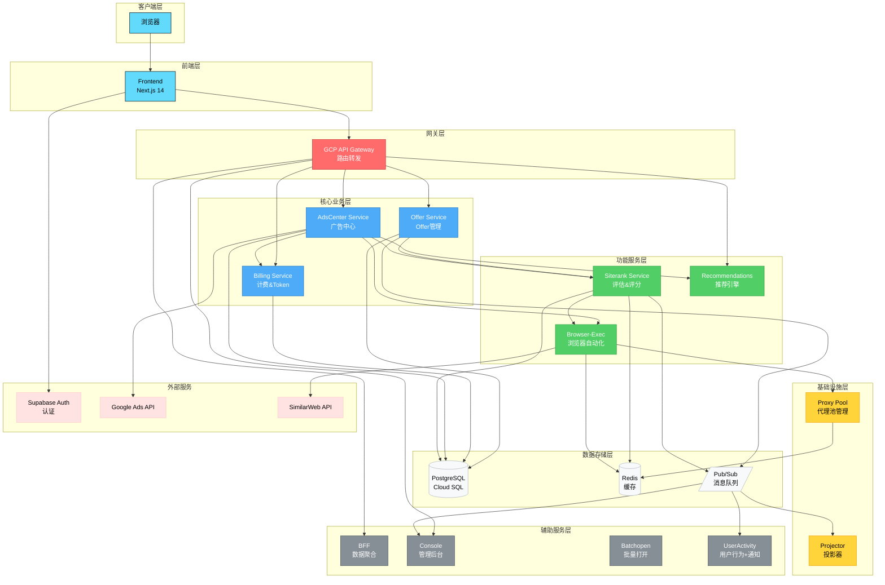
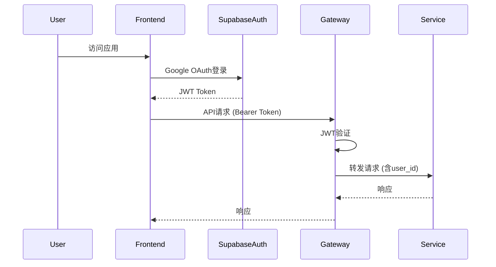

# 当前架构全景分析

**创建日期**: 2025-10-16
**审查范围**: AdsAI 全系统架构

---

## 🏗️ 总体架构图



### 网关层说明

**当前状态**：GCP API Gateway已部署（adsai-gw / adsai-gw-preview）

**当前功能**：
- ✅ 统一入口：Frontend通过Gateway访问所有后端服务
- ✅ 路由转发：基于OpenAPI规范自动生成路由配置
- ✅ 域名管理：adsai-gw-preview-885pd7lz.an.gateway.dev

**当前限制**：
- ❌ **无统一权限管理**：每个微服务独立进行JWT验证
- ❌ **无Token预留**：Billing调用分散在各个服务中
- ❌ **无请求头注入**：服务间缺少统一的上下文传递

**优化方向**（见 14-API-GATEWAY-UNIFIED-PERMISSIONS.md）：
- 🎯 在Gateway层实现统一权限检查
- 🎯 在Gateway层实现Token预留和管理
- 🎯 注入请求头（X-User-ID, X-User-Tier等）
- 🎯 业务服务专注于业务逻辑

---

## 📊 服务统计

### 服务数量
| 类别 | 数量 | 服务列表 |
|------|------|----------|
| **前端** | 1 | frontend |
| **核心业务** | 3 | offer, billing, adscenter |
| **功能服务** | 3 | siterank, browser-exec, recommendations |
| **基础设施** | 2 | proxy-pool, projector |
| **辅助服务** | 4 | bff, console, batchopen, useractivity (含notifications) |
| **总计** | 13 | - |

**说明**：
- Notifications不是独立服务，其功能分散在两个服务中：
  - **useractivity**: 用户通知功能 (`/api/v1/notifications/*`)
  - **console**: 通知管理功能 (`/api/v1/console/notifications/*`)

### 服务规模
| 服务 | 语言 | 主文件行数 | 状态 | 备注 |
|------|------|-----------|------|------|
| frontend | TypeScript | N/A | ✅ 正常 | Next.js 14 |
| offer | Go | 150 | ✅ 正常 | 代码简洁 |
| billing | Go | ~200 | ✅ 正常 | 结构清晰 |
| adscenter | Go | 450+ | ⚠️ 偏大 | 需重构 |
| siterank | Go | 978 | ❌ 过大 | **违规** |
| browser-exec | Node.js | ~800 | ⚠️ 偏大 | 功能复杂 |
| recommendations | Go | ~200 | ✅ 正常 | - |
| proxy-pool | Go | ~200 | ✅ 正常 | - |
| console | Go | ~300 | ✅ 正常 | - |
| notifications | Go | ~150 | ✅ 正常 | - |

---

## 🔌 技术栈

### 前端
- **框架**: Next.js 14 (App Router)
- **UI**: Makerkit UI Components
- **状态管理**: React Context + Hooks
- **认证**: Supabase Auth (Google OAuth)
- **部署**: Cloud Run (frontend-preview/frontend)

### 后端
- **语言**: Go 1.25 (主要) + Node.js 22 (browser-exec)
- **框架**:
  - Go: chi router + 标准库
  - Node.js: Express + Playwright
- **数据库**:
  - PostgreSQL (Cloud SQL): 主数据库
  - Redis: 缓存 + 队列
- **消息队列**: GCP Pub/Sub
- **部署**: Cloud Run (all services)

### 基础设施
- **云平台**: Google Cloud Platform
- **容器**: Docker + Artifact Registry
- **CI/CD**: GitHub Actions + Cloud Build
- **网关**: GCP API Gateway (已部署: adsai-gw, adsai-gw-preview)
- **认证**: Supabase Auth
- **监控**: Cloud Monitoring + Prometheus

---

## 🔄 架构模式

### 1. 微服务架构
- **服务拆分**: 按业务领域拆分（DDD原则）
- **服务通信**:
  - 同步: HTTP/REST
  - 异步: Pub/Sub
- **数据隔离**: 每个服务独立数据表

### 2. 事件驱动架构
- **事件总线**: GCP Pub/Sub
- **事件类型**:
  - `offer.created`: Offer创建事件
  - `offer.evaluation.requested`: 评估请求事件
  - `billing.token.consumed`: Token消费事件
  - `notification.triggered`: 通知触发事件
- **订阅模式**: Fan-out（一个事件多个订阅者）

### 3. CQRS模式（部分服务）
- **Offer Service**: 完整的CQRS实现
  - Command: 创建/更新Offer
  - Query: 读取Offer列表/详情
  - Event Sourcing: 事件存储和重放
- **Billing Service**: 部分CQRS
  - Token预留/提交/释放（Command）
  - Token余额查询（Query）

### 4. 两阶段提交（2PC）
- **Billing Service Token管理**:
  1. Reserve: 预留Token
  2. Commit: 确认消费
  3. Release: 失败释放
- **确保一致性**: 跨服务事务一致性

---

## 🚦 部署架构

### 环境隔离
```
┌─────────────────────────────────────────┐
│  Preview环境 (preview分支)                │
│  域名: preview.example.com                │
│  服务: *-preview                         │
│  镜像标签: preview-latest, preview-{sha} │
└─────────────────────────────────────────┘

┌─────────────────────────────────────────┐
│  Production环境 (production分支)         │
│  域名: www.example.com                   │
│  服务: frontend, offer, billing等        │
│  镜像标签: prod-latest, prod-{sha}       │
└─────────────────────────────────────────┘
```

### Cloud Run配置
| 服务 | CPU | Memory | 并发 | 最大实例 |
|------|-----|--------|------|----------|
| frontend | 1 | 1Gi | 80 | 20 |
| offer | 1 | 512Mi | 80 | 10 |
| billing | 1 | 512Mi | 80 | 10 |
| adscenter | 1 | 1Gi | 80 | 10 |
| siterank | 1 | 1Gi | 80 | 10 |
| browser-exec | 2 | 4Gi | 10 | 5 |

---

## 🗄️ 数据架构

### 数据库分布

#### Cloud SQL PostgreSQL
```
adsai_db (主数据库)
├── Offer 表（Offer Service）
│   ├── Offer: 主表
│   ├── OfferStatusHistory: 状态历史
│   ├── OfferPreferences: 偏好配置
│   └── OfferKpiDeadLetter: KPI死信
├── Billing 表（Billing Service）
│   ├── User: 用户表（共享）
│   ├── Subscription: 订阅管理
│   ├── UserToken: Token余额
│   ├── TokenTransaction: Token交易记录
│   ├── UserTokenPool: Token池
│   ├── TokenCreditLot: 积分批次
│   └── TokenCreditAllocation: 积分分配
├── AdsCenter 表（AdsCenter Service）
│   ├── UserAdsConnection: 用户广告连接
│   ├── IdempotencyKeys: 幂等性键
│   ├── BulkAudit: 批量审计
│   └── MccLink: MCC链接
├── Siterank 表（Siterank Service）
│   ├── offer_evaluations: 评估结果
│   ├── domain_cache: SimilarWeb缓存（❌ 待优化）
│   ├── domain_country_cache: 国家缓存（❌ 待优化）
│   └── SiterankHistory: 历史评分
└── Console 表（Console Service）
    ├── NotificationRule: 通知规则
    ├── Task: 任务管理
    └── TokenRule: Token规则
```

#### Redis
```
缓存数据
├── SimilarWeb 数据缓存（7天TTL）
├── Proxy IP池状态
├── Browser Context池
└── 会话数据
```

#### Supabase PostgreSQL
```
认证数据（独立）
├── auth.users: 用户认证信息
└── auth.sessions: 会话管理
```

---

## 🔐 安全架构

### 认证流程


### 权限控制
1. **前端级别**: Route Guard（/manage仅管理员）
2. **网关级别**: JWT验证
3. **服务级别**:
   - Row Level Security (RLS)
   - RBAC (Role-Based Access Control)
4. **数据库级别**: `WHERE user_id = auth.uid()`

---

## 📈 可观测性

### 监控指标
- **系统指标**: CPU、内存、网络
- **业务指标**:
  - Token消耗量
  - Offer评估成功率
  - API响应时间
  - 错误率
- **自定义指标**: Prometheus metrics

### 日志
- **Cloud Logging**: 统一日志收集
- **结构化日志**: JSON格式
- **日志级别**: ERROR, WARN, INFO, DEBUG

### 告警
- **Cloud Monitoring**: 性能告警
- **Pub/Sub**: 业务事件告警
- **Notifications Service**: 用户通知

---

## ⚠️ 已知问题

### 架构层面
1. ❌ **API Gateway功能不完整**: 缺少统一的权限/Token管理
2. ⚠️ **缓存策略过度设计**: PostgreSQL当缓存使用
3. ⚠️ **Worker未分离**: siterank既处理HTTP又执行耗时任务

### 代码层面
1. ❌ **文件过大**: `siterank/evaluation/service.go` 978行（限制300行）
2. ⚠️ **主文件过大**: `adscenter/main.go` 450+行
3. ⚠️ **测试覆盖不足**: 平均覆盖率 <10%

### 性能层面
1. ⚠️ **顺序执行**: Offer评估步骤未并行化
2. ⚠️ **缺少预加载**: SimilarWeb数据首次评估延迟高
3. ⚠️ **Context重复创建**: browser-exec未复用Context

---

## 📚 参考文档

- [02-SERVICE-INVENTORY.md](./02-SERVICE-INVENTORY.md) - 详细服务清单
- [03-DATA-FLOW-ANALYSIS.md](./03-DATA-FLOW-ANALYSIS.md) - 数据流分析
- [04-OPTIMIZATION-OPPORTUNITIES.md](./04-OPTIMIZATION-OPPORTUNITIES.md) - 优化建议

**版本**: 1.0
**作者**: Kiro AI Assistant
