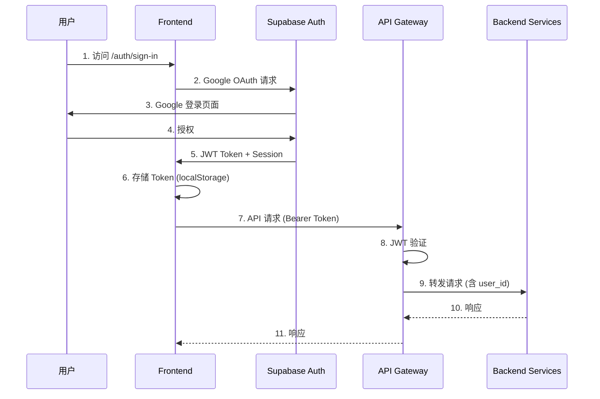
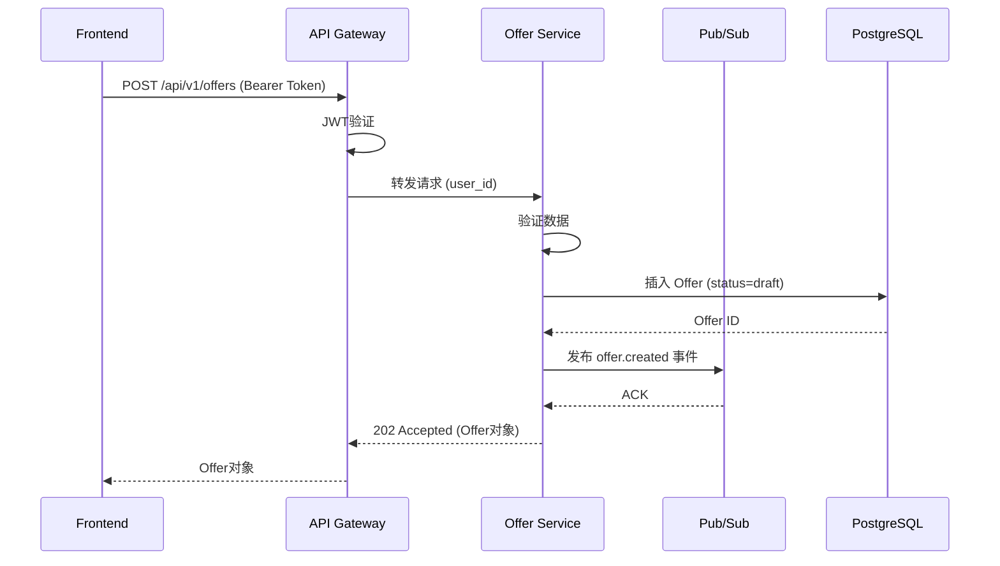
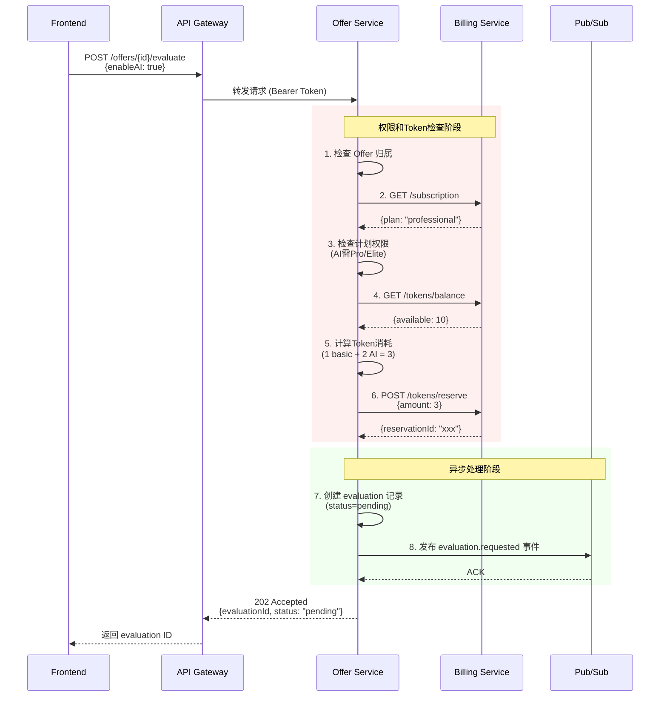
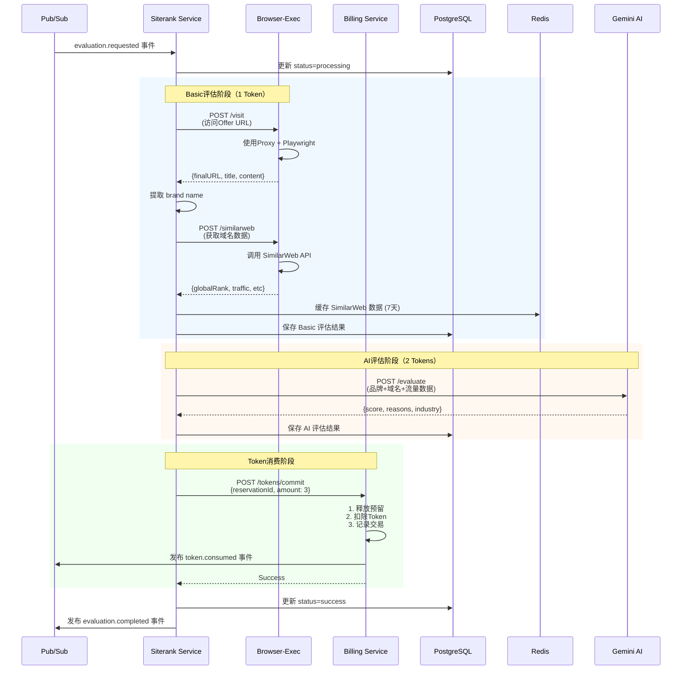
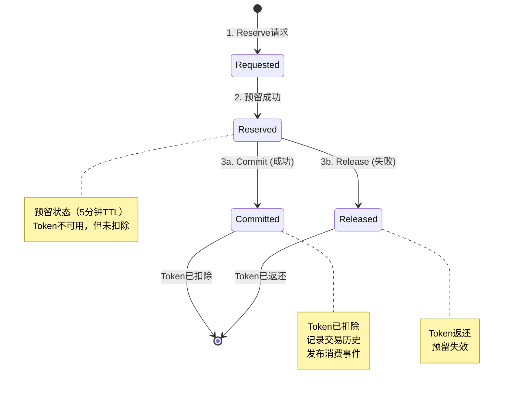
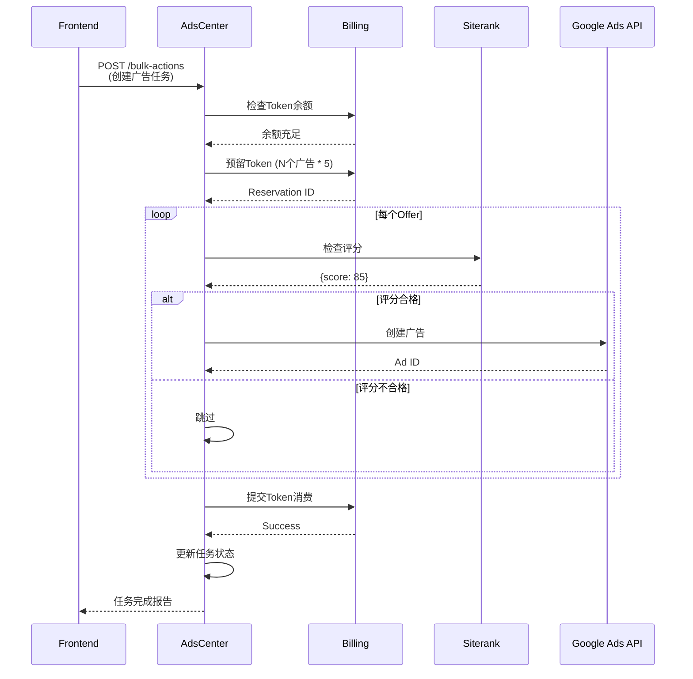

# 数据流与调用链分析

**创建日期**: 2025-10-16
**分析范围**: 核心业务流程的完整数据流

---

## 🔄 核心业务流程

### 1. 用户认证流程



**关键点**:
- ✅ Supabase Auth独立认证，前端无需自建认证系统
- ✅ JWT Token自包含用户信息（user_id, email, role）
- ⚠️ API Gateway仅做JWT验证，未统一管理权限和Token

**数据流时间**:
- Google OAuth: ~2-3秒
- JWT验证: <50ms
- 总认证时间: ~2-3秒

---

### 2. Offer创建流程



**关键点**:
- ✅ 异步创建（202 Accepted），不等待后续处理
- ✅ 事件驱动，解耦后续流程
- ✅ 幂等性保证（Idempotency-Key）

**性能指标**:
- API响应时间: <200ms
- 数据库写入: <50ms
- Pub/Sub发布: <100ms

---

### 3. Offer评估流程（核心流程）

#### 3.1 同步阶段：权限和Token管理



**时间分析**:
| 步骤 | 操作 | 耗时 |
|------|------|------|
| 1 | Offer归属检查 | ~20ms |
| 2-3 | 订阅计划检查 | ~50ms |
| 4-5 | Token余额检查 | ~50ms |
| 6 | Token预留 | ~100ms |
| 7 | 创建evaluation记录 | ~30ms |
| 8 | 发布Pub/Sub事件 | ~50ms |
| **总计** | - | **~300ms** |

**问题识别**:
- ⚠️ Offer服务仅作为"转发器"，价值有限
- ⚠️ 多次HTTP调用billing服务（3次），延迟累加
- ✅ 异步处理，用户体验良好（不等待评估完成）

---

#### 3.2 异步阶段：评估执行



**时间分析**:
| 阶段 | 操作 | 耗时 |
|------|------|------|
| **Basic评估** | | |
| - 访问URL | Browser-Exec | ~5s |
| - 提取brand | 本地计算 | <100ms |
| - SimilarWeb | API调用/缓存 | ~3s / ~50ms |
| **AI评估** | | |
| - Gemini API | AI推理 | ~8s |
| **Token消费** | Billing | ~100ms |
| **数据库写入** | PostgreSQL | ~50ms |
| **总计** | - | **~16s** (缓存命中: ~13s) |

**性能瓶颈**:
1. 🐢 **顺序执行**: 访问URL → SimilarWeb → AI（串行）
2. 🐢 **SimilarWeb首次**: 8秒（无缓存）
3. 🐢 **AI推理**: 8秒（固定）

**优化机会**:
- ⚡ 并行化: 访问URL + SimilarWeb同时执行 → 节省5秒
- ⚡ 预加载: Offer创建时预热SimilarWeb → 节省3秒
- ⚡ API+Worker: 解耦HTTP和后台任务 → 用户感知<1秒

---

### 4. Token管理流程（两阶段提交）



**实现细节**:
```go
// 1. Reserve（预留）
func (s *Service) ReserveTokens(userID string, amount int) (*Reservation, error) {
    tx := s.db.Begin()

    // 检查余额
    balance := s.getBalance(userID)
    if balance < amount {
        return nil, ErrInsufficientBalance
    }

    // 创建预留记录
    reservation := &Reservation{
        ID:        uuid.New(),
        UserID:    userID,
        Amount:    amount,
        Status:    "reserved",
        ExpiresAt: time.Now().Add(5 * time.Minute),
    }
    tx.Create(reservation)

    // 更新余额（标记为预留中）
    tx.Exec("UPDATE user_token SET reserved = reserved + ? WHERE user_id = ?",
            amount, userID)

    tx.Commit()
    return reservation, nil
}

// 2. Commit（确认消费）
func (s *Service) CommitTokens(reservationID string) error {
    tx := s.db.Begin()

    // 获取预留记录
    reservation := s.getReservation(reservationID)
    if reservation.Status != "reserved" {
        return ErrInvalidReservation
    }

    // 扣除Token
    tx.Exec("UPDATE user_token SET balance = balance - ?, reserved = reserved - ?
             WHERE user_id = ?",
            reservation.Amount, reservation.Amount, reservation.UserID)

    // 记录交易
    tx.Create(&TokenTransaction{
        UserID:    reservation.UserID,
        Amount:    -reservation.Amount,
        Type:      "consume",
        ServiceID: reservation.ServiceID,
        Reason:    reservation.Reason,
    })

    // 更新预留状态
    reservation.Status = "committed"
    tx.Save(reservation)

    tx.Commit()

    // 发布事件
    s.publisher.Publish("token.consumed", reservation)

    return nil
}

// 3. Release（失败释放）
func (s *Service) ReleaseReservation(reservationID string) error {
    tx := s.db.Begin()

    reservation := s.getReservation(reservationID)

    // 返还预留的Token
    tx.Exec("UPDATE user_token SET reserved = reserved - ? WHERE user_id = ?",
            reservation.Amount, reservation.UserID)

    reservation.Status = "released"
    tx.Save(reservation)

    tx.Commit()
    return nil
}
```

**一致性保障**:
- ✅ 数据库事务（ACID）
- ✅ 预留超时机制（5分钟TTL）
- ✅ 审计日志（所有Token变动）
- ✅ 一致性校验（定期检查余额 = 初始 + 充值 - 消费）

---

### 5. 广告投放流程



**性能指标**:
- 单个广告创建: ~500ms
- 批量10个广告: ~5s（串行） / ~1s（并行）
- Token操作: ~200ms

---

## 📊 数据流热点分析

### 高频调用路径
1. **Frontend → Gateway → Billing**: Token余额查询（每页刷新）
2. **Siterank → Browser-Exec**: 评估时的URL访问
3. **AdsCenter → Billing**: 广告操作前的权限检查

### 数据库热表
1. **user_token**: Token余额（高频读写）
2. **Offer**: Offer列表查询（高频读）
3. **offer_evaluations**: 评估结果（高频写）
4. **token_transactions**: 交易记录（仅写）

### 缓存命中率
| 数据类型 | 缓存位置 | 命中率 | TTL |
|---------|---------|--------|-----|
| SimilarWeb | Redis | 85% | 7天 |
| Token余额 | PostgreSQL | N/A | 实时 |
| Offer列表 | 无缓存 | 0% | - |
| 评估结果 | PostgreSQL | N/A | 永久 |

---

## ⚡ 性能优化机会

### 1. 并行化评估步骤
**当前**: 串行执行（~16s）
```
Visit URL (5s) → SimilarWeb (3s) → AI (8s) = 16s
```

**优化**: 并行执行（~11s）
```
并行 {
    Visit URL (5s)
    SimilarWeb (3s)
} → 等待最慢的 (5s) → AI (8s) = 13s
```

**收益**: 节省 3s（19%提升）

---

### 2. SimilarWeb预加载
**当前**: 评估时才抓取
```
Offer创建 → 用户点击评估 → 抓取SimilarWeb (8s) → 评估
```

**优化**: 创建时预加载
```
Offer创建 → 后台预热SimilarWeb (异步) → 用户点击评估 → 缓存命中 (50ms) → 评估
```

**收益**: 首次评估加速 60%（16s → 6s）

---

### 3. Token余额缓存
**当前**: 每次实时查询数据库
```
每次API请求 → 查询 user_token 表 → 返回余额
```

**优化**: Redis缓存 + 写时更新
```
读: Redis缓存 (命中率 >95%)
写: 更新数据库 + 刷新Redis
TTL: 60秒（防止不一致）
```

**收益**: 数据库负载降低 80%

---

### 4. Offer列表缓存
**当前**: 每次查询数据库（N+1问题）
```sql
SELECT * FROM Offer WHERE user_id = ?  -- 主查询
SELECT * FROM OfferPreferences WHERE offer_id = ?  -- N次关联查询
```

**优化**: 缓存 + JOIN优化
```sql
-- 使用JOIN减少查询
SELECT o.*, p.*
FROM Offer o
LEFT JOIN OfferPreferences p ON o.id = p.offer_id
WHERE o.user_id = ?

-- Redis缓存结果 (TTL: 5分钟)
```

**收益**: 响应时间 500ms → 50ms

---

## 🎯 总结

### 数据流特点
- ✅ **事件驱动**: Pub/Sub解耦，异步处理
- ✅ **两阶段提交**: Token管理一致性强
- ⚠️ **顺序执行**: 评估步骤未并行化
- ⚠️ **缓存不足**: 热数据未充分缓存

### 关键路径
1. **认证路径**: Frontend → Supabase Auth → API Gateway（~2s）
2. **评估路径**: Frontend → Offer → Siterank → Browser-Exec → AI（~16s）
3. **Token路径**: 所有服务 → Billing（~100ms）

### 优化潜力
| 优化项 | 当前 | 优化后 | 提升 |
|--------|------|--------|------|
| 评估总时间 | 16s | 11s | 31% |
| 首次评估 | 16s | 6s | 63% |
| Token查询 | 50ms | 5ms | 90% |
| Offer列表 | 500ms | 50ms | 90% |

---

## 📚 参考

- [02-SERVICE-INVENTORY.md](./02-SERVICE-INVENTORY.md) - 服务清单
- [04-OPTIMIZATION-OPPORTUNITIES.md](./04-OPTIMIZATION-OPPORTUNITIES.md) - 优化建议

**版本**: 1.0
**作者**: Kiro AI Assistant
