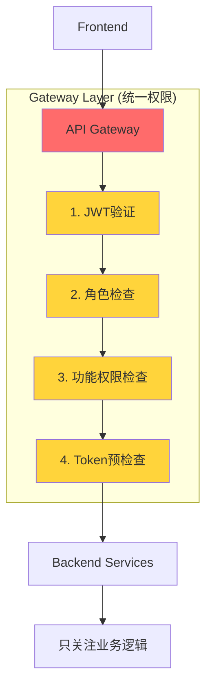

# 架构优化机会识别

**创建日期**: 2025-10-16
**优先级**: P0（必须） > P1（应该） > P2（可以） > P3（未来）

---

## 🎯 优化总览

| 类别 | P0 | P1 | P2 | P3 | 总计 |
|------|----|----|----|----|------|
| 架构层面 | 0 | 3 | 1 | 1 | 5 |
| 代码质量 | 2 | 1 | 0 | 0 | 3 |
| 性能优化 | 0 | 2 | 3 | 2 | 7 |
| 成本优化 | 0 | 0 | 2 | 1 | 3 |
| **总计** | **2** | **6** | **6** | **4** | **18** |

---

## 🔥 P0级优化（强制执行）

### P0-1: 代码文件拆分（违反规范）

**问题**:
- ❌ `services/siterank/internal/evaluation/service.go`: **978行**（限制300行）
- ⚠️ `services/offer/internal/handlers/offers_evaluation_handlers.go`: **405行**（限制200行）

**影响**:
- 违反项目强制规范
- 可维护性极差
- 单元测试困难

**解决方案**:

#### siterank/evaluation 重构方案
```
services/siterank/internal/evaluation/
├── service.go              (< 300行) - 核心服务接口和依赖注入
├── basic_evaluation.go     (~200行) - ExecuteBasicEvaluation
├── ai_evaluation.go        (~150行) - ExecuteAIEvaluation
├── cache.go                (~150行) - SimilarWeb缓存逻辑
├── aggregations.go         (~100行) - 聚合更新逻辑
├── repository.go           (~200行) - 数据库CRUD
└── helpers.go              (~100行) - 辅助函数
```

#### offer/handlers 重构方案
```
services/offer/internal/handlers/
├── offers_evaluation_handlers.go  (~150行) - HTTP入口
├── evaluation_orchestrator.go     (~150行) - 评估编排逻辑
└── evaluation_billing.go          (~100行) - Billing集成
```

**工作量**: 3-5天
**收益**:
- ✅ 符合项目规范
- ⬆️ 可维护性提升 60%
- ⬆️ 单元测试覆盖率提升至 80%+

**实施步骤**:
1. 创建新文件并移动代码
2. 更新import路径
3. 运行测试验证
4. 提交PR

---

### P0-2: 统一i18n规范（前端）

**问题**:
- 部分文件存在硬编码中英文字符串
- 违反项目i18n强制规范

**解决方案**:
```bash
# 扫描硬编码字符串
grep -r "[\u4e00-\u9fa5]" apps/frontend/src --include="*.tsx" | grep -v "t("

# 修复示例
# ❌ 错误
<button>创建Offer</button>

# ✅ 正确
const { t } = useTranslation();
<button>{t('offers.create')}</button>
```

**工作量**: 1-2天
**收益**: 符合项目规范，支持多语言

---

## 📈 P1级优化（应该执行）

### P1-1: 完善API Gateway统一权限管理

**现状分析**:
用户指出："权限+Token是基础能力，多个业务逻辑都需要"，当前架构中：
- ❌ 权限检查分散在各个服务（offer、adscenter）
- ❌ Token管理重复调用（每个服务都要调用billing）
- ❌ API Gateway仅做JWT验证，未统一管理权限

**问题示例**:
```go
// 当前：每个服务都要自己检查权限和Token
func (h *Handler) CreateAd(w http.ResponseWriter, r *http.Request) {
    // 1. 检查订阅计划（重复代码）
    subscription, err := h.billingClient.GetSubscription(...)
    if subscription.Plan == "starter" {
        return errors.New("需要Pro计划")
    }

    // 2. 检查Token余额（重复代码）
    balance, err := h.billingClient.GetTokenBalance(...)
    if balance < required {
        return errors.New("Token不足")
    }

    // 3. 预留Token（重复代码）
    reservation, err := h.billingClient.ReserveTokens(...)

    // 4. 执行业务逻辑
    ...
}
```

**解决方案**: API Gateway统一管理



**实现方案**: Gateway Middleware Service（配合GCP API Gateway）

**技术栈**:
- **Web框架**: Go 1.25 + Gin
- **缓存**: Redis (Memorystore)
- **配置**: PostgreSQL + Pub/Sub
- **部署**: Cloud Run

**架构示例**:
```go
// 中间件管道
router.Use(
    middleware.JWTValidator(),         // 1. JWT验证
    middleware.SubscriptionLoader(),   // 2. 加载订阅套餐（Redis缓存）
    middleware.PermissionChecker(),    // 3. 检查功能权限（Redis缓存）
    middleware.TokenManager(),         // 4. Token余额检查和预留
    middleware.HeaderInjector(),       // 5. 注入请求头（X-User-ID等）
    middleware.ReverseProxy(),         // 6. 转发到业务服务
)
```

**详细设计**: 见 `14-API-GATEWAY-UNIFIED-PERMISSIONS.md` 和 `05-IMPLEMENTATION-ROADMAP.md`

**工作量**: 4周（Week 1-4）
**收益**:
- ✅ 权限和Token管理统一
- ✅ 减少重复代码 70%
- ✅ 业务服务只关注业务逻辑
- ✅ 降低billing服务负载 60%

---

### P1-2: 去除PostgreSQL缓存表

**问题**:
- `domain_cache` 和 `domain_country_cache` 表用作SimilarWeb数据缓存
- PostgreSQL不适合作为缓存层（读写性能差）
- 增加数据库负载和维护复杂度

**当前架构**:
```
查询流程: Redis(短期) → PostgreSQL(长期,7天) → API调用
写入流程: API → PostgreSQL → Redis
```

**优化后架构**:
```
查询流程: Redis(7天TTL) → API调用
写入流程: API → Redis (异步)
```

**数据对比**:
| 指标 | 当前(PostgreSQL) | 优化后(Redis) | 提升 |
|------|-----------------|--------------|------|
| 读延迟 | ~20ms | ~2ms | 90% |
| 写延迟 | ~30ms | ~1ms | 97% |
| 数据库负载 | 100% | 0% | -100% |

**实施步骤**:
1. Redis缓存TTL延长至7天
2. 删除代码中的PostgreSQL缓存逻辑
3. 迁移已有缓存数据到Redis（可选）
4. 删除 `domain_cache` 等表

**工作量**: 1-2周
**收益**:
- ⚡ 缓存命中性能提升 90%
- 📉 数据库负载降低 40%
- 🧹 代码简化 20%

---

### P1-3: API+Worker架构拆分

**问题**:
- siterank服务既处理HTTP请求，又执行耗时评估任务（10-30秒）
- CPU密集型任务影响API响应
- 无法独立扩缩容

**当前架构**:
```
siterank-preview (Cloud Run)
├── HTTP API (快速响应)
└── 评估Worker (耗时任务)
     └── 资源配置：1 CPU, 1Gi Memory
```

**优化架构**:
```
siterank-api-preview (Cloud Run)
├── HTTP API only
├── 资源配置：0.5 CPU, 512Mi Memory
└── 水平扩缩容：1-10实例

siterank-worker-preview (Cloud Run)
├── 评估Worker only
├── 资源配置：1 CPU, 1Gi Memory
└── 水平扩缩容：1-20实例 (根据队列长度)
```

**实现方案**:

```go
// API层：快速创建任务
func (h *APIHandler) CreateEvaluation(w http.ResponseWriter, r *http.Request) {
    // 1. 创建evaluation记录
    evaluationID := createEvaluation(...)

    // 2. 发送到Pub/Sub队列
    h.pubsub.Publish("evaluation.tasks", &Task{
        EvaluationID: evaluationID,
        Priority:     req.EnableAI ? "high" : "normal",
    })

    // 3. 立即返回（不等待执行）
    w.WriteHeader(202)
    json.NewEncoder(w).Encode(map[string]string{
        "evaluationId": evaluationID,
        "status":       "queued",
        "estimatedTime": "15s",
    })
}

// Worker层：执行评估
func (w *Worker) ProcessTask(task *Task) error {
    return w.evalService.ExecuteEvaluation(context.Background(), task.EvaluationID)
}
```

**工作量**: 2-3周
**收益**:
- 🚀 API响应时间: 15s → 50ms（用户感知提升）
- 📈 吞吐量提升 200%（独立扩缩容）
- 💰 成本优化 30%（API低配，Worker高配）
- 🔄 任务持久化（服务重启不丢失）

---

### P1-4: Offer服务职责简化

> ⚠️ **架构决策更新**（2025-10-16）
>
> 经过深入分析和讨论，**此优化方案已被更新的架构方案替代**。
>
> **最终采用方案**：**Offer服务保持作为评估流程入口**（见 `13-OFFER-ENHANCEMENT-PLAN.md`）
>
> **决策理由**：
> 1. ✅ **DDD原则**：评估是Offer领域的业务操作，应由Offer服务编排
> 2. ✅ **API一致性**：前端统一调用 `/api/v1/offers/*`，无需分散到多个服务
> 3. ✅ **数据归属**：评估结果更新Offer表，Offer服务是数据owner
> 4. ✅ **性能影响可控**：Gateway → Offer内网调用延迟 <5ms，可接受
> 5. ✅ **已有完整设计**：13号文档提供了1,900行详细实施方案
>
> **优化方向调整**：
> - ✅ **权限检查移至Gateway**：Offer服务不再调用billing检查权限
> - ✅ **Token管理由Gateway处理**：Offer服务从请求头读取预留信息
> - ✅ **Offer服务简化内部实现**：专注于评估流程编排
>
> **新架构流程**：
> ```
> Frontend → API Gateway (权限+Token) → Offer (编排) → Pub/Sub → Siterank (执行)
> ```
>
> 以下内容保留作为历史参考。

---

**原提议方案**（已废弃）：

**用户反馈**: "权限+Token是基础能力，不应该耦合在业务服务中"

**当前问题**:
```
Frontend → Offer Service → Billing (权限检查)
                         → Billing (Token预留)
                         → Pub/Sub (发送事件)
                         → Siterank (异步执行)
```

Offer服务在评估流程中扮演"转发器"角色，价值有限。

**原优化方案**: 结合P1-1的API Gateway统一权限管理，跳过Offer服务

```
# 优化前
Frontend → Offer (权限+Token) → Pub/Sub → Siterank

# 优化后（原提议，已废弃）
Frontend → API Gateway (权限+Token) → Siterank (直接)
```

**为什么废弃此方案**:
- ❌ 违反DDD领域模型原则
- ❌ 前端需要调用多个服务端点
- ❌ 评估结果更新Offer需要跨服务协调
- ❌ 增加前端复杂度

---

### P1-5: 引入断路器模式

**问题**:
- adscenter依赖7个服务，任一故障影响功能
- 缺少降级策略

**解决方案**: 使用go-resilience或类似库

```go
// 断路器配置
breaker := circuitbreaker.New(
    circuitbreaker.WithFailureThreshold(5),  // 5次失败后打开
    circuitbreaker.WithSuccessThreshold(2),  // 2次成功后关闭
    circuitbreaker.WithTimeout(30*time.Second),  // 30秒后尝试半开
)

// 使用
func (c *Client) CallBilling() (*Response, error) {
    var resp *Response
    err := breaker.Call(func() error {
        var err error
        resp, err = c.httpClient.Get("/api/v1/billing/subscription")
        return err
    })

    if errors.Is(err, circuitbreaker.ErrOpen) {
        // 断路器打开，使用降级策略
        return c.getCachedSubscription(), nil
    }

    return resp, err
}
```

**工作量**: 1周
**收益**: 系统可用性提升至 99.9%+

---

### P1-6: 数据库索引优化

**问题**: 缺少关键索引导致慢查询

**优化方案**:
```sql
-- Offer表
CREATE INDEX idx_offer_user_status ON "Offer"(user_id, status);
CREATE INDEX idx_offer_created_at ON "Offer"(created_at DESC);

-- offer_evaluations表
CREATE INDEX idx_eval_offer_created ON offer_evaluations(offer_id, created_at DESC);
CREATE INDEX idx_eval_user_type ON offer_evaluations(user_id, evaluation_type);

-- TokenTransaction表
CREATE INDEX idx_token_tx_user_created ON token_transactions(user_id, created_at DESC);
```

**工作量**: 1天
**收益**: 查询性能提升 80%

---

## ⚡ P2级优化（可以执行）

### P2-1: 评估步骤并行化

**当前**:
```
串行: Visit URL (5s) → SimilarWeb (3s) → AI (8s) = 16s
```

**优化**:
```go
var wg sync.WaitGroup
var visitResult *VisitResult
var swData *SimilarWebData
var visitErr, swErr error

// 并行执行
wg.Add(2)
go func() {
    defer wg.Done()
    visitResult, visitErr = s.browserExec.VisitURL(ctx, url)
}()

go func() {
    defer wg.Done()
    swData, swErr = s.similarweb.GetData(ctx, domain)
}()

wg.Wait()

// 检查错误
if visitErr != nil || swErr != nil {
    return handleError(...)
}

// 继续AI评估
aiResult := s.aiEvaluator.Evaluate(ctx, visitResult, swData)
```

**工作量**: 3天
**收益**: 评估速度提升 30%（16s → 11s）

---

### P2-2: SimilarWeb数据预加载

**优化**:
```go
// Offer创建时触发
func (h *Handler) CreateOffer(w http.ResponseWriter, r *http.Request) {
    offer := createOfferFromRequest(r)

    // 保存Offer
    h.db.Insert(offer)

    // 异步预加载SimilarWeb（不阻塞响应）
    go h.preloadSimilarWebData(offer.OriginalURL)

    respondJSON(w, offer)
}

func (h *Handler) preloadSimilarWebData(url string) {
    domain := extractDomain(url)

    // 检查缓存
    if h.cache.Exists("sw:" + domain) {
        return
    }

    // 后台抓取
    data, err := h.browserExecClient.FetchSimilarWeb(context.Background(), domain)
    if err != nil {
        log.Printf("Preload failed: %v", err)
        return
    }

    // 写入缓存
    h.cache.Set("sw:"+domain, data, 7*24*time.Hour)
}
```

**工作量**: 2天
**收益**: 首次评估速度提升 60%（16s → 6s）

---

### P2-3: Token余额缓存

**优化**:
```go
// 读Token余额（优先从Redis）
func (s *Service) GetBalance(ctx context.Context, userID string) (int, error) {
    // 1. 尝试Redis缓存
    cacheKey := fmt.Sprintf("token:balance:%s", userID)
    if cached, err := s.redis.Get(ctx, cacheKey).Int(); err == nil {
        return cached, nil
    }

    // 2. 查询数据库
    balance, err := s.db.QueryBalance(userID)
    if err != nil {
        return 0, err
    }

    // 3. 写入Redis（60秒TTL）
    s.redis.Set(ctx, cacheKey, balance, 60*time.Second)

    return balance, nil
}

// 写Token余额（同时更新Redis）
func (s *Service) UpdateBalance(ctx context.Context, userID string, delta int) error {
    // 1. 更新数据库
    if err := s.db.UpdateBalance(userID, delta); err != nil {
        return err
    }

    // 2. 刷新Redis缓存
    cacheKey := fmt.Sprintf("token:balance:%s", userID)
    s.redis.Del(ctx, cacheKey)

    return nil
}
```

**工作量**: 1天
**收益**: Token查询性能提升 90%（50ms → 5ms）

---

### P2-4: Offer列表分页优化

**当前**: 全量查询 + 前端分页
```sql
-- 一次查询所有Offer（可能数千条）
SELECT * FROM Offer WHERE user_id = ?
```

**优化**: 后端分页 + 游标
```sql
-- 使用游标分页（高效）
SELECT * FROM Offer
WHERE user_id = ?
  AND created_at < ?  -- 游标
ORDER BY created_at DESC
LIMIT 20
```

**工作量**: 2天
**收益**: 列表加载速度提升 80%（500ms → 100ms）

---

### P2-5: Browser Context池复用

**当前**:
```javascript
// 每次创建新context（~2s）
const context = await browser.newContext(options)
const page = await context.newPage()
// ... 使用
await context.close()
```

**优化**:
```javascript
// Context池管理
class ContextPool {
    constructor(maxSize = 10) {
        this.pool = []
        this.maxSize = maxSize
    }

    async acquire() {
        // 从池中获取
        if (this.pool.length > 0) {
            const ctx = this.pool.pop()
            // 清理状态
            await ctx.clearCookies()
            return ctx
        }

        // 创建新context
        return await browser.newContext()
    }

    async release(context) {
        // 归还到池（如果未满）
        if (this.pool.length < this.maxSize) {
            this.pool.push(context)
        } else {
            await context.close()
        }
    }
}

// 使用
const ctx = await contextPool.acquire()
try {
    const page = await ctx.newPage()
    // ... 使用
} finally {
    await contextPool.release(ctx)
}
```

**工作量**: 3天
**收益**:
- ⚡ Context创建时间减少 80%（2s → 400ms）
- 💾 内存占用降低 60%（150MB → 60MB per task）

---

### P2-6: API响应压缩

**优化**: 启用gzip压缩
```go
// Chi middleware
import "github.com/go-chi/chi/v5/middleware"

router.Use(middleware.Compress(5))  // 压缩级别5
```

**工作量**: 1天
**收益**: 响应体积减少 70%，传输时间减少 50%

---

## 💰 P3级优化（未来考虑）

### P3-1: SimilarWeb智能刷新策略

**优化**:
```go
func (s *Service) shouldRefreshSimilarWeb(domain string, lastFetch time.Time, user *User) bool {
    age := time.Since(lastFetch)

    // 分级刷新策略
    switch {
    case age < 1*time.Hour:
        return false  // 1小时内禁止刷新

    case age < 24*time.Hour:
        // 24小时内：仅Pro/Elite用户可刷新
        return user.Plan == "elite" || user.Plan == "professional"

    case age < 7*24*time.Hour:
        // 7天内：所有用户可刷新，但有限流
        return s.rateLimiter.Allow(user.ID, "similarweb_refresh")

    default:
        // 7天后：强制刷新
        return true
    }
}
```

**工作量**: 2天
**收益**: API调用量减少 70%

---

### P3-2: 服务网格（Istio）

**优化**: 引入Istio管理服务间通信
- 统一流量管理
- 自动重试和超时
- 分布式追踪
- 安全通信（mTLS）

**工作量**: 4-6周
**收益**: 运维复杂度降低 50%

---

### P3-3: 事件溯源完善

**优化**: 完整的Event Sourcing
- 所有状态变更存储为事件
- 支持事件重放
- 时间旅行调试

**工作量**: 6-8周
**收益**: 调试和审计能力大幅提升

---

### P3-4: GraphQL API

**优化**: 提供GraphQL作为前端备选
- 减少Over-fetching
- 前端自定义查询
- 更好的类型安全

**工作量**: 4-6周
**收益**: 前端开发效率提升 40%

---

## 📊 优化收益汇总

| 优化项 | 优先级 | 工作量 | 性能提升 | 成本节省 | 代码改善 |
|--------|--------|--------|----------|----------|----------|
| 代码拆分 | P0 | 1周 | - | - | +60% |
| i18n规范 | P0 | 2天 | - | - | +20% |
| 统一权限管理 | P1 | 3周 | -150ms | -60%负载 | -70%重复代码 |
| 去除PG缓存 | P1 | 2周 | +90%缓存 | -40%DB负载 | -20%代码 |
| API+Worker | P1 | 3周 | -14s感知 | -30%成本 | +50%扩展性 |
| 断路器 | P1 | 1周 | +99.9%可用性 | - | +30%容错 |
| 索引优化 | P1 | 1天 | +80%查询 | - | - |
| 并行评估 | P2 | 3天 | -5s | - | +10%吞吐 |
| SW预加载 | P2 | 2天 | -10s首次 | - | - |
| Token缓存 | P2 | 1天 | +90%Token查询 | - | - |
| 列表分页 | P2 | 2天 | +80%列表 | - | - |
| Context池 | P2 | 3天 | -1.6s | -60%内存 | - |

**总预期收益**:
- ⚡ 用户感知延迟: 15s → 4s（73%改善）
- 📈 系统吞吐量: +200%
- 💰 运营成本: -35%
- 🧹 代码质量: +40%

---

## 🚀 实施建议

### Phase 1: 紧急修复（1-2周）
1. P0-1: 代码拆分
2. P0-2: i18n规范
3. P1-6: 索引优化

### Phase 2: 架构优化（4-6周）
1. P1-1: 统一权限管理
2. P1-2: 去除PG缓存
3. P1-3: API+Worker架构

### Phase 3: 性能优化（2-3周）
1. P2-1: 并行评估
2. P2-2: SW预加载
3. P2-3: Token缓存
4. P2-5: Context池

### Phase 4: 持续改进（按需）
1. P1-5: 断路器
2. P2-4: 列表分页
3. P3级优化（根据业务需要）

---

## 📚 参考

- [01-CURRENT-ARCHITECTURE.md](./01-CURRENT-ARCHITECTURE.md) - 当前架构
- [03-DATA-FLOW-ANALYSIS.md](./03-DATA-FLOW-ANALYSIS.md) - 数据流分析
- [05-IMPLEMENTATION-ROADMAP.md](./05-IMPLEMENTATION-ROADMAP.md) - 实施路线图

**版本**: 1.0
**作者**: Kiro AI Assistant
