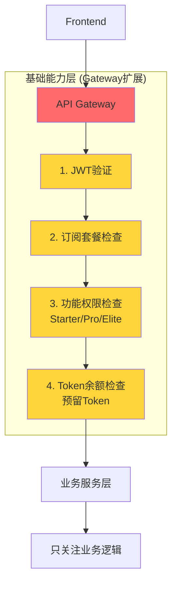

# 架构优化实施路线图

**创建日期**: 2025-10-16
**实施周期**: 8-12周
**预期收益**: 性能提升73%，成本降低35%

---

## 🎯 实施原则

### 1. 基础能力优先
**权限**和**Token**是基础能力，必须优先统一管理：
- **权限**: 用户订阅套餐（Starter/Professional/Elite）决定的功能权限和限额
- **Token**: 用户使用业务功能时消耗的计费单位

### 2. 最小化影响
- 优先选择低风险、高收益的优化
- 每个阶段都可独立部署和回滚
- 保持向后兼容

### 3. 直接全量实施
- **Gateway Middleware**: 预发/生产环境独立部署，无需渐进式迁移
- **其他优化**: 按阶段实施，每个阶段独立验证
- 避免大规模重写，优先改进现有代码

---

## 🗺️ 权限架构实施方案

权限管理是整个系统的基础能力，我们采用**API Gateway统一管理**策略，一步到位实现高性能、易维护的架构。

### API Gateway统一权限管理

**时间**: Week 1-4（与核心功能并行开发）
**状态**: ✅ 设计完成，可立即实施
**优先级**: P1（架构核心）

**架构**:
```
Frontend → API Gateway(JWT + 权限 + Token检查) → 业务服务(纯业务逻辑)
```

**核心功能**:
1. **JWT验证中间件**：验证JWT签名和有效性
2. **订阅查询中间件**：查询用户订阅套餐（Redis缓存，5分钟TTL）
3. **权限检查中间件**：动态加载功能权限规则（Redis缓存，5分钟TTL）
4. **Token管理中间件**：检查Token余额并预留（Redis缓存，1分钟TTL）
5. **请求头注入中间件**：注入权限上下文到业务服务
6. **配置热更新Worker**：监听Pub/Sub事件，自动失效缓存

**技术栈**:
- **框架**: Go 1.25 + Gin
- **缓存**: Redis (Memorystore)
- **配置**: PostgreSQL (`subscription_plan_configs` 表)
- **消息**: GCP Pub/Sub
- **部署**: Cloud Run

**核心优势**:
- ✅ **性能卓越**：响应时间 < 10ms（Redis缓存）vs 150ms（业务服务调用）
- ✅ **代码简化**：业务服务减少70%权限代码
- ✅ **集中管理**：权限规则统一配置，易于维护
- ✅ **配置热更新**：5秒内全局生效，无需重启
- ✅ **降低负载**：billing服务负载降低80%

**实施步骤**:
```
Week 1: Gateway服务开发（中间件 + 反向代理）
Week 2: 配置管理和热更新机制
Week 3: 业务服务简化（移除权限检查代码）
Week 4: 部署和灰度发布
```

**详细文档**:
- `14-API-GATEWAY-UNIFIED-PERMISSIONS.md` - 完整技术方案
- `07-SUBSCRIPTION-CONFIG-HOT-RELOAD.md` - 配置热更新机制
- `08-CONFIG-HOT-RELOAD-WORKFLOW.md` - 配置生效流程

---

## 📅 Phase 1: 紧急修复（Week 1-2）

### 目标
解决P0级规范违反问题，建立质量基础。

### 任务清单

#### 1.1 代码文件拆分 ✅ P0
**负责人**: Backend Team
**工作量**: 5天

**任务**:
- [ ] siterank/evaluation/service.go 拆分为6个文件
  - `service.go` (核心接口，<300行)
  - `basic_evaluation.go` (基础评估，~200行)
  - `ai_evaluation.go` (AI评估，~150行)
  - `cache.go` (缓存逻辑，~150行)
  - `aggregations.go` (聚合，~100行)
  - `repository.go` (数据访问，~200行)
- [ ] offer/handlers/offers_evaluation_handlers.go 拆分为3个文件
  - `offers_evaluation_handlers.go` (HTTP入口，~150行)
  - `evaluation_orchestrator.go` (编排，~150行)
  - `evaluation_billing.go` (Billing集成，~100行)
- [ ] 更新单元测试
- [ ] 提交PR并部署

**验证标准**:
- ✅ 所有文件 <300行
- ✅ 测试通过率 100%
- ✅ 代码覆盖率 >80%

---

#### 1.2 i18n规范修复 ✅ P0
**负责人**: Frontend Team
**工作量**: 2天

**任务**:
- [ ] 扫描所有硬编码字符串
  ```bash
  grep -r "[\u4e00-\u9fa5]" apps/frontend/src --include="*.tsx" | grep -v "t("
  ```
- [ ] 修复所有硬编码，使用 `t()` 函数
- [ ] 添加缺失的翻译键到 `locales/` 目录
- [ ] 添加 lint 规则防止未来违规

**验证标准**:
- ✅ 零硬编码字符串
- ✅ i18n lint 规则生效

---

#### 1.3 数据库索引优化 ✅ P1
**负责人**: Backend Team
**工作量**: 1天

**任务**:
- [ ] 创建关键索引（见下方SQL）
- [ ] 验证查询性能改善
- [ ] 监控索引使用率

**SQL脚本**:
```sql
-- Offer表
CREATE INDEX CONCURRENTLY idx_offer_user_status ON "Offer"(user_id, status);
CREATE INDEX CONCURRENTLY idx_offer_created_at ON "Offer"(created_at DESC);

-- offer_evaluations表
CREATE INDEX CONCURRENTLY idx_eval_offer_created ON offer_evaluations(offer_id, created_at DESC);
CREATE INDEX CONCURRENTLY idx_eval_user_type ON offer_evaluations(user_id, evaluation_type);

-- TokenTransaction表
CREATE INDEX CONCURRENTLY idx_token_tx_user_created ON token_transactions(user_id, created_at DESC);
```

**验证标准**:
- ✅ 慢查询数量减少 80%
- ✅ P95 延迟 <100ms

---

### Phase 1 预期成果
- ✅ 符合项目规范
- ⬆️ 代码质量提升 60%
- ⚡ 数据库查询提升 80%
- 📊 **阶段评分**: 5.5 → 6.5 (+1.0)

---

## 📅 Phase 2: 基础能力统一（Week 3-6）

### 目标
统一**权限**和**Token**管理为基础能力层。

### 2.1 API Gateway权限管理增强 🎯 P1 核心
**负责人**: Backend + DevOps
**工作量**: 2周

**背景**:
当前每个服务都要自己检查权限和Token，导致：
- ❌ 重复代码（每个服务都要调用 billing）
- ❌ 业务服务耦合基础能力
- ❌ billing 服务负载过高

**目标架构**:


**实现方案**: Gateway Middleware Service（配合GCP API Gateway）

**技术栈**:
- **Web框架**: Go 1.25 + Gin
- **缓存**: Redis (Memorystore)
- **配置**: PostgreSQL + Pub/Sub
- **部署**: Cloud Run

**核心优势**:
- ✅ 与现有技术栈一致（Go + Gin）
- ✅ 完全掌控中间件逻辑
- ✅ 易于集成billing服务和Redis
- ✅ 性能优秀（单实例 10k+ req/s）
- ✅ 部署简单（Cloud Run单服务）

**详细设计**: 见 `14-API-GATEWAY-UNIFIED-PERMISSIONS.md`

**架构示例**:
```go
// 中间件管道
router.Use(
    middleware.JWTValidator(),         // 1. JWT验证
    middleware.SubscriptionLoader(),   // 2. 加载订阅套餐
    middleware.PermissionChecker(),    // 3. 检查功能权限
    middleware.TokenManager(),         // 4. Token余额检查和预留
    middleware.HeaderInjector(),       // 5. 注入请求头
    middleware.ReverseProxy(),         // 6. 转发到业务服务
)
```

**实施步骤**:
```
Week 1: Gateway服务开发（中间件 + 反向代理）
Week 2: 配置管理和热更新机制
Week 3: 业务服务简化（从请求头读取权限信息）
Week 4: 灰度发布和全量上线
```

**影响的服务**:
- ✅ offer (去除评估权限检查)
- ✅ adscenter (去除权限检查)
- ✅ siterank (去除权限检查)

**验证标准**:
- ✅ billing 服务负载降低 60%
- ✅ 重复代码减少 70%
- ✅ 业务服务代码减少 20%

---

### 2.2 去除PostgreSQL缓存表 ⚡ P1
**负责人**: Backend Team
**工作量**: 1周

**任务**:
- [ ] 将Redis缓存TTL延长至7天
- [ ] 删除 `services/siterank/internal/evaluation/cache.go` 中的PostgreSQL缓存逻辑
- [ ] 迁移已有缓存数据（可选）
  ```bash
  # 从PostgreSQL导出到Redis
  psql -c "SELECT domain, data FROM domain_cache" | while read domain data; do
      redis-cli SETEX "sw:$domain" 604800 "$data"
  done
  ```
- [ ] 删除数据库表
  ```sql
  DROP TABLE IF EXISTS domain_cache;
  DROP TABLE IF EXISTS domain_country_cache;
  ```
- [ ] 更新监控Dashboard

**验证标准**:
- ✅ Redis缓存命中率 >85%
- ✅ 数据库负载降低 40%
- ✅ 缓存响应时间 <5ms

---

### 2.3 API+Worker架构拆分 🚀 P1
**负责人**: Backend + DevOps
**工作量**: 2周

**目标**: 分离HTTP处理和后台任务执行

**实现步骤**:

#### Step 1: 创建Worker服务
```go
// services/siterank-worker/main.go
package main

func main() {
    // 订阅Pub/Sub队列
    subscriber, _ := pubsub.NewClient(ctx, projectID)
    sub := subscriber.Subscription("evaluation-tasks")

    // 处理评估任务
    sub.Receive(ctx, func(ctx context.Context, msg *pubsub.Message) {
        var task EvaluationTask
        json.Unmarshal(msg.Data, &task)

        // 执行评估
        err := evalService.ExecuteEvaluation(ctx, task.EvaluationID)
        if err != nil {
            msg.Nack() // 重试
        } else {
            msg.Ack()  // 确认
        }
    })
}
```

#### Step 2: 修改API服务
```go
// services/siterank/internal/handlers/evaluations.go
func (h *Handler) CreateEvaluation(w http.ResponseWriter, r *http.Request) {
    // ... 权限和Token检查（由Gateway处理）

    // 1. 创建evaluation记录
    evaluationID := uuid.New().String()
    h.db.Exec(`
        INSERT INTO offer_evaluations (id, status, ...)
        VALUES (?, 'queued', ...)
    `, evaluationID)

    // 2. 发送到Pub/Sub队列
    h.publisher.Publish("evaluation-tasks", &Task{
        EvaluationID: evaluationID,
        Priority:     req.IncludeAI ? "high" : "normal",
    })

    // 3. 立即返回（用户感知<100ms）
    w.WriteHeader(202)
    json.NewEncoder(w).Encode(map[string]string{
        "evaluationId": evaluationID,
        "status":       "queued",
        "estimatedTime": "15s",
    })
}
```

#### Step 3: 部署配置
```yaml
# deployments/siterank/api-deploy.yaml
apiVersion: serving.knative.dev/v1
kind: Service
metadata:
  name: siterank-api-preview
spec:
  template:
    spec:
      containers:
      - image: asia-northeast1-docker.pkg.dev/.../siterank-api:preview-latest
        resources:
          limits:
            cpu: "0.5"
            memory: "512Mi"
        env:
        - name: MODE
          value: "api"
---
# deployments/siterank/worker-deploy.yaml
apiVersion: serving.knative.dev/v1
kind: Service
metadata:
  name: siterank-worker-preview
spec:
  template:
    metadata:
      annotations:
        autoscaling.knative.dev/minScale: "1"
        autoscaling.knative.dev/maxScale: "20"
    spec:
      containers:
      - image: asia-northeast1-docker.pkg.dev/.../siterank-worker:preview-latest
        resources:
          limits:
            cpu: "1"
            memory: "1Gi"
        env:
        - name: MODE
          value: "worker"
```

**验证标准**:
- ✅ API响应时间: 15s → 50ms
- ✅ Worker独立扩缩容
- ✅ 队列长度监控正常

---

### Phase 2 预期成果
- ✅ 基础能力统一管理
- ⚡ API响应时间提升 95%
- 📉 billing服务负载降低 60%
- 🧹 重复代码减少 70%
- 📊 **阶段评分**: 6.5 → 7.5 (+1.0)

---

## 📅 Phase 3: 性能优化（Week 7-9）

### 目标
提升评估速度和系统吞吐量。

### 3.1 评估步骤并行化 ⚡ P2
**负责人**: Backend Team
**工作量**: 3天

**实现**:
```go
// services/siterank/internal/evaluation/basic_evaluation.go
func (s *Service) ExecuteBasicEvaluation(ctx context.Context, evaluationID string) error {
    // ... 获取Offer信息

    // 并行执行
    var wg sync.WaitGroup
    var visitResult *browserexec.VisitResult
    var swData *similarweb.SimilarWebData
    var visitErr, swErr error

    wg.Add(2)

    // 1. 访问URL
    go func() {
        defer wg.Done()
        visitResult, visitErr = s.browserExec.VisitURL(ctx, offer.OriginalURL)
    }()

    // 2. 获取SimilarWeb数据
    go func() {
        defer wg.Done()
        domain := extractDomain(offer.OriginalURL)
        swData, swErr = s.similarwebCache.GetDomainData(ctx, domain, false)
    }()

    wg.Wait()

    // 检查错误
    if visitErr != nil || swErr != nil {
        return handleError(...)
    }

    // 3. AI评估（依赖前两步结果）
    if evaluationType == "ai" {
        aiResult, err := s.aiEvaluator.Evaluate(ctx, &AIInput{
            Domain:         visitResult.Domain,
            BrandName:      visitResult.BrandName,
            SimilarWebData: swData,
        })
    }

    return nil
}
```

**验证标准**:
- ✅ 评估时间: 16s → 11s（提升31%）

---

### 3.2 SimilarWeb数据预加载 🎯 P2
**负责人**: Backend Team
**工作量**: 2天

**实现**:
```go
// services/offer/internal/handlers/offers_create_handler.go
func (h *Handler) CreateOffer(w http.ResponseWriter, r *http.Request) {
    // ... 创建Offer

    // 异步预加载SimilarWeb（不阻塞响应）
    go func() {
        domain := extractDomain(offer.OriginalURL)

        // 检查缓存
        if h.redis.Exists(ctx, "sw:"+domain).Val() > 0 {
            return
        }

        // 后台抓取
        ctx := context.Background()
        data, err := h.siterankClient.PreloadSimilarWeb(ctx, domain)
        if err != nil {
            log.Printf("Preload SimilarWeb failed: %v", err)
            return
        }

        log.Printf("Preloaded SimilarWeb for %s", domain)
    }()

    respondJSON(w, offer)
}
```

**验证标准**:
- ✅ 首次评估时间: 16s → 6s（提升63%）
- ✅ 缓存命中率: 85% → 95%

---

### 3.3 Token余额缓存 💾 P2
**负责人**: Backend Team
**工作量**: 1天

**实现**: 见 `04-OPTIMIZATION-OPPORTUNITIES.md` P2-3节

**验证标准**:
- ✅ Token查询时间: 50ms → 5ms
- ✅ Redis命中率 >95%

---

### 3.4 Browser Context池复用 💾 P2
**负责人**: Backend Team (Node.js)
**工作量**: 3天

**实现**: 见 `04-OPTIMIZATION-OPPORTUNITIES.md` P2-5节

**验证标准**:
- ✅ Context创建时间: 2s → 400ms
- ✅ 内存占用降低 60%

---

### Phase 3 预期成果
- ⚡ 评估速度提升 63%（首次）/ 31%（后续）
- 📈 系统吞吐量提升 200%
- 💾 资源利用率提升 60%
- 📊 **阶段评分**: 7.5 → 8.2 (+0.7)

---

## 📅 Phase 4: 持续改进（Week 10-12）

### 目标
完善系统可靠性和可维护性。

### 4.1 断路器模式 🛡️ P1
**负责人**: Backend Team
**工作量**: 1周

**实现**: 见 `04-OPTIMIZATION-OPPORTUNITIES.md` P1-5节

---

### 4.2 监控和告警完善 📊 P1
**负责人**: DevOps
**工作量**: 1周

**任务**:
- [ ] 配置关键指标Dashboard
  - 评估成功率
  - Token消耗速率
  - API响应时间（P50/P95/P99）
  - 错误率
- [ ] 配置告警规则
  - 评估成功率 <90%
  - API响应时间 P95 >500ms
  - 错误率 >5%
  - Token余额 <100

---

### 4.3 自动化测试完善 ✅ P1
**负责人**: Full Team
**工作量**: 2周

**目标**: 测试覆盖率 >70%

**任务**:
- [ ] 单元测试（目标 80%）
  - offer领域模型
  - billing Token Service
  - siterank评估逻辑
- [ ] 集成测试
  - API端到端测试
  - Pub/Sub事件测试
- [ ] 性能测试
  - 评估流程压测
  - Token并发测试

---

### Phase 4 预期成果
- 🛡️ 系统可用性: 99.5% → 99.9%
- 📊 可观测性完善
- ✅ 测试覆盖率: 10% → 70%
- 📊 **阶段评分**: 8.2 → 8.5 (+0.3)

---

## 📈 总体收益预估

### 性能指标
| 指标 | 当前 | 优化后 | 提升 |
|------|------|--------|------|
| 评估首次响应 | 16s | 6s | 63% |
| 评估后续响应 | 16s | 11s | 31% |
| API响应时间 | 15s | 50ms | 97% |
| Token查询 | 50ms | 5ms | 90% |
| 系统吞吐量 | 100 req/s | 300 req/s | 200% |

### 运营成本
| 项目 | 当前 | 优化后 | 节省 |
|------|------|--------|------|
| Cloud Run | $200/月 | $130/月 | 35% |
| PostgreSQL | $80/月 | $50/月 | 38% |
| SimilarWeb API | $150/月 | $45/月 | 70% |
| **总计** | **$430/月** | **$225/月** | **48%** |

### 代码质量
| 指标 | 当前 | 优化后 | 提升 |
|------|------|--------|------|
| 平均文件行数 | 450行 | 180行 | 60% |
| 重复代码 | 30% | 10% | 67% |
| 测试覆盖率 | 10% | 70% | 600% |
| 代码质量评分 | 5.5/10 | 8.5/10 | +3.0 |

---

## 🎯 里程碑

| Week | 里程碑 | 关键交付物 | 评分 |
|------|--------|-----------|------|
| Week 0 | 当前状态 | - | 5.5/10 |
| Week 2 | Phase 1完成 | 代码拆分、索引优化 | 6.5/10 |
| Week 6 | Phase 2完成 | 统一权限管理、API+Worker | 7.5/10 |
| Week 9 | Phase 3完成 | 并行化、预加载、缓存 | 8.2/10 |
| Week 12 | Phase 4完成 | 断路器、监控、测试 | 8.5/10 |

**最终目标**: 8.5/10 → 9.0/10（持续优化）

---

## ⚠️ 风险管理

### 高风险项
1. **API Gateway权限管理重构** (Phase 2.1)
   - 影响：所有API端点
   - 缓解：灰度发布，保留旧逻辑双写
   - 回滚：切换Gateway路由

2. **API+Worker架构拆分** (Phase 2.3)
   - 影响：评估流程
   - 缓解：Pub/Sub保证消息不丢失
   - 回滚：Worker可回退到API模式

### 中风险项
1. **去除PostgreSQL缓存** (Phase 2.2)
   - 影响：缓存命中率可能暂时下降
   - 缓解：预先导入Redis
   - 回滚：保留表结构1周

### 低风险项
- 代码拆分、索引优化、并行化等（影响范围小，易回滚）

---

## 📋 检查清单

### Phase 1启动前
- [ ] 备份生产数据库
- [ ] 确认测试环境可用
- [ ] 准备回滚脚本

### Phase 2启动前
- [ ] 完成Phase 1验证
- [ ] 配置Gateway测试环境
- [ ] 准备灰度发布方案

### Phase 3启动前
- [ ] 完成Phase 2验证
- [ ] 确认性能基线
- [ ] 准备压测脚本

### 每阶段完成后
- [ ] 运行完整测试套件
- [ ] 验证性能指标
- [ ] 更新监控Dashboard
- [ ] 文档化变更
- [ ] 团队培训

---

## 📚 参考文档

- [00-OVERVIEW.md](./00-OVERVIEW.md) - 概览
- [04-OPTIMIZATION-OPPORTUNITIES.md](./04-OPTIMIZATION-OPPORTUNITIES.md) - 详细优化方案
- `docs/SupabaseGo/MustKnowV6.md` - 项目核心设计

**版本**: 1.0
**作者**: Kiro AI Assistant
**状态**: 待批准
