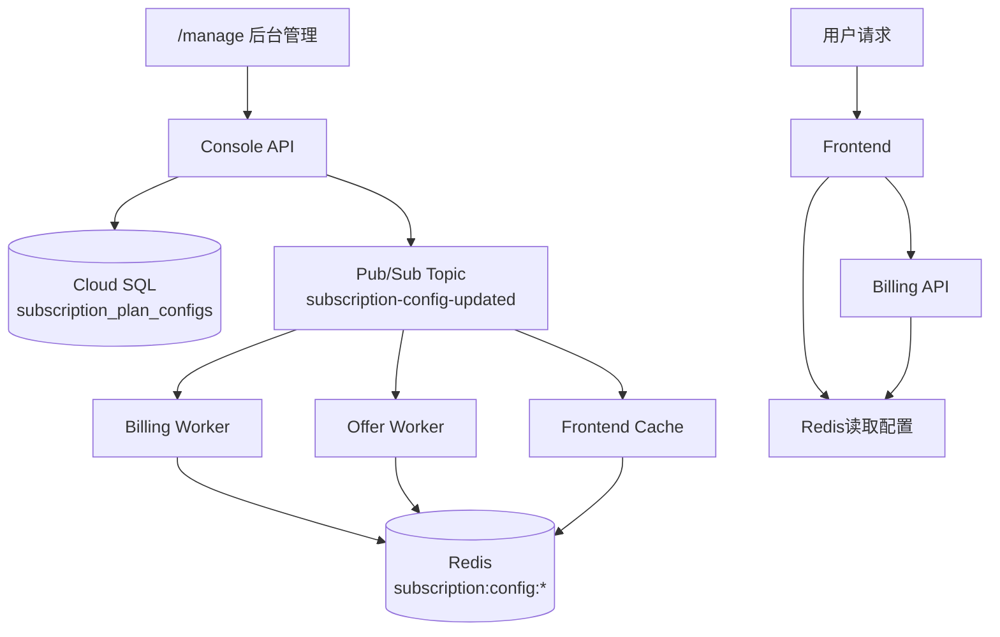

# 订阅套餐权限配置热更新方案

**版本**: 1.0
**创建日期**: 2025-10-16
**复用基础设施**: Cloud SQL + Redis + Pub/Sub + Console Admin

---

## 📋 需求分析

### 业务需求
- **权限定义**: 用户订阅套餐（trial/pro/max/elite）的功能权限和配额限制
- **配置管理**: 后台管理系统支持多次配置调整
- **热更新**: 配置变更后立即生效，无需重启服务
- **套餐升降级**: 支持用户升级/降级订阅，权限立即生效

### 当前问题
- ❌ 套餐配置硬编码在前端 `apps/frontend/src/lib/types/subscription.ts`
- ❌ 修改配置需要重新部署前端
- ❌ 无法A/B测试不同套餐配置
- ❌ 无配置变更历史追踪

---

## 🏗️ 方案设计

### 架构概览



### 核心设计原则
1. **数据库为主**: 配置存储在Cloud SQL，单一数据源
2. **Redis为缓存**: 5分钟TTL，减少数据库查询
3. **Pub/Sub通知**: 配置变更时主动刷新所有服务缓存
4. **版本控制**: 记录配置变更历史，支持回滚

---

## 📊 数据库设计

### 1. 套餐配置表

```sql
-- services/billing/internal/migrations/000007_subscription_plan_configs.up.sql

CREATE TABLE IF NOT EXISTS subscription_plan_configs (
    id UUID PRIMARY KEY DEFAULT gen_random_uuid(),

    -- 套餐标识
    tier VARCHAR(20) NOT NULL UNIQUE CHECK (tier IN ('trial', 'pro', 'max', 'elite')),
    name VARCHAR(100) NOT NULL, -- 'Trial', 'Pro', 'Max', 'Elite'

    -- 定价
    price_cents INTEGER NOT NULL, -- 单位：分（$49 = 4900）
    currency VARCHAR(3) DEFAULT 'USD',

    -- Token配额
    monthly_tokens INTEGER NOT NULL,

    -- 功能权限（JSON格式，灵活扩展）
    features JSONB NOT NULL DEFAULT '{}',
    -- 示例: {
    --   "ai_evaluation": true,
    --   "max_ad_accounts": 10,
    --   "max_offers_per_month": 100,
    --   "priority_support": true,
    --   "custom_domain": false
    -- }

    -- 速率限制（JSON格式）
    limits JSONB NOT NULL DEFAULT '{}',
    -- 示例: {
    --   "api_calls_per_minute": 60,
    --   "concurrent_evaluations": 5,
    --   "max_batch_size": 20
    -- }

    -- 状态
    is_active BOOLEAN DEFAULT true,
    version INTEGER DEFAULT 1, -- 配置版本号，每次更新+1

    -- 显示顺序（用于前端展示）
    display_order INTEGER DEFAULT 0,

    -- 时间戳
    created_at TIMESTAMP DEFAULT NOW(),
    updated_at TIMESTAMP DEFAULT NOW(),
    updated_by UUID -- admin user_id
);

-- 索引
CREATE INDEX idx_plan_tier ON subscription_plan_configs(tier) WHERE is_active = true;

-- 初始数据（与现有前端配置一致）
INSERT INTO subscription_plan_configs (tier, name, price_cents, monthly_tokens, features, limits, display_order) VALUES
('trial', 'Trial', 0, 100,
 '{"ai_evaluation": false, "max_ad_accounts": 1, "max_offers_per_month": 10}',
 '{"api_calls_per_minute": 30, "concurrent_evaluations": 1}', 1),

('pro', 'Pro', 4900, 100,
 '{"ai_evaluation": false, "max_ad_accounts": 3, "max_offers_per_month": 50}',
 '{"api_calls_per_minute": 60, "concurrent_evaluations": 3}', 2),

('max', 'Max', 7900, 1000,
 '{"ai_evaluation": false, "max_ad_accounts": 10, "max_offers_per_month": 200}',
 '{"api_calls_per_minute": 120, "concurrent_evaluations": 5}', 3),

('elite', 'Elite', 9900, 10000,
 '{"ai_evaluation": true, "max_ad_accounts": -1, "max_offers_per_month": -1}',
 '{"api_calls_per_minute": 300, "concurrent_evaluations": 10}', 4);
```

### 2. 配置变更历史表

```sql
CREATE TABLE IF NOT EXISTS subscription_config_history (
    id UUID PRIMARY KEY DEFAULT gen_random_uuid(),

    tier VARCHAR(20) NOT NULL,
    old_config JSONB NOT NULL, -- 变更前的完整配置
    new_config JSONB NOT NULL, -- 变更后的完整配置
    change_summary TEXT, -- 变更摘要

    -- 审计信息
    changed_by UUID NOT NULL, -- admin user_id
    changed_at TIMESTAMP DEFAULT NOW(),

    -- 关联
    config_id UUID REFERENCES subscription_plan_configs(id)
);

CREATE INDEX idx_config_history_tier ON subscription_config_history(tier, changed_at DESC);
CREATE INDEX idx_config_history_admin ON subscription_config_history(changed_by, changed_at DESC);
```

---

## 🔧 服务实现

### 1. Billing服务API

#### GET /api/v1/billing/plans
**功能**: 获取所有活跃套餐配置（带缓存）

```go
// services/billing/internal/handlers/subscription_plans.go

type PlanConfig struct {
    Tier          string                 `json:"tier"`
    Name          string                 `json:"name"`
    PriceCents    int                    `json:"price_cents"`
    MonthlyTokens int                    `json:"monthly_tokens"`
    Features      map[string]interface{} `json:"features"`
    Limits        map[string]interface{} `json:"limits"`
    Version       int                    `json:"version"`
}

func (h *SubscriptionPlanHandler) GetAllPlans(c *gin.Context) {
    // 1. 尝试从Redis读取
    cacheKey := "subscription:plans:all"
    if cached, err := h.redis.Get(c.Request.Context(), cacheKey).Result(); err == nil {
        var plans []PlanConfig
        if json.Unmarshal([]byte(cached), &plans) == nil {
            c.JSON(200, plans)
            return
        }
    }

    // 2. 从数据库读取
    query := `SELECT tier, name, price_cents, monthly_tokens, features, limits, version
              FROM subscription_plan_configs
              WHERE is_active = true
              ORDER BY display_order`

    rows, err := h.db.QueryContext(c.Request.Context(), query)
    if err != nil {
        c.JSON(500, gin.H{"error": "failed to query plans"})
        return
    }
    defer rows.Close()

    var plans []PlanConfig
    for rows.Next() {
        var p PlanConfig
        var featuresJSON, limitsJSON []byte
        err := rows.Scan(&p.Tier, &p.Name, &p.PriceCents, &p.MonthlyTokens,
                        &featuresJSON, &limitsJSON, &p.Version)
        if err != nil {
            continue
        }
        json.Unmarshal(featuresJSON, &p.Features)
        json.Unmarshal(limitsJSON, &p.Limits)
        plans = append(plans, p)
    }

    // 3. 写入Redis缓存（5分钟）
    if plansJSON, err := json.Marshal(plans); err == nil {
        h.redis.Set(c.Request.Context(), cacheKey, plansJSON, 5*time.Minute)
    }

    c.JSON(200, plans)
}
```

#### GET /api/v1/billing/plans/:tier
**功能**: 获取特定套餐配置

```go
func (h *SubscriptionPlanHandler) GetPlanByTier(c *gin.Context) {
    tier := c.Param("tier")

    // 1. Redis缓存
    cacheKey := fmt.Sprintf("subscription:config:%s", tier)
    if cached, err := h.redis.Get(c.Request.Context(), cacheKey).Result(); err == nil {
        var plan PlanConfig
        if json.Unmarshal([]byte(cached), &plan) == nil {
            c.JSON(200, plan)
            return
        }
    }

    // 2. 数据库查询
    query := `SELECT tier, name, price_cents, monthly_tokens, features, limits, version
              FROM subscription_plan_configs
              WHERE tier = $1 AND is_active = true`

    var plan PlanConfig
    var featuresJSON, limitsJSON []byte
    err := h.db.QueryRowContext(c.Request.Context(), query, tier).Scan(
        &plan.Tier, &plan.Name, &plan.PriceCents, &plan.MonthlyTokens,
        &featuresJSON, &limitsJSON, &plan.Version,
    )

    if err == sql.ErrNoRows {
        c.JSON(404, gin.H{"error": "plan not found"})
        return
    }
    if err != nil {
        c.JSON(500, gin.H{"error": "database error"})
        return
    }

    json.Unmarshal(featuresJSON, &plan.Features)
    json.Unmarshal(limitsJSON, &plan.Limits)

    // 3. 写入Redis
    if planJSON, err := json.Marshal(plan); err == nil {
        h.redis.Set(c.Request.Context(), cacheKey, planJSON, 5*time.Minute)
    }

    c.JSON(200, plan)
}
```

#### PUT /api/v1/billing/plans/:tier （管理员专用）
**功能**: 更新套餐配置并触发热更新

```go
type UpdatePlanRequest struct {
    Name          *string                 `json:"name"`
    PriceCents    *int                    `json:"price_cents"`
    MonthlyTokens *int                    `json:"monthly_tokens"`
    Features      map[string]interface{}  `json:"features"`
    Limits        map[string]interface{}  `json:"limits"`
    ChangeSummary string                  `json:"change_summary"`
}

func (h *SubscriptionPlanHandler) UpdatePlan(c *gin.Context) {
    // 1. 权限检查（仅管理员）
    user := c.MustGet("user").(*User)
    if !user.IsAdmin {
        c.JSON(403, gin.H{"error": "admin required"})
        return
    }

    tier := c.Param("tier")
    var req UpdatePlanRequest
    if err := c.ShouldBindJSON(&req); err != nil {
        c.JSON(400, gin.H{"error": err.Error()})
        return
    }

    // 2. 获取旧配置（用于历史记录）
    var oldConfig PlanConfig
    query := `SELECT tier, name, price_cents, monthly_tokens, features, limits, version
              FROM subscription_plan_configs WHERE tier = $1`
    // ... 查询旧配置

    // 3. 开启事务更新
    tx, _ := h.db.BeginTx(c.Request.Context(), nil)
    defer tx.Rollback()

    // 更新配置表
    updateQuery := `UPDATE subscription_plan_configs
                    SET name = COALESCE($1, name),
                        price_cents = COALESCE($2, price_cents),
                        monthly_tokens = COALESCE($3, monthly_tokens),
                        features = COALESCE($4, features),
                        limits = COALESCE($5, limits),
                        version = version + 1,
                        updated_at = NOW(),
                        updated_by = $6
                    WHERE tier = $7
                    RETURNING id, version`

    var configID string
    var newVersion int
    // ... 执行更新

    // 插入变更历史
    historyQuery := `INSERT INTO subscription_config_history
                     (tier, old_config, new_config, change_summary, changed_by, config_id)
                     VALUES ($1, $2, $3, $4, $5, $6)`
    // ... 插入历史

    tx.Commit()

    // 4. 删除Redis缓存
    h.redis.Del(c.Request.Context(),
        fmt.Sprintf("subscription:config:%s", tier),
        "subscription:plans:all",
    )

    // 5. 发布Pub/Sub事件通知其他服务
    msg := map[string]interface{}{
        "tier":    tier,
        "version": newVersion,
        "event":   "config_updated",
    }
    msgJSON, _ := json.Marshal(msg)
    h.pubsub.Publish(c.Request.Context(), "subscription-config-updated", msgJSON)

    c.JSON(200, gin.H{
        "success": true,
        "version": newVersion,
        "message": "configuration updated and cache invalidated",
    })
}
```

### 2. Pub/Sub订阅者（所有服务）

```go
// services/billing/internal/workers/config_reload_worker.go

type ConfigReloadWorker struct {
    redis  *redis.Client
    db     *sql.DB
    pubsub *pubsub.Client
}

func (w *ConfigReloadWorker) Start(ctx context.Context) {
    sub := w.pubsub.Subscription("subscription-config-updated-sub")

    err := sub.Receive(ctx, func(ctx context.Context, msg *pubsub.Message) {
        var event map[string]interface{}
        if err := json.Unmarshal(msg.Data, &event); err != nil {
            msg.Nack()
            return
        }

        tier := event["tier"].(string)

        // 刷新本地缓存
        cacheKeys := []string{
            fmt.Sprintf("subscription:config:%s", tier),
            "subscription:plans:all",
        }
        w.redis.Del(ctx, cacheKeys...)

        log.Printf("Reloaded config for tier: %s (version: %v)", tier, event["version"])
        msg.Ack()
    })

    if err != nil {
        log.Printf("Config reload worker error: %v", err)
    }
}
```

### 3. Frontend集成

#### API客户端

```typescript
// apps/frontend/src/lib/api/clients/BillingApiClient.ts

export interface SubscriptionPlanConfig {
  tier: 'trial' | 'pro' | 'max' | 'elite';
  name: string;
  price_cents: number;
  monthly_tokens: number;
  features: {
    ai_evaluation?: boolean;
    max_ad_accounts?: number;
    max_offers_per_month?: number;
    [key: string]: any;
  };
  limits: {
    api_calls_per_minute?: number;
    concurrent_evaluations?: number;
    [key: string]: any;
  };
  version: number;
}

export class BillingApiClient {
  async getAllPlans(): Promise<SubscriptionPlanConfig[]> {
    const response = await fetch('/api/v1/billing/plans');
    return response.json();
  }

  async getPlanByTier(tier: string): Promise<SubscriptionPlanConfig> {
    const response = await fetch(`/api/v1/billing/plans/${tier}`);
    return response.json();
  }
}
```

#### React Hook

```typescript
// apps/frontend/src/lib/hooks/useSubscriptionPlans.ts

import { useQuery } from '@tanstack/react-query';
import { BillingApiClient } from '@/lib/api/clients/BillingApiClient';

export function useSubscriptionPlans() {
  const client = new BillingApiClient();

  return useQuery({
    queryKey: ['subscription-plans'],
    queryFn: () => client.getAllPlans(),
    staleTime: 5 * 60 * 1000, // 5分钟
    cacheTime: 10 * 60 * 1000, // 10分钟
  });
}

export function useSubscriptionPlan(tier: string) {
  const client = new BillingApiClient();

  return useQuery({
    queryKey: ['subscription-plan', tier],
    queryFn: () => client.getPlanByTier(tier),
    staleTime: 5 * 60 * 1000,
    enabled: !!tier,
  });
}
```

---

## 🎛️ 后台管理界面

### 套餐配置管理页面

```typescript
// apps/frontend/src/app/manage/subscription-plans/page.tsx

'use client';

import { useSubscriptionPlans } from '@/lib/hooks/useSubscriptionPlans';
import { useState } from 'react';

export default function SubscriptionPlansManagePage() {
  const { data: plans, isLoading, refetch } = useSubscriptionPlans();
  const [selectedPlan, setSelectedPlan] = useState(null);

  if (isLoading) return <div>Loading...</div>;

  return (
    <div className="p-6">
      <h1 className="text-2xl font-bold mb-6">订阅套餐配置管理</h1>

      <div className="grid grid-cols-1 md:grid-cols-2 lg:grid-cols-4 gap-4">
        {plans?.map(plan => (
          <PlanConfigCard
            key={plan.tier}
            plan={plan}
            onEdit={() => setSelectedPlan(plan)}
          />
        ))}
      </div>

      {selectedPlan && (
        <PlanEditDialog
          plan={selectedPlan}
          onClose={() => setSelectedPlan(null)}
          onSave={async (updated) => {
            await updatePlan(selectedPlan.tier, updated);
            refetch(); // 重新获取数据
            setSelectedPlan(null);
          }}
        />
      )}
    </div>
  );
}

function PlanConfigCard({ plan, onEdit }) {
  return (
    <div className="border rounded-lg p-4">
      <h3 className="font-bold text-lg">{plan.name}</h3>
      <p className="text-gray-600">${(plan.price_cents / 100).toFixed(2)}/月</p>

      <div className="mt-4 space-y-2">
        <p className="text-sm">Token额度: {plan.monthly_tokens}</p>
        <p className="text-sm">
          AI评估: {plan.features.ai_evaluation ? '✅' : '❌'}
        </p>
        <p className="text-sm">
          广告账户: {plan.features.max_ad_accounts === -1 ? '无限' : plan.features.max_ad_accounts}
        </p>
      </div>

      <button
        onClick={onEdit}
        className="mt-4 w-full bg-blue-500 text-white py-2 rounded"
      >
        编辑配置
      </button>

      <p className="text-xs text-gray-400 mt-2">版本: v{plan.version}</p>
    </div>
  );
}
```

---

## 🚀 部署步骤

### Phase 1: 数据库迁移（Week 1）

```bash
# 1. 创建迁移文件
cat > services/billing/internal/migrations/000007_subscription_plan_configs.up.sql <<EOF
-- [SQL内容见上文]
EOF

# 2. 执行迁移
gcloud run jobs execute db-migrator-preview --region=asia-northeast1 --wait

# 3. 验证数据
psql $DATABASE_URL -c "SELECT tier, name, monthly_tokens FROM subscription_plan_configs;"
```

### Phase 2: Billing API实现（Week 1）

```bash
# 1. 实现API端点
# - services/billing/internal/handlers/subscription_plans.go
# - services/billing/internal/workers/config_reload_worker.go

# 2. 更新OpenAPI规范
# - services/billing/openapi.yaml

# 3. 构建并部署
gcloud builds submit --config=deployments/billing/cloudbuild.yaml
gcloud run deploy billing-preview --image=...
```

### Phase 3: Pub/Sub配置（Week 1）

```bash
# 1. 创建主题
gcloud pubsub topics create subscription-config-updated --project=gen-lang-client-0944935873

# 2. 创建订阅（所有需要感知配置变更的服务）
gcloud pubsub subscriptions create subscription-config-updated-billing \
  --topic=subscription-config-updated \
  --ack-deadline=60

gcloud pubsub subscriptions create subscription-config-updated-offer \
  --topic=subscription-config-updated \
  --ack-deadline=60
```

### Phase 4: Frontend集成（Week 2）

```bash
# 1. 替换硬编码配置
# ❌ 删除: apps/frontend/src/lib/types/subscription.ts 中的 SUBSCRIPTION_TIERS 常量
# ✅ 使用: useSubscriptionPlans() hook 动态获取

# 2. 更新订阅相关页面
# - apps/frontend/src/app/settings/subscription/page.tsx
# - apps/frontend/src/components/PricingTable.tsx

# 3. 部署前端
git add . && git commit -m "feat: dynamic subscription plan configs"
git push origin main  # 触发preview部署
```

### Phase 5: 后台管理界面（Week 2）

```bash
# 1. 创建管理页面
# - apps/frontend/src/app/manage/subscription-plans/page.tsx
# - apps/frontend/src/app/manage/subscription-plans/components/

# 2. RBAC权限控制
# 确保只有 UserRole.Admin 可以访问
```

---

## ✅ 验证清单

### 功能验证
- [ ] 管理员可以在 `/manage/subscription-plans` 查看所有套餐配置
- [ ] 管理员可以编辑套餐的 features 和 limits
- [ ] 配置更新后，Redis缓存立即失效
- [ ] Pub/Sub消息成功触发所有订阅者刷新缓存
- [ ] 前端定价页面动态展示最新配置（无需重启）
- [ ] 配置变更历史正确记录到 `subscription_config_history` 表

### 性能验证
- [ ] 配置读取命中Redis缓存（P99 < 5ms）
- [ ] 配置更新后5秒内所有服务生效
- [ ] 数据库查询优化（有索引支持）

### 安全验证
- [ ] 非管理员无法访问配置管理API（403 Forbidden）
- [ ] 配置变更审计日志完整
- [ ] 敏感操作记录操作人user_id

---

## 📈 后续优化

### 短期（1-3个月）
1. **配置版本回滚**: 支持一键回滚到历史版本
2. **配置A/B测试**: 特定用户群使用不同配置
3. **配置预览**: 修改前预览影响范围

### 长期（3-6个月）
1. **动态定价**: 根据市场情况自动调整价格
2. **个性化套餐**: 为企业客户定制专属套餐
3. **配置模板**: 预设多种套餐组合模板

---

## 📝 相关文档

- `docs/SupabaseGo/MustKnowV6.md` - 项目架构设计
- `docs/ArchitectureOpV1/04-OPTIMIZATION-OPPORTUNITIES.md` - P1-1优化项
- `apps/frontend/src/lib/types/subscription.ts` - 当前硬编码配置（待替换）

---

**优势总结**:
- ✅ **零重启热更新**: 配置变更5秒内全系统生效
- ✅ **复用现有基础设施**: Cloud SQL + Redis + Pub/Sub
- ✅ **完整审计追踪**: 所有变更记录可查
- ✅ **灵活扩展**: JSONB字段支持任意新功能配置
- ✅ **缓存优化**: Redis减轻数据库压力
