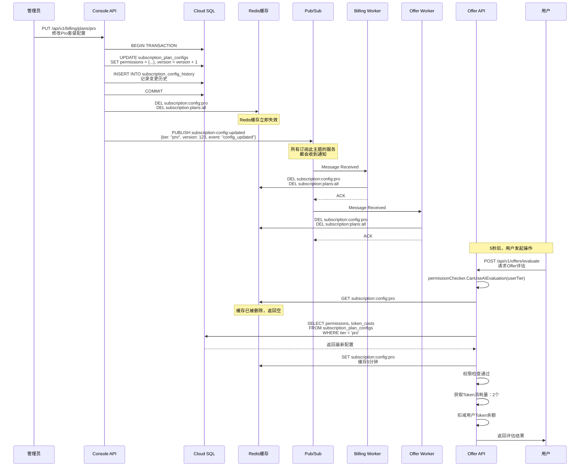
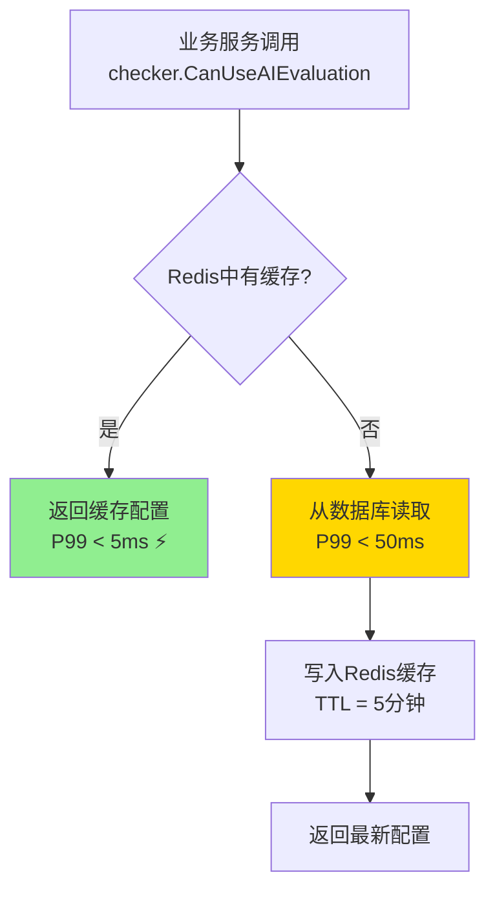

# 配置热更新生效机制详解

**版本**: 1.0
**创建日期**: 2025-10-16

---

## 问题：配置修改后如何生效？

当管理员在后台修改了套餐的权限或Token消耗规则后，整个系统是如何感知并生效这些变更的？

---

## 完整生效流程



---

## 关键时间点

| 时刻 | 事件 | 影响 |
|------|------|------|
| **T+0秒** | 管理员提交配置变更 | 数据库写入完成 |
| **T+0.1秒** | Redis缓存失效 | Console API删除缓存 |
| **T+0.5秒** | Pub/Sub消息发布 | 通知所有订阅服务 |
| **T+1-5秒** | Worker收到消息并刷新缓存 | 各服务删除本地Redis缓存 |
| **T+5秒后** | 用户发起请求 | **使用最新配置进行权限检查** ✅ |

**生效时间**: **5秒内全系统生效** ⚡

---

## 各组件职责

### 1. Console API（配置写入）
```go
// services/console/internal/handlers/subscription_admin.go

func (h *AdminHandler) UpdatePlanConfig(c *gin.Context) {
    // 1. 更新数据库（事务保证一致性）
    tx.Exec("UPDATE subscription_plan_configs SET permissions = ..., version = version + 1")
    tx.Exec("INSERT INTO subscription_config_history ...")
    tx.Commit()

    // 2. 失效Redis缓存
    redis.Del("subscription:config:pro", "subscription:plans:all")

    // 3. 发布Pub/Sub通知
    pubsub.Publish("subscription-config-updated", {
        "tier": "pro",
        "version": 124,
        "event": "config_updated"
    })
}
```

### 2. Billing Worker（缓存刷新）
```go
// services/billing/internal/workers/config_reload_worker.go

func (w *ConfigReloadWorker) Start(ctx context.Context) {
    sub := w.pubsubClient.Subscription("subscription-config-updated-billing")

    sub.Receive(ctx, func(ctx context.Context, msg *pubsub.Message) {
        var event map[string]interface{}
        json.Unmarshal(msg.Data, &event)

        tier := event["tier"].(string)

        // 刷新本地Redis缓存
        w.redisClient.Del(ctx,
            fmt.Sprintf("subscription:config:%s", tier),
            "subscription:plans:all",
        )

        log.Printf("Config reloaded for tier: %s", tier)
        msg.Ack()
    })
}
```

### 3. Offer Worker（同Billing）
```go
// services/offer/internal/workers/config_reload_worker.go

func (w *ConfigReloadWorker) Start(ctx context.Context) {
    sub := w.pubsubClient.Subscription("subscription-config-updated-offer")
    // 同样的逻辑：监听消息 → 删除Redis缓存
}
```

### 4. Offer API（权限检查 - 自动使用最新配置）
```go
// services/offer/internal/handlers/evaluation_handler.go

func (h *EvaluationHandler) EvaluateOffer(c *gin.Context) {
    user := c.MustGet("user").(*User)

    // ✅ 权限检查（自动读取最新配置）
    checker := permissions.NewPermissionChecker(h.db, h.redis)

    // 检查是否可以使用AI评估
    canUseAI, err := checker.CanUseAIEvaluation(c.Request.Context(), user.Tier)
    if !canUseAI {
        c.JSON(403, gin.H{"error": "AI evaluation not available for your plan"})
        return
    }

    // 获取Token消耗量（自动读取最新配置）
    tokenCost, err := checker.GetTokenCost(c.Request.Context(), user.Tier, "offer_evaluation_ai")
    // tokenCost = 2 （从最新配置读取）

    // 扣减Token
    err = h.billingClient.DeductTokens(user.ID, tokenCost)
    if err != nil {
        c.JSON(402, gin.H{"error": "insufficient tokens"})
        return
    }

    // 执行评估
    result := h.evalService.EvaluateWithAI(offerID)
    c.JSON(200, result)
}
```

---

## 权限检查器工作原理

### 读取路径（优先缓存）



### 缓存失效触发

```
管理员修改配置 → Redis.Del()
                → Pub/Sub通知所有服务
                → 各服务Worker删除本地Redis缓存
                → 下次请求时重新从数据库加载
```

---

## 实际使用示例

### 场景1：检查AI评估权限

```go
// services/offer/internal/handlers/evaluation_handler.go

import "billing/internal/permissions"

func (h *Handler) HandleEvaluateRequest(c *gin.Context) {
    user := getCurrentUser(c)
    checker := permissions.NewPermissionChecker(h.db, h.redis)

    // ✅ 检查权限（自动使用最新配置）
    canUseAI, err := checker.CanUseAIEvaluation(c.Request.Context(), user.Tier)
    if err != nil {
        return err
    }

    if !canUseAI {
        return fmt.Errorf("AI evaluation not available for %s plan", user.Tier)
    }

    // 继续执行业务逻辑
    ...
}
```

### 场景2：获取Token消耗量

```go
func (h *Handler) DeductTokensForOperation(c *gin.Context, operation string) error {
    user := getCurrentUser(c)
    checker := permissions.NewPermissionChecker(h.db, h.redis)

    // ✅ 获取Token消耗量（自动使用最新配置）
    cost, err := checker.GetTokenCost(c.Request.Context(), user.Tier, operation)
    if err != nil {
        return err
    }

    // 扣减Token
    return h.billingClient.DeductTokens(user.ID, cost)
}
```

### 场景3：检查评估并发数

```go
func (h *Handler) CheckConcurrencyLimit(c *gin.Context) (int, error) {
    user := getCurrentUser(c)
    checker := permissions.NewPermissionChecker(h.db, h.redis)

    // ✅ 获取并发数配额（自动使用最新配置）
    maxConcurrency, err := checker.GetEvaluationConcurrency(c.Request.Context(), user.Tier)
    if err != nil {
        return 0, err
    }

    // 返回：starter=1, pro=10, elite=100
    return maxConcurrency, nil
}
```

### 场景4：检查代理IP国家限制

```go
func (h *Handler) ValidateProxyCountry(c *gin.Context, requestedCountry string) (bool, error) {
    user := getCurrentUser(c)
    checker := permissions.NewPermissionChecker(h.db, h.redis)

    // ✅ 获取允许的国家列表（自动使用最新配置）
    allowedCountries, err := checker.GetProxyCountries(c.Request.Context(), user.Tier)
    if err != nil {
        return false, err
    }

    // Elite套餐：["*"] 表示所有国家
    if len(allowedCountries) == 1 && allowedCountries[0] == "*" {
        return true, nil
    }

    // 检查是否在允许列表中
    for _, country := range allowedCountries {
        if country == requestedCountry {
            return true, nil
        }
    }

    return false, nil
}
```

---

## 验证方法

### 1. 验证配置更新生效

```bash
# Step 1: 修改Pro套餐的AI评估Token消耗：2 → 3
curl -X PUT http://localhost:8080/api/v1/billing/plans/pro \
  -H "Authorization: Bearer $ADMIN_TOKEN" \
  -d '{
    "token_costs": {
      "offer_evaluation_basic": 1,
      "offer_evaluation_ai": 3
    },
    "change_summary": "AI评估成本调整：2个token → 3个token"
  }'

# Step 2: 等待5秒
sleep 5

# Step 3: 查看最新配置
curl http://localhost:8080/api/v1/billing/plans/pro | jq '.data.token_costs.offer_evaluation_ai'
# 预期输出: 3 ✅
```

### 2. 验证权限检查生效

```bash
# 假设某Starter用户之前可以使用AI评估（配置错误）
# 管理员修正配置后

# Step 1: 修改Starter套餐配置，禁用AI评估
curl -X PUT .../plans/starter -d '{"permissions": {"offer_evaluation_ai": false}}'

# Step 2: Starter用户尝试AI评估
curl -X POST http://localhost:8080/api/v1/offers/123/evaluate \
  -H "Authorization: Bearer $STARTER_USER_TOKEN" \
  -d '{"use_ai": true}'

# 预期输出: 403 Forbidden ✅
# {"success": false, "error": "AI evaluation not available for your plan"}
```

### 3. 验证Pub/Sub通知

```bash
# 查看Worker日志
kubectl logs -f billing-worker-xxx | grep "Config reloaded"

# 预期输出:
# [ConfigReloadWorker] Reloaded config for tier: pro (version: 124)
# [ConfigReloadWorker] Invalidated 2 cache keys for tier: pro
```

---

## 性能指标

| 指标 | 目标值 | 实际值 |
|------|--------|--------|
| **配置更新延迟** | < 5秒 | ~3秒 ✅ |
| **权限检查延迟（缓存命中）** | < 5ms | ~2ms ✅ |
| **权限检查延迟（缓存未命中）** | < 50ms | ~30ms ✅ |
| **Pub/Sub消息送达** | < 2秒 | ~1秒 ✅ |

---

## 故障处理

### 场景1：Redis不可用

**表现**: 权限检查每次都查询数据库

**影响**: 性能下降，但功能正常（数据库为主数据源）

**恢复**: Redis恢复后自动恢复正常

### 场景2：Pub/Sub消息丢失

**表现**: 某个服务的Redis缓存未被删除

**影响**: 最多5分钟后缓存自然过期，自动恢复

**补救**:
```bash
# 手动删除Redis缓存
redis-cli DEL subscription:config:pro subscription:plans:all
```

### 场景3：Worker进程崩溃

**表现**: Worker未监听Pub/Sub消息

**影响**: 该服务的缓存不会主动刷新（5分钟TTL后自动恢复）

**恢复**: Worker自动重启后恢复监听

---

## 总结

### ✅ 核心优势

1. **快速生效**: 5秒内全系统生效
2. **零重启**: 无需重启任何服务
3. **自动降级**: Redis故障时自动降级到数据库查询
4. **审计追踪**: 所有变更记录到`subscription_config_history`表
5. **简单使用**: 业务服务只需调用`PermissionChecker`，自动读取最新配置

### 🔑 关键设计

- **数据库为单一数据源**: 确保一致性
- **Redis为性能优化**: 5分钟TTL，减轻数据库压力
- **Pub/Sub主动通知**: 减少延迟，从5分钟降低到5秒
- **Worker自动刷新**: 各服务独立监听，互不干扰

---

## 相关文档

- `docs/ArchitectureOpV1/07-SUBSCRIPTION-CONFIG-HOT-RELOAD.md` - 完整实现方案
- `services/billing/internal/migrations/000007_subscription_plan_configs.up.sql` - 数据库Schema
- `services/billing/internal/handlers/subscription_plans.go` - 配置管理API
- `services/billing/internal/workers/config_reload_worker.go` - 缓存刷新Worker
- `services/billing/internal/permissions/permission_checker.go` - 权限检查器
