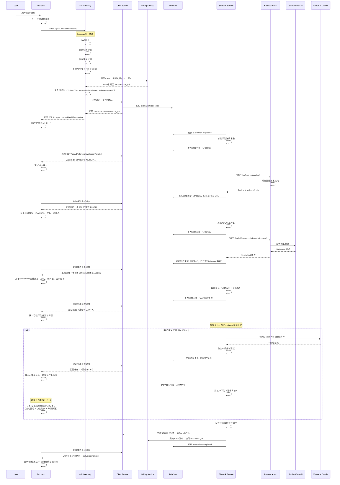

# Offer管理增强方案

**版本**: 1.0
**创建日期**: 2025-10-16
**状态**: 设计完成，待审批

---

## 📋 目录

1. [需求概述](#-需求概述)
2. [现有系统分析](#-现有系统分析)
3. [数据库Schema设计](#-数据库schema设计)
4. [评估流程增强](#-评估流程增强)
5. [API接口设计](#-api接口设计)
6. [权限集成方案](#-权限集成方案)
7. [Frontend设计](#-frontend设计)
8. [实施路线图](#-实施路线图)

---

## 🔑 关键设计决策

### 智能AI评估（权限驱动，自动执行）

本方案采用**权限驱动的自动AI评估**机制，简化前端调用并提升用户体验：

#### 设计原则
1. **前端无需传参**：移除 `enableAI` 参数，点击"评估"按钮即可
2. **后端自动判断**：根据用户订阅套餐自动决定是否执行AI评估
3. **Gateway统一管理**：权限检查和Token预留由API Gateway处理
4. **透明的升级引导**：无权限用户看到功能价值，引导升级

#### 执行流程
```
用户点击"评估"
  ↓
Gateway查询订阅套餐
  ↓
判断AI评估权限（offer_evaluation_ai）
  ↓
├─ 有权限（Pro/Elite）→ 预留3 tokens → 自动执行"基础评估 + AI评估"
└─ 无权限（Starter）→ 预留1 token → 只执行基础评估 + 前端显示升级引导
```

#### 技术实现
- **Gateway**: 查询权限 → 注入请求头 `X-Has-AI-Permission: true/false`
- **Siterank**: 读取请求头 → 自动决定是否调用Vertex AI Gemini
- **Frontend**: 根据API返回的 `userHasAIPermission` 显示结果或升级引导

#### 用户体验
- ✅ **有权限用户**：自动获得AI深度分析，无感知升级价值
- ✅ **无权限用户**：看到完整评估流程，AI部分显示锁定状态和功能列表，引导升级
- ✅ **Token计费透明**：系统自动根据套餐计算消耗（1 token vs 3 tokens）

---

## 🎯 需求概述

### 核心需求

#### 1. 批量添加Offer
- 支持多行输入Offer URL（一行一个）
- 选择投放国家（下拉框，默认"美国US"）
- 批量保存到系统

#### 2. Offer列表增强
展示的数据列包括：

**基本信息**：
- 序号
- Offer URL
- 投放国家
- 品牌名（可手动编辑）
- 状态
- 添加时间

**关键指标**：
- 普通评估分
- AI评估分
- 关联的Ads账号

**广告投放表现**：
- 曝光量 (Impressions)
- 点击量 (Clicks)
- 点击率 (CTR)
- 平均CPC

**投放收入产出比**：
- 收入 (Revenue, 可手动编辑)
- 广告支出 (Ad Spend)
- 广告支出回报率 (ROAS)

#### 3. Offer状态管理
每个Offer有4个独立的状态维度：
- **评估状态**：未评估 / 已评估
- **补点击状态**：未配置 / 已配置
- **投放状态**：未投放 / 已投放
- **归档状态**：未归档 / 已归档

#### 4. 可编辑字段
- **品牌名**：单元格直接编辑，退出即保存
- **投放国家**：支持复选批量修改
- **收入**：手动输入数值

#### 5. 评估功能增强

**用户交互**：
- 点击"评估"按钮
- 弹出评估详情面板
- 实时展示评估过程的每个步骤和阶段性成果
- 完成后保存为评估详情，用户可多次查看

**评估流程**：
```
1. 访问广告联盟Offer URL
   例：https://pboost.me/ZDO2Bdek

2. 浏览器追踪多重重定向，到达最终落地页
   例：https://www.yitahome.com/?pbtid=pb_rg36jr&utm_source=PartnerBoost&utm_medium=affiliate&utm_campaign=448227&utm_content=0

3. 提取关键信息
   - Final URL: https://www.yitahome.com/
   - Final URL suffix: pbtid=pb_rg36jr&utm_source=PartnerBoost&utm_medium=affiliate&utm_campaign=448227&utm_content=0
   - 域名: yitahome.com
   - 品牌名: yitahome

4. 调用SimilarWeb API
   API: https://data.similarweb.com/api/v1/data?domain=yitahome.com

5. 多维度分析评分
   - 普通评估：基于SimilarWeb数据，固定规则评分
   - AI评估：调用Vertex AI Gemini API，深度多维度评估
```

---

## 🔍 现有系统分析

### 数据库表结构

#### 1. Offer表（遗留表 `"Offer"`）
```sql
CREATE TABLE IF NOT EXISTS "Offer" (
  id           TEXT PRIMARY KEY,
  userId       TEXT NOT NULL,
  originalUrl  TEXT NOT NULL,
  status       TEXT NOT NULL DEFAULT 'opportunity',
  created_at   TIMESTAMPTZ NOT NULL DEFAULT now(),
  updated_at   TIMESTAMPTZ NOT NULL DEFAULT now()
);
```
**问题**：字段不足，缺少品牌名、投放国家、评估分数等

#### 2. Offer表（新表 `public.offers`）
从代码中发现存在一个新表，包含更多字段：
```go
INSERT INTO public.offers (
    id, user_id, title, status, brand_name, landing_page_url,
    ai_score, ai_score_updated_at, metadata, created_at, updated_at
) VALUES (...)
```

#### 3. OfferDailyKPI表
```sql
CREATE TABLE IF NOT EXISTS "OfferDailyKPI" (
  id           BIGSERIAL PRIMARY KEY,
  user_id      TEXT NOT NULL,
  offer_id     TEXT NOT NULL,
  date         DATE NOT NULL,
  impressions  BIGINT NOT NULL DEFAULT 0,
  clicks       BIGINT NOT NULL DEFAULT 0,
  spend        NUMERIC(16,4) NOT NULL DEFAULT 0,
  revenue      NUMERIC(16,4) NOT NULL DEFAULT 0,
  created_at   TIMESTAMPTZ NOT NULL DEFAULT now(),
  UNIQUE(user_id, offer_id, date)
);
```

#### 4. OfferAccountMap表
```sql
CREATE TABLE IF NOT EXISTS "OfferAccountMap" (
  id          BIGSERIAL PRIMARY KEY,
  user_id     TEXT NOT NULL,
  offer_id    TEXT NOT NULL,
  account_id  TEXT NOT NULL,
  linked_at   TIMESTAMPTZ NOT NULL DEFAULT now(),
  UNIQUE(offer_id, account_id)
);
```

### 现有评估流程

#### Offer Service（评估编排）
`services/offer/internal/handlers/offers_evaluation_handlers.go`:
1. 接收评估请求（enableAI, forceRefresh）
2. 检查权限和Token（硬编码规则）
3. 预扣Token
4. 创建评估记录
5. 发布Pub/Sub事件给Siterank

#### Siterank Service（评估执行）
`services/siterank/internal/evaluation/service.go`:
1. 接收评估事件
2. 调用Browser-exec获取落地页信息
3. 调用Browser-exec获取SimilarWeb数据
4. 执行基础评估或AI评估
5. 保存评估结果
6. 提交Token消耗

#### Browser-exec Service
`services/siterank/internal/browserexec/client.go`:
- **VisitURL**: 访问URL，返回`finalUrl`（已支持重定向追踪）
- **FetchSimilarWebData**: 获取SimilarWeb数据（已实现）

**关键发现**：
✅ 浏览器重定向追踪已实现（`finalUrl`）
✅ SimilarWeb数据获取已实现
❌ 缺少中间数据提取和保存（域名、品牌名、URL suffix）
❌ 评估分数未持久化到Offer表

---

## 🗄️ 数据库Schema设计

### 方案：增强现有表 + 新增评估详情表

#### 1. 扩展 public.offers 表（主表）

```sql
-- 扩展 public.offers 表
ALTER TABLE public.offers ADD COLUMN IF NOT EXISTS target_countries TEXT[] DEFAULT '{US}';
ALTER TABLE public.offers ADD COLUMN IF NOT EXISTS brand_name TEXT;
ALTER TABLE public.offers ADD COLUMN IF NOT EXISTS final_url TEXT;
ALTER TABLE public.offers ADD COLUMN IF NOT EXISTS url_suffix TEXT;
ALTER TABLE public.offers ADD COLUMN IF NOT EXISTS domain TEXT;

-- 评估分数
ALTER TABLE public.offers ADD COLUMN IF NOT EXISTS basic_score INTEGER;
ALTER TABLE public.offers ADD COLUMN IF NOT EXISTS basic_score_updated_at TIMESTAMPTZ;
-- ai_score 和 ai_score_updated_at 已存在

-- 状态字段（使用JSONB灵活扩展）
ALTER TABLE public.offers ADD COLUMN IF NOT EXISTS status_flags JSONB DEFAULT '{
  "evaluated": false,
  "click_configured": false,
  "campaign_active": false,
  "archived": false
}'::jsonb;

-- 手动输入字段
ALTER TABLE public.offers ADD COLUMN IF NOT EXISTS manual_revenue NUMERIC(16,4);

-- 索引优化
CREATE INDEX IF NOT EXISTS idx_offers_user_status ON public.offers(user_id, (status_flags->>'archived'));
CREATE INDEX IF NOT EXISTS idx_offers_domain ON public.offers(domain);
CREATE INDEX IF NOT EXISTS idx_offers_target_countries ON public.offers USING GIN(target_countries);
```

#### 2. 新增 offer_evaluation_details 表（评估详情）

```sql
CREATE TABLE IF NOT EXISTS offer_evaluation_details (
  id TEXT PRIMARY KEY,
  offer_id TEXT NOT NULL REFERENCES public.offers(id) ON DELETE CASCADE,
  user_id TEXT NOT NULL,
  evaluation_type TEXT NOT NULL, -- 'basic' or 'ai_enhanced'

  -- 重定向追踪数据
  original_url TEXT NOT NULL,
  final_url TEXT NOT NULL,
  url_suffix TEXT,
  redirect_chain JSONB, -- 完整的重定向链

  -- 提取的信息
  domain TEXT NOT NULL,
  brand_name TEXT,
  page_title TEXT,

  -- SimilarWeb数据
  similarweb_data JSONB,
  similarweb_cached BOOLEAN DEFAULT false,

  -- 评估结果
  basic_score INTEGER,
  basic_score_details JSONB,

  ai_score INTEGER,
  ai_reasons TEXT[],
  ai_industry TEXT,
  ai_raw_response JSONB,

  -- Token消耗
  tokens_consumed INTEGER NOT NULL DEFAULT 1,

  -- 状态和时间
  status TEXT NOT NULL, -- 'pending', 'processing', 'completed', 'failed'
  error_message TEXT,
  started_at TIMESTAMPTZ NOT NULL DEFAULT NOW(),
  completed_at TIMESTAMPTZ,

  created_at TIMESTAMPTZ NOT NULL DEFAULT NOW()
);

CREATE INDEX IF NOT EXISTS idx_eval_details_offer ON offer_evaluation_details(offer_id, created_at DESC);
CREATE INDEX IF NOT EXISTS idx_eval_details_user ON offer_evaluation_details(user_id, created_at DESC);
CREATE INDEX IF NOT EXISTS idx_eval_details_domain ON offer_evaluation_details(domain);
```

**设计说明**：
- `public.offers`：主表，存储Offer的最新状态和分数
- `offer_evaluation_details`：评估历史详情，每次评估生成一条记录
- 这样设计便于：
  - 快速查询Offer列表（主表）
  - 查看评估历史和详细数据（详情表）
  - 分析评估效果和趋势

#### 3. 扩展 OfferDailyKPI 表（已存在，无需修改）

已有字段满足需求：
- `impressions`: 曝光量 ✅
- `clicks`: 点击量 ✅
- `spend`: 广告支出 ✅
- `revenue`: 收入 ✅

计算字段（查询时计算）：
- CTR = clicks / impressions * 100%
- 平均CPC = spend / clicks
- ROAS = revenue / spend

---

## 🔄 评估流程增强

### 流程图



### Siterank Service增强（核心改造）

#### 修改文件：`services/siterank/internal/evaluation/service.go`

**新增数据提取逻辑**：

```go
// ExecuteEvaluation 执行完整评估流程
func (s *Service) ExecuteEvaluation(ctx context.Context, req *EvaluationRequest) (*EvaluationResult, error) {
    evalID := uuid.New().String()

    // 1. 获取Offer信息
    offer, err := s.getOffer(ctx, req.OfferID)
    if err != nil {
        return nil, fmt.Errorf("failed to get offer: %w", err)
    }

    // 2. 从请求头获取用户权限信息（Gateway已注入）
    userTier := req.UserTier // 从请求头 X-User-Tier 获取
    hasAIPermission := req.HasAIPermission // 从请求头 X-Has-AI-Permission 获取

    // 确定评估类型（自动根据权限决定）
    evalType := "basic"
    if hasAIPermission {
        evalType = "ai_enhanced"
    }

    // 3. 创建评估详情记录
    evalDetail := &EvaluationDetail{
        ID:             evalID,
        OfferID:        req.OfferID,
        UserID:         req.UserID,
        EvaluationType: evalType,
        OriginalURL:    offer.OriginalURL,
        Status:         "processing",
        StartedAt:      time.Now(),
    }
    if err := s.saveEvaluationDetail(ctx, evalDetail); err != nil {
        return nil, fmt.Errorf("failed to create evaluation detail: %w", err)
    }

    // 3. 访问原始URL，追踪重定向
    visitResult, err := s.browserExec.VisitURL(ctx, offer.OriginalURL)
    if err != nil {
        evalDetail.Status = "failed"
        evalDetail.ErrorMessage = err.Error()
        s.saveEvaluationDetail(ctx, evalDetail)
        return nil, fmt.Errorf("failed to visit URL: %w", err)
    }

    // 4. 提取Final URL和URL suffix
    finalURL := visitResult.FinalURL
    urlSuffix := extractURLSuffix(finalURL)

    // 5. 提取域名
    domain := extractDomain(finalURL)

    // 6. 提取品牌名（从域名或页面标题）
    brandName := s.brandExtractor.Extract(domain, visitResult.PageTitle, visitResult.PageContent)

    // 7. 保存提取的信息
    evalDetail.FinalURL = finalURL
    evalDetail.URLSuffix = urlSuffix
    evalDetail.Domain = domain
    evalDetail.BrandName = brandName
    evalDetail.PageTitle = visitResult.PageTitle
    s.saveEvaluationDetail(ctx, evalDetail)

    // 8. 获取SimilarWeb数据
    swData, err := s.similarwebCache.GetDomainData(ctx, domain)
    if err != nil {
        log.Printf("Warning: failed to get SimilarWeb data: %v", err)
        // 继续执行，不阻塞评估
    } else {
        evalDetail.SimilarWebData = swData
        evalDetail.SimilarWebCached = true
    }

    // 9. 执行基础评估
    basicScore := s.calculateBasicScore(swData)
    evalDetail.BasicScore = &basicScore
    evalDetail.BasicScoreDetails = map[string]interface{}{
        "global_rank_score": calculateRankScore(swData.GlobalRank),
        "traffic_score": calculateTrafficScore(swData.MonthlyVisits),
        "country_score": calculateCountryScore(swData.TopCountryShares),
    }

    // 10. AI评估（根据用户权限自动执行）
    if hasAIPermission {
        log.Printf("User %s has AI permission, executing AI evaluation", req.UserID)

        aiResult, err := s.aiEvaluator.Evaluate(ctx, &aievaluator.EvaluationInput{
            Domain:         domain,
            BrandName:      brandName,
            SimilarWebData: swData,
            PageTitle:      visitResult.PageTitle,
            BasicScore:     basicScore,
        })
        if err != nil {
            log.Printf("Warning: AI evaluation failed: %v", err)
        } else {
            evalDetail.AIScore = &aiResult.RecommendationScore
            evalDetail.AIReasons = aiResult.Reasons
            evalDetail.AIIndustry = &aiResult.Industry
            evalDetail.AIRawResponse = aiResult.RawResponse
        }
    } else {
        log.Printf("User %s does not have AI permission (tier: %s), skipping AI evaluation", req.UserID, userTier)
    }

    // 11. 更新状态为完成
    evalDetail.Status = "completed"
    evalDetail.CompletedAt = timePtr(time.Now())
    // Token消耗由Gateway预留，从请求头获取
    evalDetail.TokensConsumed = req.TokensReserved // 从 X-Tokens-Reserved 头部获取
    s.saveEvaluationDetail(ctx, evalDetail)

    // 12. 更新Offer主表
    s.updateOfferWithEvaluationResult(ctx, req.OfferID, evalDetail)

    return evalDetail.ToResult(), nil
}

// extractURLSuffix 提取URL的查询参数部分
func extractURLSuffix(fullURL string) string {
    u, err := url.Parse(fullURL)
    if err != nil {
        return ""
    }
    if u.RawQuery == "" {
        return ""
    }
    // 可能还需要包含fragment
    suffix := u.RawQuery
    if u.Fragment != "" {
        suffix += "#" + u.Fragment
    }
    return suffix
}

// extractDomain 从URL提取主域名
func extractDomain(fullURL string) string {
    u, err := url.Parse(fullURL)
    if err != nil {
        return ""
    }
    // 返回 host（包含端口），或者只返回hostname
    return u.Hostname() // yitahome.com
}

// updateOfferWithEvaluationResult 更新Offer主表
func (s *Service) updateOfferWithEvaluationResult(ctx context.Context, offerID string, eval *EvaluationDetail) error {
    query := `
        UPDATE public.offers
        SET
            final_url = $1,
            url_suffix = $2,
            domain = $3,
            brand_name = COALESCE(brand_name, $4),  -- 只在品牌名为空时更新
            basic_score = $5,
            basic_score_updated_at = NOW(),
            ai_score = $6,
            ai_score_updated_at = CASE WHEN $6 IS NOT NULL THEN NOW() ELSE ai_score_updated_at END,
            status_flags = jsonb_set(status_flags, '{evaluated}', 'true'),
            updated_at = NOW()
        WHERE id = $7
    `

    var aiScore *int
    if eval.AIScore != nil {
        aiScore = eval.AIScore
    }

    _, err := s.db.ExecContext(ctx, query,
        eval.FinalURL,
        eval.URLSuffix,
        eval.Domain,
        eval.BrandName,
        eval.BasicScore,
        aiScore,
        offerID,
    )

    return err
}
```

---

## 🔌 API接口设计

### 1. 批量创建Offer

**Endpoint**: `POST /api/v1/offers/batch`

**Request Body**:
```json
{
  "urls": [
    "https://pboost.me/ZDO2Bdek",
    "https://another-offer.com/abc123",
    "https://third-offer.com/xyz789"
  ],
  "targetCountry": "US"  // 默认值
}
```

**Response** (201 Created):
```json
{
  "success": true,
  "created": 3,
  "offers": [
    {
      "id": "offer-uuid-1",
      "originalUrl": "https://pboost.me/ZDO2Bdek",
      "targetCountries": ["US"],
      "status": "evaluating",
      "createdAt": "2025-10-16T10:30:00Z"
    },
    // ...
  ]
}
```

**权限检查**：
- 检查用户当前Offer总数
- 检查单次批量创建数量限制
- 从 `subscription_plan_configs` 读取配置：
  - `offer_creation_limit`: Offer总数限制
  - `offer_batch_size`: 单次批量上限

**实现文件**: `services/offer/internal/handlers/offers_batch_create_handler.go`

```go
func (h *Handler) createOffersBatch(w http.ResponseWriter, r *http.Request) {
    userID := middleware.GetUserID(r.Context())

    var req struct {
        URLs          []string `json:"urls"`
        TargetCountry string   `json:"targetCountry"`
    }
    if err := json.NewDecoder(r.Body).Decode(&req); err != nil {
        errors.Write(w, r, 400, "INVALID_ARGUMENT", "Invalid request body", nil)
        return
    }

    // 默认值
    if req.TargetCountry == "" {
        req.TargetCountry = "US"
    }

    // 1. 权限检查
    authHeader := r.Header.Get("Authorization")
    subscription, err := h.billingClient.GetSubscription(ctx, authHeader)
    if err != nil {
        errors.Write(w, r, 500, "INTERNAL", "Failed to check subscription", nil)
        return
    }

    permChecker := permissions.NewPermissionChecker(h.DB, h.RedisClient)

    // 检查Offer总数限制
    currentCount, _ := h.getOfferCount(ctx, userID)
    maxOffers, err := permChecker.GetFeatureQuota(ctx, subscription.Plan, "offer_creation_limit")
    if err != nil || currentCount + len(req.URLs) > maxOffers {
        errors.Write(w, r, 403, "QUOTA_EXCEEDED",
            fmt.Sprintf("Offer limit: %d/%d", currentCount, maxOffers),
            map[string]interface{}{
                "current": currentCount,
                "max": maxOffers,
                "requesting": len(req.URLs),
            })
        return
    }

    // 检查批量创建数量限制
    batchLimit, err := permChecker.GetFeatureQuota(ctx, subscription.Plan, "offer_batch_size")
    if err != nil || len(req.URLs) > batchLimit {
        errors.Write(w, r, 403, "BATCH_SIZE_EXCEEDED",
            fmt.Sprintf("Batch size limit: %d", batchLimit),
            map[string]interface{}{"max": batchLimit})
        return
    }

    // 2. 批量创建Offer
    offers := []Offer{}
    for _, url := range req.URLs {
        offer := h.createSingleOffer(ctx, userID, url, req.TargetCountry)
        offers = append(offers, offer)
    }

    // 3. 返回结果
    w.Header().Set("Content-Type", "application/json")
    w.WriteHeader(http.StatusCreated)
    json.NewEncoder(w).Encode(map[string]interface{}{
        "success": true,
        "created": len(offers),
        "offers": offers,
    })
}
```

### 2. 获取Offer列表（增强版）

**Endpoint**: `GET /api/v1/offers?include=kpi,accounts,evaluation`

**Query Parameters**:
- `include`: 指定包含的关联数据，逗号分隔
  - `kpi`: 包含KPI数据（曝光、点击、CTR、CPC、ROAS）
  - `accounts`: 包含关联的Ads账号
  - `evaluation`: 包含最新评估结果
- `status`: 过滤状态（多个状态用逗号分隔）
- `archived`: true/false，是否包含已归档

**Response** (200 OK):
```json
{
  "items": [
    {
      "id": "offer-uuid-1",
      "userId": "user-uuid",
      "originalUrl": "https://pboost.me/ZDO2Bdek",
      "targetCountries": ["US", "CA"],
      "brandName": "yitahome",
      "status": "active",
      "statusFlags": {
        "evaluated": true,
        "clickConfigured": true,
        "campaignActive": true,
        "archived": false
      },

      // 评估数据
      "finalUrl": "https://www.yitahome.com/",
      "domain": "yitahome.com",
      "basicScore": 75,
      "aiScore": 82,
      "basicScoreUpdatedAt": "2025-10-16T10:45:00Z",
      "aiScoreUpdatedAt": "2025-10-16T10:45:30Z",

      // KPI数据（30天汇总）
      "kpi": {
        "impressions": 150000,
        "clicks": 3500,
        "ctr": 2.33,
        "avgCpc": 0.85,
        "spend": 2975.00,
        "revenue": 4200.00,
        "manualRevenue": 4500.00,  // 用户手动输入
        "roas": 1.41,
        "period": "30d"
      },

      // 关联的Ads账号
      "accounts": [
        {
          "accountId": "123-456-7890",
          "accountName": "My Ads Account",
          "linkedAt": "2025-10-10T08:00:00Z"
        }
      ],

      "createdAt": "2025-10-16T09:00:00Z",
      "updatedAt": "2025-10-16T10:45:30Z"
    }
  ],
  "pagination": {
    "page": 1,
    "limit": 50,
    "totalCount": 120,
    "totalPages": 3,
    "hasMore": true
  }
}
```

**实现文件**: `services/offer/internal/handlers/offers_list_handler.go`

增强现有的 `getOffers` 方法：

```go
func (h *Handler) getOffers(w http.ResponseWriter, r *http.Request) {
    userID := middleware.GetUserID(r.Context())
    query := r.URL.Query()

    // 解析 include 参数
    includeStr := query.Get("include")
    includes := parseIncludes(includeStr) // map[string]bool

    // 查询主表
    offers, err := h.listOffersEnhanced(ctx, userID, filters)
    if err != nil {
        errors.Write(w, r, 500, "INTERNAL", "Failed to fetch offers", nil)
        return
    }

    // 根据 include 参数加载关联数据
    if includes["kpi"] {
        h.enrichOffersWithKPI(ctx, offers, 30) // 30天数据
    }
    if includes["accounts"] {
        h.enrichOffersWithAccounts(ctx, offers)
    }
    if includes["evaluation"] {
        h.enrichOffersWithEvaluation(ctx, offers)
    }

    // 返回结果
    w.Header().Set("Content-Type", "application/json")
    json.NewEncoder(w).Encode(map[string]interface{}{
        "items": offers,
        "pagination": pagination,
    })
}

// enrichOffersWithKPI 填充KPI数据
func (h *Handler) enrichOffersWithKPI(ctx context.Context, offers []*Offer, days int) {
    offerIDs := extractOfferIDs(offers)

    // 查询过去N天的KPI汇总
    rows, err := h.DB.QueryContext(ctx, `
        SELECT
            offer_id,
            SUM(impressions) as total_impressions,
            SUM(clicks) as total_clicks,
            SUM(spend) as total_spend,
            SUM(revenue) as total_revenue
        FROM "OfferDailyKPI"
        WHERE offer_id = ANY($1)
          AND date >= CURRENT_DATE - $2
        GROUP BY offer_id
    `, pq.Array(offerIDs), days)

    if err != nil {
        log.Printf("Failed to fetch KPI: %v", err)
        return
    }
    defer rows.Close()

    kpiMap := make(map[string]*KPIData)
    for rows.Next() {
        var offerID string
        var kpi KPIData
        rows.Scan(&offerID, &kpi.Impressions, &kpi.Clicks, &kpi.Spend, &kpi.Revenue)

        // 计算派生指标
        if kpi.Impressions > 0 {
            kpi.CTR = float64(kpi.Clicks) / float64(kpi.Impressions) * 100
        }
        if kpi.Clicks > 0 {
            kpi.AvgCPC = kpi.Spend / float64(kpi.Clicks)
        }
        if kpi.Spend > 0 {
            kpi.ROAS = kpi.Revenue / kpi.Spend
        }
        kpi.Period = fmt.Sprintf("%dd", days)

        kpiMap[offerID] = &kpi
    }

    // 填充到Offer对象
    for _, offer := range offers {
        if kpi, ok := kpiMap[offer.ID]; ok {
            offer.KPI = kpi
            // 如果有手动输入的收入，使用手动值重新计算ROAS
            if offer.ManualRevenue != nil && *offer.ManualRevenue > 0 {
                kpi.ManualRevenue = offer.ManualRevenue
                if kpi.Spend > 0 {
                    kpi.ROAS = *offer.ManualRevenue / kpi.Spend
                }
            }
        }
    }
}
```

### 3. 更新Offer字段

**Endpoint**: `PATCH /api/v1/offers/:id`

**Request Body** (支持部分更新):
```json
{
  "brandName": "YitaHome Official",
  "targetCountries": ["US", "CA", "GB"],
  "manualRevenue": 5200.50
}
```

**Response** (200 OK):
```json
{
  "success": true,
  "offer": {
    "id": "offer-uuid-1",
    "brandName": "YitaHome Official",
    "targetCountries": ["US", "CA", "GB"],
    "manualRevenue": 5200.50,
    "updatedAt": "2025-10-16T11:00:00Z"
  }
}
```

**实现文件**: `services/offer/internal/handlers/offers_update_handler.go`

```go
func (h *Handler) updateOffer(w http.ResponseWriter, r *http.Request, offerID, userID string) {
    var req struct {
        BrandName      *string   `json:"brandName"`
        TargetCountries *[]string `json:"targetCountries"`
        ManualRevenue  *float64  `json:"manualRevenue"`
    }
    if err := json.NewDecoder(r.Body).Decode(&req); err != nil {
        errors.Write(w, r, 400, "INVALID_ARGUMENT", "Invalid request body", nil)
        return
    }

    // 构建动态更新语句
    updates := []string{}
    args := []interface{}{}
    argIdx := 1

    if req.BrandName != nil {
        updates = append(updates, fmt.Sprintf("brand_name = $%d", argIdx))
        args = append(args, *req.BrandName)
        argIdx++
    }
    if req.TargetCountries != nil {
        updates = append(updates, fmt.Sprintf("target_countries = $%d", argIdx))
        args = append(args, pq.Array(*req.TargetCountries))
        argIdx++
    }
    if req.ManualRevenue != nil {
        updates = append(updates, fmt.Sprintf("manual_revenue = $%d", argIdx))
        args = append(args, *req.ManualRevenue)
        argIdx++
    }

    if len(updates) == 0 {
        errors.Write(w, r, 400, "INVALID_ARGUMENT", "No fields to update", nil)
        return
    }

    updates = append(updates, "updated_at = NOW()")
    args = append(args, offerID, userID)

    query := fmt.Sprintf(`
        UPDATE public.offers
        SET %s
        WHERE id = $%d AND user_id = $%d
        RETURNING id, brand_name, target_countries, manual_revenue, updated_at
    `, strings.Join(updates, ", "), argIdx, argIdx+1)

    var result Offer
    err := h.DB.QueryRowContext(ctx, query, args...).Scan(
        &result.ID, &result.BrandName, pq.Array(&result.TargetCountries),
        &result.ManualRevenue, &result.UpdatedAt,
    )

    if err != nil {
        errors.Write(w, r, 404, "NOT_FOUND", "Offer not found", nil)
        return
    }

    w.Header().Set("Content-Type", "application/json")
    json.NewEncoder(w).Encode(map[string]interface{}{
        "success": true,
        "offer": result,
    })
}
```

### 4. 批量更新投放国家

**Endpoint**: `PATCH /api/v1/offers/bulk-update-countries`

**Request Body**:
```json
{
  "offerIds": ["offer-uuid-1", "offer-uuid-2", "offer-uuid-3"],
  "targetCountries": ["US", "CA", "GB", "AU"]
}
```

**Response** (200 OK):
```json
{
  "success": true,
  "updated": 3
}
```

### 5. 增强评估API

**Endpoint**: `POST /api/v1/offers/:id/evaluate`

**Request Body**:
```json
{
  "forceRefresh": false
}
```

**说明**：
- 不再需要 `enableAI` 参数
- 后端根据用户订阅套餐自动判断是否执行AI评估
- 有AI权限：自动执行"普通评估 + AI评估"
- 无AI权限：只执行"普通评估"，前端显示升级引导

**Response** (202 Accepted):
```json
{
  "evaluationId": "eval-uuid-1",
  "offerId": "offer-uuid-1",
  "status": "pending",
  "message": "Evaluation started",
  "estimatedTime": "30s",
  "tokensReserved": 3
}
```

**轮询状态**: `GET /api/v1/offers/:id/evaluation/:evaluationId`

**Response** (200 OK):
```json
{
  "id": "eval-uuid-1",
  "status": "completed",
  "userHasAIPermission": true,  // 用户是否有AI评估权限
  "progress": {
    "step": 5,
    "totalSteps": 5,
    "currentStep": "AI评估完成",
    "steps": [
      {"name": "访问原始URL", "status": "completed", "duration": 3200},
      {"name": "追踪重定向", "status": "completed", "duration": 2800},
      {"name": "提取域名和品牌", "status": "completed", "duration": 500},
      {"name": "获取SimilarWeb数据", "status": "completed", "duration": 5600},
      {"name": "AI深度评估", "status": "completed", "duration": 18000}
    ]
  },
  "result": {
    "originalUrl": "https://pboost.me/ZDO2Bdek",
    "finalUrl": "https://www.yitahome.com/",
    "urlSuffix": "pbtid=pb_rg36jr&utm_source=PartnerBoost...",
    "domain": "yitahome.com",
    "brandName": "yitahome",
    "pageTitle": "YitaHome - Modern Furniture & Home Decor",

    "basicScore": 75,
    "basicScoreDetails": {
      "globalRankScore": 80,
      "trafficScore": 70,
      "countryScore": 75
    },

    "aiScore": 82,
    "aiReasons": [
      "Strong global presence with consistent traffic growth",
      "High-quality brand recognition in home furniture category",
      "Good geographic diversity in traffic sources"
    ],
    "aiIndustry": "E-commerce - Home & Furniture",

    "similarWebData": {
      "globalRank": 15234,
      "monthlyVisits": 2500000,
      "topCountryShares": [
        {"country": "US", "value": 45.2},
        {"country": "CA", "value": 18.3},
        {"country": "GB", "value": 12.1}
      ]
    },

    "tokensConsumed": 3,
    "completedAt": "2025-10-16T10:45:35Z"
  }
}
```

---

## 🔐 权限集成方案

### 扩展 subscription_plan_configs 表

```sql
UPDATE subscription_plan_configs
SET permissions = permissions || '{
  "offer_creation_limit": 10,
  "offer_batch_size": 5
}'::jsonb
WHERE tier = 'starter';

UPDATE subscription_plan_configs
SET permissions = permissions || '{
  "offer_creation_limit": 50,
  "offer_batch_size": 20
}'::jsonb
WHERE tier = 'pro';

UPDATE subscription_plan_configs
SET permissions = permissions || '{
  "offer_creation_limit": -1,
  "offer_batch_size": 50
}'::jsonb
WHERE tier = 'elite';
```

**配置说明**：
- `offer_creation_limit`: Offer总数限制（-1表示无限制）
- `offer_batch_size`: 单次批量创建数量限制
- `evaluation_concurrency`: 并发评估数量（已有）

### PermissionChecker 新增方法

```go
// GetOfferCreationLimit 获取Offer创建限制
func (pc *PermissionChecker) GetOfferCreationLimit(ctx context.Context, userTier string) (int, error) {
    limit, err := pc.GetFeatureQuota(ctx, userTier, "offer_creation_limit")
    if err != nil {
        return 0, err
    }
    return limit, nil
}

// GetOfferBatchSize 获取批量创建限制
func (pc *PermissionChecker) GetOfferBatchSize(ctx context.Context, userTier string) (int, error) {
    batchSize, err := pc.GetFeatureQuota(ctx, userTier, "offer_batch_size")
    if err != nil {
        return 0, err
    }
    return batchSize, nil
}
```

---

## 🎨 Frontend设计

### 1. 批量添加Offer页面

**路径**: `/dashboard/offers/new`

**布局**：
```tsx
import { DashboardPageLayout } from '~/core/ui/PageLayout';

export default function BatchCreateOffersPage() {
  const [urls, setUrls] = useState('');
  const [targetCountry, setTargetCountry] = useState('US');
  const [isSubmitting, setIsSubmitting] = useState(false);

  return (
    <DashboardPageLayout>
      <div className="flex flex-col gap-6">
        <Section>
          <SectionHeader
            title="批量添加Offer"
            description="支持一次添加多个Offer URL，每行一个"
          />
          <SectionBody>
            <form onSubmit={handleSubmit}>
              {/* URL输入框 */}
              <Textarea
                label="Offer URLs"
                placeholder="https://pboost.me/ZDO2Bdek
https://another-offer.com/abc123
https://third-offer.com/xyz789"
                rows={10}
                value={urls}
                onChange={(e) => setUrls(e.target.value)}
              />

              {/* 国家选择 */}
              <Select
                label="投放国家"
                value={targetCountry}
                onChange={(e) => setTargetCountry(e.target.value)}
              >
                <option value="US">美国 (US)</option>
                <option value="CA">加拿大 (CA)</option>
                <option value="GB">英国 (GB)</option>
                <option value="AU">澳大利亚 (AU)</option>
                {/* 更多国家 */}
              </Select>

              {/* 提交按钮 */}
              <Button type="submit" loading={isSubmitting}>
                创建 {urls.split('\n').filter(u => u.trim()).length} 个Offer
              </Button>
            </form>
          </SectionBody>
        </Section>
      </div>
    </DashboardPageLayout>
  );
}
```

### 2. Offer列表页（增强版）

**路径**: `/dashboard/offers`

**关键功能**：
- 复杂数据表格（使用 TanStack Table）
- 单元格直接编辑（品牌名、收入）
- 批量选择和操作
- 多种状态筛选

**数据表格列定义**：

```tsx
const columns: ColumnDef<Offer>[] = [
  // 复选框列
  {
    id: 'select',
    header: ({ table }) => (
      <Checkbox
        checked={table.getIsAllRowsSelected()}
        onChange={table.getToggleAllRowsSelectedHandler()}
      />
    ),
    cell: ({ row }) => (
      <Checkbox
        checked={row.getIsSelected()}
        onChange={row.getToggleSelectedHandler()}
      />
    ),
  },

  // 序号
  {
    accessorKey: 'rowNumber',
    header: '#',
    cell: ({ row }) => row.index + 1,
  },

  // Offer URL
  {
    accessorKey: 'originalUrl',
    header: 'Offer URL',
    cell: ({ row }) => (
      <a href={row.original.originalUrl} target="_blank" className="text-blue-600 hover:underline">
        {truncateURL(row.original.originalUrl)}
      </a>
    ),
  },

  // 投放国家（可编辑）
  {
    accessorKey: 'targetCountries',
    header: '投放国家',
    cell: ({ row }) => (
      <EditableCountries
        offerId={row.original.id}
        countries={row.original.targetCountries}
        onUpdate={handleCountryUpdate}
      />
    ),
  },

  // 品牌名（可编辑）
  {
    accessorKey: 'brandName',
    header: '品牌名',
    cell: ({ row }) => (
      <EditableCell
        value={row.original.brandName}
        onSave={(value) => handleUpdate(row.original.id, { brandName: value })}
      />
    ),
  },

  // 状态
  {
    accessorKey: 'statusFlags',
    header: '状态',
    cell: ({ row }) => <StatusBadges statusFlags={row.original.statusFlags} />,
  },

  // 普通评估分
  {
    accessorKey: 'basicScore',
    header: '普通评估',
    cell: ({ row }) => (
      <ScoreBadge score={row.original.basicScore} />
    ),
  },

  // AI评估分
  {
    accessorKey: 'aiScore',
    header: 'AI评估',
    cell: ({ row }) => (
      <ScoreBadge score={row.original.aiScore} type="ai" />
    ),
  },

  // 关联账号
  {
    accessorKey: 'accounts',
    header: 'Ads账号',
    cell: ({ row }) => (
      <AccountBadges accounts={row.original.accounts} />
    ),
  },

  // KPI数据
  {
    header: 'KPI (30天)',
    columns: [
      {
        accessorKey: 'kpi.impressions',
        header: '曝光',
        cell: ({ row }) => formatNumber(row.original.kpi?.impressions),
      },
      {
        accessorKey: 'kpi.clicks',
        header: '点击',
        cell: ({ row }) => formatNumber(row.original.kpi?.clicks),
      },
      {
        accessorKey: 'kpi.ctr',
        header: 'CTR',
        cell: ({ row }) => formatPercentage(row.original.kpi?.ctr),
      },
      {
        accessorKey: 'kpi.avgCpc',
        header: '平均CPC',
        cell: ({ row }) => formatCurrency(row.original.kpi?.avgCpc),
      },
    ],
  },

  // 投放ROI
  {
    header: '投放ROI',
    columns: [
      {
        accessorKey: 'kpi.revenue',
        header: '收入',
        cell: ({ row }) => (
          <EditableCell
            value={row.original.manualRevenue || row.original.kpi?.revenue}
            type="currency"
            onSave={(value) => handleUpdate(row.original.id, { manualRevenue: value })}
          />
        ),
      },
      {
        accessorKey: 'kpi.spend',
        header: '广告支出',
        cell: ({ row }) => formatCurrency(row.original.kpi?.spend),
      },
      {
        accessorKey: 'kpi.roas',
        header: 'ROAS',
        cell: ({ row }) => (
          <ROASBadge roas={row.original.kpi?.roas} />
        ),
      },
    ],
  },

  // 操作
  {
    id: 'actions',
    header: '操作',
    cell: ({ row }) => (
      <ActionButtons
        offer={row.original}
        onEvaluate={handleEvaluate}
        onConfigureClick={handleConfigureClick}
        onArchive={handleArchive}
      />
    ),
  },
];
```

### 3. 评估详情面板组件

**组件**: `EvaluationDetailPanel.tsx`

```tsx
export function EvaluationDetailPanel({
  offerId,
  evaluationId,
  onClose
}: EvaluationDetailPanelProps) {
  const [status, setStatus] = useState<'pending' | 'processing' | 'completed' | 'failed'>('pending');
  const [progress, setProgress] = useState<EvaluationProgress | null>(null);
  const [result, setResult] = useState<Partial<EvaluationResult>>({});
  const [userHasAIPermission, setUserHasAIPermission] = useState<boolean>(false);

  useEffect(() => {
    // 轮询评估状态和阶段性结果
    const pollInterval = setInterval(async () => {
      const res = await fetch(`/api/v1/offers/${offerId}/evaluation/${evaluationId}`);
      const data = await res.json();

      setStatus(data.status);
      setProgress(data.progress);
      setResult(prev => ({ ...prev, ...data.result })); // 增量更新结果
      setUserHasAIPermission(data.userHasAIPermission); // 获取用户AI权限

      if (data.status === 'completed' || data.status === 'failed') {
        clearInterval(pollInterval);
      }
    }, 2000);

    return () => clearInterval(pollInterval);
  }, [offerId, evaluationId]);

  return (
    <Sheet open onOpenChange={(open) => !open && onClose()}>
      <SheetContent side="right" className="w-[600px] overflow-y-auto">
        <SheetHeader>
          <SheetTitle>评估详情</SheetTitle>
          <SheetDescription>
            {status === 'completed' ? '评估已完成' : '正在进行评估...'}
          </SheetDescription>
        </SheetHeader>

        <div className="space-y-6 py-6">
          {/* 进度条 */}
          <div className="space-y-2">
            <div className="flex justify-between text-sm">
              <span className="font-medium">评估进度</span>
              <span className="text-muted-foreground">
                {progress?.step || 0} / {progress?.totalSteps || 5}
              </span>
            </div>
            <Progress value={(progress?.step || 0) / (progress?.totalSteps || 5) * 100} />
          </div>

          {/* 评估步骤列表 */}
          <div className="space-y-3">
            {progress?.steps?.map((step, idx) => (
              <div key={idx} className="flex items-start gap-3 p-3 rounded-lg border">
                {/* 步骤图标 */}
                {step.status === 'completed' && (
                  <CheckCircle2 className="w-5 h-5 text-green-600 mt-0.5" />
                )}
                {step.status === 'processing' && (
                  <Loader2 className="w-5 h-5 text-blue-600 animate-spin mt-0.5" />
                )}
                {step.status === 'pending' && (
                  <Circle className="w-5 h-5 text-gray-300 mt-0.5" />
                )}

                <div className="flex-1 space-y-1">
                  <p className="font-medium text-sm">{step.name}</p>
                  {step.status === 'completed' && step.duration && (
                    <p className="text-xs text-muted-foreground">
                      耗时 {(step.duration / 1000).toFixed(1)}s
                    </p>
                  )}
                </div>
              </div>
            ))}
          </div>

          {/* 阶段性成果展示 */}
          {result.finalUrl && (
            <Card>
              <CardHeader>
                <CardTitle className="text-sm">落地页信息</CardTitle>
              </CardHeader>
              <CardContent className="space-y-2">
                <DataRow label="落地页URL" value={result.finalUrl} />
                <DataRow label="域名" value={result.domain} />
                <DataRow label="品牌名" value={result.brandName} />
                <DataRow label="页面标题" value={result.pageTitle} />
              </CardContent>
            </Card>
          )}

          {/* SimilarWeb数据 */}
          {result.similarWebData && (
            <Card>
              <CardHeader>
                <CardTitle className="text-sm">SimilarWeb数据</CardTitle>
              </CardHeader>
              <CardContent className="space-y-2">
                <DataRow
                  label="全球排名"
                  value={result.similarWebData.globalRank?.toLocaleString()}
                />
                <DataRow
                  label="月访问量"
                  value={result.similarWebData.monthlyVisits?.toLocaleString()}
                />
                {result.similarWebData.topCountryShares && (
                  <div>
                    <p className="text-xs font-medium mb-2">主要流量来源国家</p>
                    <div className="space-y-1">
                      {result.similarWebData.topCountryShares.slice(0, 3).map((country, idx) => (
                        <div key={idx} className="flex justify-between text-xs">
                          <span>{country.country}</span>
                          <span>{country.value.toFixed(1)}%</span>
                        </div>
                      ))}
                    </div>
                  </div>
                )}
              </CardContent>
            </Card>
          )}

          {/* 基础评估分数 */}
          {result.basicScore !== undefined && (
            <Card>
              <CardHeader>
                <CardTitle className="text-sm">基础评估</CardTitle>
              </CardHeader>
              <CardContent>
                <div className="flex items-center gap-4">
                  <div className="relative w-24 h-24">
                    <CircularProgress value={result.basicScore} />
                    <div className="absolute inset-0 flex items-center justify-center">
                      <span className="text-2xl font-bold">{result.basicScore}</span>
                    </div>
                  </div>
                  {result.basicScoreDetails && (
                    <div className="flex-1 space-y-1 text-sm">
                      <DataRow
                        label="排名得分"
                        value={result.basicScoreDetails.globalRankScore}
                      />
                      <DataRow
                        label="流量得分"
                        value={result.basicScoreDetails.trafficScore}
                      />
                      <DataRow
                        label="国家得分"
                        value={result.basicScoreDetails.countryScore}
                      />
                    </div>
                  )}
                </div>
              </CardContent>
            </Card>
          )}

          {/* AI评估分数和建议（或升级引导） */}
          <Card>
            <CardHeader>
              <CardTitle className="text-sm flex items-center gap-2">
                <Sparkles className="w-4 h-4" />
                AI评估
              </CardTitle>
            </CardHeader>
            <CardContent className="space-y-4">
              {/* 有AI权限且评估完成 */}
              {userHasAIPermission && result.aiScore !== undefined && (
                <>
                  <div className="flex items-center gap-4">
                    <div className="relative w-24 h-24">
                      <CircularProgress value={result.aiScore} color="primary" />
                      <div className="absolute inset-0 flex items-center justify-center">
                        <span className="text-2xl font-bold text-primary">{result.aiScore}</span>
                      </div>
                    </div>
                    {result.aiIndustry && (
                      <div className="flex-1">
                        <p className="text-xs text-muted-foreground">行业分类</p>
                        <p className="font-medium">{result.aiIndustry}</p>
                      </div>
                    )}
                  </div>

                  {result.aiReasons && result.aiReasons.length > 0 && (
                    <div className="space-y-2">
                      <p className="text-xs font-medium">AI洞察与建议</p>
                      <ul className="space-y-2">
                        {result.aiReasons.map((reason, idx) => (
                          <li key={idx} className="flex items-start gap-2 text-sm">
                            <Badge variant="outline" className="mt-0.5">{idx + 1}</Badge>
                            <span>{reason}</span>
                          </li>
                        ))}
                      </ul>
                    </div>
                  )}
                </>
              )}

              {/* 有AI权限但评估中 */}
              {userHasAIPermission && result.aiScore === undefined && status === 'processing' && (
                <div className="flex items-center justify-center py-8">
                  <div className="text-center space-y-2">
                    <Loader2 className="w-8 h-8 text-primary animate-spin mx-auto" />
                    <p className="text-sm text-muted-foreground">AI评估进行中...</p>
                  </div>
                </div>
              )}

              {/* 无AI权限 - 显示升级引导 */}
              {!userHasAIPermission && (
                <div className="space-y-4 py-4">
                  {/* 锁定图标 */}
                  <div className="flex justify-center">
                    <div className="w-16 h-16 rounded-full bg-muted flex items-center justify-center">
                      <Lock className="w-8 h-8 text-muted-foreground" />
                    </div>
                  </div>

                  {/* 引导文案 */}
                  <div className="text-center space-y-2">
                    <h4 className="font-semibold">解锁AI深度评估</h4>
                    <p className="text-sm text-muted-foreground">
                      升级到 <Badge variant="secondary">Pro</Badge> 或 <Badge variant="secondary">Elite</Badge> 套餐，
                      获得AI驱动的深度分析和行业洞察
                    </p>
                  </div>

                  {/* AI功能列表 */}
                  <div className="space-y-2 text-sm">
                    <div className="flex items-start gap-2">
                      <Check className="w-4 h-4 text-green-600 mt-0.5" />
                      <span>多维度深度评估（流量质量、用户行为、转化潜力）</span>
                    </div>
                    <div className="flex items-start gap-2">
                      <Check className="w-4 h-4 text-green-600 mt-0.5" />
                      <span>行业智能分类和竞品对比分析</span>
                    </div>
                    <div className="flex items-start gap-2">
                      <Check className="w-4 h-4 text-green-600 mt-0.5" />
                      <span>个性化优化建议和投放策略</span>
                    </div>
                    <div className="flex items-start gap-2">
                      <Check className="w-4 h-4 text-green-600 mt-0.5" />
                      <span>风险预警和机会识别</span>
                    </div>
                  </div>

                  {/* 升级按钮 */}
                  <div className="flex gap-2">
                    <Button
                      className="flex-1"
                      onClick={() => {
                        window.location.href = '/pricing';
                      }}
                    >
                      <Sparkles className="w-4 h-4 mr-2" />
                      查看套餐价格
                    </Button>
                    <Button
                      variant="outline"
                      onClick={() => {
                        window.open('/docs/ai-evaluation', '_blank');
                      }}
                    >
                      了解更多
                    </Button>
                  </div>

                  {/* 附加说明 */}
                  <p className="text-xs text-center text-muted-foreground">
                    升级后，所有评估将自动包含AI深度分析
                  </p>
                </div>
              )}
            </CardContent>
          </Card>

          {/* Token消耗 */}
          {result.tokensConsumed && (
            <div className="text-xs text-muted-foreground text-center">
              本次评估消耗 {result.tokensConsumed} 个Token
            </div>
          )}
        </div>
      </SheetContent>
    </Sheet>
  );
}

// 辅助组件
function DataRow({ label, value }: { label: string; value?: string | number }) {
  if (!value) return null;
  return (
    <div className="flex justify-between text-sm">
      <span className="text-muted-foreground">{label}</span>
      <span className="font-medium">{value}</span>
    </div>
  );
}
```

**设计特点**：
1. **实时进度展示**：显示当前步骤和完成百分比
2. **阶段性成果**：每完成一个步骤，立即展示获取到的数据
3. **增量更新**：通过轮询持续更新面板内容
4. **可复查**：评估完成后，详情面板保持打开，用户可以关闭后再次查看
5. **清晰的状态指示**：使用图标（✓、⏳、○）表示步骤状态

### 4. 评估历史查看入口

在Offer列表页添加"查看评估详情"按钮：

```tsx
// 在ActionButtons组件中添加
function ActionButtons({ offer }: { offer: Offer }) {
  return (
    <DropdownMenu>
      <DropdownMenuTrigger asChild>
        <Button variant="ghost" size="icon">
          <MoreVertical className="w-4 h-4" />
        </Button>
      </DropdownMenuTrigger>
      <DropdownMenuContent align="end">
        {/* 评估操作 */}
        {!offer.statusFlags.evaluated && (
          <DropdownMenuItem onClick={() => handleEvaluate(offer.id)}>
            <FileSearch className="w-4 h-4 mr-2" />
            开始评估
          </DropdownMenuItem>
        )}

        {/* 查看评估详情（如果已评估） */}
        {offer.statusFlags.evaluated && (
          <DropdownMenuItem onClick={() => handleViewEvaluation(offer.id)}>
            <Eye className="w-4 h-4 mr-2" />
            查看评估详情
          </DropdownMenuItem>
        )}

        {/* 其他操作... */}
      </DropdownMenuContent>
    </DropdownMenu>
  );
}
```

---

## 🚀 实施路线图

### Phase 1: 数据库Schema升级（Week 1）

**任务清单**：
- [ ] 创建数据库迁移文件
- [ ] 扩展 `public.offers` 表
- [ ] 创建 `offer_evaluation_details` 表
- [ ] 添加索引优化
- [ ] 测试Schema兼容性

**SQL文件**: `schemas/sql/030_offer_enhancement.sql`

### Phase 2: Siterank评估流程增强（Week 1-2）

**任务清单**：
- [ ] 实现URL suffix提取逻辑
- [ ] 实现域名提取逻辑
- [ ] 增强品牌名提取（`brandextract`包）
- [ ] 保存评估详情到新表
- [ ] 更新Offer主表字段
- [ ] 添加评估进度追踪

**修改文件**：
- `services/siterank/internal/evaluation/service.go`
- `services/siterank/internal/evaluation/extraction.go` (新建)

### Phase 3: Offer Service API增强（Week 2）

**任务清单**：
- [ ] 实现批量创建Offer API
- [ ] 增强列表查询API（支持KPI、账号、评估数据）
- [ ] 实现单字段更新API
- [ ] 实现批量更新国家API
- [ ] 集成权限检查（PermissionChecker）
- [ ] 添加Offer数量和批量限制检查

**新增文件**：
- `services/offer/internal/handlers/offers_batch_create_handler.go`
- `services/offer/internal/handlers/offers_enrichment.go`

### Phase 4: 权限配置扩展（Week 2）

**任务清单**：
- [ ] 更新 `subscription_plan_configs` 表数据
- [ ] 添加 `offer_creation_limit` 配置
- [ ] 添加 `offer_batch_size` 配置
- [ ] 更新文档 `07-SUBSCRIPTION-CONFIG-HOT-RELOAD.md`

### Phase 5: Frontend实现（Week 3-4）

**任务清单**：
- [ ] 批量添加Offer页面
- [ ] Offer列表页（TanStack Table）
- [ ] 单元格编辑组件（EditableCell）
- [ ] 评估详情面板组件（实时进度和阶段成果展示）
- [ ] 批量操作功能
- [ ] 状态筛选和搜索

**新增文件**：
- `apps/frontend/src/app/dashboard/offers/new/page.tsx`
- `apps/frontend/src/app/dashboard/offers/page.tsx`
- `apps/frontend/src/components/offers/EvaluationDetailPanel.tsx`
- `apps/frontend/src/components/offers/EditableCell.tsx`

### Phase 6: 测试和优化（Week 4）

**任务清单**：
- [ ] 单元测试（后端API）
- [ ] 集成测试（评估流程）
- [ ] E2E测试（前端完整流程）
- [ ] 性能测试（批量创建、列表查询）
- [ ] 用户验收测试

---

## 📊 关键指标定义

### CTR（点击率）
```
CTR = (Clicks / Impressions) × 100%
```

### 平均CPC（Cost Per Click）
```
Average CPC = Total Spend / Total Clicks
```

### ROAS（广告支出回报率）
```
ROAS = Revenue / Ad Spend
```

**说明**：
- 如果用户手动输入了Revenue，则使用手动值
- 否则使用从Google Ads同步的实际Revenue

---

## 🔧 技术实现细节

### URL Suffix提取

```go
func extractURLSuffix(fullURL string) string {
    u, err := url.Parse(fullURL)
    if err != nil {
        return ""
    }

    suffix := ""
    if u.RawQuery != "" {
        suffix = u.RawQuery
    }
    if u.Fragment != "" {
        if suffix != "" {
            suffix += "#" + u.Fragment
        } else {
            suffix = "#" + u.Fragment
        }
    }

    return suffix
}
```

### 域名提取

```go
func extractDomain(fullURL string) string {
    u, err := url.Parse(fullURL)
    if err != nil {
        return ""
    }

    // 返回 hostname（不包含端口）
    // 例：www.yitahome.com:443 → www.yitahome.com
    return u.Hostname()
}
```

### 品牌名提取（增强版）

```go
// Extract 从多个来源提取品牌名
func (e *Extractor) Extract(domain, pageTitle, pageContent string) string {
    // 1. 尝试从域名提取（移除www、.com等）
    brandFromDomain := e.extractFromDomain(domain)

    // 2. 尝试从页面标题提取
    brandFromTitle := e.extractFromTitle(pageTitle)

    // 3. 尝试从页面内容提取（meta标签、JSON-LD等）
    brandFromContent := e.extractFromContent(pageContent)

    // 4. 选择最佳结果（优先级：content > title > domain）
    if brandFromContent != "" {
        return brandFromContent
    }
    if brandFromTitle != "" {
        return brandFromTitle
    }
    return brandFromDomain
}

func (e *Extractor) extractFromDomain(domain string) string {
    // 移除 www. 前缀
    domain = strings.TrimPrefix(domain, "www.")

    // 移除顶级域名后缀
    parts := strings.Split(domain, ".")
    if len(parts) > 1 {
        return parts[0]
    }
    return domain
}

func (e *Extractor) extractFromTitle(title string) string {
    // 常见模式：
    // "BrandName - Description"
    // "BrandName | Description"
    // "Description - BrandName"

    separators := []string{" - ", " | ", " – "}
    for _, sep := range separators {
        parts := strings.Split(title, sep)
        if len(parts) >= 2 {
            // 取第一部分或最后一部分（根据长度判断）
            first := strings.TrimSpace(parts[0])
            last := strings.TrimSpace(parts[len(parts)-1])

            // 选择较短的作为品牌名
            if len(first) < len(last) && len(first) > 0 {
                return first
            }
            if len(last) > 0 {
                return last
            }
        }
    }

    // 如果没有分隔符，返回整个title（限制长度）
    if len(title) > 0 && len(title) <= 50 {
        return title
    }

    return ""
}
```

---

## 📝 总结

本方案完整实现了Offer管理的增强功能：

### 核心特性
1. ✅ 批量添加Offer（多行输入 + 国家选择）
2. ✅ 增强的Offer列表（完整KPI + 可编辑字段）
3. ✅ 多维度状态管理（4个独立状态）
4. ✅ 详细的评估流程（重定向追踪 + 数据提取 + SimilarWeb + AI）
5. ✅ 权限集成（数量限额 + 批量限制）
6. ✅ 友好的前端交互（实时进度展示 + 阶段性成果 + 单元格编辑）
7. ✅ **智能AI评估**（根据订阅套餐自动执行，无需前端传参）

### 技术亮点
- 数据库Schema灵活扩展（主表 + 详情表）
- 评估流程完整追踪（中间数据持久化）
- API设计RESTful（支持部分更新、批量操作）
- 权限集成无缝（通过API Gateway统一管理）
- Frontend交互友好（实时进度更新 + 阶段性成果展示 + 即时编辑）
- **权限驱动的自动AI评估**：
  - Gateway查询AI权限并注入请求头（X-Has-AI-Permission）
  - Siterank根据权限自动决定是否执行AI评估
  - 有权限：自动执行"基础评估 + AI评估"
  - 无权限：只执行基础评估，前端显示升级引导UI
  - Token成本自动计算（Starter: 1 token, Pro/Elite: 3 tokens）

### 实施时间
- **总计**：4周
- **Phase 1-2**：2周（后端核心功能）
- **Phase 3-4**：1周（API和权限）
- **Phase 5-6**：1-2周（Frontend和测试）

---

**准备开始实施？请审批本方案后，我将生成完整的实施代码和测试用例。** 🚀
