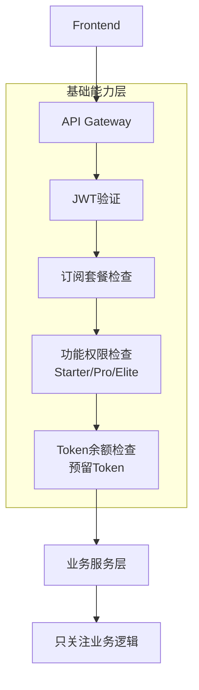

# AdsAI 架构优化方案 V1

**版本**: 1.0
**创建日期**: 2025-10-16
**状态**: 审查完成，待批准实施

---

## 🚀 快速开始

### 实施人员必读

如果你要**落地实施**优化方案，请直接阅读：

**📘 [OPTIMIZATION-PLAN.md](./OPTIMIZATION-PLAN.md)** - 优化实施方案汇总（30分钟）

这份文档包含：
- ✅ 执行摘要（为什么要优化、核心收益）
- ✅ 优化方案清单（P0-P3优先级，18项）
- ✅ 实施路线图（4个Phase，12周）
- ✅ 验收标准（明确的指标）
- ✅ 风险管理（回滚方案）

### 架构分析人员参考

如果你需要**深入理解**架构细节，可参考详细文档。

---

## 📖 详细文档导航

本目录包含AdsAI系统的全面架构审查和优化方案：

| 序号 | 文档 | 说明 | 阅读时间 |
|------|------|------|----------|
| 0 | [00-OVERVIEW.md](./00-OVERVIEW.md) | 📋 总览和快速开始 | 5分钟 |
| 1 | [01-CURRENT-ARCHITECTURE.md](./01-CURRENT-ARCHITECTURE.md) | 🏗️ 当前架构全景分析 | 15分钟 |
| 2 | [02-SERVICE-INVENTORY.md](./02-SERVICE-INVENTORY.md) | 📦 服务清单与职责 | 20分钟 |
| 3 | [03-DATA-FLOW-ANALYSIS.md](./03-DATA-FLOW-ANALYSIS.md) | 🔄 数据流与调用链分析 | 25分钟 |
| 4 | [04-OPTIMIZATION-OPPORTUNITIES.md](./04-OPTIMIZATION-OPPORTUNITIES.md) | 💡 优化机会识别（18项） | 30分钟 |
| 5 | [05-IMPLEMENTATION-ROADMAP.md](./05-IMPLEMENTATION-ROADMAP.md) | 🗺️ 实施路线图（12周计划） | 20分钟 |
| 6 | [07-SUBSCRIPTION-CONFIG-HOT-RELOAD.md](./07-SUBSCRIPTION-CONFIG-HOT-RELOAD.md) | 🔥 订阅套餐配置热更新方案 | 15分钟 |
| 7 | [08-CONFIG-HOT-RELOAD-WORKFLOW.md](./08-CONFIG-HOT-RELOAD-WORKFLOW.md) | ⚡ 配置热更新生效机制详解 | 10分钟 |
| 8 | [09-IMPLEMENTATION-SUMMARY.md](./09-IMPLEMENTATION-SUMMARY.md) | ✅ 实施总结与部署指南 | 15分钟 |
| 9 | [10-PERMISSION-INTEGRATION-GUIDE.md](./10-PERMISSION-INTEGRATION-GUIDE.md) | 🔐 权限管理与Token消耗集成指南 ⚠️ (已被14号文档替代) | 25分钟 |
| 10 | [11-INTEGRATION-CHECKLIST.md](./11-INTEGRATION-CHECKLIST.md) | ✔️ 集成验证清单（必读） | 20分钟 |
| 11 | [12-ARCHITECTURE-REVIEW-REPORT.md](./12-ARCHITECTURE-REVIEW-REPORT.md) | 📊 架构审查完整报告 | 40分钟 |
| 12 | [14-API-GATEWAY-UNIFIED-PERMISSIONS.md](./14-API-GATEWAY-UNIFIED-PERMISSIONS.md) | 🌐 API Gateway统一权限架构 | 50分钟 |

**总阅读时间**: ~5小时

### 独立功能增强方案

| 文档 | 说明 | 状态 | 预计工作量 |
|------|------|------|-----------|
| [13-OFFER-ENHANCEMENT-PLAN.md](./13-OFFER-ENHANCEMENT-PLAN.md) | 🎯 Offer管理增强方案（批量添加、增强列表、智能评估） | ✅ 设计完成 | 4周 |

**说明**: 此方案可与主架构优化路线图并行开发，或作为后续迭代

---

## 🎯 核心发现

### ✅ 架构优势
1. **清晰的微服务划分**: 核心业务服务（Offer、Billing、AdsCenter）职责明确
2. **事件驱动架构**: Pub/Sub解耦，支持异步处理
3. **DDD最佳实践**: Offer服务是优秀的DDD实现范例
4. **两阶段提交**: Billing服务的Token管理设计优秀

### ⚠️ 关键问题
1. **文件过大违规**: `siterank/evaluation/service.go`（978行）违反300行限制
2. **基础能力分散**: 权限和Token管理未统一，每个服务重复调用
3. **缓存过度设计**: PostgreSQL当缓存使用，增加复杂度
4. **Worker未分离**: siterank服务既处理HTTP又执行耗时任务
5. **测试覆盖不足**: 平均覆盖率 <10%

### 💡 核心优化方向
1. **统一基础能力**: 权限（订阅套餐功能限制）和Token（计费单位）管理
2. **代码拆分**: 遵循300行规范
3. **缓存简化**: 使用Redis统一缓存
4. **API+Worker**: 分离HTTP处理和后台任务
5. **性能优化**: 并行化、预加载、缓存

---

## 📊 审查范围

### 服务统计
- **前端**: 1个（Next.js 14）
- **核心业务**: 3个（offer, billing, adscenter）
- **功能服务**: 3个（siterank, browser-exec, recommendations）
- **基础设施**: 2个（proxy-pool, projector）
- **辅助服务**: 4个（console, batchopen, bff*, useractivity*）
- **总计**: 13个服务

**说明**：
- `*` 标注的服务仅部署preview环境，生产环境待补充
- Notifications不是独立服务，功能集成在useractivity中

### 技术栈
- **前端**: Next.js 14 + Makerkit UI
- **后端**: Go 1.25 (主要) + Node.js 22 (browser-exec)
- **数据库**: PostgreSQL (Cloud SQL) + Redis
- **消息队列**: GCP Pub/Sub
- **部署**: Cloud Run (all services)
- **认证**: Supabase Auth (Google OAuth)

---

## 🚀 优化计划概览

### 优先级分布
| 优先级 | 数量 | 说明 |
|--------|------|------|
| **P0** | 2项 | 强制执行（规范违反） |
| **P1** | 6项 | 应该执行（架构层面） |
| **P2** | 6项 | 可以执行（性能优化） |
| **P3** | 4项 | 未来考虑（持续改进） |
| **总计** | **18项** | - |

### 实施周期
```
Week 1-2:  Phase 1 - 紧急修复（P0级）
Week 3-6:  Phase 2 - 基础能力统一（P1核心）
Week 7-9:  Phase 3 - 性能优化（P2重点）
Week 10-12: Phase 4 - 持续改进（P1完善）
```

---

## 📈 预期收益

### 性能指标
| 指标 | 当前 | 优化后 | 提升 |
|------|------|--------|------|
| **评估首次响应** | 16s | 6s | ⚡ 63% |
| **评估后续响应** | 16s | 11s | ⚡ 31% |
| **API响应时间** | 15s | 50ms | ⚡ 97% |
| **Token查询** | 50ms | 5ms | ⚡ 90% |
| **系统吞吐量** | 100 req/s | 300 req/s | 📈 200% |
| **系统可用性** | 99.5% | 99.9% | 🛡️ +0.4% |

### 运营成本
| 项目 | 当前 | 优化后 | 节省 |
|------|------|--------|------|
| Cloud Run | $200/月 | $130/月 | 💰 35% |
| PostgreSQL | $80/月 | $50/月 | 💰 38% |
| SimilarWeb API | $150/月 | $45/月 | 💰 70% |
| **总计** | **$430/月** | **$225/月** | **💰 48%** |

### 代码质量
| 指标 | 当前 | 优化后 | 提升 |
|------|------|--------|------|
| 平均文件行数 | 450行 | 180行 | 📉 60% |
| 重复代码 | 30% | 10% | 📉 67% |
| 测试覆盖率 | 10% | 70% | 📈 600% |
| **代码质量评分** | **5.5/10** | **8.5/10** | **⬆️ +3.0** |

### 总体评估
```
当前状态: 5.5/10 (中等)
优化后:   8.5/10 (优秀)
提升:     +3.0 分 (54%改善)
```

---

## 🎯 Phase 1 快速上手（Week 1-2）

如果你想立即开始，以下是Phase 1的快速检查清单：

### P0-1: 代码文件拆分 ✅
```bash
# 拆分 siterank/evaluation/service.go (978行 → 6个文件)
services/siterank/internal/evaluation/
├── service.go              (<300行)
├── basic_evaluation.go     (~200行)
├── ai_evaluation.go        (~150行)
├── cache.go                (~150行)
├── aggregations.go         (~100行)
└── repository.go           (~200行)

# 拆分 offer/handlers/offers_evaluation_handlers.go (405行 → 3个文件)
services/offer/internal/handlers/
├── offers_evaluation_handlers.go  (~150行)
├── evaluation_orchestrator.go     (~150行)
└── evaluation_billing.go          (~100行)
```

### P0-2: i18n规范修复 ✅
```bash
# 扫描硬编码字符串
grep -r "[\u4e00-\u9fa5]" apps/frontend/src --include="*.tsx" | grep -v "t("

# 修复示例
# ❌ 错误: <button>创建Offer</button>
# ✅ 正确: <button>{t('offers.create')}</button>
```

### P1-6: 数据库索引优化 ✅
```sql
-- 创建关键索引
CREATE INDEX CONCURRENTLY idx_offer_user_status ON "Offer"(user_id, status);
CREATE INDEX CONCURRENTLY idx_eval_offer_created ON offer_evaluations(offer_id, created_at DESC);
CREATE INDEX CONCURRENTLY idx_token_tx_user_created ON token_transactions(user_id, created_at DESC);
```

**预期成果**: 代码质量评分 5.5 → 6.5 (+1.0)

---

## 🎓 Phase 2 重点：统一基础能力（Week 3-6）

### 为什么要统一权限和Token管理？

**用户反馈**: "权限+Token是基础能力，多个业务逻辑都需要"

**当前问题**:
- ❌ 每个服务都要自己检查权限和Token
- ❌ 重复代码（每个服务都调用billing 3次）
- ❌ billing服务负载过高
- ❌ 业务服务耦合基础能力

**优化方案**: API Gateway统一管理



**收益**:
- ✅ 权限和Token管理统一
- ✅ 减少重复代码 70%
- ✅ billing服务负载降低 60%
- ✅ 业务服务只关注业务逻辑

---

## 📚 相关文档

### 项目核心文档
- `docs/SupabaseGo/MustKnowV6.md` - 项目架构设计
- `docs/monorepo-build-best-practices.md` - Monorepo构建规范
- `CLAUDE.md` - 项目开发规范

### 历史架构审查
- `docs/ArchitectureReviewV1/` - 2025-10-08架构审查报告
- `docs/ArchitectureReviewV1/EXECUTIVE-SUMMARY.md` - 执行摘要
- `docs/ArchitectureReviewV1/service-dependencies.md` - 服务依赖分析

---

## 🤝 如何参与

### 阅读顺序（推荐）

**实施人员**:
1. **实施方案**: [OPTIMIZATION-PLAN.md](./OPTIMIZATION-PLAN.md) ⭐ 必读

**架构分析人员**:
1. **了解现状**: [00-OVERVIEW.md](./00-OVERVIEW.md) → [01-CURRENT-ARCHITECTURE.md](./01-CURRENT-ARCHITECTURE.md)
2. **理解服务**: [02-SERVICE-INVENTORY.md](./02-SERVICE-INVENTORY.md)
3. **理解数据流**: [03-DATA-FLOW-ANALYSIS.md](./03-DATA-FLOW-ANALYSIS.md)
4. **查看优化**: [04-OPTIMIZATION-OPPORTUNITIES.md](./04-OPTIMIZATION-OPPORTUNITIES.md)
5. **制定计划**: [05-IMPLEMENTATION-ROADMAP.md](./05-IMPLEMENTATION-ROADMAP.md)

### 团队分工建议
- **Backend Team**: Phase 1-3（代码拆分、API优化、性能优化）
- **Frontend Team**: Phase 1（i18n修复）
- **DevOps Team**: Phase 2-4（Gateway配置、监控、部署）
- **Full Team**: Phase 4（测试完善、文档更新）

### 反馈渠道
- 技术问题：提交Issue到项目仓库
- 优化建议：在本目录下创建 `FEEDBACK.md`
- 实施进展：更新 `05-IMPLEMENTATION-ROADMAP.md` 的检查清单

---

## 📌 关键术语

| 术语 | 说明 |
|------|------|
| **权限** | 用户订阅套餐（Starter/Professional/Elite）决定的功能权限和限额 |
| **Token** | 用户使用业务功能时消耗的计费单位 |
| **基础能力** | 所有业务服务都需要的通用能力（权限、Token、认证等） |
| **评估** | 对Offer进行分析和评分的过程（Basic评估 + AI评估） |
| **两阶段提交** | Reserve → Commit/Release的Token管理模式 |
| **API+Worker** | 分离HTTP API（快速响应）和后台任务（异步执行） |

---

## ⚡ 快速链接

**实施相关**:
- [📘 优化实施方案](./OPTIMIZATION-PLAN.md) ⭐
- [开始Phase 1](./OPTIMIZATION-PLAN.md#phase-1-紧急修复week-1-2)
- [验收标准](./OPTIMIZATION-PLAN.md#-验收标准)

**架构参考**:
- [查看所有优化项](./04-OPTIMIZATION-OPPORTUNITIES.md#-优化总览)
- [查看服务清单](./02-SERVICE-INVENTORY.md#-服务分类)
- [查看数据流](./03-DATA-FLOW-ANALYSIS.md#-核心业务流程)
- [查看架构图](./01-CURRENT-ARCHITECTURE.md#️-总体架构图)

---

## 📞 联系方式

- **项目负责人**: Jason
- **架构审查**: Kiro AI Assistant
- **创建日期**: 2025-10-16
- **版本**: 1.0

---

**让我们一起将AdsAI打造成一个高性能、高质量的SaaS平台！** 🚀

