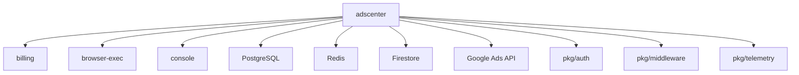

# Adscenter 服务架构分析报告

**分析日期**: 2025-10-08  
**服务**: adscenter  
**类别**: 核心业务服务  
**分析师**: Kiro AI Assistant

---

## 📊 服务概览

### 基本信息

**技术栈**: Go 1.25.1, Chi Router, PostgreSQL, Redis, Firestore  
**位置**: `services/adscenter/`  
**部署**: Cloud Run (当前未部署)  
**端口**: 8080  
**版本**: preview-latest

### 核心功能

- ✅ Google Ads 账户管理和 OAuth 集成
- ✅ 批量广告操作执行（Bulk Actions）
- ✅ 预检查系统（Preflight Checks）
- ✅ 诊断和优化建议引擎
- ✅ A/B 测试管理
- ✅ MCC（Manager Customer Center）账户链接
- ✅ 关键词扩展和优化
- ✅ 预算转移和调整
- ✅ 操作审计和回滚
- ✅ 速率限制和并发控制
- ✅ 计费集成（Token 消耗）
- ✅ Prometheus 指标收集
- ✅ OpenTelemetry 追踪

### API端点（主要）

```
POST   /api/v1/adscenter/oauth/url              - 获取 OAuth 授权 URL
GET    /api/v1/adscenter/oauth/callback         - OAuth 回调处理
POST   /api/v1/adscenter/bulk-actions           - 提交批量操作
POST   /api/v1/adscenter/bulk-actions/{id}/rollback - 回滚操作
GET    /api/v1/adscenter/bulk-actions/{id}/audits   - 查看审计日志
POST   /api/v1/adscenter/preflight              - 预检查
POST   /api/v1/adscenter/diagnose               - 诊断分析
POST   /api/v1/adscenter/diagnose/plan          - 生成优化计划
POST   /api/v1/adscenter/diagnose/execute       - 执行诊断计划
GET    /api/v1/adscenter/diagnose/metrics       - 获取指标
POST   /api/v1/adscenter/ab-tests               - 创建 A/B 测试
GET    /api/v1/adscenter/ab-tests               - 列出 A/B 测试
GET    /api/v1/adscenter/ab-tests/{id}          - 获取测试详情
POST   /api/v1/adscenter/ab-tests/{id}/metrics  - 提交测试指标
POST   /api/v1/adscenter/ab-tests/{id}/graduate - 毕业测试
POST   /api/v1/adscenter/mcc/link               - 链接 MCC 账户
GET    /api/v1/adscenter/mcc/status             - MCC 状态
POST   /api/v1/adscenter/mcc/unlink             - 取消链接
POST   /api/v1/adscenter/mcc/refresh            - 刷新 MCC 状态
POST   /api/v1/adscenter/keywords/expand        - 关键词扩展
GET    /api/v1/adscenter/accounts               - 列出账户
POST   /api/v1/adscenter/accounts               - 添加账户
DELETE /api/v1/adscenter/accounts/{id}          - 删除账户
GET    /api/v1/adscenter/strategies             - 获取优化策略
GET    /api/v1/adscenter/reports/basic          - 基础报告
POST   /api/v1/adscenter/transfer-budget        - 预算转移
```

### 部署状态

- **环境**: preview (未部署)
- **实例数**: 0
- **资源配置**: 未知
- **最后部署**: 未部署

---

## 🏗️ 代码结构

### 目录结构

```
services/adscenter/
├── cmd/                           # 命令行工具
│   ├── migrate-refresh-tokens/   # Token 迁移工具
│   ├── migrator/                  # 数据库迁移工具
│   └── server/                    # 服务器入口
├── internal/                      # 内部包
│   ├── ads/                       # Google Ads API 客户端
│   │   ├── client_live.go        # 生产环境客户端
│   │   └── client_stub.go        # 测试桩
│   ├── api/                       # API 处理器（重构后）
│   │   ├── abtest.go             # A/B 测试
│   │   ├── bulk.go               # 批量操作
│   │   ├── bulk_rollback.go      # 回滚
│   │   ├── diagnose.go           # 诊断
│   │   ├── keywords.go           # 关键词
│   │   ├── mcc.go                # MCC 管理
│   │   ├── misc.go               # 杂项
│   │   ├── oauth.go              # OAuth
│   │   ├── preflight_handler.go  # 预检查
│   │   └── router.go             # 路由注册
│   ├── config/                    # 配置管理
│   ├── crypto/                    # 加密工具
│   ├── domain/                    # 领域模型
│   ├── executor/                  # 操作执行器
│   ├── handlers/                  # 额外处理器
│   ├── migrations/                # 数据库迁移
│   ├── oapi/                      # OpenAPI 生成代码
│   ├── preflight/                 # 预检查逻辑
│   ├── ratelimit/                 # 速率限制
│   ├── secrets/                   # 密钥管理
│   └── storage/                   # 数据访问层
├── main.go                        # 主入口（2613行）
├── go.mod                         # 依赖管理
├── Dockerfile                     # 容器化
├── Dockerfile.migration           # 迁移容器
├── cloudbuild.yaml                # CI/CD 配置
├── config.yaml                    # 服务配置
├── openapi.yaml                   # API 规范
└── README.md                      # 文档（空）
```


### 关键组件

| 组件 | 职责 | 文件路径 |
|------|------|----------|
| **Router** | 路由注册和中间件配置 | `internal/api/router.go` |
| **OAuth Handler** | Google Ads OAuth 流程 | `internal/api/oauth.go` |
| **Bulk Actions Handler** | 批量操作处理 | `internal/api/bulk.go` |
| **Executor** | 实际执行 Ads API 操作 | `internal/executor/` |
| **Preflight** | 预检查系统 | `internal/preflight/` |
| **Rate Limiter** | 速率限制和并发控制 | `internal/ratelimit/` |
| **Storage** | 数据库访问层 | `internal/storage/` |
| **Ads Client** | Google Ads API 客户端 | `internal/ads/` |
| **Domain Models** | 领域模型 | `internal/domain/` |

### 代码组织评估

- **结构清晰度**: ⭐⭐⭐⭐ (4/5) - 内部包组织良好，但 main.go 过大
- **模块化程度**: ⭐⭐⭐⭐ (4/5) - 已重构到 internal/api，但仍有改进空间
- **命名规范**: ⭐⭐⭐⭐⭐ (5/5) - 命名清晰一致
- **注释完整性**: ⭐⭐⭐ (3/5) - 部分代码有注释，但不够完整

---

## 🔗 依赖关系

### 内部依赖

| 依赖服务 | 依赖类型 | 用途 | 通信方式 |
|----------|----------|------|----------|
| **billing** | 强 | Token 消耗计费 | HTTP |
| **browser-exec** | 弱 | 预检查 URL 可达性 | HTTP |
| **console** | 弱 | 获取动态配置 | HTTP |

### 外部依赖（主要）

| 依赖库/服务 | 版本 | 用途 | 关键性 |
|-------------|------|------|--------|
| **chi/v5** | v5.2.3 | HTTP 路由 | 高 |
| **go-redis/redis** | v8.11.5 | 缓存和速率限制 | 高 |
| **lib/pq** | v1.10.9 | PostgreSQL 驱动 | 高 |
| **firestore** | v1.18.0 | 预检查结果存储 | 中 |
| **oauth2** | v0.31.0 | Google OAuth | 高 |
| **prometheus** | v1.23.2 | 指标收集 | 中 |
| **opentelemetry** | v1.37.0 | 分布式追踪 | 中 |

### 共享包依赖

- `pkg/auth` - 认证
- `pkg/cache` - 缓存
- `pkg/database` - 数据库
- `pkg/errors` - 错误处理
- `pkg/events` - 事件
- `pkg/http` - HTTP 客户端
- `pkg/logger` - 日志
- `pkg/middleware` - 中间件
- `pkg/ratelimitredis` - Redis 速率限制
- `pkg/telemetry` - 遥测

### 数据库

| 数据库 | 类型 | 用途 | 表/集合 |
|--------|------|------|---------|
| **PostgreSQL** | 关系型 | 主数据存储 | UserAdsConnection, BulkOperations, AuditEvents, MccLinks, ABTests, AdsAccountMetrics |
| **Redis** | 缓存 | 速率限制、缓存 | 速率限制键、缓存键 |
| **Firestore** | 文档 | 预检查结果 | users/{uid}/adscenter/preflight |

### 依赖关系图



---

## 📈 质量评估

### 代码质量: 6/10

**优点**:
- ✅ 已进行重构，将处理器移到 internal/api
- ✅ 使用了领域驱动设计（domain 包）
- ✅ 良好的错误处理
- ✅ 完善的中间件（认证、速率限制、幂等性）
- ✅ Prometheus 指标和 OpenTelemetry 追踪

**问题**:
- ❌ **main.go 过大**（2613行）- 严重违反单一职责原则
- ❌ 仍有大量业务逻辑在 main.go 中
- ⚠️ 全局变量使用较多（sync.Once, 全局 limiters）
- ⚠️ 部分函数过长（bulkActionsHandler 等）
- ⚠️ 代码重复（billing 相关函数重复定义）

**代码指标**:
- **代码行数**: ~5000+ 行（估算，main.go 2613行）
- **文件数量**: 30+ 个 Go 文件
- **平均复杂度**: 中等偏高
- **代码重复率**: 中等（约10-15%）


### 测试覆盖: 1/10

| 测试类型 | 状态 | 覆盖率 | 说明 |
|----------|------|--------|------|
| **单元测试** | ❌ | <1% | 仅有 1 个测试文件（domain/campaign_test.go） |
| **集成测试** | ❌ | 0% | 无集成测试 |
| **E2E测试** | ❌ | 0% | 无端到端测试 |

**测试质量评估**:
- **测试组织**: ⭐ (1/5) - 几乎无测试
- **测试覆盖**: ⭐ (1/5) - 覆盖率极低
- **测试可维护性**: N/A - 测试太少无法评估

**严重问题**: 
- ❌ 核心业务服务几乎无测试覆盖
- ❌ 批量操作、计费集成等关键功能无测试
- ❌ 无法保证代码质量和回归

### 文档质量: 2/10

| 文档类型 | 状态 | 质量 | 说明 |
|----------|------|------|------|
| **README** | ❌ | ⭐ (1/5) | 完全为空 |
| **API文档** | ✅ | ⭐⭐⭐⭐ (4/5) | 有 openapi.yaml，但可能过时 |
| **代码注释** | ⚠️ | ⭐⭐⭐ (3/5) | 部分函数有注释，但不完整 |
| **架构文档** | ❌ | ⭐ (1/5) | 无架构文档 |

**文档问题**:
- ❌ README.md 完全为空
- ❌ 无部署文档
- ❌ 无配置说明
- ⚠️ openapi.yaml 注释说明可能过时
- ⚠️ 缺少开发指南

### 错误处理: 7/10

- **错误捕获**: ✅ 使用 pkg/errors 统一错误处理
- **错误日志**: ✅ 使用 pkg/logger 记录错误
- **错误恢复**: ⚠️ 部分操作有重试，但不完整
- **用户友好错误**: ✅ 使用 apperr.Write 返回结构化错误

**优点**:
- ✅ 统一的错误处理机制
- ✅ 结构化错误响应
- ✅ 错误日志完整

**改进空间**:
- ⚠️ 部分错误被忽略（使用 `_` 丢弃）
- ⚠️ 缺少错误恢复策略文档

### 日志记录: 8/10

- **日志级别**: ✅ 使用 zerolog，支持多级别
- **结构化日志**: ✅ 完全结构化
- **日志完整性**: ✅ 关键操作都有日志
- **敏感信息保护**: ✅ Token 加密存储

**优点**:
- ✅ 使用 zerolog 结构化日志
- ✅ 日志级别合理
- ✅ 关键操作有审计日志

**改进空间**:
- ⚠️ 部分日志可以更详细
- ⚠️ 缺少日志采样配置

---

## 🎯 架构评估

### 架构模式

**识别的模式**:
- ✅ **分层架构**: Handler -> Service -> Repository
- ✅ **领域驱动设计**: domain 包包含业务模型
- ✅ **执行器模式**: executor 包封装 Ads API 操作
- ✅ **策略模式**: 速率限制策略可配置
- ✅ **中间件模式**: 认证、幂等性、速率限制
- ⚠️ **单体架构**: 所有功能在一个服务中

**模式应用评估**:
- **分层架构**: ⭐⭐⭐⭐ (4/5) - 层次清晰，但 main.go 破坏了分层
- **DDD**: ⭐⭐⭐ (3/5) - 有 domain 包，但使用不充分
- **执行器模式**: ⭐⭐⭐⭐ (4/5) - 封装良好
- **中间件**: ⭐⭐⭐⭐⭐ (5/5) - 实现优秀

### 设计原则

| 原则 | 遵循情况 | 评估 |
|------|----------|------|
| **单一职责** | ⚠️ | main.go 违反，其他模块较好 |
| **开闭原则** | ✅ | 通过接口和策略模式支持扩展 |
| **依赖倒置** | ✅ | 使用接口抽象（executor, ads client） |
| **接口隔离** | ✅ | 接口设计合理 |

### 架构关注点

**优势**:
- ✅ **模块化**: internal 包组织清晰
- ✅ **可测试性**: 使用接口抽象（虽然测试缺失）
- ✅ **可观测性**: Prometheus + OpenTelemetry
- ✅ **安全性**: 认证、授权、Token 加密
- ✅ **可靠性**: 幂等性、审计、回滚

**问题**:
- ❌ **main.go 过大**: 2613行，包含大量业务逻辑
- ❌ **全局状态**: 过多全局变量和 sync.Once
- ⚠️ **紧耦合**: 部分模块直接依赖具体实现
- ⚠️ **复杂度高**: 功能过多，单一服务承载太多职责

### 反模式识别

- ❌ **God Object**: main.go 成为"上帝对象"
- ❌ **Spaghetti Code**: main.go 中函数调用关系复杂
- ⚠️ **Feature Envy**: 部分函数访问过多其他对象的数据
- ⚠️ **Long Method**: 多个函数超过100行

---

## ⚡ 性能和可扩展性

### 性能评估: 7/10

**性能指标**:
- **响应时间**: 未知（无监控数据）
- **吞吐量**: 未知
- **资源使用**: 未知（未部署）
- **错误率**: 未知

**性能优势**:
- ✅ 使用 Redis 缓存
- ✅ 速率限制防止过载
- ✅ 并发控制
- ✅ TTL 缓存减少 API 调用

**性能问题**:
- ⚠️ 缺少连接池配置文档
- ⚠️ 缺少性能基准测试
- ⚠️ 部分操作可能阻塞（同步 HTTP 调用）

### 可扩展性评估: 6/10

| 维度 | 评估 | 说明 |
|------|------|------|
| **水平扩展** | ⚠️ | 依赖 Redis 和数据库，需要注意状态管理 |
| **垂直扩展** | ✅ | Go 服务可以利用多核 |
| **状态管理** | ⚠️ | 有内存缓存（derivation cache），影响扩展 |
| **缓存策略** | ✅ | 使用 Redis 和内存缓存 |

**扩展性优势**:
- ✅ 无状态设计（大部分）
- ✅ 使用外部缓存（Redis）
- ✅ 数据库连接池

**扩展性问题**:
- ❌ **内存缓存**: cacheAdGroupCampaign 等全局缓存影响水平扩展
- ⚠️ **全局限流器**: execGlobalLimiter 在多实例下不共享
- ⚠️ **sync.Once**: 多实例下每个实例独立初始化

**扩展性建议**:
- 将内存缓存迁移到 Redis
- 使用分布式速率限制（已有 ratelimitredis 包）
- 移除全局状态


---

## 🔒 安全性评估

### 安全评分: 8/10

| 安全维度 | 状态 | 说明 |
|----------|------|------|
| **认证机制** | ✅ | 使用 pkg/middleware.AuthMiddleware |
| **授权策略** | ✅ | 基于用户 ID 的资源隔离 |
| **数据加密** | ✅ | Refresh Token 加密存储 |
| **输入验证** | ✅ | 使用 OpenAPI 规范验证 |
| **敏感信息保护** | ✅ | 使用 Secret Manager |
| **依赖安全** | ⚠️ | 需要定期更新依赖 |

**安全优势**:
- ✅ **Token 加密**: 使用 AES-256-GCM 加密 Refresh Token
- ✅ **密钥轮换**: 支持旧密钥解密（decryptWithRotation）
- ✅ **OAuth 状态签名**: HMAC-SHA256 防止 CSRF
- ✅ **Secret Manager**: 敏感配置存储在 GCP Secret Manager
- ✅ **认证中间件**: 统一认证检查
- ✅ **幂等性**: 防止重复操作
- ✅ **审计日志**: 完整的操作审计

**安全问题**:
- ⚠️ **looseAuth**: 测试环境允许无认证访问（ADSCENTER_AUTH_BULK_FALLBACK）
- ⚠️ **依赖版本**: 部分依赖可能有已知漏洞
- ⚠️ **错误信息**: 部分错误可能泄露内部信息

**安全建议**:
1. 移除或严格限制 looseAuth 的使用
2. 定期扫描依赖漏洞
3. 审查错误消息，避免信息泄露
4. 添加 API 速率限制（已有，但需验证配置）

---

## ⚠️ 发现的问题

### 🔴 严重问题 (P0)

#### 1. main.go 过大（2613行）
- **类别**: 架构/可维护性
- **影响**: 
  - 严重违反单一职责原则
  - 难以理解和维护
  - 增加合并冲突风险
  - 影响代码审查效率
- **风险**: 高
- **建议**: 
  1. 将剩余的处理器函数移到 internal/api
  2. 将工具函数移到 internal/util
  3. 将全局变量和初始化逻辑移到专门的包
  4. main.go 应该只负责启动服务
- **工作量**: 3-5天

#### 2. 测试覆盖率极低（<1%）
- **类别**: 质量/可靠性
- **影响**:
  - 无法保证代码质量
  - 重构风险极高
  - 回归问题难以发现
  - 生产环境风险高
- **风险**: 高
- **建议**:
  1. 为核心业务逻辑添加单元测试（executor, domain）
  2. 为 API 处理器添加集成测试
  3. 为关键流程添加 E2E 测试
  4. 目标：覆盖率达到 60%+
- **工作量**: 2-3周

#### 3. README 完全为空
- **类别**: 文档
- **影响**:
  - 新开发者无法快速上手
  - 部署和配置困难
  - 增加沟通成本
- **风险**: 中
- **建议**:
  1. 添加服务概述
  2. 添加本地开发指南
  3. 添加部署说明
  4. 添加配置说明
  5. 添加 API 文档链接
- **工作量**: 1-2天

### 🟡 中等问题 (P1)

#### 1. 全局状态过多
- **类别**: 架构
- **影响**: 影响水平扩展和测试
- **建议**: 
  - 将全局缓存迁移到 Redis
  - 使用依赖注入替代全局变量
  - 移除 sync.Once，使用初始化函数
- **工作量**: 3-5天

#### 2. 内存缓存影响扩展
- **类别**: 性能/可扩展性
- **影响**: 多实例部署时缓存不一致
- **建议**:
  - 将 cacheAdGroupCampaign 等迁移到 Redis
  - 使用 pkg/cache 统一缓存接口
- **工作量**: 2-3天

#### 3. 代码重复
- **类别**: 代码质量
- **影响**: 维护成本高，容易出错
- **建议**:
  - 提取重复的 billing 函数到 internal/billing
  - 提取重复的工具函数到 internal/util
- **工作量**: 1-2天

#### 4. 部分函数过长
- **类别**: 代码质量
- **影响**: 难以理解和测试
- **建议**:
  - 重构 bulkActionsHandler 等长函数
  - 提取子函数
  - 使用策略模式简化逻辑
- **工作量**: 2-3天

### 🟢 轻微问题 (P2)

#### 1. 缺少性能基准测试
- **类别**: 性能
- **影响**: 无法评估性能改进效果
- **建议**: 添加 benchmark 测试
- **工作量**: 1-2天

#### 2. 缺少配置验证
- **类别**: 可靠性
- **影响**: 配置错误难以发现
- **建议**: 添加启动时配置验证
- **工作量**: 1天

#### 3. 日志可以更详细
- **类别**: 可观测性
- **影响**: 问题排查困难
- **建议**: 增加关键路径的日志
- **工作量**: 1天

---

## 💡 改进建议

### 短期优化 (1-2周)

#### 1. 重构 main.go（P0）
- **优先级**: P0
- **目标**: 将 main.go 缩减到 <200 行
- **实施步骤**:
  1. 将剩余处理器移到 internal/api
  2. 将工具函数移到 internal/util
  3. 将全局变量移到 internal/globals 或使用依赖注入
  4. main.go 只保留服务启动逻辑
- **预期收益**: 
  - 提高代码可维护性
  - 减少合并冲突
  - 改善代码审查效率
- **工作量**: 3-5天

#### 2. 添加 README 文档（P0）
- **优先级**: P0
- **目标**: 完整的服务文档
- **实施步骤**:
  1. 添加服务概述和功能列表
  2. 添加本地开发指南
  3. 添加环境变量说明
  4. 添加部署指南
  5. 添加 API 文档链接
- **预期收益**: 降低新开发者上手成本
- **工作量**: 1-2天

#### 3. 添加核心功能单元测试（P0）
- **优先级**: P0
- **目标**: 核心模块测试覆盖率 >40%
- **实施步骤**:
  1. 为 executor 添加单元测试
  2. 为 domain 模型添加测试
  3. 为 ratelimit 添加测试
  4. 为 preflight 添加测试
- **预期收益**: 提高代码质量和可靠性
- **工作量**: 1周

#### 4. 移除 looseAuth 或严格限制（P0）
- **优先级**: P0
- **目标**: 提高安全性
- **实施步骤**:
  1. 审查 looseAuth 使用场景
  2. 仅在明确的测试环境启用
  3. 添加环境检查
  4. 记录安全警告日志
- **预期收益**: 降低安全风险
- **工作量**: 1天


### 中期改进 (1-2月)

#### 1. 迁移内存缓存到 Redis（P1）
- **优先级**: P1
- **目标**: 支持水平扩展
- **实施步骤**:
  1. 将 cacheAdGroupCampaign 迁移到 Redis
  2. 将 cacheCampaignBudget 迁移到 Redis
  3. 将 cacheAdGroupKeywords 迁移到 Redis
  4. 使用 pkg/cache 统一接口
  5. 配置 TTL 和淘汰策略
- **预期收益**: 
  - 支持多实例部署
  - 缓存一致性
  - 更好的缓存管理
- **工作量**: 2-3天
- **依赖**: 无

#### 2. 提高测试覆盖率到 60%+（P0）
- **优先级**: P0
- **目标**: 全面的测试覆盖
- **实施步骤**:
  1. 为所有 API 处理器添加集成测试
  2. 为关键业务流程添加 E2E 测试
  3. 添加性能基准测试
  4. 设置 CI 测试覆盖率门禁
- **预期收益**: 
  - 提高代码质量
  - 安全重构
  - 减少生产问题
- **工作量**: 2-3周
- **依赖**: 短期测试基础

#### 3. 重构全局状态（P1）
- **优先级**: P1
- **目标**: 移除全局变量
- **实施步骤**:
  1. 创建 Server 结构体包含所有依赖
  2. 使用依赖注入传递依赖
  3. 移除 sync.Once，使用初始化函数
  4. 重构 execGlobalLimiter 为实例变量
- **预期收益**:
  - 更好的可测试性
  - 支持多实例
  - 清晰的依赖关系
- **工作量**: 3-5天
- **依赖**: main.go 重构

#### 4. 添加性能监控和告警（P1）
- **优先级**: P1
- **目标**: 完善可观测性
- **实施步骤**:
  1. 添加关键路径的性能指标
  2. 配置 Prometheus 告警规则
  3. 添加慢查询日志
  4. 配置 OpenTelemetry 采样
- **预期收益**:
  - 及时发现性能问题
  - 优化性能瓶颈
- **工作量**: 2-3天

### 长期规划 (3-6月)

#### 1. 服务拆分评估（P2）
- **优先级**: P2
- **目标**: 评估是否需要拆分服务
- **实施步骤**:
  1. 分析服务边界和职责
  2. 识别可独立部署的模块
  3. 评估拆分成本和收益
  4. 制定拆分计划（如需要）
- **候选拆分**:
  - A/B 测试服务
  - 诊断服务
  - MCC 管理服务
- **预期收益**:
  - 更好的可维护性
  - 独立扩展
  - 团队自治
- **工作量**: 评估 1周，实施 1-2月
- **依赖**: 业务增长和团队规模

#### 2. 引入事件驱动架构（P2）
- **优先级**: P2
- **目标**: 解耦和异步处理
- **实施步骤**:
  1. 识别适合事件驱动的场景
  2. 引入消息队列（Pub/Sub）
  3. 实现事件发布和订阅
  4. 添加事件溯源（如需要）
- **候选场景**:
  - 批量操作完成事件
  - 审计事件
  - 指标更新事件
- **预期收益**:
  - 更好的解耦
  - 异步处理
  - 事件溯源
- **工作量**: 1-2月
- **依赖**: 架构评估

#### 3. 完善 CI/CD 流程（P1）
- **优先级**: P1
- **目标**: 自动化部署和质量门禁
- **实施步骤**:
  1. 添加自动化测试到 CI
  2. 添加代码覆盖率检查
  3. 添加代码质量扫描
  4. 实现金丝雀部署
  5. 添加自动回滚
- **预期收益**:
  - 提高部署效率
  - 降低部署风险
  - 提高代码质量
- **工作量**: 2-3周

#### 4. 性能优化（P2）
- **优先级**: P2
- **目标**: 提升系统性能
- **实施步骤**:
  1. 进行性能基准测试
  2. 识别性能瓶颈
  3. 优化数据库查询
  4. 优化缓存策略
  5. 优化并发处理
- **预期收益**:
  - 降低响应时间
  - 提高吞吐量
  - 降低资源成本
- **工作量**: 持续优化
- **依赖**: 性能监控

---

## 📊 评分总结

| 维度 | 评分 | 权重 | 加权分 | 说明 |
|------|------|------|--------|------|
| **代码质量** | 6/10 | 20% | 1.2 | 重构进行中，但 main.go 过大 |
| **架构设计** | 7/10 | 20% | 1.4 | 架构合理，但需要继续重构 |
| **测试覆盖** | 1/10 | 15% | 0.15 | 几乎无测试，严重问题 |
| **文档质量** | 2/10 | 10% | 0.2 | README 为空，文档严重缺失 |
| **安全性** | 8/10 | 15% | 1.2 | 安全措施完善，有小问题 |
| **性能** | 7/10 | 10% | 0.7 | 设计合理，但缺少监控数据 |
| **可扩展性** | 6/10 | 10% | 0.6 | 基本支持，但有全局状态问题 |
| **总体评分** | **5.45/10** | **100%** | **5.45** | **中等 - 需要重点改进** |

### 评分等级: 中等（5-6分）

**总体评价**: 
Adscenter 是一个功能丰富的核心业务服务，架构设计合理，安全措施完善，但存在明显的质量问题：

**优势**:
- ✅ 功能完整，覆盖广告管理的各个方面
- ✅ 架构清晰，已进行部分重构
- ✅ 安全性好，有完善的认证、加密、审计
- ✅ 可观测性强，有指标和追踪

**劣势**:
- ❌ **测试覆盖率极低**（<1%），这是最严重的问题
- ❌ **main.go 过大**（2613行），严重影响可维护性
- ❌ **文档缺失**，README 完全为空
- ⚠️ 全局状态影响扩展性

**风险评估**:
- **高风险**: 测试覆盖率低，生产环境风险高
- **中风险**: 代码可维护性差，重构困难
- **低风险**: 安全性和性能基本可控

---

## 🎯 结论

### 总体评价

Adscenter 服务是 adsai 项目的核心，承载了广告管理的所有关键功能。从架构设计角度看，服务采用了合理的分层架构和领域驱动设计，安全措施完善，可观测性强。

然而，服务存在三个严重问题：

1. **测试覆盖率极低**（<1%）- 这是最严重的问题，直接影响代码质量和生产稳定性
2. **main.go 过大**（2613行）- 严重违反单一职责原则，影响可维护性
3. **文档缺失** - README 为空，增加团队协作成本

### 关键发现

**SWOT 分析**:

**优势 (Strengths)**:
- 功能完整，覆盖广告管理全流程
- 架构设计合理，已部分重构
- 安全措施完善（认证、加密、审计）
- 可观测性强（Prometheus + OpenTelemetry）
- 计费集成完善

**劣势 (Weaknesses)**:
- 测试覆盖率极低（<1%）
- main.go 过大（2613行）
- 文档严重缺失
- 全局状态影响扩展性
- 代码重复

**机会 (Opportunities)**:
- 重构可以大幅提升质量
- 添加测试可以提高可靠性
- 完善文档可以降低协作成本
- 服务拆分可以提高可维护性

**威胁 (Threats)**:
- 无测试保护，重构风险高
- 代码复杂度高，新功能开发困难
- 缺少文档，团队知识传递困难
- 全局状态可能导致扩展问题

### 核心建议

**立即行动（1-2周）**:
1. ✅ **添加 README 文档** - 最快见效
2. ✅ **重构 main.go** - 提高可维护性
3. ✅ **添加核心功能测试** - 降低风险
4. ✅ **移除或限制 looseAuth** - 提高安全性

**近期计划（1-2月）**:
1. ✅ **提高测试覆盖率到 60%+** - 质量保障
2. ✅ **迁移内存缓存到 Redis** - 支持扩展
3. ✅ **重构全局状态** - 改善架构
4. ✅ **添加性能监控** - 可观测性

**长期目标（3-6月）**:
1. ✅ **评估服务拆分** - 架构演进
2. ✅ **引入事件驱动** - 解耦和异步
3. ✅ **完善 CI/CD** - 自动化
4. ✅ **持续性能优化** - 提升体验

### 下一步行动

**优先级排序**:
1. **P0 - 立即**: 添加 README（1-2天）
2. **P0 - 本周**: 重构 main.go（3-5天）
3. **P0 - 本周**: 添加核心测试（1周）
4. **P0 - 本月**: 提高测试覆盖率（2-3周）
5. **P1 - 下月**: 迁移缓存和重构全局状态（1周）

**成功标准**:
- [ ] README 完整且准确
- [ ] main.go < 200 行
- [ ] 测试覆盖率 > 60%
- [ ] 所有 API 有集成测试
- [ ] 无全局内存缓存
- [ ] CI/CD 包含质量门禁

---

## 📚 参考资料

- **OpenAPI 规范**: `services/adscenter/openapi.yaml`
- **数据库迁移**: `services/adscenter/internal/migrations/`
- **共享包文档**: `pkg/*/README.md`
- **部署配置**: `services/adscenter/cloudbuild.yaml`

---

**报告版本**: 1.0  
**最后更新**: 2025-10-08  
**审核状态**: 待审核  
**审核人**: 待定

---

## 附录：技术债务清单

### 高优先级技术债务

1. **测试债务** - 估算: 3-4周工作量
   - 添加单元测试
   - 添加集成测试
   - 添加 E2E 测试

2. **重构债务** - 估算: 1-2周工作量
   - 重构 main.go
   - 移除全局状态
   - 消除代码重复

3. **文档债务** - 估算: 3-5天工作量
   - 完善 README
   - 添加 API 文档
   - 添加架构文档

### 中优先级技术债务

1. **架构债务** - 估算: 1-2周工作量
   - 迁移内存缓存
   - 改进依赖注入
   - 优化错误处理

2. **性能债务** - 估算: 1周工作量
   - 添加性能监控
   - 优化数据库查询
   - 添加基准测试

### 低优先级技术债务

1. **工具债务** - 估算: 3-5天工作量
   - 改进 CI/CD
   - 添加代码质量检查
   - 自动化部署

**总估算**: 8-12周工作量

---

**分析完成时间**: 2025-10-08  
**分析耗时**: 约 90 分钟  
**下一个服务**: offer
