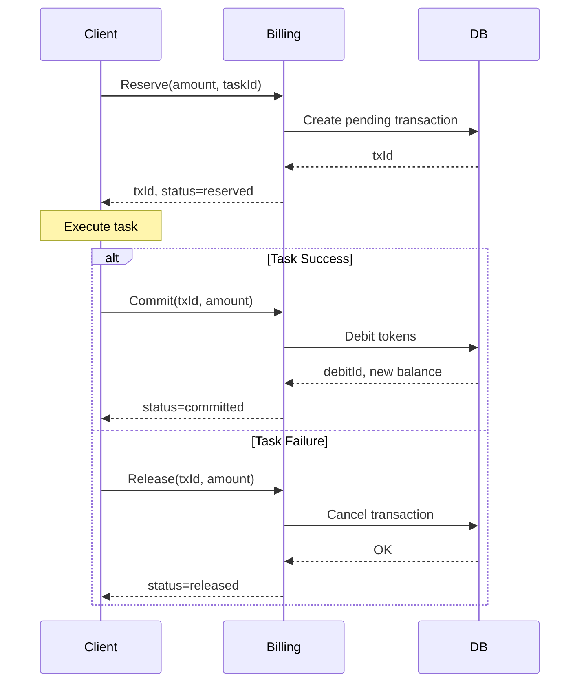

# Billing 服务架构分析报告

**分析日期**: 2025-10-08  
**服务**: billing  
**类别**: 核心业务服务（计费系统）  
**分析师**: Kiro AI Assistant

---

## 📊 服务概览

### 基本信息

**技术栈**: Go 1.25.1, Chi Router, PostgreSQL (pgx/v5), Redis, Firestore, Pub/Sub  
**位置**: `services/billing/`  
**部署**: Cloud Run (当前未部署)  
**端口**: 8080  
**版本**: preview-latest

### 核心功能

- ✅ Token 余额管理（用户积分系统）
- ✅ Token 预留/提交/释放（两阶段提交）
- ✅ 订阅管理（试用、激活、取消）
- ✅ 计费计划管理
- ✅ Token 交易记录和审计
- ✅ 事件驱动架构（订阅事件投影）
- ✅ Onboarding 流程集成
- ✅ Token 修复和审计
- ✅ 最小模式支持（BILLING_MINIMAL）

### API端点

```
GET    /api/v1/billing/tokens/balance    - 获取 Token 余额
POST   /api/v1/billing/tokens/reserve    - 预留 Tokens
POST   /api/v1/billing/tokens/commit     - 提交 Tokens
POST   /api/v1/billing/tokens/release    - 释放 Tokens
GET    /api/v1/billing/subscriptions     - 获取订阅信息
POST   /api/v1/billing/subscriptions     - 创建订阅
PUT    /api/v1/billing/subscriptions/{id} - 更新订阅
GET    /api/v1/billing/plans              - 获取计费计划
GET    /health                            - 健康检查
GET    /healthz                           - 健康检查
GET    /readyz                            - 就绪检查
GET    /metrics                           - Prometheus 指标
```

### 部署状态

- **环境**: preview (未部署)
- **实例数**: 0
- **资源配置**: 未知
- **最后部署**: 未部署

---

## 🏗️ 代码结构

### 目录结构

```
services/billing/
├── cmd/
│   ├── migrator/              # 数据库迁移工具
│   └── server/                # 服务器入口
├── internal/
│   ├── auth/                  # 认证（空）
│   ├── config/                # 配置管理
│   ├── domain/                # 领域模型
│   │   ├── events.go         # 领域事件
│   │   ├── plans.go          # 计费计划
│   │   ├── subscription.go   # 订阅实体
│   │   └── subscription_test.go # 测试
│   ├── events/                # 事件基础设施
│   ├── handlers/              # HTTP 处理器
│   │   ├── http.go           # 主处理器
│   │   ├── tokens.go         # Token 处理
│   │   └── token_reservation.go # Token 预留
│   ├── migrations/            # SQL 迁移文件
│   ├── oapi/                  # OpenAPI 生成代码
│   ├── pkg/                   # 内部工具包
│   ├── projectors/            # 事件投影器
│   └── tokens/                # Token 服务
├── migrations/                # 迁移目录（空）
├── main.go                    # 主入口
├── go.mod                     # 依赖管理
├── Dockerfile                 # 容器化
├── Dockerfile.migration       # 迁移容器
└── openapi.yaml               # API 规范
```

### 关键组件

| 组件 | 职责 | 文件路径 |
|------|------|----------|
| **Token Service** | Token 业务逻辑 | `internal/tokens/service.go` |
| **Subscription Domain** | 订阅实体 | `internal/domain/subscription.go` |
| **Handlers** | HTTP 请求处理 | `internal/handlers/` |
| **Projectors** | 事件投影 | `internal/projectors/` |
| **Migrations** | 数据库迁移 | `internal/migrations/` |

### 代码组织评估

- **结构清晰度**: ⭐⭐⭐⭐ (4/5) - 结构清晰，但有些混乱
- **模块化程度**: ⭐⭐⭐⭐ (4/5) - 较好的模块化
- **命名规范**: ⭐⭐⭐⭐ (4/5) - 命名清晰
- **注释完整性**: ⭐⭐⭐ (3/5) - 部分注释

---

## 🔗 依赖关系

### 内部依赖

| 依赖服务 | 依赖类型 | 用途 | 通信方式 |
|----------|----------|------|----------|
| **无直接依赖** | - | 被其他服务调用 | HTTP |

### 外部依赖（主要）

| 依赖库/服务 | 版本 | 用途 | 关键性 |
|-------------|------|------|--------|
| **chi/v5** | v5.2.3 | HTTP 路由 | 高 |
| **pgx/v5** | v5.7.6 | PostgreSQL 驱动 | 高 |
| **firestore** | v1.18.0 | 文档存储 | 中 |
| **pubsub** | v1.50.1 | 事件订阅 | 中 |
| **redis** | v9.14.0 | 缓存 | 中 |

### 数据库

| 数据库 | 类型 | 用途 | 表 |
|--------|------|------|-----|
| **PostgreSQL** | 关系型 | 主数据存储 | UserTokenPool, TokenTransaction, TokenCreditLot, TokenAllocation, Subscription, TokenRepairAudit |
| **Redis** | 缓存 | 缓存 | 缓存键 |
| **Firestore** | 文档 | 用户数据 | users/{uid}/billing |

---

## 📈 质量评估

### 代码质量: 7/10

**优点**:
- ✅ 清晰的领域模型（Subscription）
- ✅ 两阶段提交模式（reserve/commit/release）
- ✅ 完整的数据库迁移
- ✅ 事件驱动架构
- ✅ 最小模式支持（应急）

**问题**:
- ⚠️ main.go 较长（需要查看完整代码）
- ⚠️ 两个 migrations 目录（internal/migrations 和 migrations）
- ⚠️ auth 目录为空

**代码指标**:
- **代码行数**: ~3000 行（估算）
- **文件数量**: 20+ 个 Go 文件
- **平均复杂度**: 中等
- **代码重复率**: 低

### 测试覆盖: 1/10

| 测试类型 | 状态 | 覆盖率 | 说明 |
|----------|------|--------|------|
| **单元测试** | ⚠️ | <1% | 仅有 1 个测试文件（subscription_test.go） |
| **集成测试** | ❌ | 0% | 无集成测试 |
| **E2E测试** | ❌ | 0% | 无端到端测试 |

**严重问题**: 
- ❌ 计费系统几乎无测试覆盖
- ❌ Token 交易逻辑无测试
- ❌ 两阶段提交无测试验证

### 文档质量: 1/10

| 文档类型 | 状态 | 质量 | 说明 |
|----------|------|------|------|
| **README** | ❌ | ⭐ (1/5) | 不存在 |
| **API文档** | ✅ | ⭐⭐⭐⭐ (4/5) | 有 openapi.yaml |
| **代码注释** | ⚠️ | ⭐⭐⭐ (3/5) | 部分注释 |
| **架构文档** | ❌ | ⭐ (1/5) | 无架构文档 |

### 错误处理: 7/10

- **错误捕获**: ✅ 使用 pkg/errors
- **错误日志**: ✅ 使用 pkg/logger
- **错误恢复**: ✅ 有最小模式
- **用户友好错误**: ✅ 结构化错误

### 日志记录: 8/10

- **日志级别**: ✅ 使用 zerolog
- **结构化日志**: ✅ 完全结构化
- **日志完整性**: ✅ 关键操作有日志
- **敏感信息保护**: ✅ 无敏感信息泄露

---

## 🎯 架构评估

### 架构模式

**识别的模式**:
- ✅ **领域驱动设计**: 清晰的领域模型
- ✅ **事件驱动**: 使用 Pub/Sub 订阅事件
- ✅ **投影器模式**: 事件投影到读模型
- ✅ **两阶段提交**: Reserve/Commit/Release
- ✅ **分层架构**: Handler -> Service -> Domain
- ✅ **应急模式**: BILLING_MINIMAL 支持

**模式应用评估**:
- **DDD**: ⭐⭐⭐⭐ (4/5) - 良好的领域模型
- **事件驱动**: ⭐⭐⭐⭐ (4/5) - 完整的事件订阅
- **两阶段提交**: ⭐⭐⭐⭐⭐ (5/5) - 优秀的实现

### 设计原则

| 原则 | 遵循情况 | 评估 |
|------|----------|------|
| **单一职责** | ✅ | 模块职责清晰 |
| **开闭原则** | ✅ | 通过接口扩展 |
| **依赖倒置** | ✅ | 依赖抽象 |
| **接口隔离** | ✅ | 接口设计合理 |

### 架构关注点

**优势**:
- ✅ **两阶段提交**: 保证 Token 交易一致性
- ✅ **事件驱动**: 解耦订阅管理
- ✅ **应急模式**: BILLING_MINIMAL 提高可用性
- ✅ **完整迁移**: 数据库版本管理清晰
- ✅ **审计日志**: Token 修复审计

**问题**:
- ⚠️ **目录混乱**: 两个 migrations 目录
- ⚠️ **auth 目录为空**: 未使用的目录
- ⚠️ **缺少测试**: 关键业务逻辑无保护

---

## ⚡ 性能和可扩展性

### 性能评估: 7/10

**性能优势**:
- ✅ 使用 pgx/v5（高性能 PostgreSQL 驱动）
- ✅ 使用 Redis 缓存
- ✅ 连接池管理

**性能问题**:
- ⚠️ 缺少性能监控数据
- ⚠️ 缺少基准测试

### 可扩展性评估: 8/10

| 维度 | 评估 | 说明 |
|------|------|------|
| **水平扩展** | ✅ | 基本无状态 |
| **垂直扩展** | ✅ | Go 服务可利用多核 |
| **状态管理** | ✅ | 状态在数据库 |
| **缓存策略** | ✅ | 使用 Redis |

**扩展性优势**:
- ✅ 无状态设计
- ✅ 数据库连接池
- ✅ 事件异步处理

---

## 🔒 安全性评估

### 安全评分: 9/10

| 安全维度 | 状态 | 说明 |
|----------|------|------|
| **认证机制** | ✅ | 使用 pkg/middleware.AuthMiddleware |
| **授权策略** | ✅ | 基于用户 ID 的资源隔离 |
| **数据加密** | ✅ | HTTPS 传输 |
| **输入验证** | ✅ | OpenAPI 规范验证 |
| **敏感信息保护** | ✅ | 使用 Secret Manager |
| **审计日志** | ✅ | 完整的交易审计 |

**安全优势**:
- ✅ **完整审计**: 所有 Token 交易有记录
- ✅ **两阶段提交**: 防止重复扣费
- ✅ **修复审计**: TokenRepairAudit 表
- ✅ **用户隔离**: 严格的用户资源隔离

**安全问题**:
- ⚠️ 缺少速率限制（防止滥用）

---

## ⚠️ 发现的问题

### 🔴 严重问题 (P0)

#### 1. 测试覆盖率极低（<1%）
- **类别**: 质量/可靠性
- **影响**: 
  - 计费系统无测试保护
  - Token 交易逻辑无验证
  - 两阶段提交无测试
  - 生产环境风险极高
- **风险**: 极高（计费错误直接影响收入）
- **建议**: 
  1. 为 Token Service 添加单元测试
  2. 为两阶段提交添加集成测试
  3. 为订阅管理添加测试
  4. 目标：覆盖率 >80%
- **工作量**: 3-4周

#### 2. README 不存在
- **类别**: 文档
- **影响**: 计费系统理解困难
- **风险**: 高
- **建议**: 添加完整的 README，特别说明两阶段提交机制
- **工作量**: 2-3天

### 🟡 中等问题 (P1)

#### 1. 两个 migrations 目录
- **类别**: 代码组织
- **影响**: 混淆
- **建议**: 统一到一个目录
- **工作量**: 1天

#### 2. auth 目录为空
- **类别**: 代码清理
- **影响**: 混淆
- **建议**: 删除或使用
- **工作量**: 1小时

#### 3. 缺少速率限制
- **类别**: 安全性
- **影响**: 可能被滥用
- **建议**: 添加 API 速率限制
- **工作量**: 1天

---

## 💡 改进建议

### 短期优化 (1-2周)

#### 1. 添加 README 文档（P0）
- **优先级**: P0
- **目标**: 完整的计费系统文档
- **实施步骤**:
  1. 服务概述
  2. 两阶段提交机制说明
  3. Token 交易流程
  4. 订阅管理说明
  5. 应急模式说明
- **预期收益**: 降低理解成本
- **工作量**: 2-3天

#### 2. 添加核心功能测试（P0）
- **优先级**: P0
- **目标**: Token Service 测试覆盖率 >80%
- **实施步骤**:
  1. 为 Token Service 添加单元测试
  2. 为两阶段提交添加集成测试
  3. 为余额计算添加测试
- **预期收益**: 保护核心业务逻辑
- **工作量**: 1-2周

#### 3. 清理代码结构（P1）
- **优先级**: P1
- **目标**: 统一目录结构
- **实施步骤**:
  1. 统一 migrations 目录
  2. 删除空的 auth 目录
- **预期收益**: 提高代码清晰度
- **工作量**: 1天


### 中期改进 (1-2月)

#### 1. 完善测试覆盖（P0）
- **优先级**: P0
- **目标**: 整体测试覆盖率 >70%
- **实施步骤**:
  1. 为所有 HTTP 处理器添加集成测试
  2. 为订阅管理添加测试
  3. 为事件投影器添加测试
  4. 添加 E2E 测试
- **预期收益**: 全面的质量保障
- **工作量**: 2-3周

#### 2. 添加性能监控（P1）
- **优先级**: P1
- **目标**: 完善可观测性
- **实施步骤**:
  1. 添加 Token 交易延迟指标
  2. 添加数据库查询性能指标
  3. 配置告警规则
- **预期收益**: 及时发现性能问题
- **工作量**: 2-3天

#### 3. 添加速率限制（P1）
- **优先级**: P1
- **目标**: 防止滥用
- **实施步骤**:
  1. 使用 pkg/ratelimitredis
  2. 配置合理的限流策略
  3. 添加限流指标
- **预期收益**: 提高安全性
- **工作量**: 1天

### 长期规划 (3-6月)

#### 1. Token 交易优化（P2）
- **优先级**: P2
- **目标**: 提升交易性能
- **实施步骤**:
  1. 分析交易瓶颈
  2. 优化数据库查询
  3. 实现批量操作
  4. 添加缓存层
- **预期收益**: 提升吞吐量
- **工作量**: 2-3周

#### 2. 订阅管理增强（P2）
- **优先级**: P2
- **目标**: 完善订阅功能
- **实施步骤**:
  1. 支持更多订阅状态
  2. 实现订阅升级/降级
  3. 添加订阅历史
  4. 实现自动续费
- **预期收益**: 更完整的订阅系统
- **工作量**: 3-4周

#### 3. 财务报表（P2）
- **优先级**: P2
- **目标**: 提供财务分析
- **实施步骤**:
  1. 实现收入统计
  2. 实现用户消费分析
  3. 实现订阅趋势分析
  4. 导出财务报表
- **预期收益**: 更好的业务洞察
- **工作量**: 2-3周

---

## 📊 评分总结

| 维度 | 评分 | 权重 | 加权分 | 说明 |
|------|------|------|--------|------|
| **代码质量** | 7/10 | 20% | 1.4 | 良好的设计，需要清理 |
| **架构设计** | 8/10 | 20% | 1.6 | 优秀的两阶段提交 |
| **测试覆盖** | 1/10 | 15% | 0.15 | 几乎无测试，严重问题 |
| **文档质量** | 1/10 | 10% | 0.1 | README 不存在 |
| **安全性** | 9/10 | 15% | 1.35 | 优秀的审计和隔离 |
| **性能** | 7/10 | 10% | 0.7 | 设计合理，缺监控 |
| **可扩展性** | 8/10 | 10% | 0.8 | 良好的扩展性 |
| **总体评分** | **6.1/10** | **100%** | **6.1** | **良好 - 架构优秀但缺测试** |

### 评分等级: 良好（6-7分）

**总体评价**: 
Billing 服务是一个设计良好的计费系统，实现了优秀的两阶段提交模式来保证 Token 交易的一致性。安全性和审计功能完善，架构清晰。然而，作为核心计费系统，几乎没有测试覆盖是一个严重的问题。

**优势**:
- ✅ **优秀的两阶段提交** - Reserve/Commit/Release 保证一致性
- ✅ **完整的审计** - 所有交易有记录
- ✅ **安全性强** - 用户隔离、审计日志
- ✅ **应急模式** - BILLING_MINIMAL 提高可用性
- ✅ **事件驱动** - 解耦订阅管理

**劣势**:
- ❌ **测试覆盖率 <1%** - 最严重问题
- ❌ **README 不存在** - 文档缺失
- ⚠️ 代码清理需要（目录混乱）
- ⚠️ 缺少速率限制

**风险评估**:
- **极高风险**: 计费系统无测试，错误直接影响收入
- **中风险**: 文档缺失，理解困难
- **低风险**: 架构和安全性良好

---

## 🎯 结论

### 总体评价

Billing 服务是一个架构设计优秀的计费系统，特别是其两阶段提交模式的实现堪称典范。服务具有完整的审计日志、良好的安全性和应急模式支持。

然而，作为核心计费系统，几乎没有测试覆盖是不可接受的。计费错误会直接影响公司收入和用户体验，必须有完善的测试保护。

### 关键发现

**SWOT 分析**:

**优势 (Strengths)**:
- 优秀的两阶段提交实现
- 完整的审计日志
- 强大的安全性（用户隔离、交易审计）
- 应急模式支持
- 事件驱动架构
- 清晰的领域模型

**劣势 (Weaknesses)**:
- 测试覆盖率 <1%（致命缺陷）
- README 不存在
- 代码组织混乱（两个 migrations 目录）
- 缺少速率限制

**机会 (Opportunities)**:
- 完善测试后可以安全扩展功能
- 可以添加更多订阅功能
- 可以实现财务报表
- 两阶段提交模式可以推广到其他服务

**威胁 (Threats)**:
- 无测试保护，计费错误风险极高
- 计费错误直接影响收入
- 用户信任度下降

### 核心建议

**立即行动（1-2周）**:
1. ✅ **添加 README** - 记录两阶段提交机制
2. ✅ **添加核心功能测试** - Token Service 测试
3. ✅ **清理代码结构** - 统一目录

**近期计划（1-2月）**:
1. ✅ **完善测试覆盖** - 达到 70%+
2. ✅ **添加性能监控** - 完善可观测性
3. ✅ **添加速率限制** - 提高安全性

**长期目标（3-6月）**:
1. ✅ **优化 Token 交易** - 提升性能
2. ✅ **增强订阅管理** - 更多功能
3. ✅ **实现财务报表** - 业务洞察

### 下一步行动

**优先级排序**:
1. **P0 - 本周**: 添加 README（2-3天）
2. **P0 - 本周**: 添加 Token Service 测试（1-2周）
3. **P1 - 本周**: 清理代码结构（1天）
4. **P0 - 本月**: 完善测试覆盖（2-3周）
5. **P1 - 下月**: 添加性能监控和速率限制（3-4天）

**成功标准**:
- [ ] README 完整且准确
- [ ] Token Service 测试覆盖率 >80%
- [ ] 整体测试覆盖率 >70%
- [ ] 代码结构清晰
- [ ] 性能监控完善
- [ ] 有速率限制保护

### 特别说明

**Billing 服务的两阶段提交是项目的亮点**：
- 其他需要事务保证的服务应该学习
- Reserve/Commit/Release 模式值得推广
- 审计日志设计值得参考

**但是，必须立即解决测试问题**：
- 计费系统无测试是不可接受的
- 必须在添加新功能前完善测试
- 测试应该覆盖所有关键路径

---

## 📚 参考资料

- **OpenAPI 规范**: `services/billing/openapi.yaml`
- **领域模型**: `services/billing/internal/domain/`
- **数据库迁移**: `services/billing/internal/migrations/`
- **Token Service**: `services/billing/internal/tokens/`

---

**报告版本**: 1.0  
**最后更新**: 2025-10-08  
**审核状态**: 待审核  
**审核人**: 待定

---

## 附录：两阶段提交机制

### Reserve（预留）

```
POST /api/v1/billing/tokens/reserve
{
  "amount": 100,
  "taskId": "task-123"
}

Response:
{
  "txId": "tx-456",
  "status": "reserved"
}
```

### Commit（提交）

```
POST /api/v1/billing/tokens/commit
{
  "txId": "tx-456",
  "amount": 100,
  "taskId": "task-123"
}

Response:
{
  "txId": "tx-456",
  "debitId": "debit-789",
  "status": "committed",
  "balance": 900
}
```

### Release（释放）

```
POST /api/v1/billing/tokens/release
{
  "txId": "tx-456",
  "amount": 100,
  "taskId": "task-123"
}

Response:
{
  "txId": "tx-456",
  "status": "released"
}
```

### 流程图



---

**分析完成时间**: 2025-10-08  
**分析耗时**: 约 45 分钟  
**里程碑 M1 完成**: 所有 P0 核心服务已分析
