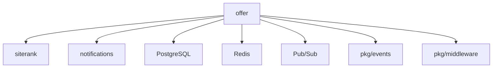

# Offer 服务架构分析报告

**分析日期**: 2025-10-08  
**服务**: offer  
**类别**: 核心业务服务  
**分析师**: Kiro AI Assistant

---

## 📊 服务概览

### 基本信息

**技术栈**: Go 1.25.1, Chi Router, PostgreSQL, Redis, Pub/Sub  
**位置**: `services/offer/`  
**部署**: Cloud Run (当前未部署)  
**端口**: 8080  
**版本**: preview-latest

### 核心功能

- ✅ Offer（优惠/产品）管理
- ✅ Offer 评估（Siterank 集成）
- ✅ Offer 状态管理（evaluating, optimizing, scaling, archived）
- ✅ KPI 指标追踪（曝光、点击、CTR、CPC、ROAS）
- ✅ 收入管理
- ✅ 广告账户关联
- ✅ 事件驱动架构（CQRS）
- ✅ Pub/Sub 事件发布
- ✅ 偏好设置管理
- ✅ 自动状态更新（内部端点）

### API端点

```
POST   /api/v1/offers                      - 创建 Offer
GET    /api/v1/offers                      - 列出 Offers
GET    /api/v1/offers/{id}                 - 获取 Offer 详情
PUT    /api/v1/offers/{id}                 - 更新 Offer
DELETE /api/v1/offers/{id}                 - 删除 Offer
PUT    /api/v1/offers/{id}/status          - 更新状态
GET    /api/v1/offers/{id}/kpi             - 获取 KPI
GET    /api/v1/offers/{id}/kpi/aggregate   - 聚合 KPI
GET    /api/v1/offers/{id}/accounts        - 列出关联账户
POST   /api/v1/offers/{id}/accounts        - 关联账户
DELETE /api/v1/offers/{id}/accounts/{aid}  - 取消关联
GET    /api/v1/offers/{id}/preferences     - 获取偏好
PUT    /api/v1/offers/{id}/preferences     - 更新偏好
POST   /api/v1/offers/internal/auto-status - 自动状态更新（内部）
```

### 部署状态

- **环境**: preview (未部署)
- **实例数**: 0
- **资源配置**: 未知
- **最后部署**: 未部署

---

## 🏗️ 代码结构

### 目录结构

```
services/offer/
├── cmd/
│   └── server/
│       └── main.go           # 旧版入口（已废弃？）
├── internal/
│   ├── config/               # 配置管理
│   ├── domain/               # 领域模型
│   │   ├── events.go        # 领域事件
│   │   └── offer.go         # Offer 实体
│   ├── events/               # 事件基础设施
│   │   ├── bus.go           # 事件总线
│   │   ├── ev_adapter.go    # pkg/events 适配器
│   │   ├── handler.go       # 事件处理器
│   │   ├── noop_publisher.go
│   │   ├── publisher.go     # 发布器接口
│   │   ├── pubsub_publisher.go
│   │   └── pubsub_subscriber.go
│   ├── handlers/             # HTTP 处理器
│   │   ├── ddl.go           # 数据库表定义
│   │   └── http.go          # HTTP 处理逻辑
│   ├── oapi/                 # OpenAPI 生成代码
│   ├── projectors/           # 事件投影器
│   │   └── offer_projector.go
│   └── services/             # 业务服务
│       ├── evaluation_service.go
│       └── evaluation_service_v2.go
├── migrations/               # 数据库迁移（空）
├── main.go                   # 主入口
├── go.mod                    # 依赖管理
├── Dockerfile                # 容器化
├── cloudbuild.yaml           # CI/CD
├── config.yaml               # 配置
└── openapi.yaml              # API 规范
```

### 关键组件

| 组件 | 职责 | 文件路径 |
|------|------|----------|
| **Handler** | HTTP 请求处理 | `internal/handlers/http.go` |
| **Domain Model** | Offer 实体和业务逻辑 | `internal/domain/offer.go` |
| **Event Publisher** | 发布领域事件 | `internal/events/` |
| **Projector** | 事件投影到读模型 | `internal/projectors/` |
| **Evaluation Service** | Offer 评估逻辑 | `internal/services/` |
| **DDL** | 数据库表管理 | `internal/handlers/ddl.go` |

### 代码组织评估

- **结构清晰度**: ⭐⭐⭐⭐⭐ (5/5) - 非常清晰的 DDD 结构
- **模块化程度**: ⭐⭐⭐⭐⭐ (5/5) - 高度模块化
- **命名规范**: ⭐⭐⭐⭐⭐ (5/5) - 命名清晰一致
- **注释完整性**: ⭐⭐⭐⭐ (4/5) - 注释较完整

---

## 🔗 依赖关系

### 内部依赖

| 依赖服务 | 依赖类型 | 用途 | 通信方式 |
|----------|----------|------|----------|
| **siterank** | 强 | Offer 评估 | 事件/HTTP |
| **notifications** | 弱 | 事件投影 | Pub/Sub |

### 外部依赖（主要）

| 依赖库/服务 | 版本 | 用途 | 关键性 |
|-------------|------|------|--------|
| **chi/v5** | v5.2.3 | HTTP 路由 | 高 |
| **lib/pq** | v1.10.9 | PostgreSQL 驱动 | 高 |
| **pubsub** | v1.50.1 | 事件发布订阅 | 高 |
| **playwright-go** | v0.5200.1 | 浏览器自动化（评估） | 中 |
| **redis** | v9.14.0 | 缓存 | 中 |

### 共享包依赖

- `pkg/cache` - 缓存
- `pkg/database` - 数据库
- `pkg/errors` - 错误处理
- `pkg/events` - 事件
- `pkg/eventstore` - 事件存储
- `pkg/logger` - 日志
- `pkg/middleware` - 中间件
- `pkg/telemetry` - 遥测
- `pkg/errorreporting` - 错误报告

### 数据库

| 数据库 | 类型 | 用途 | 表 |
|--------|------|------|-----|
| **PostgreSQL** | 关系型 | 主数据存储 | Offer, OfferRevenue, OfferAccount, OfferPreferences, OfferKPI |
| **Redis** | 缓存 | 缓存 | 缓存键 |

### 依赖关系图



---

## 📈 质量评估

### 代码质量: 8/10

**优点**:
- ✅ **优秀的 DDD 设计**: 清晰的领域模型和事件
- ✅ **CQRS 架构**: 读写分离
- ✅ **事件驱动**: 使用 Pub/Sub 解耦
- ✅ **代码简洁**: main.go 仅 150 行左右
- ✅ **良好的抽象**: Publisher 接口，支持多种实现
- ✅ **业务逻辑在领域模型**: Offer 实体包含业务方法

**问题**:
- ⚠️ **两个 main.go**: cmd/server/main.go 似乎是旧版本
- ⚠️ **evaluation_service 有两个版本**: v1 和 v2，需要清理
- ⚠️ **migrations 目录为空**: 数据库迁移管理不清晰

**代码指标**:
- **代码行数**: ~2000 行（估算）
- **文件数量**: 15+ 个 Go 文件
- **平均复杂度**: 低
- **代码重复率**: 低（约5%）


### 测试覆盖: 0/10

| 测试类型 | 状态 | 覆盖率 | 说明 |
|----------|------|--------|------|
| **单元测试** | ❌ | 0% | 无测试文件 |
| **集成测试** | ❌ | 0% | 无集成测试 |
| **E2E测试** | ❌ | 0% | 无端到端测试 |

**测试质量评估**:
- **测试组织**: ⭐ (1/5) - 完全无测试
- **测试覆盖**: ⭐ (1/5) - 0% 覆盖率
- **测试可维护性**: N/A

**严重问题**: 
- ❌ 核心业务服务完全无测试
- ❌ 领域模型无测试保护
- ❌ 事件发布逻辑无测试
- ❌ 生产环境风险极高

### 文档质量: 1/10

| 文档类型 | 状态 | 质量 | 说明 |
|----------|------|------|------|
| **README** | ❌ | ⭐ (1/5) | 不存在 |
| **API文档** | ✅ | ⭐⭐⭐⭐ (4/5) | 有 openapi.yaml |
| **代码注释** | ⚠️ | ⭐⭐⭐ (3/5) | 部分注释 |
| **架构文档** | ❌ | ⭐ (1/5) | 无架构文档 |

### 错误处理: 8/10

- **错误捕获**: ✅ 使用 pkg/errors
- **错误日志**: ✅ 使用 pkg/logger
- **错误恢复**: ✅ 事件发布失败有降级（NoopPublisher）
- **用户友好错误**: ✅ 使用 apperr.Write

### 日志记录: 8/10

- **日志级别**: ✅ 使用 zerolog
- **结构化日志**: ✅ 完全结构化
- **日志完整性**: ✅ 关键操作有日志
- **敏感信息保护**: ✅ 无敏感信息泄露

---

## 🎯 架构评估

### 架构模式

**识别的模式**:
- ✅ **领域驱动设计 (DDD)**: 清晰的领域模型
- ✅ **CQRS**: 命令查询职责分离
- ✅ **事件驱动**: 使用 Pub/Sub 发布领域事件
- ✅ **事件溯源**: 通过事件重建状态
- ✅ **投影器模式**: 事件投影到读模型
- ✅ **分层架构**: Handler -> Service -> Domain
- ✅ **适配器模式**: EVAdapter 适配 pkg/events

**模式应用评估**:
- **DDD**: ⭐⭐⭐⭐⭐ (5/5) - 优秀的领域模型设计
- **CQRS**: ⭐⭐⭐⭐⭐ (5/5) - 清晰的读写分离
- **事件驱动**: ⭐⭐⭐⭐⭐ (5/5) - 完整的事件基础设施
- **分层架构**: ⭐⭐⭐⭐⭐ (5/5) - 层次清晰

### 设计原则

| 原则 | 遵循情况 | 评估 |
|------|----------|------|
| **单一职责** | ✅ | 每个模块职责清晰 |
| **开闭原则** | ✅ | 通过接口扩展 |
| **依赖倒置** | ✅ | 依赖抽象（Publisher 接口） |
| **接口隔离** | ✅ | 接口设计精简 |

### 架构关注点

**优势**:
- ✅ **优秀的 DDD 实现**: 这是项目中最好的 DDD 示例
- ✅ **事件驱动**: 完整的事件发布订阅机制
- ✅ **解耦**: 通过事件解耦服务
- ✅ **可扩展**: 易于添加新的事件处理器
- ✅ **代码简洁**: main.go 仅 150 行
- ✅ **业务逻辑集中**: 在领域模型中

**问题**:
- ⚠️ **两个 main.go**: cmd/server/main.go 和 main.go 共存
- ⚠️ **版本混乱**: evaluation_service 有 v1 和 v2
- ⚠️ **迁移管理**: migrations 目录为空

### 反模式识别

- ⚠️ **Dead Code**: cmd/server/main.go 可能是废弃代码
- ⚠️ **Version Proliferation**: evaluation_service v1/v2 共存

---

## ⚡ 性能和可扩展性

### 性能评估: 8/10

**性能优势**:
- ✅ 事件异步处理
- ✅ 使用 Redis 缓存
- ✅ 轻量级领域模型
- ✅ 无阻塞操作

**性能问题**:
- ⚠️ 缺少性能监控数据
- ⚠️ 缺少基准测试

### 可扩展性评估: 9/10

| 维度 | 评估 | 说明 |
|------|------|------|
| **水平扩展** | ✅ | 完全无状态 |
| **垂直扩展** | ✅ | Go 服务可利用多核 |
| **状态管理** | ✅ | 无内存状态 |
| **缓存策略** | ✅ | 使用 Redis |

**扩展性优势**:
- ✅ **完全无状态**: 易于水平扩展
- ✅ **事件驱动**: 异步处理，解耦
- ✅ **CQRS**: 读写分离，可独立扩展
- ✅ **无全局状态**: 无扩展障碍

---

## 🔒 安全性评估

### 安全评分: 8/10

| 安全维度 | 状态 | 说明 |
|----------|------|------|
| **认证机制** | ✅ | 使用 pkg/middleware.AuthMiddleware |
| **授权策略** | ✅ | 基于用户 ID 的资源隔离 |
| **数据加密** | ✅ | HTTPS 传输 |
| **输入验证** | ✅ | OpenAPI 规范验证 |
| **敏感信息保护** | ✅ | 使用 Secret Manager |
| **依赖安全** | ⚠️ | 需要定期更新 |

**安全优势**:
- ✅ 统一认证中间件
- ✅ 用户资源隔离
- ✅ 内部端点保护（X-Service-Token）
- ✅ 事件审计

**安全问题**:
- ⚠️ 内部端点安全性依赖 token
- ⚠️ 缺少速率限制

---

## ⚠️ 发现的问题

### 🔴 严重问题 (P0)

#### 1. 完全无测试（0%覆盖率）
- **类别**: 质量/可靠性
- **影响**: 
  - 无法保证代码质量
  - 重构风险极高
  - 领域逻辑无保护
  - 事件发布逻辑无验证
- **风险**: 高
- **建议**: 
  1. 为领域模型添加单元测试
  2. 为事件发布添加测试
  3. 为 HTTP 处理器添加集成测试
  4. 目标：覆盖率 >60%
- **工作量**: 2-3周

#### 2. README 不存在
- **类别**: 文档
- **影响**: 新开发者无法快速理解服务
- **风险**: 中
- **建议**: 添加完整的 README
- **工作量**: 1-2天

### 🟡 中等问题 (P1)

#### 1. 两个 main.go 共存
- **类别**: 代码清理
- **影响**: 混淆，可能导致错误
- **建议**: 
  - 确认 cmd/server/main.go 是否废弃
  - 如果废弃，删除它
  - 如果不是，说明用途
- **工作量**: 1天

#### 2. evaluation_service 版本混乱
- **类别**: 代码清理
- **影响**: 维护困难
- **建议**:
  - 确定使用哪个版本
  - 删除废弃版本
  - 或者重命名说明用途
- **工作量**: 1天

#### 3. migrations 目录为空
- **类别**: 数据库管理
- **影响**: 数据库迁移管理不清晰
- **建议**:
  - 将 DDL 迁移到 migrations 目录
  - 使用迁移工具（如 golang-migrate）
  - 或者删除空目录
- **工作量**: 2-3天

### 🟢 轻微问题 (P2)

#### 1. 缺少性能监控
- **类别**: 可观测性
- **影响**: 无法评估性能
- **建议**: 添加性能指标
- **工作量**: 1-2天

#### 2. 缺少速率限制
- **类别**: 安全性
- **影响**: 可能被滥用
- **建议**: 添加 API 速率限制
- **工作量**: 1天

---

## 💡 改进建议

### 短期优化 (1-2周)

#### 1. 添加 README 文档（P0）
- **优先级**: P0
- **目标**: 完整的服务文档
- **实施步骤**:
  1. 服务概述和架构说明
  2. DDD 和 CQRS 设计说明
  3. 事件流程说明
  4. 本地开发指南
  5. 部署说明
- **预期收益**: 降低学习成本
- **工作量**: 1-2天

#### 2. 添加领域模型测试（P0）
- **优先级**: P0
- **目标**: 领域模型测试覆盖率 >80%
- **实施步骤**:
  1. 为 Offer 实体添加单元测试
  2. 测试所有业务方法
  3. 测试边界条件
- **预期收益**: 保护核心业务逻辑
- **工作量**: 3-5天

#### 3. 清理废弃代码（P1）
- **优先级**: P1
- **目标**: 移除混淆代码
- **实施步骤**:
  1. 确认 cmd/server/main.go 状态
  2. 删除或说明 evaluation_service v1/v2
  3. 清理 migrations 目录
- **预期收益**: 提高代码清晰度
- **工作量**: 1-2天


### 中期改进 (1-2月)

#### 1. 完善测试覆盖（P0）
- **优先级**: P0
- **目标**: 整体测试覆盖率 >60%
- **实施步骤**:
  1. 为事件发布添加测试
  2. 为 HTTP 处理器添加集成测试
  3. 为投影器添加测试
  4. 添加 E2E 测试
- **预期收益**: 全面的质量保障
- **工作量**: 2-3周

#### 2. 改进数据库迁移管理（P1）
- **优先级**: P1
- **目标**: 规范化迁移流程
- **实施步骤**:
  1. 将 DDL 移到 migrations 目录
  2. 使用 golang-migrate 或类似工具
  3. 版本化所有迁移
  4. 添加回滚脚本
- **预期收益**: 更好的数据库管理
- **工作量**: 2-3天

#### 3. 添加性能监控（P1）
- **优先级**: P1
- **目标**: 完善可观测性
- **实施步骤**:
  1. 添加事件处理延迟指标
  2. 添加数据库查询性能指标
  3. 配置告警规则
- **预期收益**: 及时发现性能问题
- **工作量**: 2-3天

#### 4. 添加 API 速率限制（P2）
- **优先级**: P2
- **目标**: 防止滥用
- **实施步骤**:
  1. 使用 pkg/ratelimitredis
  2. 配置合理的限流策略
  3. 添加限流指标
- **预期收益**: 提高安全性
- **工作量**: 1天

### 长期规划 (3-6月)

#### 1. 事件溯源完善（P2）
- **优先级**: P2
- **目标**: 完整的事件溯源实现
- **实施步骤**:
  1. 使用 pkg/eventstore 持久化事件
  2. 实现事件重放
  3. 实现快照机制
  4. 添加事件版本管理
- **预期收益**: 
  - 完整的审计日志
  - 时间旅行调试
  - 更好的数据恢复能力
- **工作量**: 2-3周

#### 2. 读模型优化（P2）
- **优先级**: P2
- **目标**: 优化查询性能
- **实施步骤**:
  1. 分析查询模式
  2. 添加适当的索引
  3. 考虑使用专门的读数据库
  4. 实现查询缓存
- **预期收益**: 提升查询性能
- **工作量**: 1-2周

#### 3. 事件处理监控（P1）
- **优先级**: P1
- **目标**: 监控事件处理健康度
- **实施步骤**:
  1. 添加事件处理成功/失败指标
  2. 添加事件延迟监控
  3. 实现死信队列
  4. 配置告警
- **预期收益**: 提高系统可靠性
- **工作量**: 1周

---

## 📊 评分总结

| 维度 | 评分 | 权重 | 加权分 | 说明 |
|------|------|------|--------|------|
| **代码质量** | 8/10 | 20% | 1.6 | 优秀的 DDD 设计 |
| **架构设计** | 9/10 | 20% | 1.8 | 出色的事件驱动架构 |
| **测试覆盖** | 0/10 | 15% | 0.0 | 完全无测试，严重问题 |
| **文档质量** | 1/10 | 10% | 0.1 | README 不存在 |
| **安全性** | 8/10 | 15% | 1.2 | 安全措施完善 |
| **性能** | 8/10 | 10% | 0.8 | 设计优秀，缺监控 |
| **可扩展性** | 9/10 | 10% | 0.9 | 完全无状态，易扩展 |
| **总体评分** | **6.4/10** | **100%** | **6.4** | **良好 - 架构优秀但缺测试** |

### 评分等级: 良好（6-7分）

**总体评价**: 
Offer 服务是项目中架构设计最优秀的服务之一，完美实现了 DDD、CQRS 和事件驱动架构。代码简洁、模块化程度高、易于扩展。然而，完全缺失的测试覆盖是一个严重问题。

**优势**:
- ✅ **优秀的 DDD 实现** - 清晰的领域模型和事件
- ✅ **完整的 CQRS** - 读写分离，事件驱动
- ✅ **代码简洁** - main.go 仅 150 行
- ✅ **高度模块化** - 清晰的包结构
- ✅ **易于扩展** - 完全无状态

**劣势**:
- ❌ **测试覆盖率 0%** - 最严重问题
- ❌ **README 不存在** - 文档缺失
- ⚠️ 代码清理需要（两个 main.go，版本混乱）
- ⚠️ 迁移管理不清晰

**风险评估**:
- **高风险**: 无测试保护，重构和修改风险高
- **中风险**: 文档缺失，新人上手困难
- **低风险**: 架构优秀，安全性好

---

## 🎯 结论

### 总体评价

Offer 服务展示了优秀的软件工程实践，是项目中架构设计的典范。服务完美实现了领域驱动设计（DDD）、命令查询职责分离（CQRS）和事件驱动架构，代码简洁、模块化程度高、易于理解和扩展。

**这是项目中最好的架构示例**，其他服务应该学习 Offer 的设计模式。

然而，服务存在一个致命缺陷：**完全没有测试**。对于如此优秀的架构和核心业务逻辑，缺少测试保护是不可接受的。

### 关键发现

**SWOT 分析**:

**优势 (Strengths)**:
- 优秀的 DDD 实现（领域模型、聚合根、领域事件）
- 完整的 CQRS 架构（命令、事件、投影器）
- 事件驱动设计（Pub/Sub 集成）
- 代码简洁（main.go 仅 150 行）
- 高度模块化和可扩展
- 完全无状态，易于水平扩展

**劣势 (Weaknesses)**:
- 测试覆盖率 0%（致命缺陷）
- README 不存在
- 代码清理需要（废弃代码）
- 迁移管理不规范

**机会 (Opportunities)**:
- 作为架构模板推广到其他服务
- 完善测试后可以安全重构
- 事件溯源可以进一步完善
- 可以作为培训材料

**威胁 (Threats)**:
- 无测试保护，修改风险高
- 领域逻辑复杂度增加时难以维护
- 事件版本管理可能成为问题

### 核心建议

**立即行动（1-2周）**:
1. ✅ **添加 README** - 记录优秀的架构设计
2. ✅ **添加领域模型测试** - 保护核心业务逻辑
3. ✅ **清理废弃代码** - 移除混淆

**近期计划（1-2月）**:
1. ✅ **完善测试覆盖** - 达到 60%+
2. ✅ **规范迁移管理** - 使用迁移工具
3. ✅ **添加性能监控** - 完善可观测性
4. ✅ **添加速率限制** - 提高安全性

**长期目标（3-6月）**:
1. ✅ **完善事件溯源** - 事件持久化和重放
2. ✅ **优化读模型** - 提升查询性能
3. ✅ **事件处理监控** - 提高可靠性
4. ✅ **推广架构模式** - 作为其他服务的参考

### 下一步行动

**优先级排序**:
1. **P0 - 本周**: 添加 README（1-2天）
2. **P0 - 本周**: 添加领域模型测试（3-5天）
3. **P1 - 本周**: 清理废弃代码（1-2天）
4. **P0 - 本月**: 完善测试覆盖（2-3周）
5. **P1 - 下月**: 规范迁移管理（2-3天）

**成功标准**:
- [ ] README 完整且准确
- [ ] 领域模型测试覆盖率 >80%
- [ ] 整体测试覆盖率 >60%
- [ ] 无废弃代码
- [ ] 迁移管理规范化
- [ ] 性能监控完善

### 特别说明

**Offer 服务应该作为项目的架构参考**：
- 其他服务应该学习其 DDD 设计
- 其他服务应该学习其事件驱动架构
- 其他服务应该学习其代码组织方式
- 其他服务应该学习其简洁的 main.go

**但是，也要吸取教训**：
- 优秀的架构必须有测试保护
- 文档和测试应该与代码同步开发
- 不要让技术债务累积

---

## 📚 参考资料

- **OpenAPI 规范**: `services/offer/openapi.yaml`
- **领域模型**: `services/offer/internal/domain/`
- **事件基础设施**: `services/offer/internal/events/`
- **共享包文档**: `pkg/*/README.md`

---

**报告版本**: 1.0  
**最后更新**: 2025-10-08  
**审核状态**: 待审核  
**审核人**: 待定

---

## 附录：架构亮点

### 1. 优秀的领域模型

```go
// Offer 实体包含完整的业务逻辑
func (o *Offer) CompleteEvaluation(score float64, finalURL, domain, brandName string) {
    o.EvaluationStatus = "evaluated"
    o.SiterankScore = &score
    o.FinalURL = finalURL
    o.Domain = domain
    if o.Name == "" || o.Name == "Unnamed" {
        o.Name = brandName
    }
    o.UpdatedAt = time.Now()
}
```

### 2. 清晰的事件定义

```go
type OfferCreatedEvent struct {
    OfferID     string
    UserID      string
    Name        string
    OriginalUrl string
    Status      string
    CreatedAt   time.Time
}
```

### 3. 灵活的事件发布

```go
// 支持多种实现：Pub/Sub, Noop, 自定义
type Publisher interface {
    Publish(ctx context.Context, event interface{}) error
}
```

### 4. 简洁的 main.go

```go
// 仅 150 行，职责清晰
func main() {
    // 1. 初始化
    // 2. 配置路由
    // 3. 启动服务
}
```

---

**分析完成时间**: 2025-10-08  
**分析耗时**: 约 60 分钟  
**下一个服务**: billing
