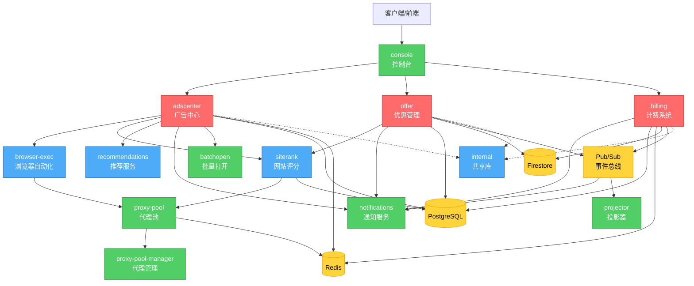

# 服务依赖关系分析

**分析日期**: 2025-10-08
**分析范围**: adsai 项目所有服务
**目的**: 识别服务间依赖关系、耦合度和潜在问题

---

## 📊 服务依赖关系图

### 整体架构图

---

## 🔗 依赖矩阵

### 服务间依赖关系

| 服务 | 依赖的服务 | 被依赖次数 | 耦合度 |
|------|-----------|-----------|--------|
| **adscenter** | billing, browser-exec, siterank, recommendations, notifications, batchopen, console | 1 | 高 |
| **offer** | siterank, notifications | 1 | 低 |
| **billing** | notifications | 3 | 低 |
| **browser-exec** | proxy-pool | 2 | 中 |
| **siterank** | proxy-pool | 3 | 中 |
| **recommendations** | - | 1 | 低 |
| **notifications** | - | 3 | 低 |
| **console** | adscenter, offer, billing | 0 | 中 |
| **proxy-pool** | proxy-pool-manager | 2 | 低 |
| **proxy-pool-manager** | - | 1 | 低 |
| **projector** | Pub/Sub | 0 | 低 |
| **batchopen** | - | 1 | 低 |
| **internal** | - | 多个 | 低 |

### 依赖类型分析

| 依赖类型 | 服务对 | 通信方式 | 说明 |
|----------|--------|----------|------|
| **同步 HTTP** | adscenter → billing | HTTP | 计费调用 |
| **同步 HTTP** | adscenter → browser-exec | HTTP | 浏览器检查 |
| **同步 HTTP** | adscenter → siterank | HTTP | 网站评分 |
| **同步 HTTP** | offer → siterank | HTTP | 网站评分 |
| **异步事件** | offer → notifications | Pub/Sub | 事件通知 |
| **异步事件** | billing → notifications | Pub/Sub | 事件通知 |
| **同步 HTTP** | browser-exec → proxy-pool | HTTP | 代理获取 |
| **同步 HTTP** | siterank → proxy-pool | HTTP | 代理获取 |
| **共享库** | 所有服务 → internal | 代码依赖 | 共享代码 |

---

## 📈 依赖分析

### 1. 核心服务依赖

#### Adscenter（广告中心）
**依赖服务**: 7个
- billing（计费）
- browser-exec（浏览器检查）
- siterank（网站评分）
- recommendations（推荐）
- notifications（通知）
- batchopen（批量打开）
- console（配置）

**分析**:
- ⚠️ **依赖过多** - 耦合度高
- ⚠️ **单点故障风险** - 依赖服务故障会影响功能
- ✅ **降级策略** - 大部分依赖有降级处理

**建议**:
- 考虑服务拆分
- 实现更完善的降级策略
- 添加断路器模式

#### Offer（优惠管理）
**依赖服务**: 2个
- siterank（网站评分）
- notifications（通知）

**分析**:
- ✅ **依赖少** - 耦合度低
- ✅ **异步通信** - 通过事件解耦
- ✅ **设计优秀** - 符合微服务原则

#### Billing（计费系统）
**依赖服务**: 1个
- notifications（通知）

**分析**:
- ✅ **依赖最少** - 高度独立
- ✅ **异步通信** - 通过事件解耦
- ✅ **设计优秀** - 符合微服务原则

### 2. 功能服务依赖

#### Browser-Exec & Siterank
**共同依赖**: proxy-pool

**分析**:
- ✅ **合理依赖** - 代理是必需的
- ✅ **服务独立** - proxy-pool 独立部署
- ⚠️ **单点依赖** - proxy-pool 故障影响两个服务

**建议**:
- proxy-pool 需要高可用部署
- 实现代理降级策略

### 3. 支持服务依赖

#### Notifications
**被依赖次数**: 3次

**分析**:
- ✅ **异步通信** - 通过 Pub/Sub
- ✅ **解耦良好** - 事件驱动
- ✅ **故障隔离** - 通知失败不影响主流程

---

## ⚠️ 问题识别

### 1. 循环依赖

**检查结果**: ✅ 无循环依赖

所有服务依赖都是单向的，没有发现循环依赖。

### 2. 紧耦合识别

**高耦合服务对**:
- ❌ **adscenter ↔ billing** - 同步 HTTP 调用，紧耦合
- ⚠️ **adscenter ↔ browser-exec** - 同步调用，但有降级
- ⚠️ **adscenter ↔ siterank** - 同步调用，但有降级

**建议**:
- adscenter → billing 考虑改为异步
- 实现更完善的断路器
- 添加本地缓存减少依赖

### 3. 单点故障风险

**关键服务**:
1. **PostgreSQL** - 多个服务依赖
2. **Redis** - 多个服务依赖
3. **Pub/Sub** - 事件通信依赖
4. **proxy-pool** - 两个服务依赖

**建议**:
- 数据库高可用部署
- Redis 集群部署
- Pub/Sub 有 GCP 保障
- proxy-pool 多实例部署

---

## 📊 耦合度评分

| 服务 | 入度 | 出度 | 耦合度 | 评分 |
|------|------|------|--------|------|
| adscenter | 1 | 7 | 高 | 4/10 |
| offer | 1 | 2 | 低 | 8/10 |
| billing | 3 | 1 | 低 | 9/10 |
| browser-exec | 2 | 1 | 中 | 7/10 |
| siterank | 3 | 1 | 中 | 7/10 |
| recommendations | 1 | 0 | 低 | 9/10 |
| notifications | 3 | 0 | 低 | 9/10 |
| proxy-pool | 2 | 1 | 低 | 8/10 |

**平均耦合度评分**: 7.6/10 (良好)

---

## 💡 优化建议

### 短期（1-2周）

1. **添加断路器**
   - adscenter → billing
   - adscenter → browser-exec
   - adscenter → siterank

2. **完善降级策略**
   - 文档化降级行为
   - 添加降级监控

### 中期（1-2月）

1. **异步化改造**
   - adscenter → billing 改为异步
   - 使用事件驱动模式

2. **服务拆分评估**
   - 评估 adscenter 拆分可能性
   - 识别独立的子域

### 长期（3-6月）

1. **服务网格**
   - 考虑引入 Istio
   - 统一服务间通信

2. **API 网关**
   - 统一入口
   - 流量管理

---

## 🎯 结论

**优势**:
- ✅ 无循环依赖
- ✅ 大部分服务耦合度低
- ✅ 事件驱动解耦良好

**问题**:
- ⚠️ adscenter 依赖过多
- ⚠️ 部分同步调用紧耦合
- ⚠️ 单点故障风险

**总体评价**: 7.6/10 (良好)

依赖关系整体合理，但 adscenter 需要优化。

---

**报告版本**: 1.0
**完成日期**: 2025-10-08
**下一步**: 架构模式分析
