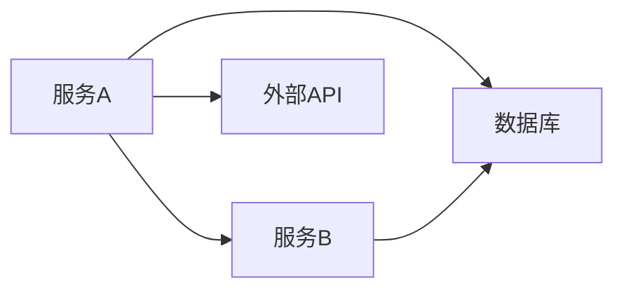
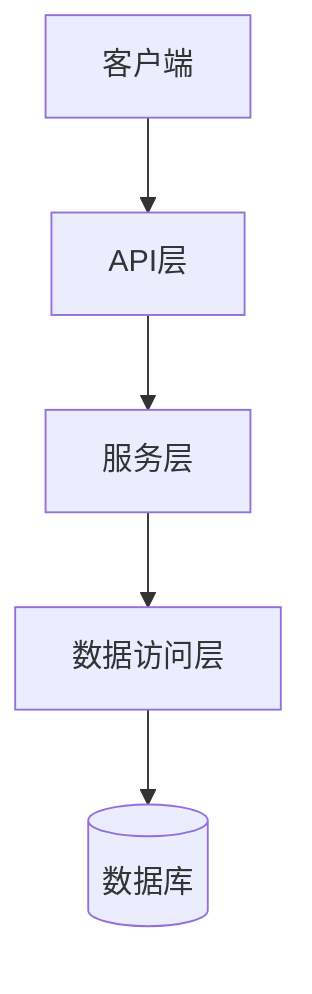
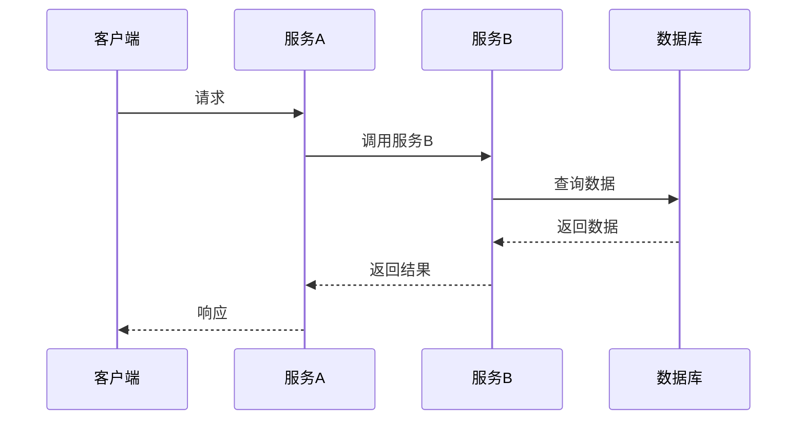

# 架构分析快速参考指南

本指南提供快速参考，帮助你高效完成服务架构分析。

---

## 🚀 快速开始

### 1. 运行自动分析脚本

```bash
./scripts/analyze-service.sh <service-name>
```

示例：
```bash
./scripts/analyze-service.sh adscenter
```

这将自动收集：
- 技术栈信息
- 代码统计
- 目录结构
- 文档检查
- 测试覆盖
- 依赖分析

### 2. 使用分析模板

复制模板创建新报告：
```bash
cp docs/ArchitectureReviewV1/templates/service-analysis-template.md \
   docs/ArchitectureReviewV1/<service-name>-analysis.md
```

### 3. 使用检查清单

打开检查清单确保完整性：
```bash
open docs/ArchitectureReviewV1/templates/analysis-checklist.md
```

---

## 📋 分析流程

```
1. 准备 → 2. 发现 → 3. 代码分析 → 4. 依赖分析 → 
5. 架构评估 → 6. 测试评估 → 7. 性能评估 → 
8. 安全评估 → 9. 问题识别 → 10. 建议制定 → 
11. 评分 → 12. 报告生成
```

---

## 🎯 评分标准

### 代码质量 (0-10分)

| 分数 | 标准 |
|------|------|
| 9-10 | 代码结构优秀，命名规范，注释完整，无明显问题 |
| 7-8  | 代码质量良好，有少量改进空间 |
| 5-6  | 代码质量中等，存在一些问题 |
| 3-4  | 代码质量较差，存在明显问题 |
| 1-2  | 代码质量很差，需要重构 |

### 架构设计 (0-10分)

| 分数 | 标准 |
|------|------|
| 9-10 | 架构清晰，模式正确，职责明确，扩展性好 |
| 7-8  | 架构合理，有改进空间 |
| 5-6  | 架构基本可用，存在一些问题 |
| 3-4  | 架构存在明显问题 |
| 1-2  | 架构混乱，需要重新设计 |

### 测试覆盖 (0-10分)

| 分数 | 覆盖率 | 标准 |
|------|--------|------|
| 9-10 | >80%   | 测试完整，质量高 |
| 7-8  | 60-80% | 测试良好 |
| 5-6  | 40-60% | 测试中等 |
| 3-4  | 20-40% | 测试不足 |
| 1-2  | <20%   | 几乎无测试 |

### 文档质量 (0-10分)

| 分数 | 标准 |
|------|------|
| 9-10 | 文档完整、准确、易懂 |
| 7-8  | 文档良好，有改进空间 |
| 5-6  | 文档基本可用 |
| 3-4  | 文档不足 |
| 1-2  | 几乎无文档 |

### 安全性 (0-10分)

| 分数 | 标准 |
|------|------|
| 9-10 | 安全措施完善，无明显漏洞 |
| 7-8  | 安全性良好，有改进空间 |
| 5-6  | 基本安全，存在一些问题 |
| 3-4  | 存在安全隐患 |
| 1-2  | 存在严重安全问题 |

### 性能 (0-10分)

| 分数 | 标准 |
|------|------|
| 9-10 | 性能优秀，无瓶颈 |
| 7-8  | 性能良好 |
| 5-6  | 性能中等 |
| 3-4  | 存在性能问题 |
| 1-2  | 性能很差 |

### 可扩展性 (0-10分)

| 分数 | 标准 |
|------|------|
| 9-10 | 易于扩展，设计灵活 |
| 7-8  | 扩展性良好 |
| 5-6  | 基本可扩展 |
| 3-4  | 扩展困难 |
| 1-2  | 几乎无法扩展 |

---

## 🔍 常见问题识别

### 代码质量问题

- ❌ 命名不规范（变量、函数、类）
- ❌ 代码重复
- ❌ 函数过长（>50行）
- ❌ 复杂度过高（圈复杂度>10）
- ❌ 缺少注释
- ❌ 硬编码配置

### 架构问题

- ❌ 职责不清晰
- ❌ 紧耦合
- ❌ 循环依赖
- ❌ 违反SOLID原则
- ❌ 反模式（God Object, Spaghetti Code等）

### 测试问题

- ❌ 测试覆盖率低
- ❌ 缺少单元测试
- ❌ 缺少集成测试
- ❌ 测试不独立
- ❌ 测试难以维护

### 文档问题

- ❌ README缺失或不完整
- ❌ API文档缺失
- ❌ 配置说明不清楚
- ❌ 缺少架构图
- ❌ 缺少部署文档

### 安全问题

- ❌ 硬编码密钥
- ❌ 缺少输入验证
- ❌ SQL注入风险
- ❌ XSS风险
- ❌ 依赖漏洞
- ❌ 敏感信息泄露

### 性能问题

- ❌ N+1查询
- ❌ 缺少缓存
- ❌ 同步阻塞操作
- ❌ 内存泄漏
- ❌ 资源未释放

---

## 💡 常见改进建议

### 短期优化 (1-2周)

1. **修复严重问题**
   - 安全漏洞
   - 性能瓶颈
   - 关键bug

2. **改进代码质量**
   - 重构复杂函数
   - 消除代码重复
   - 改进命名

3. **补充文档**
   - 更新README
   - 添加API文档
   - 添加配置说明

4. **增加测试**
   - 添加关键路径测试
   - 提高覆盖率到40%+

### 中期改进 (1-2月)

1. **架构优化**
   - 解耦紧耦合模块
   - 引入设计模式
   - 改进分层

2. **性能优化**
   - 添加缓存
   - 优化数据库查询
   - 改进并发处理

3. **测试完善**
   - 添加集成测试
   - 提高覆盖率到60%+
   - 改进测试质量

4. **监控增强**
   - 添加指标收集
   - 改进日志
   - 添加追踪

### 长期规划 (3-6月)

1. **架构演进**
   - 微服务拆分（如需要）
   - 引入事件驱动
   - 改进可扩展性

2. **技术升级**
   - 升级框架版本
   - 采用新技术
   - 改进工具链

3. **质量提升**
   - 建立质量门禁
   - 自动化测试
   - 持续集成改进

---

## 📊 报告模板快速填写

### 1. 服务概览 (5分钟)
- 运行分析脚本获取基本信息
- 填写技术栈、端口、部署信息
- 列出核心功能

### 2. 代码结构 (10分钟)
- 复制目录树
- 识别关键组件
- 评估代码组织

### 3. 依赖关系 (10分钟)
- 检查go.mod或package.json
- 识别内部服务依赖
- 列出主要外部依赖

### 4. 质量评估 (15分钟)
- 评估代码质量
- 检查测试覆盖
- 评估文档质量
- 检查错误处理和日志

### 5. 架构评估 (15分钟)
- 识别架构模式
- 评估设计原则
- 识别架构问题

### 6. 性能和安全 (10分钟)
- 评估性能指标
- 检查安全措施
- 识别潜在问题

### 7. 问题和建议 (15分钟)
- 列出发现的问题
- 制定改进建议
- 估算工作量

### 8. 评分和结论 (10分钟)
- 各维度评分
- 计算总分
- 撰写结论

**总计：约90分钟/服务**

---

## 🛠️ 有用的命令

### Go服务

```bash
# 代码统计
cloc services/<service-name>/

# 测试覆盖率
cd services/<service-name>
go test -cover ./...

# 依赖分析
go mod graph

# 代码复杂度
gocyclo -over 10 .

# 查找TODO
grep -r "TODO" .
```

### Node.js服务

```bash
# 代码统计
cloc services/<service-name>/

# 测试覆盖率
cd services/<service-name>
npm test -- --coverage

# 依赖分析
npm list --depth=0

# 查找TODO
grep -r "TODO" .
```

### 通用

```bash
# 查找大文件
find services/<service-name> -type f -size +1M

# 统计文件数
find services/<service-name> -type f | wc -l

# 查找重复代码
# 需要安装 jscpd: npm install -g jscpd
jscpd services/<service-name>/
```

---

## 📝 Mermaid图表示例

### 依赖关系图



### 架构图



### 数据流图



---

## ✅ 质量检查清单

完成报告前，确保：

- [ ] 所有章节都已填写
- [ ] 至少识别3个改进点
- [ ] 所有评分有充分依据
- [ ] 建议具有可操作性
- [ ] 包含至少1个图表
- [ ] 检查拼写和语法
- [ ] 报告长度3-10页
- [ ] 格式符合模板

---

## 🔗 相关资源

- **分析模板**: `docs/ArchitectureReviewV1/templates/service-analysis-template.md`
- **检查清单**: `docs/ArchitectureReviewV1/templates/analysis-checklist.md`
- **分析脚本**: `scripts/analyze-service.sh`
- **示例报告**: `docs/ArchitectureReviewV1/proxy-services-analysis.md`

---

## 💬 获取帮助

如果遇到问题：

1. 查看示例报告（proxy-services-analysis.md）
2. 参考检查清单确保完整性
3. 使用分析脚本自动收集信息
4. 咨询团队成员

---

**快速参考版本**: 1.0  
**最后更新**: 2025-10-08  
**维护者**: 架构团队
