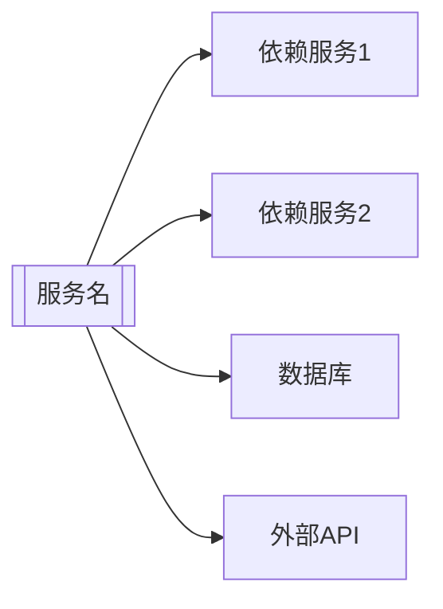

# [服务名称] 架构分析报告

**分析日期**: YYYY-MM-DD  
**服务**: [服务名称]  
**类别**: [核心业务/功能服务/支持服务/工具服务]  
**分析师**: [分析人员]

---

## 📊 服务概览

### 基本信息

**技术栈**: [语言, 框架, 主要库]  
**位置**: `services/[service-name]/`  
**部署**: [Cloud Run/Cloud Functions/GKE]  
**端口**: [端口号]  
**版本**: [当前版本]

### 核心功能

- ✅ [功能1描述]
- ✅ [功能2描述]
- ✅ [功能3描述]
- ❌ [缺失功能或待实现功能]

### API端点

```
[HTTP方法] [路径]           - [描述]
[HTTP方法] [路径]           - [描述]
```

### 部署状态

- **环境**: [preview/staging/production]
- **实例数**: [当前运行实例数]
- **资源配置**: [CPU/内存]
- **最后部署**: [日期]

---

## 🏗️ 代码结构

### 目录结构

```
services/[service-name]/
├── cmd/                    # 应用入口
│   └── server/
│       └── main.go
├── internal/               # 内部包
│   ├── handlers/          # HTTP处理器
│   ├── [domain]/          # 业务逻辑
│   ├── health/            # 健康检查
│   └── config.go          # 配置
├── [tests/]               # 测试目录
├── go.mod / package.json  # 依赖管理
├── Dockerfile             # 容器化
└── README.md              # 文档
```

### 关键组件

| 组件 | 职责 | 文件路径 |
|------|------|----------|
| **[组件名]** | [职责描述] | `[路径]` |
| **[组件名]** | [职责描述] | `[路径]` |

### 代码组织评估

- **结构清晰度**: ⭐⭐⭐⭐⭐ (1-5星)
- **模块化程度**: ⭐⭐⭐⭐⭐
- **命名规范**: ⭐⭐⭐⭐⭐
- **注释完整性**: ⭐⭐⭐⭐⭐

---

## 🔗 依赖关系

### 内部依赖

| 依赖服务 | 依赖类型 | 用途 | 通信方式 |
|----------|----------|------|----------|
| [服务名] | [强/弱] | [用途描述] | [HTTP/gRPC/消息队列] |

### 外部依赖

| 依赖库/服务 | 版本 | 用途 | 关键性 |
|-------------|------|------|--------|
| [库名] | [版本] | [用途] | [高/中/低] |

### 数据库

| 数据库 | 类型 | 用途 | 表/集合 |
|--------|------|------|---------|
| [数据库名] | [PostgreSQL/Redis/等] | [用途] | [主要表] |

### 依赖关系图



---

## 📈 质量评估

### 代码质量: [X]/10

**优点**:
- ✅ [优点1]
- ✅ [优点2]
- ✅ [优点3]

**问题**:
- ❌ [问题1]
- ❌ [问题2]
- ⚠️ [警告1]

**代码指标**:
- **代码行数**: [总行数] ([语言]代码: [行数], 注释: [行数])
- **文件数量**: [数量]
- **平均复杂度**: [复杂度分数]
- **代码重复率**: [百分比]

### 测试覆盖: [X]%

| 测试类型 | 状态 | 覆盖率 | 说明 |
|----------|------|--------|------|
| **单元测试** | ✅/❌ | [%] | [说明] |
| **集成测试** | ✅/❌ | [%] | [说明] |
| **E2E测试** | ✅/❌ | [%] | [说明] |

**测试质量评估**:
- **测试组织**: ⭐⭐⭐⭐⭐
- **测试覆盖**: ⭐⭐⭐⭐⭐
- **测试可维护性**: ⭐⭐⭐⭐⭐

### 文档质量: [X]/10

| 文档类型 | 状态 | 质量 | 说明 |
|----------|------|------|------|
| **README** | ✅/❌ | ⭐⭐⭐⭐⭐ | [说明] |
| **API文档** | ✅/❌ | ⭐⭐⭐⭐⭐ | [说明] |
| **代码注释** | ✅/❌ | ⭐⭐⭐⭐⭐ | [说明] |
| **架构文档** | ✅/❌ | ⭐⭐⭐⭐⭐ | [说明] |

### 错误处理: [X]/10

- **错误捕获**: ✅/❌ [说明]
- **错误日志**: ✅/❌ [说明]
- **错误恢复**: ✅/❌ [说明]
- **用户友好错误**: ✅/❌ [说明]

### 日志记录: [X]/10

- **日志级别**: ✅/❌ [说明]
- **结构化日志**: ✅/❌ [说明]
- **日志完整性**: ✅/❌ [说明]
- **敏感信息保护**: ✅/❌ [说明]

---

## 🎯 架构评估

### 架构模式

**识别的模式**:
- ✅ [模式1]: [描述和应用情况]
- ✅ [模式2]: [描述和应用情况]
- ❌ [缺失模式]: [说明]

### 设计原则

| 原则 | 遵循情况 | 评估 |
|------|----------|------|
| **单一职责** | ✅/⚠️/❌ | [评估说明] |
| **开闭原则** | ✅/⚠️/❌ | [评估说明] |
| **依赖倒置** | ✅/⚠️/❌ | [评估说明] |
| **接口隔离** | ✅/⚠️/❌ | [评估说明] |

### 架构关注点

**优势**:
- ✅ [架构优势1]
- ✅ [架构优势2]

**问题**:
- ❌ [架构问题1]
- ⚠️ [架构警告1]

### 反模式识别

- ❌ [反模式1]: [描述和影响]
- ❌ [反模式2]: [描述和影响]

---

## ⚡ 性能和可扩展性

### 性能评估: [X]/10

**性能指标**:
- **响应时间**: [平均/P95/P99]
- **吞吐量**: [请求/秒]
- **资源使用**: [CPU/内存使用率]
- **错误率**: [百分比]

**性能优势**:
- ✅ [优势1]

**性能问题**:
- ❌ [问题1]
- ⚠️ [潜在瓶颈1]

### 可扩展性评估: [X]/10

| 维度 | 评估 | 说明 |
|------|------|------|
| **水平扩展** | ✅/⚠️/❌ | [说明] |
| **垂直扩展** | ✅/⚠️/❌ | [说明] |
| **状态管理** | ✅/⚠️/❌ | [说明] |
| **缓存策略** | ✅/⚠️/❌ | [说明] |

**扩展性建议**:
- [建议1]
- [建议2]

---

## 🔒 安全性评估

### 安全评分: [X]/10

| 安全维度 | 状态 | 说明 |
|----------|------|------|
| **认证机制** | ✅/⚠️/❌ | [说明] |
| **授权策略** | ✅/⚠️/❌ | [说明] |
| **数据加密** | ✅/⚠️/❌ | [说明] |
| **输入验证** | ✅/⚠️/❌ | [说明] |
| **敏感信息保护** | ✅/⚠️/❌ | [说明] |
| **依赖安全** | ✅/⚠️/❌ | [说明] |

**安全优势**:
- ✅ [优势1]

**安全问题**:
- ❌ [严重问题1]
- ⚠️ [警告1]

---

## ⚠️ 发现的问题

### 🔴 严重问题 (P0)

#### 1. [问题标题]
- **类别**: [安全/性能/架构/等]
- **影响**: [详细描述影响]
- **风险**: [高/中/低]
- **建议**: [具体解决方案]
- **工作量**: [小时/天]

### 🟡 中等问题 (P1)

#### 1. [问题标题]
- **类别**: [类别]
- **影响**: [影响描述]
- **建议**: [解决方案]
- **工作量**: [估算]

### 🟢 轻微问题 (P2)

#### 1. [问题标题]
- **类别**: [类别]
- **影响**: [影响描述]
- **建议**: [解决方案]
- **工作量**: [估算]

---

## 💡 改进建议

### 短期优化 (1-2周)

#### 1. [建议标题]
- **优先级**: P0/P1/P2
- **目标**: [改进目标]
- **实施步骤**:
  1. [步骤1]
  2. [步骤2]
- **预期收益**: [收益描述]
- **工作量**: [估算]

### 中期改进 (1-2月)

#### 1. [建议标题]
- **优先级**: P1/P2
- **目标**: [改进目标]
- **实施步骤**:
  1. [步骤1]
  2. [步骤2]
- **预期收益**: [收益描述]
- **工作量**: [估算]
- **依赖**: [依赖项]

### 长期规划 (3-6月)

#### 1. [建议标题]
- **优先级**: P2/P3
- **目标**: [改进目标]
- **实施步骤**:
  1. [步骤1]
  2. [步骤2]
- **预期收益**: [收益描述]
- **工作量**: [估算]
- **依赖**: [依赖项]

---

## 📊 评分总结

| 维度 | 评分 | 权重 | 加权分 | 说明 |
|------|------|------|--------|------|
| **代码质量** | X/10 | 20% | X.X | [简短说明] |
| **架构设计** | X/10 | 20% | X.X | [简短说明] |
| **测试覆盖** | X/10 | 15% | X.X | [简短说明] |
| **文档质量** | X/10 | 10% | X.X | [简短说明] |
| **安全性** | X/10 | 15% | X.X | [简短说明] |
| **性能** | X/10 | 10% | X.X | [简短说明] |
| **可扩展性** | X/10 | 10% | X.X | [简短说明] |
| **总体评分** | **X/10** | **100%** | **X.X** | [总体评价] |

### 评分等级

- **9-10分**: 优秀 - 架构设计优良，代码质量高
- **7-8分**: 良好 - 整体质量不错，有改进空间
- **5-6分**: 中等 - 存在一些问题，需要改进
- **3-4分**: 较差 - 存在明显问题，需要重点改进
- **1-2分**: 很差 - 存在严重问题，需要重构

---

## 🎯 结论

### 总体评价

[对服务的总体评价，包括优势和不足]

### 关键发现

1. **优势**: [主要优势]
2. **劣势**: [主要劣势]
3. **机会**: [改进机会]
4. **威胁**: [潜在风险]

### 核心建议

1. **立即行动**: [最重要的改进建议]
2. **近期计划**: [短期内应该做的]
3. **长期目标**: [长期改进方向]

### 下一步行动

- [ ] [行动项1]
- [ ] [行动项2]
- [ ] [行动项3]

---

## 📚 参考资料

- [相关文档链接]
- [相关代码仓库]
- [相关技术文档]

---

**报告版本**: 1.0  
**最后更新**: YYYY-MM-DD  
**审核状态**: [待审核/已审核/已批准]  
**审核人**: [审核人员]
