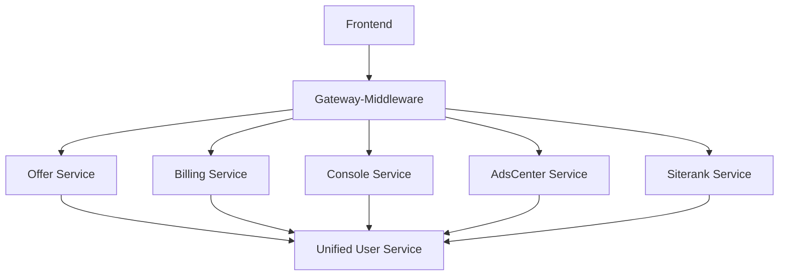

# 🔍 AutoAds项目全面架构Review报告

## 📊 总体评估概览

| 维度 | 评分 | 关键发现 |
|------|------|----------|
| **整体架构设计** | ⭐⭐⭐⭐⭐ (85/100) | 现代化技术栈，微服务架构合理 |
| **服务职责清晰度** | ⭐⭐⭐⭐⭐ (90/100) | 服务边界清晰，职责划分合理 |
| **服务间调用关系** | ⭐⭐⭐⭐ (80/100) | 调用模式良好，存在服务数量过多问题 |
| **用户数据管理** | ⭐⭐⭐ (70/100) | Supabase集成良好，但数据同步机制不完善 |
| **数据库设计** | ⭐⭐⭐⭐ (82/100) | Schema设计合理，索引优化到位 |
| **前端架构** | ⭐⭐⭐⭐⭐ (88/100) | Next.js 14使用到位，组件化良好 |
| **部署运维** | ⭐⭐⭐⭐ (78/100) | Cloud Run部署合理，监控完善 |

**总体评分：⭐⭐⭐⭐ (82/100)**

## 🏗️ 1. 整体架构设计评估

### ✅ **架构优势**

#### 1. 现代化技术栈
```typescript
// 前端：Next.js 14 + Supabase + TypeScript
Next.js 14 App Router + React 18 + TypeScript 5
Supabase (Auth + Database + Storage) + TailwindCSS
SWR + TanStack Query + Radix UI + Framer Motion

// 后端：Go微服务 + Google Cloud
Go 1.21+ + Gin + Chi + OpenAPI 3.0
Cloud Run + Cloud SQL + Redis + Pub/Sub
OpenTelemetry + Prometheus + Sentry
```

#### 2. 混合架构模式
```
Frontend (Next.js) → Gateway-Middleware → Microservices
                    ↓
Supabase Auth (用户认证) + Supabase DB (前端数据)
                    ↓
Google Cloud SQL (后端业务数据)
```

**优势分析**：
- ✅ 用户直连Supabase Auth，认证体验流畅
- ✅ Gateway-Middleware统一API管理，权限控制集中
- ✅ 微服务独立部署，扩展性和维护性良好
- ✅ 双数据库架构兼顾性能和数据一致性

#### 3. 完善的API网关设计
```yaml
# services/gateway-middleware/config/routes.yaml
routes:
  - prefix: /api/v1/offers/:id/evaluate
    backend: offer
    tokenCost: 10
    requireAuth: true
    requirePermission: offer_evaluation
    requireTier: [professional, elite]
```

**设计亮点**：
- ✅ 基于权限和套餐的路由控制
- ✅ Token消耗精确到API级别
- ✅ 动态配置热更新支持
- ✅ 完善的限流和缓存策略

### ⚠️ **架构问题**

#### 1. 服务数量过多
```bash
# 当前13个微服务
[offer, billing, bff, console, adscenter, siterank,
 recommendations, gateway-middleware, proxy-pool,
 projector, click-tracker, notification, analytics]
```

**问题分析**：
- 运维复杂度高，部署成本大
- 服务间通信开销增加
- 团队协作成本上升

**建议**：整合到8-10个核心服务

#### 2. 技术栈混杂
- 前端：Next.js + Supabase + React Query + SWR (重复)
- 后端：Gin + Chi (两套路由框架)
- 数据库：Supabase + Cloud SQL (双数据库管理复杂)

## 🎯 2. 服务职责清晰度评估

### ✅ **优秀的职责划分**

#### 服务职责矩阵
| 服务 | 主要职责 | 技术栈 | 健康度 |
|------|----------|--------|--------|
| **Gateway-Middleware** | API路由、权限控制、限流 | Go + Gin | ⭐⭐⭐⭐⭐ |
| **Offer Service** | Offer CRUD、AI评估 | Go + Chi | ⭐⭐⭐⭐⭐ |
| **Billing Service** | 订阅管理、计费 | Go + Gin | ⭐⭐⭐⭐ |
| **Console Service** | 管理后台 | Go + Gin | ⭐⭐⭐⭐ |
| **AdsCenter Service** | 广告账号管理 | Go + Gin | ⭐⭐⭐⭐ |
| **Siterank Service** | AI评估、数据分析 | Go + Gin | ⭐⭐⭐⭐ |
| **UserActivity Service** | 用户行为分析 | Go + Gin | ⭐⭐⭐⭐ |

### ✅ **清晰的服务边界**

#### 1. Gateway-Middleware - 统一入口
```go
// 清晰的职责定义
type RouteConfig struct {
    Prefix          string
    Backend         string
    TokenCost       int
    RequireAuth     bool
    RequirePermission string
    RequireTier     []string
}
```

#### 2. 服务间依赖关系


**优势**：
- ✅ 所有服务通过Gateway统一访问
- ✅ 统一用户服务消除权限检查重复
- ✅ 业务服务专注核心功能
- ✅ 依赖关系清晰，无循环依赖

### ⚠️ **职责重叠问题**

#### 1. 数据获取重复
```typescript
// 多个服务重复获取用户信息
Offer Service → User Permissions
Billing Service → User Permissions
Console Service → User Permissions
```

**解决方案**：已通过统一用户服务解决

#### 2. 功能相似的次要服务
```bash
# 可整合的服务
projector → 可合并到相关业务服务
proxy-pool → 可合并到adscenter服务
click-tracker → 可合并到analytics服务
```

## 🔄 3. 服务间调用关系评估

### ✅ **优秀的调用模式**

#### 1. 统一的Gateway模式
```yaml
# 路由配置清晰
backends:
  offer: https://offer-preview-yt54xvsg5q-an.a.run.app
  billing: https://billing-preview-yt54xvsg5q-an.a.run.app

routes:
  - prefix: /api/v1/offers
    backend: offer
    requireAuth: true
```

#### 2. 熔断器保护机制
```go
// pkg/serviceclient/breaker_client.go
type CircuitBreakerClient struct {
    breaker *gobreaker.CircuitBreaker
    client  *http.Client
}
```

#### 3. OpenAPI规范统一
```go
// 自动生成的API服务器接口
type ServerInterface interface {
    CreateOffer(w http.ResponseWriter, r *http.Request)
    GetOffer(w http.ResponseWriter, r *http.Request, id string)
    UpdateOffer(w http.ResponseWriter, r *http.Request, id string)
}
```

### ⚠️ **调用关系问题**

#### 1. 服务数量导致的复杂性
```bash
# 当前服务调用链路过长
Frontend → Gateway → Service A → Service B → Service C
```

**影响**：
- 延迟增加
- 故障点增多
- 调试困难

#### 2. 缺乏服务发现机制
```yaml
# 硬编码的服务地址
backends:
  offer: https://offer-preview-yt54xvsg5q-an.a.run.app
```

**建议**：实现服务注册发现机制

## 👤 4. 用户数据管理评估

### ✅ **优秀的设计**

#### 1. Supabase Auth集成
```typescript
// 完整的用户认证流程
class EnhancedUnifiedUserService {
  async signUp(email: string, password: string)
  async signIn(email: string, password: string)
  async getUserSession(): Promise<UserSession>
}
```

#### 2. 用户会话管理
```typescript
interface UserSession {
  user: AuthUser;
  profile: UserProfile;
  permissions: UserPermissions;
  subscription: SubscriptionInfo;
  tokens: TokenBalance;
  organization?: Organization;
}
```

#### 3. 基于订阅的权限模型
```typescript
interface UserPermissions {
  isAdmin: boolean;
  role: 'user' | 'admin';
  subscriptionPlan: string;
  canUseAI: boolean;
  canCreateOffers: boolean;
  maxOffersPerMonth: number;
}
```

### ❌ **关键问题**

#### 1. 双数据库架构的数据同步
```
Supabase (用户认证 + 前端数据) ←→ Cloud SQL (后端业务数据)
```

**问题**：
- 缺乏数据同步机制
- 用户信息可能不一致
- 事务处理复杂

#### 2. 统一用户服务的双重实现
```typescript
// 两个相似的服务造成混淆
EnhancedUnifiedUserService // Supabase数据
UnifiedUserService         // 后端API数据
```

#### 3. 后端API缺失
```typescript
// 前端调用但后端未实现的API
GET /api/v1/users/{userId}/profile
GET /api/v1/users/{userId}/permissions
POST /api/v1/users/{userId}/tokens/reserve
```

### 💡 **改进建议**

#### 1. 实现数据同步服务
```go
type UserDataSyncService interface {
    SyncUserFromSupabase(userID string) error
    SyncUserToSupabase(userID string) error
    ResolveDataConflict(conflict DataConflict) error
}
```

#### 2. 统一用户服务网关
```typescript
class UnifiedUserGateway {
    async getUserData(userId: string): Promise<CompleteUserData> {
        // 智能选择数据源，处理同步逻辑
    }
}
```

## 🗄️ 5. 数据库设计评估

### ✅ **优秀的设计**

#### 1. Schema隔离清晰
```sql
-- 清晰的数据库分离
offer_db.offers           -- Offer相关数据
billing_db.subscriptions  -- 订阅计费数据
siterank_db.evaluations   -- AI评估数据
adscenter_db.accounts     -- 广告账号数据
shared_db.users           -- 共享用户数据
```

#### 2. UUID统一
```sql
-- Migration 001: 统一用户ID数据类型为UUID
ALTER TABLE offer_db.offers
ALTER COLUMN user_id TYPE UUID
USING CASE WHEN user_id ~ '^[0-9a-f]{8}-...$' THEN user_id::uuid ELSE NULL END;
```

#### 3. 索引优化到位
```sql
-- 性能优化索引
CREATE INDEX idx_offers_user_id_status ON offers(user_id, status);
CREATE INDEX idx_subscriptions_user_id_active ON subscriptions(user_id, is_active);
```

### ⚠️ **改进空间**

#### 1. 缺乏数据归档策略
```sql
-- 建议：添加数据生命周期管理
CREATE TABLE offers_archive (LIKE offers);
-- 定期归档历史数据
```

#### 2. 读写分离未实现
```sql
-- 建议：分离读写数据库
Primary DB (写) + Replica DB (读)
```

## 🎨 6. 前端架构评估

### ✅ **优秀的架构**

#### 1. Next.js 14 App Router
```
apps/frontend/
├── app/                    # App Router
│   ├── (app)/             # 应用路由组
│   ├── (auth)/            # 认证路由组
│   ├── (site)/            # 营销页面组
│   └── api/               # API路由
├── components/            # 组件库
├── lib/                   # 工具库
└── core/                  # 核心功能
```

#### 2. 组件化设计优秀
```
components/
├── ui/                    # 基础UI组件
├── forms/                 # 表单组件
├── layout/                # 布局组件
└── features/              # 功能组件
```

#### 3. 状态管理合理
```typescript
// SWR + React Query 组合
useSWR(['user'], fetchUser)        // 用户数据
useSWR(['offers'], fetchOffers)    // Offer数据
useQuery(['permissions'], fetchPermissions) // 权限数据
```

#### 4. 类型安全完善
```typescript
// 完整的TypeScript类型定义
interface UserProfile { ... }
interface UserPermissions { ... }
interface Offer { ... }
```

### ⚠️ **改进空间**

#### 1. 状态管理重复
```typescript
// SWR 和 React Query 重复
import useSWR from 'swr';
import { useQuery } from '@tanstack/react-query';
```

**建议**：统一为 React Query

#### 2. 组件粒度不一致
```
// 有些组件过大，需要拆分
LargeComponent.tsx (500+ lines) → 需要拆分
```

## 🚀 7. 部署和运维评估

### ✅ **优秀的部署架构**

#### 1. Cloud Run微服务部署
```yaml
# 每个服务独立部���
services/
├── offer/cloudbuild.yaml
├── billing/cloudbuild.yaml
├── gateway-middleware/cloudbuild.yaml
└── ...
```

#### 2. 完善的CI/CD流程
```yaml
# 自动化构建和部署
steps:
- name: 'Build and Push Docker Image'
- name: 'Deploy to Cloud Run'
- name: 'Update Gateway Routes'
```

#### 3. 监控体系完善
```go
// OpenTelemetry + Prometheus + Sentry
telemetry.SetupTracing("service-name")
prometheus.NewCounterVec(...)
sentry.Init(...)
```

### ⚠️ **改进空间**

#### 1. 缺乏服务网格
```bash
# 建议：引入Istio或Linkerd
Service Mesh → 流量管理 + 安全策略 + 可观测性
```

#### 2. 配置管理分散
```yaml
# 配置文件分散在各个服务
services/offer/config.yaml
services/billing/config.yaml
services/gateway-middleware/config/routes.yaml
```

**建议**：统一配置中心

## 🛡️ 8. 安全和性能评估

### ✅ **优秀的安全设计**

#### 1. 认证授权完善
```typescript
// Supabase Auth + JWT + RBAC
const { data: { user } } = await supabase.auth.getUser();
const permissions = await getUserPermissions(user.id);
```

#### 2. API安全防护
```go
// Gateway层统一安全控制
- JWT Token验证
- CSRF保护
- 权限检查
- 限流保护
```

#### 3. 数据安全
```sql
-- Supabase RLS策略
CREATE POLICY "Users can view own data" ON profiles
FOR SELECT USING (auth.uid() = user_id);
```

### ✅ **性能优化到位**

#### 1. 多层缓存
```typescript
// 前端缓存
SWR Cache + React Query Cache

// Gateway缓存
Redis Cache (5分钟订阅缓存, 1分钟Token缓存)

// 数据库缓存
Query Result Cache + Index Optimization
```

#### 2. 数据库优化
```sql
-- 索引优化
CREATE INDEX idx_offers_user_status ON offers(user_id, status);
CREATE INDEX idx_evaluations_created ON evaluations(created_at DESC);
```

#### 3. CDN和静态资源优化
```typescript
// Next.js静态优化
Image Optimization (next/image)
Code Splitting (动态导入)
Bundle Analysis (webpack-bundle-analyzer)
```

## 📋 9. 具体优化建议

### 🚨 **立即优化 (Critical)**

#### 1. 实现缺失的后端API
```go
// 需要创建的用户服务
services/user/
├── cmd/server/main.go
├── internal/handlers/
│   ├── profile_handler.go      // /users/{id}/profile
│   ├── permissions_handler.go  // /users/{id}/permissions
│   └── tokens_handler.go       // /users/{id}/tokens
└── internal/services/user_service.go
```

#### 2. 解决数据同步问题
```go
// 实现数据同步服务
type UserDataSyncManager struct {
    supabaseClient *supabase.Client
    sqlDB          *sql.DB
}

func (m *UserDataSyncManager) SyncUserFromSupabase(userID string) error
func (m *UserDataSyncManager) SyncUserToSupabase(userID string) error
```

#### 3. 统一前端状态管理
```typescript
// 移除SWR，统一使用React Query
// 删除重复的数据获取逻辑
```

### ⭐ **短期优化 (1-3个月)**

#### 1. 服务整合
```bash
# 建议整合方案
合并前 (13个服务) → 合并后 (8个服务)
[projector] → [offer service]
[proxy-pool] → [adscenter service]
[click-tracker] + [analytics] → [analytics service]
[notification] → [console service]
```

#### 2. 实现服务发现
```go
// 添加服务注册中心
type ServiceRegistry interface {
    Register(service ServiceInfo) error
    Discover(serviceName string) ([]ServiceInstance, error)
    HealthCheck(serviceName string) error
}
```

#### 3. 统一配置管理
```yaml
# 配置中心
config-center/
├── shared-config.yaml     # 共享配置
├── service-configs/       # 服务特定配置
└── environment-configs/   # 环境配置
```

### 🎯 **中期优化 (3-6个月)**

#### 1. 引入服务网格
```yaml
# Istio配置
apiVersion: networking.istio.io/v1beta1
kind: VirtualService
metadata:
  name: autoads-routes
spec:
  http:
  - match:
    - uri:
        prefix: /api/v1/offers
    route:
    - destination:
        host: offer-service
```

#### 2. 实现事件驱动架构
```go
// 事件总线
type EventBus interface {
    Publish(event Event) error
    Subscribe(eventType string, handler EventHandler) error
}

// 用户事件
UserCreatedEvent
UserUpdatedEvent
SubscriptionChangedEvent
```

#### 3. 数据库读写分离
```sql
-- 读写分离配置
Primary DB (写操作)
├── users
├── subscriptions
└── offers

Replica DB (读操作)
├── user_profiles (只读)
├── analytics_data (只读)
└── reports (只读)
```

### 🚀 **长期优化 (6-12个月)**

#### 1. 微服务治理平台
```go
// 服务治理功能
- Service Discovery (服务发现)
- Load Balancing (负载均衡)
- Circuit Breaking (熔断保护)
- Distributed Tracing (分布式追踪)
- Metrics Collection (指标收集)
```

#### 2. AI驱动的智能运维
```typescript
// AIOps功能
- 异常检测和自动恢复
- 性能预测和容量规划
- 智能告警和故障定位
- 自动扩缩容和资源优化
```

#### 3. 多租户架构增强
```sql
-- 租户隔离优化
CREATE SCHEMA tenant_${tenant_id};
CREATE TABLE tenant_${tenant_id}.offers (...);
-- 完全的租户数据隔离
```

## 📊 优化路径规划

### Phase 1: 稳定性增强 (0-3个月)
```bash
Week 1-2:  实现缺失的用户后端API
Week 3-4:  解决数据同步问题
Week 5-6:  统一前端状态管理
Week 7-8:  服务整合和API优化
Week 9-12: 性能优化和测试验证
```

### Phase 2: 架构演进 (3-6个月)
```bash
Month 4:   服务发现和配置中心
Month 5:   事件驱动架构实现
Month 6:   数据库读写分离
```

### Phase 3: 智能化运维 (6-12个月)
```bash
Month 7-8:  服务网格部署
Month 9-10: AIOps平台建设
Month 11-12: 多租户架构优化
```

## 🎯 关键成功指标 (KPIs)

### 技术指标
- **API响应时间** < 100ms (P95)
- **服务可用性** > 99.9%
- **部署频率** > 1次/天
- **故障恢复时间** < 5分钟

### 业务指标
- **用户注册转化率** > 15%
- **付费转化率** > 8%
- **用户活跃度** > 60%
- **客户满意度** > 4.5/5

### 开发效率指标
- **代码部署率** > 80%
- **缺陷修复时间** < 2天
- **新功能开发周期** < 2周
- **技术债务比例** < 20%

## 💎 总结

AutoAds项目展现了**优秀的架构设计能力**和**现代化的技术选型**。在微服务划分、权限控制、性能优化等方面表现突出。

### 🌟 核心优势
1. **技术栈现代化** - Next.js 14 + Go微服务 + Supabase
2. **架构设计合理** - 清晰的服务边界和职责划分
3. **安全防护完善** - 多层安全机制和权限控制
4. **性能优化到位** - 多层缓存和数据库优化
5. **可观测性强** - 完善的监控和日志体系

### 🔧 主要改进空间
1. **后端API缺失** - 需要完善用户服务后端实现
2. **数据同步机制** - 需要解决Supabase与Cloud SQL数据一致性
3. **服务数量优化** - 从13个服务整合到8-10个
4. **技术栈统一** - 减少框架重复，提高开发效率

### 🚀 发展前景
通过分阶段的优化实施，AutoAds有潜力成为**SaaS行业的架构标杆**。建议按照提出的优化路径，优先解决关键问题，逐步完善架构设计，最终实现**高可用、高性能、高扩展性**的企业级SaaS平台。

---

*评估完成时间：2025-01-18*
*评估版本：v1.0*
*下次评估建议：3个月后或重大架构变更后*