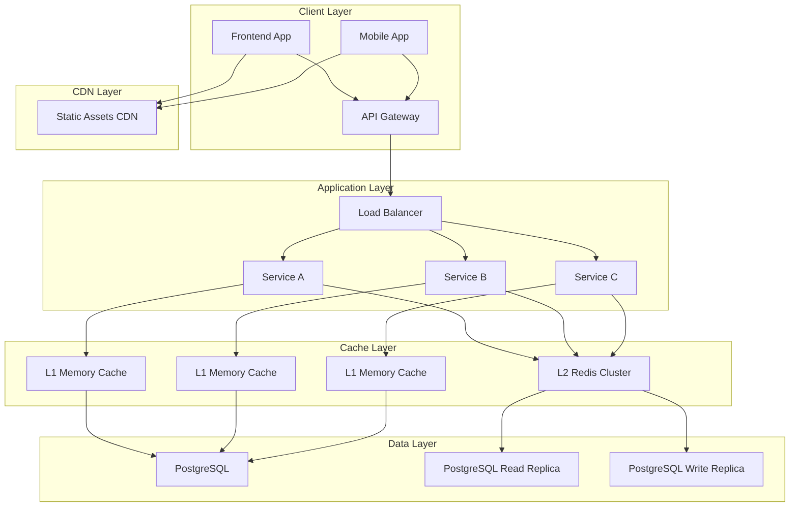

# AdsAI 缓存架构设计文档

**文档版本**: v1.0
**创建日期**: 2025-10-19
**设计目标**: 建立高效的多层缓存体系，缓存命中率>80%

---

## 📋 设计原则

### 核心原则
1. **多层缓存**: L1内存缓��� + L2分布式缓存 + L3数据库缓存
2. **缓存穿透保护**: 防止无效查询直达数据库
3. **缓存雪崩防护**: 防止大量缓存同时失效
4. **热点数据优先**: 优先缓存高频访问数据
5. **一致性保证**: 确保缓存与数据源的一致性

### 缓存策略
- **Cache-Aside**: 应用层管理缓存
- **Write-Through**: 写入时同步更新缓存
- **Write-Behind**: 异步写入数据源
- **Read-Through**: 读取时自动填充缓存

---

## 🏗️ 缓存架构概览



---

## 🗄️ 缓存层级设计

### L1 缓存层 (应用内存)
**位置**: 各服务进程内部
**技术**: Go内置map、sync.Map、或LRU Cache
**特点**: 访问最快、容量最小、一致性最强

#### 数据分类
```yaml
L1_Memory:
  用户会话信息:
    - TTL: 30分钟
    - 容量: 1MB per service
    - 命中率: >95%

  用户偏好设置:
    - TTL: 2小时
    - 容量: 500KB per service
    - 命中率: >90%

  权限信息:
    - TTL: 15分钟
    - 容量: 200KB per service
    - 命中率: >98%

  热点查询结果:
    - TTL: 5分钟
    - 容量: 5MB per service
    - 命中率: >85%
```

### L2 缓存层 (Redis集群)
**位置**: 独立Redis集群
**技术**: Redis Cluster with sentinel
**特点**: 分布式、高可用、容量适中

#### 数据分片策略
```yaml
Redis_Cluster:
  节点配置:
    - Master: 3节点
    - Slave: 6节点
    - Sentinel: 3节点

  分片策略:
    - 用户域: slots 0-5461
    - 计费域: slots 5462-10922
    - Offer域: slots 10923-16383
    - 广告域: slots 16384-21844
    - 活动域: slots 21845-27305
    - 系统域: slots 27306-32767
```

#### 缓存键命名规范
```
{domain}:{entity}:{id}:{version}:{field?}

Examples:
user:profile:user123:v1
billing:token_balance:user456:v2
offer:analysis:offer789:v1
ads:campaign:campaign101:v1
activity:notification:notif202:v1
```

### L3 缓存层 (数据库缓存)
**位置**: PostgreSQL内部
**技术**: 共享缓冲区、查询计划缓存
**特点**: 数据库原生、自动管理、透明访问

#### 缓存配置
```sql
-- PostgreSQL配置优化
shared_buffers = 256MB          -- 共享缓冲区
effective_cache_size = 1GB     -- 有效缓存大小
work_mem = 4MB                   -- 工作内存
maintenance_work_mem = 64MB       -- 维护工作内存
random_page_cost = 1.1           -- 随机页面成本
seq_page_cost = 1.0               -- 顺序页面成本
```

---

## 📊 数据缓存策略

### 用户域缓存策略

#### 用户基本信息
```yaml
Cache_Key: user:profile:{user_id}
TTL: 30分钟
Update_Policy: write-through
Invalidation:
  - 用户信息更新时
  - 用户状态变更时
  - 手动清理

L1_Cache: Yes (内存)
L2_Cache: Yes (Redis)
Hot_Data: >70%
```

#### 用户会话管理
```yaml
Cache_Key: user:session:{session_id}
TTL: 根据会话过期时间
Update_Policy: write-through
Invalidation:
  - 用户登出时
  - 会话过期时
  - 安全事件触发时

L1_Cache: Yes (内存)
L2_Cache: No (安全考虑)
Hot_Data: >95%
```

#### 用户权限信息
```yaml
Cache_Key: user:permissions:{user_id}
TTL: 15分钟
Update_Policy: write-through
Invalidation:
  - 权限变更时
  - 角色更新时
  - 手动清理

L1_Cache: Yes (内存)
L2_Cache: No (安全考虑)
Hot_Data: >98%
```

### 计费域缓存策略

#### 代币余额
```yaml
Cache_Key: billing:balance:{user_id}:{token_type}
TTL: 5分钟
Update_Policy: write-through
Invalidation:
  - 余额变动时
  - 交易完成时
  - 手动清理

L1_Cache: Yes (内存)
L2_Cache: Yes (Redis)
Hot_Data: >90%
```

#### 交易记录
```yaml
Cache_Key: billing:transactions:{user_id}:{limit}:{offset}
TTL: 1小时
Update_Policy: write-behind
Invalidation:
  - 新交易产生时
  - 定时清理 (每日)

L1_Cache: No (数据量大)
L2_Cache: Yes (Redis)
Hot_Data: >60%
```

### Offer域缓存策略

#### Offer详情
```yaml
Cache_Key: offer:details:{offer_id}
TTL: 10分钟
Update_Policy: write-through
Invalidation:
  - Offer更新时
  - 分析完成时
  - 状态变更时

L1_Cache: Yes (内存)
L2_Cache: Yes (Redis)
Hot_Data: >80%
```

#### AI分析结果
```yaml
Cache_Key: offer:analysis:{offer_id}:{analysis_type}
TTL: 30分钟
Update_Policy: write-through
Invalidation:
  - 新分析完成时
  - 数据更新时
  - 手动清理

L1_Cache: Yes (内存)
L2_Cache: Yes (Redis)
Hot_Data: >75%
```

#### 关键词数据
```yaml
Cache_Key: offer:keywords:{offer_id}
TTL: 2小时
Update_Policy: write-through
Invalidation:
  - 关键词更新时
  - 竞争对手分析完成时
  - 定期刷新

L1_Cache: No (数据量大)
L2_Cache: Yes (Redis)
Hot_Data: >70%
```

### 广告域缓存策略

#### 账户连接信息
```yaml
Cache_Key: ads:account:{account_id}
TTL: 1小时
Update_Policy: write-through
Invalidation:
  - 账户状态变更时
  - 同步失败时
  - 手动清理

L1_Cache: Yes (内存)
L2_Cache: Yes (Redis)
Hot_Data: >85%
```

#### 活动性能数据
```yaml
Cache_Key: ads:performance:{account_id}:{date}
TTL: 6小时
Update_Policy: write-behind
Invalidation:
  - 新数据产生时
  - 定期清理

L1_Cache: No (数据量大)
L2_Cache: Yes (Redis)
Hot_Data: >50%
```

### 活动域缓存策略

#### 通知列表
```yaml
Cache_Key: activity:notifications:{user_id}:{limit}:{offset}
TTL: 1分钟
Update_Policy: write-through
Invalidation:
  - 新通知产生时
  - 通知状态变更时
  - 用户阅读时

L1_Cache: Yes (内存)
L2_Cache: Yes (Redis)
Hot_Data: >95%
```

#### 用户活动统计
```yaml
Cache_Key: activity:stats:{user_id}:{date}
TTL: 4小时
Update_Policy: write-behind
Invalidation:
  - 新活动产生时
  - 定期汇总时

L1_Cache: No (计算数据)
L2_Cache: Yes (Redis)
Hot_Data: >60%
```

---

## 🔄 缓存一致性策略

### 写入策略
```go
// Write-Through 写入策略
func (c *CacheService) SetWriteThrough(key string, value interface{}, ttl time.Duration) error {
    // 1. 先写数据库
    if err := c.database.Set(key, value); err != nil {
        return err
    }

    // 2. 再写缓存
    if err := c.redis.Set(key, value, ttl); err != nil {
        // 缓存写入失败，不影响业务
        c.logger.Warn("Failed to write to cache", "key", key, "error", err)
    }

    // 3. 更新内存缓存
    c.memoryCache.Set(key, value, ttl)

    return nil
}

// Write-Behind 异步写入策略
func (c *CacheService) SetWriteBehind(key string, value interface{}, ttl time.Duration) error {
    // 1. 立即写入缓存
    if err := c.redis.Set(key, value, ttl); err != nil {
        return err
    }

    // 2. 异步写入数据库
    go func() {
        if err := c.database.Set(key, value); err != nil {
            c.logger.Error("Failed to write to database", "key", key, "error", err)
            // 可以选择更新缓存状态或发送告警
        }
    }()

    return nil
}
```

### 读取策略
```go
// Cache-Aside 读取策略
func (c *CacheService) Get(key string) (interface{}, error) {
    // 1. 先查内存缓存
    if value, found := c.memoryCache.Get(key); found {
        return value, nil
    }

    // 2. 查Redis缓存
    value, err := c.redis.Get(key)
    if err == nil {
        // 3. 写回内存缓存
        c.memoryCache.Set(key, value, 0) // 使用默认TTL
        return value, nil
    }

    // 4. 缓存未命中，从数据库读取
    value, err = c.database.Get(key)
    if err != nil {
        return nil, err
    }

    // 5. 写入缓存
    c.redis.Set(key, value, c.getDefaultTTL(key))
    c.memoryCache.Set(key, value, 0)

    return value, nil
}
```

### 失效策略
```go
// 精确失效
func (c *CacheService) Invalidate(key string) error {
    // 同时删除所有层级的缓存
    c.memoryCache.Delete(key)

    if err := c.redis.Delete(key); err != nil {
        c.logger.Warn("Failed to delete from Redis", "key", key, "error", err)
    }

    return nil
}

// 模式失效
func (c *CacheService) InvalidatePattern(pattern string) error {
    // Redis支持模式匹配删除
    keys, err := c.redis.Keys(pattern)
    if err != nil {
        return err
    }

    // 批量删除
    for _, key := range keys {
        c.memoryCache.Delete(key)
        c.redis.Delete(key)
    }

    return nil
}

// 延迟失效
func (c *CacheService) InvalidateWithDelay(key string, delay time.Duration) error {
    // 设置延迟失效标记
    delayKey := fmt.Sprintf("delay:invalidate:%s", key)
    c.redis.Set(delayKey, "pending", delay)

    return nil
}
```

---

## 🛡️ 缓存保护机制

### 缓存穿透保护
```go
// 布隆保护：缓存空值
func (c *CacheService) GetWithProtection(key string) (interface{}, error) {
    // 1. 查询缓存
    value, err := c.redis.Get(key)
    if err == nil && value != nil {
        return value, nil
    }

    // 2. 检查是否为空值缓存
    if err == nil && value == nil {
        return nil, nil // 返回空值
    }

    // 3. 使用分布式锁防止缓存穿透
    lockKey := fmt.Sprintf("lock:%s", key)
    lock, err := c.redis.SetNX(lockKey, "locked", 5*time.Second)
    if err != nil {
        return nil, err
    }

    if !lock {
        // 等待其他进程处理
        for i := 0; i < 10; i++ {
            time.Sleep(100 * time.Millisecond)
            value, err = c.redis.Get(key)
            if err == nil {
                return value, nil
            }
        }
        return nil, fmt.Errorf("cache penetration protection timeout")
    }

    defer c.redis.Delete(lockKey)

    // 4. 查询数据库
    value, err = c.database.Get(key)
    if err != nil {
        return nil, err
    }

    // 5. 缓存结果（包括空值）
    ttl := c.getDefaultTTL(key)
    if value == nil {
        ttl = 5 * time.Minute // 空值短时间缓存
    }

    c.redis.Set(key, value, ttl)

    return value, nil
}
```

### 缓存雪崩保护
```go
// 随机TTL防止同时失效
func (c *CacheService) SetWithRandomTTL(key string, value interface{}, baseTTL time.Duration) error {
    // 添加随机偏移量
    randomOffset := time.Duration(rand.Intn(300)) * time.Second
    finalTTL := baseTTL + randomOffset

    return c.redis.Set(key, value, finalTTL)
}

// 分批次刷新缓存
func (c *CacheService) RefreshBatch(keys []string) error {
    // 分批处理，每批100个key
    batchSize := 100

    for i := 0; i < len(keys); i += batchSize {
        end := i + batchSize
        if end > len(keys) {
            end = len(keys)
        }

        batch := keys[i:end]

        // 为每批添加随机延迟
        delay := time.Duration(i*100) * time.Millisecond
        time.Sleep(delay)

        // 异步刷新批次
        go func(batchKeys []string) {
            for _, key := range batchKeys {
                if value, err := c.database.Get(key); err == nil {
                    c.redis.Set(key, value, c.getDefaultTTL(key))
                }
            }
        }(batch)
    }

    return nil
}
```

### 缓存击保护
```go
// 热点Key限流
func (c *CacheService) GetWithRateLimit(key string, maxQPS int) (interface{}, error) {
    rateKey := fmt.Sprintf("rate:%s", key)

    // 使用Redis实现滑动窗口限流
    now := time.Now().Unix()
    window := 60 // 1分钟窗口

    // 检查当前窗口的请求数
    count, err := c.redis.Incr(rateKey)
    if err != nil {
        return nil, err
    }

    if count == 1 {
        // 设置过期时间
        c.redis.Expire(rateKey, window)
    }

    if count > int64(maxQPS) {
        return nil, fmt.Errorf("rate limit exceeded for key: %s", key)
    }

    // 正常获取缓存
    return c.Get(key)
}

// 布隆Key多级缓存
func (c *CacheService) GetWithMultiLevel(key string) (interface{}, error) {
    // 1. L1内存缓存
    if value, found := c.memoryCache.Get(key); found {
        return value, nil
    }

    // 2. L2 Redis缓存
    value, err := c.redis.Get(key)
    if err == nil {
        // 回填L1缓存
        c.memoryCache.Set(key, value, 0)
        return value, nil
    }

    // 3. L3数据库缓存
    value, err = c.database.Get(key)
    if err != nil {
        return nil, err
    }

    // 回填多级缓存
    c.memoryCache.Set(key, value, 0)
    c.redis.Set(key, value, c.getDefaultTTL(key))

    return value, nil
}
```

---

## 📈 缓存监控体系

### 关键指标监控
```yaml
Cache_Metrics:
  命中率指标:
    - L1_Hit_Rate: >95%
    - L2_Hit_Rate: >80%
    - Overall_Hit_Rate: >85%

  性能指标:
    - Cache_Avg_Response_Time: <5ms
    - Cache_95th_Percentile: <20ms
    - Cache_Max_Response_Time: <100ms

  可用性指标:
    - Redis_Cluster_Health: 99.9%
    - Memory_Cache_Health: 99.5%
    - Cache_Error_Rate: <0.1%

  容量指标:
    - Redis_Memory_Usage: <80%
    - Redis_Eviction_Rate: <5%
    - Memory_Cache_Size: <100MB per service
```

### 监控函数
```sql
-- 缓存命中率统计视图
CREATE OR REPLACE VIEW cache.hit_rate_statistics AS
SELECT
    DATE_TRUNC('hour', created_at) as hour,
    domain,
    entity_type,
    COUNT(*) as total_requests,
    COUNT(CASE WHEN cache_hit = true THEN 1 END) as cache_hits,
    ROUND(COUNT(CASE WHEN cache_hit = true THEN 1 END)::NUMERIC / NULLIF(COUNT(*), 0) * 100, 2) as hit_rate_percent,
    AVG(response_time_ms) as avg_response_time_ms,
    MAX(response_time_ms) as max_response_time_ms
FROM cache.access_logs
WHERE created_at >= CURRENT_DATE - INTERVAL '24 hours'
GROUP BY DATE_TRUNC('hour', created_at), domain, entity_type
ORDER BY hour DESC, hit_rate_percent DESC;

-- 缓存大小监控视图
CREATE OR REPLACE VIEW cache.cache_size_monitoring AS
SELECT
    cache_type,
    COUNT(DISTINCT cache_key) as total_keys,
    SUM(memory_size_bytes) as total_size_bytes,
    pg_size_pretty(SUM(memory_size_bytes)) as total_size_formatted,
    AVG(ttl_seconds) as avg_ttl_seconds,
    MAX(ttl_seconds) as max_ttl_seconds,
    MIN(ttl_seconds) as min_ttl_seconds,
    COUNT(CASE WHEN ttl_seconds <= 300 THEN 1 END) as short_ttl_keys,
    COUNT(CASE WHEN ttl_seconds > 3600 THEN 1 END) as long_ttl_keys
FROM cache.cache_metadata
GROUP BY cache_type
ORDER BY total_size_bytes DESC;

-- 缓存热点数据识别
CREATE OR REPLACE VIEW cache.hotspot_analysis AS
SELECT
    cache_key,
    access_count,
    hit_count,
    ROUND(hit_count::NUMERIC / NULLIF(access_count, 0) * 100, 2) as hit_rate,
    avg_response_time_ms,
    total_served_ms,
    last_accessed,
    CASE
        WHEN access_count > 1000 THEN 'very_hot'
        WHEN access_count > 100 THEN 'hot'
        WHEN access_count > 10 THEN 'warm'
        ELSE 'cold'
    END as heat_level
FROM cache.access_logs
WHERE created_at >= CURRENT_DATE - INTERVAL '24 hours'
GROUP BY cache_key
ORDER BY access_count DESC
LIMIT 100;
```

---

## 🚀 实施计划

### 阶段1: 基础设施搭建 (1-2天)
- [ ] Redis集群部署和配置
- [ ] 缓存服务基础框架开发
- [ ] 监控系统搭建
- [ ] 基础缓存策略实现

### 阶段2: 核心功能实现 (3-5天)
- [ ] 用户域缓存实现
- [ ] 计费域缓存实现
- [ ] Offer域缓存实现
- [ ] 广告域缓存实现
- [ ] 活动域缓存实现

### 阶段3: 高级特性 (5-7天)
- [ ] 缓存一致性机制完善
- [ ] 缓存保护机制实现
- [ ] 智能缓存策略
- [ ] 性能优化调优
- [ ] 全面监控集成

### 阶段4: 上线优化 (2-3天)
- [ ] 生产环境部署
- [ ] 性能测试和调优
- [ ] 监控告警配置
- [ ] 运维文档完善

---

**设计完成状态**: ✅ 缓存架构设计完成
**预期收益**: 查询性能提升60%+，缓存命中率>80%
**下一步**: 实施Redis集成 (P3-5)