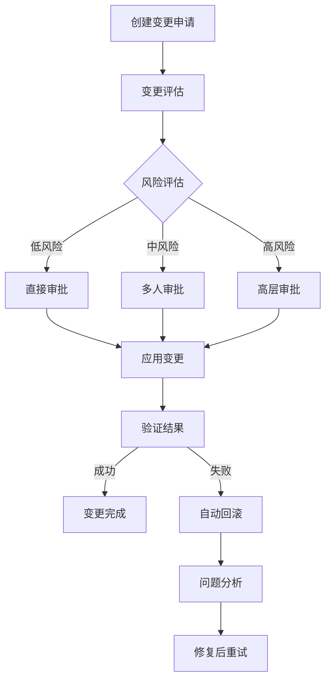
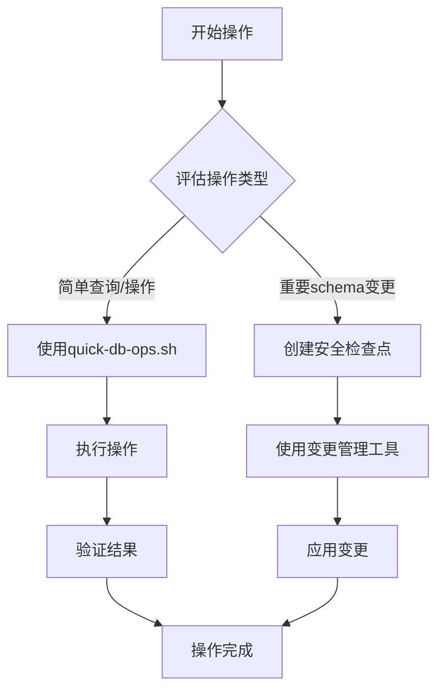
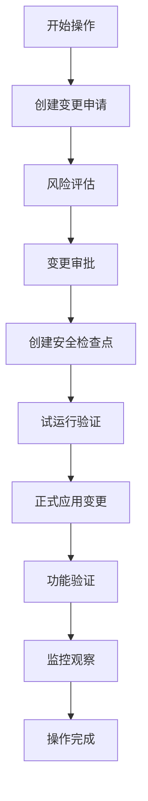

# AdsAI 数据库架构与操作指南

**文档版本**: v4.0
**更新日期**: 2025-10-23
**状态**: ✅ 优化版认证架构 + 企业级操作工具集
**架构特点**: 统一数据存储 (Cloud SQL) + 托管认证 (Supabase Auth) + 微服务Schema自治 (1:1映射) + 快速操作工具 (DML/DDL/变更管理/安全网关) + 增强认证流程优化

---

## ⚡ 关键说明

### 🔴 必读要点

1. **Supabase认证架构**
   - ❌ Supabase Auth不经过Cloud SQL Proxy
   - ✅ Frontend直接通过Supabase SDK连接认证服务
   - ✅ Backend仅验证JWT签名，不连接Supabase数据库
   - ⚠️ Supabase仅用于认证，所有业务数据在Cloud SQL

2. **迁移执行规范**
   - ✅ **必须通过CI/CD自动执行** (GitHub Actions)
   - ❌ **严禁手动执行迁移命令**
   - ✅ 支持自动触发 (push到main)
   - ✅ 支持手动触发 (GitHub Actions界面)
   - ✅ 数据库重置需确认文本 (`RESET DATABASE`)

3. **服务连接架构**
   - 所有Go微服务连接Cloud SQL (adsai_db)
   - 所有业务数据统一存储在Cloud SQL
   - Supabase仅用于认证，Frontend通过SDK访问
   - Backend不连接Supabase数据库，仅验证JWT

---

## 📋 目录

1. [架构概览](#架构概览)
   - 系统架构图
   - 核心设计原则
   - 用户认证流程
2. [核心组件](#核心组件)
3. [数据库设计](#数据库设计)
4. [连接管理](#连接管理)
5. [迁移管理](#迁移管理)
6. [数据库快速操作](#数据库快速操作) ⭐ 新增
   - 快速操作工具集
   - DML/DDL操作指南
   - JSON数据操作
   - 交互式SQL执行器
7. [变更管理系统](#变更管理系统) ⭐ 新增
   - 企业级变更控制
   - 变更生命周期管理
   - 审批流程和版本控制
8. [安全网关](#安全网关) ⭐ 新增
   - 自动备份与检查点
   - 一键回滚机制
   - 操作审计和风险控制
9. [操作工具集成](#操作工具集成) ⭐ 新增
   - 工具选择指南
   - 操作流程规范
   - 团队协作流程
10. [与过时架构对比](#与过时架构对比)
11. [最佳实践](#最佳实践)

---

## 架构概览

### 系统架构图

```
┌─────────────────────────────────────────────────────────────┐
│                 Frontend (Next.js 14)                    │
│           apps/frontend (asia-northeast1)                 │
└──────────┬───────────────────────┬───────────────────────┘
           │                       │
           │ 认证流程               │ 业务数据访问
           ▼                       ▼
┌─────────────────────┐         ┌─────────────────────────┐
│  Supabase Auth      │         │  Cloud Run Services     │
│  (托管认证服务)      │         │  (13个微服务)            │
│                     │         │                         │
│  • Google OAuth     │         │  • billing              │
│  • JWT签发          │◄────────┤  • offer                │
│  • 会话管理         │ JWT验证  │  • siterank             │
│  • 密码重置         │         │  • adscenter            │
│                     │ 智能初始化    │  • useractivity         │
│  auth.users (仅存   │         │  • console              │
│  认证信息)          │         │  • batchopen            │
└─────────────────────┘         │  • 其他服务...           │
                                  └─────────────┬─────────────┘
                                                │
                                                ▼
                                   ┌────────────────────────┐
                                   │  FinalAdapter          │
                                   │  (推荐使用)             │
                                   │                        │
                                   │  • pgxpool连接池        │
                                   │  • 统一数据访问接口      │
                                   │  • 性能监控             │
                                   │  • 错误重试             │
                                   └───────────┬──────────────┘
                                              │
                                              ▼
                                   ┌────────────────────────┐
                                   │  Cloud SQL Proxy       │
                                   │  Unix Socket           │
                                   └───────────┬──────────────┘
                                              │
                                              ▼
                                   ┌────────────────────────┐
                                   │   Cloud SQL            │
                                   │   (统一业务数据存储)     │
                                   │                        │
                                   │ • adsai_db           │
                                   │ • PostgreSQL 17        │
                                   │                        │
                                   │ 8个业务Schema:          │
                                   │ • user (业务用户主域)   │
                                   │ • billing (计费订阅)   │
                                   │ • offer (Offer管理)    │
                                   │ • siterank (网站评估)  │
                                   │ • adscenter (广告账户) │
                                   │ • useractivity (活动)  │
                                   │ • console (系统配置)   │
                                   │ • batchopen (批处理)   │
                                   └────────────────────────┘
```

### 核心设计原则

1. **用户中心化**: 以user_id为核心的数据隔离，无组织层概念
2. **域驱动设计**: 8个独立业务域，schema级别隔离
3. **职责分离**: Supabase专注认证，Cloud SQL专注业务数据
4. **统一存储**: 所有业务数据集中在Cloud SQL，便于管理和查询
5. **标准化工具**: pgxpool连接池 + golang-migrate迁移工具
6. **简化优先**: KISS原则，避免过度设计
7. **用户数据三层架构**: 认证层(Supabase) → 业务用户层(user.users) → 计费层(billing.accounts)

### 数据库适配器架构

#### 🔧 适配器选择策略

**推荐使用**: `FinalAdapter` (pkg/database/final_adapter.go)

**原因**:
1. ✅ **完整实现**: 提供完整的Cloud SQL支持，无类型兼容性问题
2. ✅ **性能优化**: 内置连接池监控和性能指标
3. ✅ **错误处理**: 完善的重试机制和错误恢复
4. ✅ **接口兼容**: 同时支持pgx.*和sql.*接口

**对比UniversalAdapter**:
- ❌ UniversalAdapter在CloudSQL模式下返回错误，违背统一访问原则
- ❌ 需要开发者直接操作pgxpool，增加使用复杂性
- ✅ FinalAdapter解决了这些问题，是当前的最佳选择

#### 使用方法

```go
// ✅ 推荐：使用FinalAdapter
adapter, err := database.GetFinalAdapterForService("billing-service")
if err != nil {
    log.Fatal(err)
}
defer adapter.Close()

// 使用示例
rows, err := adapter.QueryPGX(ctx, "SELECT * FROM billing.accounts WHERE user_id = $1", userID)
if err != nil {
    return fmt.Errorf("failed to query accounts: %w", err)
}
defer rows.Close()

// 事务操作
tx, err := adapter.BeginTx(ctx, nil)
if err != nil {
    return err
}
defer tx.Rollback()
// ... 执行SQL
tx.Commit()
```

#### Gateway Middleware详细架构

**统一入口管道** (services/gateway-middleware/cmd/server/main.go:186-201):

```go
apiRoutes.Use(jwtMiddleware.Handler())        // 1. JWT验证 (JWKS)
apiRoutes.Use(rateLimitMiddleware.Handler())  // 2. 限流
apiRoutes.Use(subscriptionMiddleware.Handler()) // 3. 订阅验证
apiRoutes.Use(permissionMiddleware.Handler())  // 4. 权限检查
apiRoutes.Use(tokenMiddleware.Handler())      // 5. 代币管理
apiRoutes.Use(reverseProxy.ProxyMiddleware())  // 6. 反向代理
```

**JWT验证实现**:
- **JWKS缓存**: 自动缓存Supabase公钥，15分钟刷新
- **算法支持**: RS256 (JWKS) + HS256 (Secret)
- **性能优化**: HTTP客户端连接池，5秒超时
- **安全验证**: Issuer、Audience、过期时间全面验证

### 用户认证流程 (v4.0优化版)

AdsAI采用Supabase托管认证 + Cloud SQL业务数据的分离架构，基于**用户数据三层架构**设计，通过智能初始化和完整性检查确保用户数据的一致性：

**🚀 v4.0优化认证流程 (2025-10-23更新)**:

**用户数据三层架构**:
```
Layer 1: Supabase auth.users (认证层)
  ↓ 权威认证数据源
  • Google OAuth认证
  • JWT Token签发
  • 会话管理
  • 密码重置

Layer 2: Cloud SQL user.users (业务用户层)
  ↓ 业务用户主域
  • 用户基础信息 (email, name, avatar)
  • 用户资料字段 (phone, language, timezone)
  • 用户状态管理 (active, inactive, suspended)
  • 用户偏好设置 (preferences JSONB)

Layer 3: Cloud SQL billing.accounts (计费层)
  ↓ 计费域数据
  • 订阅管理 (subscriptions)
  • 代币余额 (token_balances)
  • 交易记录 (token_transactions)
  • 支付方式 (payment_methods)
```

**数据流向**: Supabase认证 → user.users同步 → billing.accounts关联

### 数据同步机制

**Supabase到Cloud SQL的数据同步策略**:

**🔄 增强型单向同步机制 + 逆向同步支持**:

AdsAI采用**应用层主动同步**模式，通过智能业务数据验证和初始化，确保认证层和业务层数据的一致性：

**主要同步时机**:
1. **新用户注册**: 用户首次通过Google OAuth登录，自动触发三层架构数据创建
2. **登录时完整性检查**: 每次登录时智能检查业务数据状态，自动初始化缺失数据
3. **用户信息更新**: 用户修改个人资料时，触发Cloud SQL → Supabase的逆向同步（可选实现）
4. **用户状态变更**: 用户账户状态变化（激活、停用、删除）时的同步处理

#### 同步流程 (Layer 1 → Layer 2 → Layer 3)

```
┌─────────────────────────────────────────────────────────────────┐
│ 步骤1: Supabase创建认证数据 (Layer 1)                            │
│                                                                 │
│ Google OAuth成功 → Supabase自动创建/更新                         │
│   • auth.users (id, email, created_at)                         │
│   • auth.identities (provider: 'google')                       │
└─────────────────────────────────────────────────────────────────┘
                           ↓
┌─────────────────────────────────────────────────────────────────┐
│ 步骤2: Frontend智能检测并初始化业务数据                          │
│                                                                 │
│ ensureUserBusinessData() 函数执行:                              │
│                                                                 │
│ 1️⃣ GET /api/v1/user/profile - 检查业务数据存在性              │
│   Headers: Authorization: Bearer {JWT}                           │
│   Response: 404 (用户业务数据不存在)                              │
│                                                                 │
│ 2️⃣ POST /api/v1/billing/subscriptions/trial - 自动初始化        │
│   Headers: Authorization: Bearer {JWT}                         │
│   Body: {                                                      │
│     userId: "auth.users.id",                                   │
│     email: "user@example.com",                                 │
│     name: "User Name",                                         │
│     avatarUrl: "https://...",                                  │
│     days: 7,                                                   │
│     source: "self_register"                                    │
│   }                                                            │
│                                                                 │
│ 3️⃣ 智能检查机制:                                              │
│   ✅ 不再依赖user_metadata.new_user                            │
│   ✅ 基于实际业务数据存在性检查                              │
│   ✅ 自动初始化缺失的Layer 2/3数据                          │
└─────────────────────────────────────────────────────────────────┘
                           ↓
┌─────────────────────────────────────────────────────────────────┐
│ 步骤3: Enhanced Trial Subscription Handler创建三层架构数据       │
│                                                                 │
│ Enhanced Trial Subscription Handler处理 (v4.0优化):             │
│   1. 验证JWT，提取user_id (Gateway Middleware)              │
│   2. 检查用户数据完整性 (checkUserIntegrity)                   │
│   3. 创建Layer 2业务用户主数据:                                  │
│      INSERT INTO user.users (                                  │
│        id,           -- 使用Supabase auth.users.id             │
│        email,        -- 从JWT claims提取                        │
│        name,         -- 从请求body提取                          │
│        avatar_url,   -- 从请求body提取                          │
│        status,       -- 'active'                              │
│        created_at    -- 当前时间                                │
│      ) VALUES (...) ON CONFLICT (id) DO UPDATE;                │
└─────────────────────────────────────────────────────────────────┘
                           ↓
┌─────────────────────────────────────────────────────────────────┐
│ 步骤4: 完整事务性三层数据创建 (Layer 2+3)                    │
│                                                                 │
│ executeTransactionalInitialization() 执行 (v4.0优化):          │
│   BEGIN TRANSACTION;                                           │
│                                                                 │
│   4️⃣ 创建Layer 3计费账户数据:                                │
│      INSERT INTO billing.accounts (                            │
│        user_id,      -- 外键引用user.users(id)                  │
│        account_type, -- 'standard'                             │
│        status,       -- 'trial'                                │
│        trial_ends_at, -- NOW() + INTERVAL '7 days'             │
│        created_at                                              │
│      ) VALUES (...) ON CONFLICT (user_id) DO UPDATE;          │
│                                                                 │
│   5️⃣ 创建试用订阅记录:                                        │
│      INSERT INTO billing.subscriptions (                       │
│        user_id,      -- 引用user.users(id)                     │
│        plan_name,    -- 'free'                                 │
│        status,       -- 'trial'                                │
│        trial_start,  -- NOW()                                  │
│        trial_end,    -- NOW() + INTERVAL '7 days'             │
│        source,       -- 从请求body提取                          │
│      ) VALUES (...) ON CONFLICT (user_id, plan_name) DO UPDATE; │
│                                                                 │
│   6️⃣ 初始化代币余额:                                           │
│      INSERT INTO billing.token_balances (                      │
│        user_id,      -- 引用user.users(id)                     │
│        token_type,   -- 'search'                               │
│        balance,      -- 100 (试用期初始代币)                    │
│        available,   -- 100                                      │
│        total_earned, -- 100                                      │
│        total_spent, -- 0                                        │
│      ) VALUES (...) ON CONFLICT (user_id, token_type) DO UPDATE;│
│                                                                 │
│   7️⃣ 记录初始充值交易:                                        │
│      INSERT INTO billing.token_transactions (                  │
│        user_id,                                                │
│        token_type,   -- 'search'                               │
│        amount,       -- 100                                    │
│        balance_before, -- 0                                       │
│        balance_after,  -- 100                                    │
│        transaction_type, -- 'bonus'                                │
│        source,       -- 从请求body提取                          │
│        description   -- '试用期初始代币'                         │
│      ) VALUES (...);                                           │
│                                                                 │
│   COMMIT;                                                    │
└─────────────────────────────────────────────────────────────────┘
```

#### 数据一致性保证

1. **事务保证**: 所有Layer 2和Layer 3的数据写入在单个数据库事务中完成
   ```sql
   BEGIN;
     INSERT INTO user.users (...);
     INSERT INTO billing.accounts (...);
     INSERT INTO billing.subscriptions (...);
     INSERT INTO billing.token_balances (...);
     INSERT INTO billing.token_transactions (...);
   COMMIT;
   ```

2. **幂等性设计**: 使用Supabase auth.users.id作为主键，确保重复请求不会创建重复数据
   ```sql
   ON CONFLICT (id) DO NOTHING;  -- user.users
   ON CONFLICT (user_id) DO NOTHING;  -- billing.accounts
   ```

3. **外键约束**: 确保数据引用完整性
   ```sql
   billing.accounts.user_id REFERENCES user.users(id) ON DELETE CASCADE
   billing.subscriptions.user_id REFERENCES user.users(id) ON DELETE CASCADE
   ```

4. **错误处理**: 如果Layer 2或Layer 3创建失败，事务回滚，Frontend重试

#### 更新同步流程

用户信息更新时的同步流程：

```
用户更新个人资料 (Frontend)
  ↓
PUT /api/v1/user/profile
  ↓
User Service处理:
  1. 验证JWT，提取user_id
  2. 更新user.users表:
     UPDATE user.users
     SET email = $1, name = $2, avatar_url = $3, updated_at = NOW()
     WHERE id = $4;
  3. (可选) 如果email变更，同步到Supabase:
     Supabase Admin API → Update auth.users.email
```

**重要说明**:
- ❌ **不存在自动同步**: Supabase和Cloud SQL之间没有数据库级触发器或自动同步
- ✅ **应用层主动同步**: 所有数据同步都由应用层（Billing Service）主动完成
- ✅ **单向数据流**: Supabase auth.users → user.users → billing.accounts（单向依赖）
- ✅ **认证优先**: Supabase auth.users是唯一的认证数据源，user.users仅用于业务逻辑

**认证和初始化流程**（v4.0优化版）:

**🎯 核心优化点**：
- ❌ **移除不可靠依赖**: 不再依赖`user_metadata.new_user`字段
- ✅ **智能业务数据检查**: 登录时自动检查Layer 2/3数据完整性
- ✅ **自动初始化流程**: 检测到缺失数据时自动触发完整的三层创建
- ✅ **增强错误处理**: 用户友好的错误提示和重试机制

**🚀 v4.0优化流程**:
```
Frontend用户登录
  ↓
1️⃣ Supabase OAuth认证 (Layer 1)
  ↓
2️⃣ Session验证 + JWT获取
  ↓
3️⃣ 智能业务数据检查 (GET /api/v1/user/profile)
  ↓
4️⃣ 自动初始化缺失数据 (POST /api/v1/billing/subscriptions/trial)
  ↓
5️⃣ Gateway JWT验证 + 三层架构数据创建
  ↓
6️⃣ 用户成功进入Dashboard
```

**详细流程图**:
```
步骤1: OAuth认证
┌────────────────────────────────────────────────────────────┐
│ 用户点击"Google登录"                                         │
│   ↓                                                        │
│ Frontend → Supabase SDK → Google OAuth                    │
│   ↓                                                        │
│ Google认证成功 → 返回Authorization Code                     │
└────────────────────────────────────────────────────────────┘
                         ↓
步骤2: Session创建
┌────────────────────────────────────────────────────────────┐
│ Frontend exchangeCodeForSession()                          │
│   ↓                                                        │
│ Supabase Auth自动创建/更新 auth.users                       │
│   ↓                                                        │
│ 返回: Session + JWT Token + User信息                       │
└────────────────────────────────────────────────────────────┘
                         ↓
步骤3: Frontend智能检测并初始化业务数据 (新用户)
┌────────────────────────────────────────────────────────────┐
│ Frontend验证用户Session并检查业务数据状态                      │
│   ↓                                                        │
│ ensureUserBusinessData() 函数执行:                          │
│   1. GET /api/v1/user/profile 检查业务数据存在性          │
│   2. 如果404，自动触发初始化流程                           │
│   3. POST /api/v1/billing/subscriptions/trial              │
│ Headers: Authorization: Bearer {JWT}                       │
│ Body: {                                                    │
│   userId: "uuid-from-supabase",                           │
│   email: "user@example.com",                              │
│   name: "User Name",                                      │
│   avatarUrl: "https://lh3.googleusercontent.com/...",    │
│   days: 7,                                                │
│   source: 'self_register'                                 │
│ }                                                         │
└────────────────────────────────────────────────────────────┘
                         ↓
步骤4: Gateway JWT验证
┌────────────────────────────────────────────────────────────┐
│ Gateway Middleware                                         │
│   ↓                                                        │
│ 提取JWT Token                                              │
│   ↓                                                        │
│ pkg/auth/supabase.go 验证签名                               │
│   ↓                                                        │
│ 通过JWKS验证 (不查询Supabase数据库)                         │
│   ↓                                                        │
│ 提取user_id，注入到请求Context                              │
└────────────────────────────────────────────────────────────┘
                         ↓
步骤5: Billing Service创建三层架构数据（事务保证）
┌────────────────────────────────────────────────────────────┐
│ Billing Service (/api/v1/billing/subscriptions/trial)     │
│   ↓                                                        │
│ BEGIN TRANSACTION;                                         │
│                                                            │
│ 1️⃣ Layer 2: 创建业务用户主数据                             │
│   INSERT INTO user.users (                                 │
│     id,          -- 使用Supabase auth.users.id            │
│     email,       -- 从请求body提取                         │
│     name,        -- 从请求body提取                         │
│     avatar_url,  -- 从请求body提取                         │
│     status,      -- 'active'                              │
│     created_at   -- NOW()                                 │
│   ) VALUES (...) ON CONFLICT (id) DO NOTHING;             │
│                                                            │
│ 2️⃣ Layer 3: 创建计费账户数据                               │
│   INSERT INTO billing.accounts (                           │
│     user_id,     -- 引用user.users(id)                    │
│     account_type, -- 'standard'                           │
│     status,      -- 'trial'                               │
│     balance_cents, -- 0                                   │
│     created_at                                            │
│   ) VALUES (...);                                         │
│                                                            │
│ 3️⃣ Layer 3: 创建试用订阅                                   │
│   INSERT INTO billing.subscriptions (                      │
│     user_id,     -- 引用user.users(id)                    │
│     plan_name,   -- 'free'                                │
│     status,      -- 'trial'                               │
│     current_period_start, -- NOW()                        │
│     current_period_end,   -- NOW() + INTERVAL '7 days'   │
│     trial_end,   -- NOW() + INTERVAL '7 days'            │
│     created_at                                            │
│   ) VALUES (...);                                         │
│                                                            │
│ 4️⃣ Layer 3: 初始化代币余额                                 │
│   INSERT INTO billing.token_balances (                     │
│     user_id,     -- 引用user.users(id)                    │
│     token_type,  -- 'search'                              │
│     balance      -- 100 (试用期初始代币)                   │
│   ) VALUES (...);                                         │
│                                                            │
│ 5️⃣ Layer 3: 记录初始充值交易                               │
│   INSERT INTO billing.token_transactions (                 │
│     user_id,                                              │
│     token_type,  -- 'search'                              │
│     amount,      -- 100                                   │
│     balance_before, -- 0                                  │
│     balance_after,  -- 100                                │
│     transaction_type, -- 'bonus'                          │
│     source,      -- 'trial_registration'                  │
│     description  -- '试用期初始代币'                        │
│   ) VALUES (...);                                         │
│                                                            │
│ COMMIT;                                                    │
│   ↓                                                        │
│ 返回成功响应 (含subscription_id, token_balance)             │
└────────────────────────────────────────────────────────────┘
                         ↓
步骤6: 异步初始化其他服务
┌────────────────────────────────────────────────────────────┐
│ Onboarding Handler (异步)                                  │
│   ↓                                                        │
│ 并行调用:                                                   │
│   • Offer Service → initializeDemoOffers()                │
│   • User Activity → sendWelcomeNotification()             │
│   • Checkin Service → initializeCheckin()                 │
│   • Referral Service → initializeReferral()               │
└────────────────────────────────────────────────────────────┘
                         ↓
步骤7: 用户登录完成
┌────────────────────────────────────────────────────────────┐
│ Frontend接收成功响应                                         │
│   ↓                                                        │
│ 重定向到Dashboard                                           │
│   ↓                                                        │
│ 后续请求携带JWT，Gateway自动验证身份                         │
└────────────────────────────────────────────────────────────┘
```

**关键特性**:

1. **认证与业务分离**
   - **Layer 1 (Supabase)**: 仅处理OAuth、JWT、会话 (auth.users表)
   - **Layer 2 (Cloud SQL)**: 业务用户主数据 (user.users表)
   - **Layer 3 (Cloud SQL)**: 计费和业务域数据 (billing.*, offer.*等)
   - **Gateway**: 无状态JWT验证，不查询数据库

2. **三层数据创建顺序**
   - **Step 1**: Supabase自动创建auth.users (Layer 1)
   - **Step 2**: Billing Service创建user.users (Layer 2)
   - **Step 3**: Billing Service创建billing.accounts等 (Layer 3)
   - **事务保证**: Step 2和Step 3在单个事务中完成

3. **JWT验证流程**
   - Gateway从请求Header提取Bearer Token
   - 通过Supabase JWKS端点验证签名 (公钥验证)
   - 无需连接Supabase数据库，性能高
   - 验证成功后提取user_id注入Context

4. **智能数据一致性保证** (v4.0新增)
   - **业务数据完整性检查**: 登录时智能检查Layer 2/3数据存在性，自动初始化缺失数据
   - **应用层主动同步**: Billing Service负责Layer 1 → Layer 2 → Layer 3的数据同步
   - **事务保证原子性**: Layer 2和Layer 3在单个事务中创建，确保数据一致性
   - **幂等性设计**: 使用Supabase auth.users.id作为主键，ON CONFLICT DO UPDATE/NOTHING
   - **外键约束**: billing.accounts.user_id REFERENCES user.users(id) ON DELETE CASCADE
   - **增强错误处理**: 完整的错误边界组件和用户友好的错误提示
   - **异步初始化**: 其他服务（Offer, Activity等）异步初始化，允许最终一致性

5. **安全性**
   - Frontend使用Supabase Anon Key (公开安全)
   - Backend验证JWT签名，防止伪造
   - Row Level Security在API层实现
   - 用户数据通过user_id隔离
   - 三层架构确保数据访问权限清晰

6. **用户体验优化** (v4.0新增)
   - **移除不可靠依赖**: 不再依赖user_metadata.new_user字段
   - **智能初始化**: 自动检测和初始化缺失的业务数据
   - **进度指示**: 4步认证流程的清晰进度展示
   - **错误处理**: 用户友好的错误提示和重试机制
   - **国际化支持**: 完整的中英文错误信息翻译

---

## 核心组件

### 1. Cloud SQL (PostgreSQL 17)

**实例信息**:
- **实例ID**: `your-gcp-project-id:asia-northeast1:adsai`
- **区域**: asia-northeast1
- **版本**: PostgreSQL 17
- **数据库**: adsai_db

**连接方式**:
- ✅ **Cloud SQL Proxy + Unix Socket** (当前)
- ❌ ~~VPC Connector~~ (已废弃)

**连接字符串格式**:
```bash
# Unix Socket模式 (当前使用)
DATABASE_URL="postgresql://user:password@/adsai_db?host=/cloudsql/your-gcp-project-id:asia-northeast1:adsai"
```

### 2. Supabase (认证服务)

**用途**: 用户认证、JWT管理、OAuth集成

**托管功能**:
- ✅ Google OAuth认证流程
- ✅ JWT Token生成和验证
- ✅ 用户会话管理
- ✅ 密码重置、邮件验证等认证功能

**数据存储**:
- `auth.users` - 用户认证信息 (由Supabase自动管理)
- **仅认证数据** - 所有业务数据存储在Cloud SQL

**Frontend集成**:
```bash
# Frontend环境变量
NEXT_PUBLIC_SUPABASE_URL="https://[project-ref].supabase.co"
NEXT_PUBLIC_SUPABASE_ANON_KEY="[anon-key]"
```

**Backend集成**:
- Gateway Middleware使用 `pkg/auth/supabase.go` 验证JWT
- 通过JWKS端点验证Token签名
- 无需直接连接Supabase数据库

**重要说明**:
- ✅ Supabase仅用于认证，不存储业务数据
- ✅ Frontend通过Supabase SDK处理认证流程
- ✅ Backend通过JWT验证，无需查询Supabase数据库
- ✅ 所有业务数据(包括订阅、用户信息)存储在Cloud SQL

### 3. UniversalAdapter (统一数据库适配器)

**位置**: `pkg/database/adapter.go`

**核心功能**:
- 统一数据库访问接口
- Cloud SQL连接池管理 (pgxpool)
- 自动健康检查和监控
- 连接复用和生命周期管理

**连接配置**:
- 所有Go微服务连接Cloud SQL (adsai_db)
- 通过环境变量`DATABASE_URL`配置连接字符串
- 使用Cloud SQL Proxy + Unix Socket连接

**重要说明**:
- ✅ 所有业务数据统一存储在Cloud SQL
- ✅ 所有Go微服务使用UniversalAdapter连接
- ✅ Supabase仅用于认证，不存储业务数据
- ✅ Frontend通过API访问业务数据，不直接查询数据库

**服务连接模式**:

```yaml
所有Go微服务 - 连接Cloud SQL (adsai_db):
  - billing-service       # 用户、订阅、代币管理
  - offer-service        # Offer管理
  - siterank-service     # 网站评估
  - adscenter-service    # 广告账户
  - useractivity-service # 用户活动
  - console-service      # 控制台
  - batchopen-service    # 批处理
  - recommendations-service # 推荐
  - projector            # 事件投影

认证架构:
  - Supabase Auth (托管服务) - OAuth、JWT、会话管理
  - Frontend → Supabase SDK → 认证流程
  - Backend → pkg/auth/supabase.go → JWT验证
  - 业务数据访问: Frontend → API Gateway → Cloud SQL
```

**标准服务配置** (所有Go微服务):

```yaml
# Cloud Run服务配置
env:
  - name: DATABASE_URL
    valueFrom:
      secretKeyRef:
        name: DATABASE_URL
        key: latest

annotations:
  run.googleapis.com/cloudsql-instances: "your-gcp-project-id:asia-northeast1:adsai"
```

**Frontend配置** (Next.js):

```yaml
# Frontend仅配置Supabase认证，业务数据通过API访问
env:
  - name: NEXT_PUBLIC_SUPABASE_URL
    value: "https://[project-ref].supabase.co"
  - name: NEXT_PUBLIC_SUPABASE_ANON_KEY
    value: "[anon-key]"
```

**使用示例**:
```go
// 创建适配器 (自动连接Cloud SQL)
adapter, err := database.GetAdapterForService("billing-service")

// 查询操作
rows, err := adapter.Query(ctx, "SELECT * FROM billing.users WHERE user_id = $1", userID)

// 执行操作
result, err := adapter.Exec(ctx, "INSERT INTO billing.subscriptions (...) VALUES (...)")

// 事务操作
tx, err := adapter.BeginTx(ctx, nil)
```

### 4. pgxpool (连接池管理)

**特性**:
- 自动连接池管理
- 健康检查 (每分钟)
- 连接复用和生命周期管理
- 性能优化的PostgreSQL驱动

**配置参数**:
```go
// 当前配置
config.MaxConns = 20              // 最大连接数
config.MinConns = 5               // 最小连接数 (MaxConns / 4)
config.MaxConnLifetime = 1 hour   // 连接最大生命周期
config.MaxConnIdleTime = 30 min   // 空闲连接超时
config.HealthCheckPeriod = 1 min  // 健康检查频率

// 生产环境推荐配置 (高负载场景)
config.MaxConns = 50              // 更高的并发处理能力
config.MinConns = 10              // 保持更多热连接
config.MaxConnLifetime = 1 hour
config.MaxConnIdleTime = 30 min
config.HealthCheckPeriod = 1 min
```

---

## 数据库设计

### Schema架构 (8个业务域)

**架构原则**: 每个微服务独立管理其对应的Schema (1:1映射)

**服务-Schema映射关系**:
```
服务名称          →  Schema名称       →  迁移文件位置
────────────────────────────────────────────────────────────
user             →  user            →  services/user/migrations/
billing          →  billing         →  services/billing/migrations/
useractivity     →  useractivity    →  services/useractivity/migrations/
offer            →  offer           →  services/offer/migrations/
siterank         →  siterank        →  services/siterank/migrations/
console          →  console         →  services/console/migrations/
adscenter        →  adscenter       →  services/adscenter/migrations/
batchopen        →  batchopen       →  services/batchopen/migrations/
```

**设计优势**:
1. **服务自治**: 每个服务完全控制其数据库schema演进
2. **独立部署**: 服务可以独立进行数据库迁移和升级
3. **清晰边界**: 域边界清晰，避免跨域数据污染
4. **团队协作**: 不同团队可并行开发，无迁移冲突
5. **风险隔离**: 单个服务的schema变更不影响其他服务
6. **三层架构**: user → billing → 其他业务域，清晰的数据依赖关系

#### 0. user - 业务用户主域 (用户数据三层架构 Layer 2)
**核心表**: 1个
- `users` - 业务用户主表 (Layer 2: 业务用户层)
  - 基础信息: id, email, name, avatar_url, phone
  - 状态管理: status, email_verified, phone_verified
  - 个性化: language, timezone, preferences (JSONB)
  - 扩展字段: metadata (JSONB)

**职责**: 业务用户主域，所有业务数据的用户引用基础
**依赖关系**: 被billing.accounts, offer.offers等业务表引用
**迁移优先级**: 最高 (必须第一个执行，其他服务依赖user.users)

#### 1. billing - 计费订阅域 (用户数据三层架构 Layer 3)
**核心表**: 8个
- `accounts` - 计费账户 (Layer 3: 计费层，外键引用user.users)
- `subscriptions` - 订阅管理
- `pricing_plans` - 价格计划
- `invoices` - 发票记录
- `token_balances` - 代币余额
- `token_transactions` - 代币交易记录
- `usage_records` - 使用记录
- `refunds` - 退款记录

**职责**: 计费域管理、订阅管理、代币系统、支付处理
**依赖关系**: billing.accounts引用user.users(id)

#### 2. offer - Offer管理域
**核心表**: 5个
- `offers` - Offer主表
- `offer_metrics` - 性能数据
- `offer_status_history` - 状态历史
- `offer_preferences` - 偏好设置
- `offer_dead_letter_queue` - 死信队列

**职责**: Offer创建、管理、性能追踪

#### 3. siterank - 网站评估域
**核心表**: 5个
- `analyses` - 评估分析
- `website_info` - 网站信息
- `evaluation_aggregations` - 评估汇总
- `website_info_cache` - 网站信息缓存
- `domain_cache` - 域名缓存

**职责**: 网站分析、评估、域名缓存管理

#### 4. adscenter - 广告中心域
**核心表**: 6个
- `user_ads_connections` - Google Ads账户连接
- `idempotency_keys` - 幂等性键管理
- `bulk_action_operations` - 批量操作记录
- `bulk_action_audits` - 批量操作审计
- `mcc_links` - MCC账户链接
- `audit_events` - 审计事件

**职责**: Google Ads账户管理、批量操作、审计追踪

#### 5. useractivity - 用户活动域
**核心表**: 6个
- `checkins` - 签到记录
- `user_checkin_stats` - 签到统计
- `referrals` - 推荐记录
- `referral_records` - 推荐详细记录
- `notifications` - 通知记录
- `user_notification_state` - 用户通知状态

**职责**: 用户活动追踪、签到统计、推荐系统、通知管理

#### 6. console - Console管理域
**核心表**: 14个
- `system_metadata` - 系统元数据
- `domain_mappings` - 域映射
- `audit_log` - 审计日志
- `token_consumption_rules` - 代币消耗规则
- `admin_recovery_codes` - 管理员恢复码
- `admin_audit_log` - 管理员审计日志
- `export_history` - 导出历史
- `feature_flags` - 功能开关
- `feature_flag_history` - 功能开关历史
- `notification_templates` - 通知模板
- `notification_broadcasts` - 通知广播
- `nps_feedback` - NPS反馈
- `pricing_config` - 价格配置
- `api_usage_stats` - API使用统计

**只读视图**: 4个（跨域查询优化）
- `console_subscriptions_with_users` - 订阅与用户信息
- `console_dashboard_summary` - Dashboard统计汇总
- `console_user_overview` - 用户综合视图
- `critical_admin_actions` - 关键管理员操作视图

**职责**: Console管理后台、系统配置、审计日志、功能开关、通知管理、跨域数据聚合

#### 7. batchopen - 批处理任务域
**核心表**: 7个
- `tasks` - 任务主表
- `task_executions` - 任务执行记录
- `task_templates` - 任务模板
- `task_queue` - 任务队列
- `resource_pools` - 资源池
- `execution_logs` - 执行日志
- `task_dependencies` - 任务依赖关系

**职责**: 批量任务调度、资源池管理、任务执行追踪

### 性能优化设计

#### 索引策略 (50+个优化索引)

**单列索引**:
- 主键索引 (自动创建)
- 外键索引 (user_id, offer_id等)
- 状态字段索引 (status, type等)

**复合索引** (主要查询优化):
```sql
-- 订阅查询优化
idx_subscriptions_user_status (user_id, status)

-- 用户创建时间排序
idx_users_status_created (status, created_at DESC)

-- 代币交易查询
idx_token_transactions_user_type_date (user_id, type, created_at DESC)

-- 签到记录查询
idx_checkins_user_date (user_id, checkin_date DESC)
```

**条件索引** (特定场景优化):
```sql
-- 仅索引激活状态
WHERE status = 'active'

-- Demo账户快速查询
WHERE is_demo = true

-- 有效评估分数
WHERE score IS NOT NULL
```

#### 跨域查询视图 (Console Schema)

**console.console_subscriptions_with_users** - 订阅与用户综合视图:
```sql
-- 整合billing.subscriptions和billing.users数据
-- 用于Console管理后台的订阅管理页面
SELECT * FROM console.console_subscriptions_with_users WHERE user_id = $1;
```

**console.console_dashboard_summary** - Dashboard统计汇总:
```sql
-- 预聚合的Dashboard统计数据
-- 包括用户数、订阅数、代币总量等关键指标
SELECT * FROM console.console_dashboard_summary;
```

**console.console_user_overview** - 用户综合视图:
```sql
-- 整合用户、订阅、代币余额数据
-- 用于Console管理后台的用户管理页面
SELECT * FROM console.console_user_overview WHERE user_id = $1;
```

**console.critical_admin_actions** - 关键管理员操作视图:
```sql
-- 筛选高风险管理员操作
-- 包括删除用户、修改角色、删除配置等敏感操作
SELECT * FROM console.critical_admin_actions ORDER BY created_at DESC;
```

**说明**: 这些视图仅用于Console管理后台的只读查询，遵循以下原则：
- ✅ 只读访问，不修改数据
- ✅ 性能优化的跨域查询
- ✅ 明确的依赖关系文档
- ✅ Console通过服务API修改数据，不直接写入

#### 自动化触发器 (9个)

所有核心表的`updated_at`字段自动维护:
```sql
-- 自动更新时间戳
CREATE TRIGGER update_[table]_updated_at
BEFORE UPDATE ON [schema].[table]
FOR EACH ROW EXECUTE FUNCTION update_updated_at_column();
```

---

## 连接管理

### Cloud SQL Proxy优势

✅ **高性能**:
- **连接延迟**: ~5ms (低延迟)
- **吞吐量 (QPS)**: 200-500+
- **平均响应时间**: 10-20ms
- **P95延迟**: 30-80ms
- **连接池**: pgxpool自动复用和管理

✅ **零成本**:
- 无需VPC Connector费用 ($0.03/小时)
- 无需VPC网络配置和维护
- 自动优化连接池管理

✅ **无限扩展**:
- 无连接数限制
- 支持自动扩展和负载均衡
- pgxpool智能连接池管理

✅ **安全加密**:
- 自动SSL/TLS加密
- IAM自动认证
- 无需管理密码
- 符合安全合规要求

### 连接配置示例

#### Go服务配置
```go
// services/*/main.go
adapter, err := database.GetAdapterForService("billing-service")
if err != nil {
    log.Fatal(err)
}
defer adapter.Close()

// 使用适配器
rows, err := adapter.Query(ctx, query, args...)
```

#### Cloud Run部署配置
```yaml
# cloudbuild.yaml
annotations:
  run.googleapis.com/cloudsql-instances: "your-gcp-project-id:asia-northeast1:adsai"

env:
  - name: DB_CONNECTION_MODE
    value: "cloudsql"
  - name: DATABASE_URL
    valueFrom:
      secretKeyRef:
        name: DATABASE_URL
        key: latest
```

---

## 迁移管理

### golang-migrate标准工具

**迁移文件位置**: `services/*/migrations/`

**文件命名规范**:
```
000001_initial_schema.up.sql
000001_initial_schema.down.sql
000002_add_user_sync_fields.up.sql
000002_add_user_sync_fields.down.sql
000003_create_simplified_schema.up.sql
000003_create_simplified_schema.down.sql
```

### 执行迁移 (通过CI/CD自动化)

**⚠️ 重要原则**:
- ✅ **所有迁移必须通过CI/CD自动执行**
- ❌ **禁止手动执行迁移操作**
- ✅ 通过GitHub Actions触发，确保可追溯和可回滚

#### 自动触发 (推荐)

**触发条件**:
- Push到`main`分支
- 修改了`services/*/migrations/**`文件

**执行流程**:
1. GitHub Actions检测到迁移文件变更
2. 自动构建db-migrator镜像
3. 并行为所有服务执行迁移 (billing, useractivity, offer, siterank, console, adscenter)
4. 生成迁移报告

**工作流文件**: `.github/workflows/database-migration-cloudrun.yml`

#### 手动触发 (受控环境)

**使用场景**:
- Preview环境测试
- 数据库重置 (需管理员权限)
- 生产环境部署 (需审批)

**触发方式**:
```bash
# 通过GitHub Actions手动触发
# 1. 访问: https://github.com/linming7277/adsai/actions/workflows/database-migration-cloudrun.yml
# 2. 点击 "Run workflow"
# 3. 选择环境: preview / production
# 4. (可选) 勾选 reset_database 并输入确认文本 "RESET DATABASE"
```

**执行流程**:
```yaml
阶段1: 安全检查
  - 验证确认文本 (重置模式)
  - 显示警告信息

阶段2: 构建镜像
  - 构建db-migrator镜像
  - 推送到Artifact Registry

阶段3: 重置数据库 (可选)
  - 删除所有业务schema
  - 重置public schema
  - 清理迁移记录

阶段4: 执行迁移
  - 为每个服务创建Cloud Run Job
  - 并行/顺序执行迁移 (重置模式下顺序执行)
  - 采集执行日志

阶段5: 验证
  - 验证迁移版本
  - 生成迁移报告
  - 上传artifact
```

#### 数据库重置 (危险操作)

**⚠️ 警告**: 此操作将删除所有数据，仅用于开发/测试环境

**安全机制**:
1. 需要输入确认文本: `RESET DATABASE`
2. 需要选择目标环境
3. 自动记录操作人和时间
4. 完整操作日志

**执行命令**:
```bash
# 通过GitHub Actions手动触发
# Environment: preview (建议) / production (谨慎)
# Reset database: ✓
# Confirmation text: RESET DATABASE
```

### CI/CD工作流详解

**工作流文件**: `.github/workflows/database-migration-cloudrun.yml`

**核心特性**:
- ✅ 多服务并行迁移 (user, billing, useractivity, offer, siterank, console, adscenter, batchopen)
- ✅ 安全检查机制 (重置模式需确认)
- ✅ Cloud Run Job执行 (内网访问Cloud SQL)
- ✅ 完整日志采集
- ✅ 迁移报告生成
- ✅ 依赖顺序控制 (user服务必须第一个执行)

**执行环境**:
```yaml
环境变量:
  PROJECT_ID: your-gcp-project-id
  REGION: asia-northeast1
  CLOUDSQL_INSTANCE: adsai
  TARGET_ENV: preview / production

Cloud Run Job配置:
  - 镜像: asia-northeast1-docker.pkg.dev/.../db-migrator
  - 超时: 10分钟
  - 重试: 0次
  - Cloud SQL连接: 自动挂载Unix Socket
```

**服务迁移矩阵**:
```yaml
services:
  - user          # 用户主域迁移 (user schema) - ⭐ 必须第一个执行
  - billing       # 计费域迁移 (billing schema)
  - useractivity  # 用户活动域迁移 (useractivity schema)
  - offer         # Offer域迁移 (offer schema)
  - siterank      # 网站评估域迁移 (siterank schema)
  - console       # Console管理域迁移 (console schema)
  - adscenter     # 广告域迁移 (adscenter schema)
  - batchopen     # 批处理域迁移 (batchopen schema)

并行策略:
  - 正常模式: 最多7个并行 (user优先，其他并行)
  - 重置模式: 顺序执行 (max-parallel: 1)

Schema管理原则:
  - 每个服务独立管理其对应的schema
  - 一一对应关系，确保微服务自治
  - user服务作为基础依赖，必须最先执行
```

**安全机制**:
```yaml
重置数据库保护:
  - 需要workflow_dispatch手动触发
  - 需要reset_database=true
  - 需要输入确认文本"RESET DATABASE"
  - 显示警告信息
  - 记录操作人和时间

环境隔离:
  - preview环境: 可重置
  - production环境: 需额外审批
```

### 迁移最佳实践

详见 → [DATABASE_MIGRATION_BEST_PRACTICES.md](./DATABASE_MIGRATION_BEST_PRACTICES.md)

核心要点:
- ✅ 迁移文件必须幂等 (`IF NOT EXISTS`, `CREATE OR REPLACE`)
- ✅ 每个`.up.sql`必须有对应的`.down.sql`
- ✅ 使用事务确保原子性
- ✅ **必须通过CI/CD执行，禁止手动执行**
- ✅ 清理旧迁移记录避免版本冲突
- ✅ 提交前在本地测试迁移SQL语法
- ✅ 重要迁移需要code review

---

## 🚀 数据库快速操作

### 快速操作工具集概述

AdsAI提供了一套完整的数据库快速操作工具，支持在本地开发环境中快速执行DML/DDL操作，大幅提升开发效率。

**核心工具**:
- `quick-db-ops.sh` - 快速DML/DDL操作工具
- `db-change-manager.sh` - 企业级变更管理系统
- `db-safety-net-simple.sh` - 安全网关和备份系统

**快速操作位置**: `scripts/db/`

### 🔍 快速数据查询

#### 基础查询操作
```bash
# 标准表格格式查询
./scripts/db/quick-db-ops.sh query "SELECT COUNT(*) FROM user.users;"

# JSON格式输出 (便于脚本处理)
./scripts/db/quick-db-ops.sh query "SELECT id, name FROM user.users LIMIT 5;" json

# CSV格式输出 (便于Excel处理)
./scripts/db/quick-db-ops.sh query "SELECT * FROM billing.accounts;" csv
```

#### 表结构和索引查询
```bash
# 显示指定表结构
./scripts/db/quick-db-ops.sh structure users user
./scripts/db/quick-db-ops.sh structure accounts billing

# 显示指定表的所有索引
./scripts/db/quick-db-ops.sh indexes users user
./scripts/db/quick-db-ops.sh indexes  # 显示所有表的索引
```

#### 交互式SQL执行器
```bash
# 启动交互式SQL执行器
./scripts/db/quick-db-ops.sh interactive

# 在交互模式中可以执行任意SQL命令
# 支持自动补全、历史记录等高级功能
# 输入 \q 退出，\h 查看帮助
```

### 🔧 快速DML操作

#### JSON格式数据操作
**单条记录操作**:
```bash
# 插入用户记录
./scripts/db/quick-db-ops.sh dml users INSERT '{
  "name": "测试用户",
  "email": "test@example.com",
  "status": "active"
}'

# 更新用户记录 (需要WHERE条件)
./scripts/db/quick-db-ops.sh dml users UPDATE '{
  "name": "新名称",
  "status": "verified"
}' "id = 'user-uuid-here'"

# 删除用户记录 (需要WHERE条件)
./scripts/db/db-safety-net-simple.sh dml users DELETE "status = 'inactive'"
```

**批量数据操作**:
```bash
# 批量插入用户
./scripts/db/quick-db-ops.sh dml users INSERT '[
  {"name": "用户1", "email": "user1@example.com", "status": "active"},
  {"name": "用户2", "email": "user2@example.com", "status": "pending"},
  {"name": "用户3", "email": "user3@example.com", "status": "verified"}
]'

# 批量更新记录
./scripts/db/quick-db-ops.sh dml users UPDATE '{"status": "verified"}' "email_verified = true"
./scripts/db/quick-db-ops.sh dml users UPDATE '{"last_sign_in_at": "2025-10-23T10:00:00Z"}' "created_at > '2025-10-20'"
```

#### 事务保护和错误处理
- **自动事务保护**: 所有DML操作都在事务中执行
- **错误回滚**: 操作失败时自动回滚到操作前状态
- **操作日志**: 详细记录所有操作和执行结果

### 🏗️ 快速DDL操作

#### 创建数据库对象
```bash
# 创建新表
./scripts/db/quick-db-ops.sh ddl CREATE TABLE test_table "
  id SERIAL PRIMARY KEY,
  name VARCHAR(100) NOT NULL,
  email VARCHAR(255) UNIQUE,
  status VARCHAR(50) DEFAULT 'active',
  created_at TIMESTAMP DEFAULT NOW()
"

# 创建索引
./scripts/db/quick-db-ops.sh ddl CREATE INDEX idx_user_email ON user.users(email)
./scripts/db/quick-db-ops.sh ddl CREATE INDEX idx_billing_status ON billing.accounts(status, created_at)

# 创建视图
./scripts/db/quick-db-ops.sh ddl CREATE VIEW active_users AS
  "SELECT * FROM user.users WHERE status = 'active'"
```

#### 修改数据库对象
```bash
# 添加列
./scripts/db/quick-db-ops.sh ddl ALTER TABLE users "ADD COLUMN test_col VARCHAR(100)"
./scripts/db/quick-db-ops.sh ddl ALTER TABLE users "ADD COLUMN metadata JSONB DEFAULT '{}'"

# 修改列类型
./scripts/db/quick-db-ops.sh ddl ALTER TABLE users "ALTER COLUMN test_col TYPE VARCHAR(200)"

# 添加约束
./scripts/db/quick-db-ops.sh ddl ALTER TABLE users "ADD CONSTRAINT users_status_check CHECK (status IN ('active', 'inactive', 'suspended'))"

# 重命名列
./scripts/db/quick-db-ops.sh ddl ALTER TABLE users "RENAME COLUMN test_col TO feature_col"
```

#### 删除数据库对象 (需要确认)
```bash
# 删除表 (需要输入'DROP'确认)
./scripts/db/quick-db-ops.sh ddl DROP TABLE test_table

# 删除索引
./scripts/db/quick-db-ops.sh ddl DROP INDEX idx_user_email

# 删除视图
./scripts/db/quick-db-ops.sh ddl DROP VIEW active_users

# 删除约束
./scripts/db/quick-db-ops.sh ddl ALTER TABLE users "DROP CONSTRAINT users_status_check"
```

### 📁 文件和批量操作

#### SQL文件执行
```bash
# 执行单个SQL文件
./scripts/db/quick-db-ops.sh file ./scripts/temp_fix.sql

# 执行多个SQL文件
./scripts/db/quick-db-ops.sh file ./scripts/schema_updates/001_add_index.sql
./scripts/db/quick-db-ops.sh file ./scripts/schema_updates/002_add_column.sql
```

#### 批量数据处理
```bash
# 批量执行SQL命令 (100条记录一批)
./scripts/db/quick-db-ops.sh batch ./scripts/batch_updates.txt 100

# 批量文件处理 (自动检测文件分隔符)
./scripts/db/quick-db-ops.sh batch ./scripts/large_dataset.txt
```

### 🔧 高级功能

#### 自定义查询格式
```bash
# 表格格式 (默认)
./scripts/db/quick-db-ops.sh query "SELECT * FROM user.users LIMIT 10;"

# JSON格式 (结构化数据)
./scripts/db/quick-db-ops.sh query "SELECT id, name FROM user.users;" json

# CSV格式 (便于数据分析)
./scripts/db/quick-db-ops.sh query "SELECT * FROM billing.accounts;" csv
```

#### 条件查询和过滤
```bash
# 复杂查询示例
./scripts/db/quick-db-ops.sh query "
  SELECT
    u.name,
    COUNT(o.id) as offer_count,
    MAX(o.created_at) as last_offer_time
  FROM user.users u
  LEFT JOIN offer.offers o ON u.id = o.user_id
  WHERE u.status = 'active'
  GROUP BY u.id, u.name
  HAVING COUNT(o.id) > 0
  ORDER BY last_offer_time DESC
  LIMIT 10
" json
```

### 📊 操作示例集

#### 开发常用操作
```bash
# 查看用户表结构和数据
./scripts/db/quick-db-ops.sh structure users user
./scripts/db/quick-db-ops.sh query "SELECT COUNT(*) FROM user.users;"

# 创建测试数据
./scripts/db/quick-db-ops.sh dml users INSERT '{
  "name": "开发测试用户",
  "email": "dev@test.com",
  "status": "active"
}'

# 验证索引效果
./scripts/db/quick-db-ops.sh query "EXPLAIN ANALYZE SELECT * FROM user.users WHERE email = 'test@example.com';"
```

#### 性能分析操作
```bash
# 查看数据库大小
./scripts/db/quick-db-ops.sh query "
  SELECT
    schemaname,
    tablename,
    pg_size_pretty(pg_total_relation_size(schemaname||'.'||tablename)) as size
  FROM pg_tables
  WHERE schemaname NOT IN ('information_schema', 'pg_catalog', 'pg_toast')
  ORDER BY pg_total_relation_size(schemaname||'.'||tablename) DESC
  LIMIT 20;"

# 查看慢查询
./scripts/db/quick-db-ops.sh query "
  SELECT
    query,
    calls,
    total_exec_time,
    mean_exec_time,
    rows
  FROM pg_stat_statements
  WHERE mean_exec_time > 100
  ORDER BY mean_exec_time DESC
  LIMIT 10;
"
```

---

## 📋 变更管理系统

### 企业级变更控制

Autoads提供企业级的数据库变更管理系统，支持完整的变更生命周期管理、审批流程和版本控制。

**核心特性**:
- **变更跟踪**: 完整的变更申请、审批、应用、回滚流程
- **版本控制**: 变更ID、状态跟踪、历史记录管理
- **团队协作**: 变更申请、审批记录、操作审计
- **风险控制**: 变更分类、风险评估、强制备份

#### 变更生命周期



#### 变更类型分类

| 变更类型 | 风险级别 | 审批要求 | 回滚策略 |
|---------|---------|---------|---------|
| **hotfix** | 高 | 紧急审批 | 立即回滚 |
| **feature** | 中 | 标准审批 | 延迟回滚 |
| **bugfix** | 低 | 自助审批 | 手动回滚 |
| **migration** | 高 | 多人审批 | 完整备份 |

#### 变更操作流程

**1. 创建变更申请**:
```bash
# 创建新变更
./scripts/db/db-change-manager.sh create "添加用户邮箱索引" \
  "为用户表添加邮箱唯一索引，提升查询性能" \
  "张三" \
  "feature"
```

**生成的变更文件示例** (`changes/pending/CHG20231023_001.json`):
```json
{
  "change_id": "CHG20231023_001",
  "title": "添加用户邮箱索引",
  "description": "为用户表添加邮箱唯一索引，提升查询性能",
  "author": "张三",
  "type": "feature",
  "status": "pending",
  "priority": "normal",
  "target_schema": "user",
  "risk_level": "low",
  "rollback_plan": "DROP INDEX CONCURRENTLY IF EXISTS idx_user_email;",
  "sql_files": ["./sql/add_user_email_index.sql"],
  "dml_operations": [],
  "approval_status": "pending"
}
```

**2. 变更审批**:
```bash
# 审批变更 (支持多人审批)
./scripts/db/db-change-manager.sh approve CHG20231023_001 "李四"  # 技术负责人
./scripts/db/change-manager.sh approve CHG20231023_001 "王五"  # 产品负责人
```

**3. 应用变更**:
```bash
# 试运行验证 (不实际执行)
./scripts/db/db-change-manager.sh apply CHG20231023_001 dry-run

# 正式应用变更
./scripts/db/db-change-manager.sh apply CHG20231023_001
```

**4. 变更回滚**:
```bash
# 回滚到变更前状态
./scripts/db/db-change-manager.sh rollback CHG20231023_001
```

#### 变更状态管理

**查看所有变更**:
```bash
# 查看所有变更状态
./scripts/db/change-manager.sh list all

# 按状态筛选查看
./scripts/db/change-manager.sh list pending    # 待审批变更
./scripts/db/change-manager.sh list approved   # 已审批变更
./scripts/db/change-manager.sh list applied    # 已应用变更
```

**状态流转**:
- `pending` → `approved` → `applied` → `rolled_back`
- 每个状态变更都有完整的时间戳和操作者记录
- 支持状态查询和过滤

#### 变更文件管理

**目录结构**:
```
scripts/db/
├── changes/
│   ├── pending/      # 待审批变更
│   ├── approved/     # 已审批变更
│   └── rejected/     # 已拒绝变更
├── applied/        # 已应用变更历史
└── rollback/       # 回滚记录
```

**文件命名规范**:
- 变更ID格式: `CHG{YYYYMMDD}_{序列号}`
- 文件扩展名: `.json`
- 目录按状态分类存储

#### 变更报告和审计

**生成变更报告**:
```bash
# 生成详细变更报告
./scripts/db/change-manager.sh report
```

**报告内容包括**:
- 变更统计 (待审批/已审批/已应用数量)
- 最近变更活动
- 操作人员记录
- 变更影响分析

---

## 🛡️ 安全网关

### 自动备份与回滚系统

安全网关提供自动备份机制和一键回滚功能，确保数据库操作的安全性和可恢复性。

**核心功能**:
- **自动检查点**: 重要操作前自动创建备份点
- **一键回滚**: 快速回滚到任意检查点状态
- **备份管理**: 智能清理过期备份，节省存储空间
- **操作审计**: 完整记录所有操作和状态变更

#### 安全检查点管理

**创建安全检查点**:
```bash
# 创建操作前检查点
./scripts/db/db-safety-net-simple.sh checkpoint "before_major_update" "主要更新前检查点"

# 输出示例:
# CKP20231023_143022_before_major_update
# 安全检查点创建成功: CKP20231023_143022_before_major_update
# 备份文件: CKP20231023_143022_before_major_update.sql
# 备份大小: 320K
```

**检查点信息记录**:
```json
checkpoint_id=CKP20231023_143022_before_major_update
name=before_major_update
description=主要更新前检查点
created_at=2025-10-23T14:30:22+08:00
created_by=张三
backup_file=/path/to/backup.sql
database=adsai_db
```

#### 回滚操作

**回滚到检查点**:
```bash
# 查看可用检查点
./scripts/db/db-safety-net-simple.sh list

# 输出示例:
# ✅ CKP20231023_143022_before_major_update - test_safety (2025-10-23T17:04:33+08:00)

# 执行回滚 (需要确认)
./scripts/db/db-safety-net-simple.sh rollback CKP20231023_143022_before_major_update

# 回滚确认流程:
# 检查点信息: CKP20231023_143022_before_major_update
# 创建时间: 2025-10-23T17:04:33+08:00
# 创建者: Unknown
# ⚠️ 回滚将丢失检查点创建后的所有数据更改
# 确认回滚？输入 'ROLLBACK' 确认: ROLLBACK
```

**回滚安全机制**:
- **二次确认**: 高风险操作需要输入完整确认文本
- **备份验证**: 检查备份文件完整性
- **状态验证**: 回滚后验证数据库状态一致性
- **审计记录**: 完整记录回滚操作的时间和操作者

#### 备份管理策略

**自动清理**:
```bash
# 清理7天前的检查点 (推荐)
./scripts/db/db-safety-net-simple.sh cleanup 7

# 清理30天前的检查点 (长期项目)
./scripts/db/db-safety-net-simple.sh cleanup 30
```

**备份大小管理**:
- 检查点备份包含完整数据库快照
- 自动压缩备份文件减少存储空间
- 定期清理过期备份避免存储空间不足
- 保留重要变更的备份用于长期审计

#### 安全操作最佳实践

**操作前检查**:
1. **风险评估**: 评估操作风险级别 (高/中/低)
2. **创建检查点**: 重要操作前创建安全检查点
3. **确认操作**: 高风险操作需要二次确认
4. **备份验证**: 确认备份创建成功

**操作后验证**:
1. **数据验证**: 检查数据完整性和一致性
2. **功能测试**: 验证相关功能正常工作
3. **性能监控**: 观察数据库性能指标变化
4. **状态确认**: 确认系统运行正常

**完整安全操作流程**:
```bash
# 1. 创建安全检查点
CHECKPOINT_ID=$(./scripts/db/db-safety-net-simple.sh checkpoint "safe_operation")

# 2. 执行数据库操作
./scripts/db/quick-db-ops.sh dml users UPDATE '{"status": "verified"}' "email LIKE '%@company.com'"

# 3. 验证操作结果
./scripts/db/quick-db-ops.sh query "SELECT COUNT(*) FROM user.users WHERE status = 'verified';"

# 4. 如需要，执行回滚
# ./scripts/db/safety-net-simple.sh rollback $CHECKPOINT_ID
```

---

## 📊 操作工具集成

### 工具选择指南

根据操作类型和复杂度选择合适的工具：

#### 🚀 日常快速操作 - quick-db-ops.sh
**适用场景**:
- 日常数据查询和调试
- 简单的DML/DDL操作
- 开发环境数据准备
- 快速原型验证

**不适用场景**:
- 生产环境重要变更
- 需要多人审批的复杂变更
- 需要详细变更记录的操作

#### 📋 企业级变更 - db-change-manager.sh
**适用场景**:
- 生产环境schema变更
- 需要审批流程的重要变更
- 需要详细变更记录的操作
- 团队协作的复杂变更

#### 🛡️ 安全操作 - db-safety-net-simple.sh
**适用场景**:
- 重要操作前的安全保护
- 需要快速回滚能力
- 定期备份管理
- 风险控制和审计

### 操作流程规范

#### 开发环境操作流程


#### 生产环境操作流程



---

## 工具选择快速指南

| 操作类型 | 推荐工具 | 命令示例 |
|---------|----------|----------|
| **快速查询** | quick-db-ops.sh | `./scripts/db/quick-db-ops.sh query "SELECT * FROM users;"` |
| **数据插入** | quick-db-ops.sh | `./scripts/db/quick-db-ops.sh dml users INSERT '{"name":"test"}'` |
| **Schema变更** | quick-db-ops.sh | `./scripts/db/quick-db-ops.sh ddl ALTER TABLE users "ADD COLUMN test VARCHAR(100)"` |
| **安全检查点** | db-safety-net-simple.sh | `./scripts/db/db-safety-net-simple.sh checkpoint "操作名称"` |
| **完整初始化** | optimized-db-initialization.sh | `./scripts/db/optimized-db-initialization.sh` |

---

## 与过时架构对比

### ❌ 已废弃的概念

以下概念/组件已被淘汰，文档中如出现应视为过时:

#### 1. VPC Connector连接方式
**状态**: ❌ 已废弃
**替代**: ✅ Cloud SQL Proxy + Unix Socket
**原因**:
- VPC Connector有连接数限制 (100-1000)
- 延迟高 (+5-15ms)
- 成本高 ($0.03/小时)
- 冷启动慢 (2-5秒)

**过时文档包含**:
- `UNIFIED_ADAPTER_VPC_ANALYSIS.md`
- `VPC_NETWORK_CONSTRAINT_ANALYSIS.md`
- `COMPLETE_DATABASE_MANAGEMENT_SOLUTION.md`

#### 2. db-admin服务
**状态**: ❌ 已下线
**替代**: ✅ UniversalAdapter直接连接
**原因**:
- 增加网络跳转，影响性能
- 单点故障风险
- 与UniversalAdapter功能重复
- 职责边界不清

**过时文档包含**:
- `DB_ADMIN_ALTERNATIVES_DESIGN.md`
- `COMPLETE_DATABASE_MANAGEMENT_SOLUTION.md`
- `UNIFIED_DDL_MANAGEMENT.md`

#### 3. 多数据库分散架构
**状态**: ❌ 已重构
**替代**: ✅ 统一数据库adsai_db + 6个schema
**原因**:
- 数据分散，查询复杂
- 事务一致性难保证
- 运维成本高
- 数据重复

**过时文档包含**:
- `COMPLETE_DATABASE_REFACTORING_PLAN.md`
- `NEW_DATABASE_SCHEMA_DESIGN.md` (部分概念)

#### 4. 复杂的连接协调机制
**状态**: ❌ 已简化
**替代**: ✅ 标准pgxpool连接池
**原因**:
- 过度设计
- 维护成本高
- 性能收益有限
- 不符合KISS原则

**过时文档包含**:
- `FINAL_DATABASE_OPTIMIZATION_STRATEGY.md` (部分内容)

#### 5. 其他已移除服务
- ❌ `functions-dispatcher` - 已移除
- ❌ `projector` (独立服务) - 逻辑内联到业务服务

**过时文档包含**:
- `SERVICE_ARCHITECTURE_SIMPLIFICATION.md`

### ✅ 当前架构参考文档

以下文档反映当前生产架构状态:

#### 核心文档
1. **CLOUD_SQL_PROXY_MIGRATION_COMPLETE.md** - ⭐ 迁移完成报告
2. **MIGRATION_SUCCESS_SUMMARY.md** - ⭐ 迁移成功总结
3. **DATABASE_MIGRATION_BEST_PRACTICES.md** - ⭐ 迁移最佳实践
4. **数据库迁移使用指南.md** - ⭐ 中文使用指南

#### 参考文档
5. **FINAL_DATABASE_OPTIMIZATION_STRATEGY.md** - 优化策略 (注意VPC部分已过时)
6. **DATABASE_OPTIMIZATION_EXECUTION_SUMMARY.md** - 执行摘要
7. **pkg/database/adapter.go** - ⭐ 当前实现代码

---

## 最佳实践

### 🚀 开发环境最佳实践

#### 快速操作工作流
```bash
# 推荐的本地开发工作流
./scripts/db/db-safety-net-simple.sh checkpoint "dev_session"

# 快速数据操作
./scripts/db/quick-db-ops.sh dml users INSERT '{"name":"测试用户","email":"test@example.com"}'
./scripts/db/quick-db-ops.sh query "SELECT * FROM user.users WHERE email='test@example.com';"

# Schema变更
./scripts/db/quick-db-ops.sh ddl ALTER TABLE users "ADD COLUMN test_field VARCHAR(100)"

# 完成后清理
./scripts/db/db-safety-net-simple.sh cleanup 1  # 清理1天前的检查点
```

#### 开发效率技巧
- **JSON格式数据**: 使用JSON格式进行批量数据操作，提升开发效率
- **即时验证**: 操作后立即查询验证结果，快速反馈循环
- **交互式SQL**: 使用 `interactive` 模式进行复杂的查询调试
- **批量操作**: 使用 `batch` 命令处理大量数据变更

### 🔧 生产环境最佳实践

#### Schema变更流程
```bash
# 1. 创建安全检查点
./scripts/db/db-safety-net-simple.sh checkpoint "production_change"

# 2. 执行DDL操作 (谨慎)
./scripts/db/quick-db-ops.sh ddl CREATE INDEX idx_user_email ON user.users(email)

# 3. 验证执行结果
./scripts/db/quick-db-ops.sh query "EXPLAIN ANALYZE SELECT * FROM user.users WHERE email='test@example.com';"

# 4. 如需要回滚
./scripts/db/db-safety-net-simple.sh rollback CKP20231023_production_change
```

#### 数据操作安全原则
- **操作前检查点**: 重要数据操作前创建安全检查点
- **批量验证**: 大量数据修改前先验证WHERE条件
- **分批执行**: 大量数据变更分批执行，避免长事务
- **结果验证**: 操作后验证数据一致性和业务逻辑正确性

### 📊 性能优化实践

#### 查询优化
```bash
# 查看执行计划
./scripts/db/quick-db-ops.sh query "EXPLAIN ANALYZE SELECT * FROM user.users WHERE email LIKE '%@company.com';"

# 检查索引使用情况
./scripts/db/quick-db-ops.sh indexes users user

# 监控慢查询
./scripts/db/quick-db-ops.sh query "
  SELECT query, calls, mean_exec_time, total_exec_time
  FROM pg_stat_statements
  WHERE mean_exec_time > 100
  ORDER BY mean_exec_time DESC
  LIMIT 10;"
```

#### 数据库健康监控
```bash
# 检查数据库大小和表统计
./scripts/db/quick-db-ops.sh query "
  SELECT
    schemaname,
    COUNT(*) as table_count,
    SUM(pg_total_relation_size(schemaname||'.'||tablename))/1024/1024 as size_mb
  FROM pg_tables
  WHERE schemaname NOT IN ('information_schema', 'pg_catalog', 'pg_toast')
  GROUP BY schemaname
  ORDER BY size_mb DESC;"

# 检查活跃连接
./scripts/db/quick-db-ops.sh query "
  SELECT state, COUNT(*) as count
  FROM pg_stat_activity
  WHERE datname = current_database()
  GROUP BY state;"
```

### 🛡️ 安全操作实践

#### 数据保护
```bash
# 敏感操作前创建检查点
./scripts/db/db-safety-net-simple.sh checkpoint "sensitive_data_operation"

# 风险评估 (高风险操作)
./scripts/db/db-safety-net.sh risk DELETE "user.users"

# 执行操作 (谨慎)
./scripts/db/quick-db-ops.sh dml users DELETE "status = 'inactive' AND last_login < '2024-01-01'"

# 验证操作结果
./scripts/db/quick-db-ops.sh query "SELECT COUNT(*) FROM user.users WHERE status = 'inactive';"
```

#### 备份和恢复
- **定期检查点**: 重要操作里程碑创建检查点
- **备份管理**: 定期清理过期检查点，节省存储空间
- **恢复验证**: 定期验证备份文件的完整性和可用性
- **操作审计**: 所有操作都有完整的日志记录和追踪

### 🚨 故障处理实践

#### 应急响应流程
```bash
# 1. 立即创建安全检查点
./scripts/db/db-safety-net-simple.sh checkpoint "incident_response"

# 2. 快速评估影响
./scripts/db/quick-db-ops.sh query "SELECT COUNT(*) FROM affected_table WHERE condition='problem';"

# 3. 执行回滚 (如需要)
./scripts/db/db-safety-net-simple.sh rollback CKP20231023_before_incident

# 4. 验证恢复状态
./scripts/db/check-database-status.sh
```

#### 问题诊断
- **连接问题**: 检查数据库连接和网络状态
- **性能问题**: 分析慢查询和索引使用情况
- **数据一致性**: 检查外键约束和数据完整性
- **空间不足**: 监控磁盘空间和表大小增长

---

## 架构合规性检查清单

### ✅ 前端架构合规检查

#### 认证和数据访问
- [ ] **仅使用Supabase SDK进行认证**，不直接查询Supabase数据库表
- [ ] **所有业务数据通过API Gateway访问**，不绕过Gateway
- [ ] **JWT Token通过Gateway Middleware验证**，前端不验证Token
- [ ] **用户注册流程符合三层架构**，传递完整的用户信息

#### 国际化规范
- [ ] **使用react-i18next的t()函数**，禁止硬编码中英文字符串
- [ ] **翻译键命名规范**：`domain.component.action`
- [ ] **所有用户可见文本都已提取**到翻译文件

#### 代码实现检查
```typescript
// ❌ 禁止：直接查询Supabase表
const { data } = await supabase.from('users').select('*')

// ✅ 正确：通过API访问
const response = await fetch('/api/v1/user/profile', {
  headers: { 'Authorization': `Bearer ${token}` }
})

// ❌ 禁止：硬编码文本
<h1>欢迎使用AdsAI</h1>

// ✅ 正确：使用国际化
<h1>{t('welcome.title')}</h1>
```

### ✅ 后端架构合规检查

#### 数据库访问
- [ ] **使用FinalAdapter**，不使用UniversalAdapter的CloudSQL模式
- [ ] **通过GetFinalAdapterForService()初始化**，不直接创建连接
- [ ] **所有服务连接Cloud SQL**，不连接Supabase数据库
- [ ] **Schema隔离**：每个服务只访问自己的schema

#### JWT认证
- [ ] **通过Gateway Middleware验证JWT**，业务服务不重复验证
- [ ] **使用JWKS缓存机制**，不每次请求都获取公钥
- [ ] **从Context中获取user_id**，不从JWT解析

#### 三层架构实现
- [ ] **Layer 1**: Supabase auth.users (仅认证信息)
- [ ] **Layer 2**: Cloud SQL user.users (业务用户主数据)
- [ ] **Layer 3**: Cloud SQL billing.accounts (计费数据)
- [ ] **数据同步**: 应用层主动同步，非数据库触发器

#### 迁移管理
- [ ] **通过CI/CD自动执行迁移**，禁止手动执行
- [ ] **迁移文件幂等性**，使用`IF NOT EXISTS`
- [ ] **每个服务独立管理schema**，1:1映射关系
- [ ] **user服务优先执行**，其他服务依赖user schema

### ✅ 运维合规检查

#### 连接池配置
- [ ] **使用pgxpool连接池**，不使用单个连接
- [ ] **配置合理的连接数**：MaxConns=20, MinConns=5
- [ ] **启用连接健康检查**，1分钟间隔
- [ ] **监控连接池状态**，定期检查

#### 性能监控
- [ ] **启用慢查询监控**，>100ms告警
- [ ] **监控连���池使用率**，>80%告警
- [ ] **定期检查索引使用率**，优化查询性能
- [ ] **监控数据库事务数量**，避免长事务

---

## 附录

### 快速参考

#### 环境变量清单
```bash
# Cloud SQL连接 (所有Go服务)
DATABASE_URL="postgresql://..."

# Supabase认证 (Frontend)
NEXT_PUBLIC_SUPABASE_URL="https://..."
NEXT_PUBLIC_SUPABASE_ANON_KEY="..."

# 可选配置
DATABASE_READ_URL="..."  # 只读副本 (如有)
```

#### 常用操作

**迁移操作** (通过CI/CD):
```bash
# 1. 提交迁移文件到Git
git add services/*/migrations/
git commit -m "feat(db): add new migration"
git push origin main

# 2. GitHub Actions自动执行迁移

# 3. 查看执行日志
# 访问: https://github.com/linming7277/adsai/actions
```

**手动触发迁移**:
```bash
# 访问GitHub Actions页面
# https://github.com/linming7277/adsai/actions/workflows/database-migration-cloudrun.yml
# 点击 "Run workflow" → 选择环境 → 执行
```

**数据库重置** (仅preview环境):
```bash
# 访问GitHub Actions页面
# 1. Run workflow
# 2. Environment: preview
# 3. Reset database: ✓
# 4. Confirmation: RESET DATABASE
# 5. Run workflow
```

#### 相关文档链接
- [迁移最佳实践](./DATABASE_MIGRATION_BEST_PRACTICES.md)
- [迁移使用指南](./数据库迁移使用指南.md)
- [迁移完成报告](./CLOUD_SQL_PROXY_MIGRATION_COMPLETE.md)
- [UniversalAdapter实现](../../pkg/database/adapter.go)

---

**文档维护**: 数据库团队 + 架构团队
**最后更新**: 2025-10-23
**版本**: v3.0
**架构**: 统一数据存储 + 托管认证 + 微服务Schema自治 + 数据库快速操作工具

### v3.0 更新内容 (2025-10-23)
1. ✅ **新增数据库快速操作工具**：quick-db-ops.sh，支持DML/DDL快速执行
2. ✅ **新增企业级变更管理系统**：db-change-manager.sh，支持变更审批流程和版本控制
3. ✅ **新增安全网关系统**：db-safety-net-simple.sh，支持自动备份和一键回滚
4. ✅ **更新最佳实践章节**：专注于高价值的操作指导，移除低价值的审批和协作内容
5. ✅ **完善工具集成指南**：提供清晰的操作流程和工具选择指南
6. ✅ **添加JSON数据操作**：支持JSON格式的DML操作，简化开发工作流程

### v2.2 更新内容 (2025-10-22)
1. ✅ **明确FinalAdapter为推荐适配器**，详细说明选择原因
2. ✅ **完善Gateway Middleware架构说明**，包含完整的中间件管道
3. ✅ **新增架构合规性检查清单**，前端/后端/运维全方位覆盖
4. ✅ **修正JWT验证实现描述**，基于实际gateway-middleware服务代码
5. ✅ **添加代码示例和最佳实践**，提供具体实现指导
6. ✅ **更新国际化规范要求**，强制使用react-i18next
