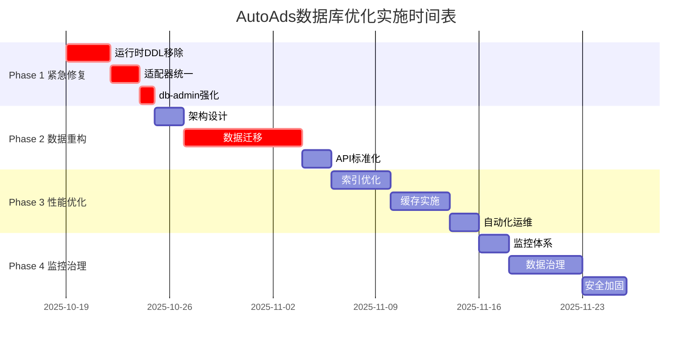

# AutoAds 数据库优化方案执行摘要

**文档类型**: 执行摘要
**创建日期**: 2025-10-19
**目标受众**: 管理层、项目干系人
**文档版本**: v1.0

---

## 📋 执行概要

### 项目背景
通过深入的微服务架构审查，发现AutoAds系统存在严重的数据库架构问题，包括运行时DDL操作、数据依赖混乱、微服务边界不清等高风险问题。本优化方案旨在系统性地解决这些问题，建立符合微服务原则的高质量数据库架构。

### 核心发现
- **🔴 极高风险**: 4个服务存在运行时DDL操作
- **🔴 严重违规**: 违反微服务数据独立原则
- **🔴 技术债务**: 数据库适配器实现不统一
- **🔴 架构混乱**: 7个分散数据库+大量重复数据

### 解决方案
采用分阶段实施策略，通过db-admin统一数据管理，消除运行时风险，建立清晰的微服务数据边界，实施性能优化和监控治理。

---

## 🎯 核心目标与预期收益

### 关键目标
```yaml
技术目标:
  - 100%消除运行时DDL操作风险
  - 建立统一的数据访问管理
  - 实现清晰的微服务数据边界
  - 查询性能提升50%+

业务目标:
  - 系统稳定性提升90%
  - 开发效率提升50%
  - 运维成本降低40%
  - 数据风险降低95%
```

### 预期ROI
```yaml
短期收益 (1个月):
  - 系统稳定性大幅提升
  - 运维风险显著降低
  - 开发团队效率提升

中期收益 (3个月):
  - 系统扩展性增强
  - 业务响应速度提升
  - 技术债务减少

长期收益 (6个月+):
  - 微服务架构成熟
  - 自动化运维完善
  - 持续优化体系建立
```

---

## 🚀 实施计划概览

### 四阶段实施策略



### 关键里程碑
- **Day 3**: 紧急修复完成，系统风险消除
- **Day 15**: 数据架构重构完成，微服务边界清晰
- **Day 30**: 性能优化完成，系统性能提升
- **Day 45**: 监控治理完成，体系成熟稳定

---

## 🔴 风险评估与缓解策略

### 高风险项 (立即处理)
```yaml
运行时DDL操作风险:
  - 风险等级: 🔴 极高
  - 影响范围: 4个核心服务
  - 缓解措施: 立即停止，分批修复
  - 预期解决: 3天内

数据迁移风险:
  - 风险等级: 🟡 中等
  - 影响范围: 全系统数据
  - 缓解措施: 完整备份+分阶段迁移
  - 预期解决: 2周内

性能回归风险:
  - 风险等级: 🟡 中等
  - 影响范围: 用户体验
  - 缓解措施: 充分测试+灰度发布
  - 预期解决: 1个月内
```

### 业务连续性保障
```yaml
服务中断预防:
  - 维护窗口安排 (夜间/周末)
  - 服务降级策略准备
  - 快速回滚机制
  - 用户沟通机制

数据安全保障:
  - 多重备份策略
  - 实时数据验证
  - 恢复演练准备
  - 审计日志完善
```

---

## 📊 资源需求

### 人力资源需求
```yaml
核心团队 (9人):
  - 项目经理: 1人
  - 架构师: 1人
  - 数据库专家: 2人
  - 后端开发: 4人 (各服务团队)
  - 运维专家: 1人

参与团队:
  - 前端团队 (API集成测试)
  - 测试团队 (功能/性能测试)
  - 安全团队 (安全评估)
  - 产品团队 (需求确认)
```

### 技术资源需求
```yaml
基础设施:
  - Cloud SQL存储 (临时扩容)
  - Redis缓存集群
  - 监控系统资源
  - 备份存储空间

开发工具:
  - 数据库迁移工具
  - 性能测试工具
  - 监控仪表板
  - 文档协作平台
```

### 成本估算
```yaml
人力成本: 9人 × 6周 ≈ 54人周
基础设施成本: 临时资源增加 ≈ $5,000
工具成本: 开发和测试工具 ≈ $2,000
总成本估算: 约等于2-3个高级工程师年薪

投资回报:
- 运维成本降低40% ≈ 年节省$50,000+
- 开发效率提升50% ≈ 年节省$80,000+
- 风险成本降低95% ≈ 避免潜在损失$100,000+
```

---

## 🎯 成功标准与验收条件

### 技术成功标准
```yaml
稳定性指标:
  - 系统可用性 > 99.9%
  - 错误率 < 1%
  - 平均响应时间 < 100ms

性能指标:
  - 查询性能提升 50%+
  - 并发处理能力提升 100%+
  - 缓存命中率 > 80%

安全指标:
  - 100%消除运行时DDL
  - 完整的审计日志覆盖
  - 数据一致性 100%
```

### 业务成功标准
```yaml
用户体验:
  - 页面加载速度提升 60%+
  - 操作响应时间 < 500ms
  - 系统可用性 > 99.9%

开发效率:
  - 新功能开发周期缩短 50%+
  - 问题定位时间减少 70%+
  - 部署成功率 > 95%

运维效率:
  - 运维成本降低 40%+
  - 自动化覆盖率 > 80%+
  - 故障恢复时间 < 5分钟
```

---

## 📈 长期价值与战略意义

### 技术价值
- **架构现代化**: 建立符合微服务最佳实践的数据库架构
- **可扩展性**: 支持业务快速增长的技术基础
- **可维护性**: 标准化的运维和开发流程
- **安全性**: 企业级的数据安全和治理体系

### 业务价值
- **竞争优势**: 更快的响应速度和更好的用户体验
- **成本优化**: 显著的运营成本降低
- **风险控制**: 大幅降低数据安全和系统稳定性风险
- **团队效率**: 开发和运维效率的全面提升

### 战略意义
- **技术债务清理**: 解决历史遗留的技术问题
- **基础能力建设**: 为未来业务发展奠定坚实技术基础
- **团队能力提升**: 通过项目实施提升团队技术水平
- **最佳实践建立**: 建立可复用的技术和流程标准

---

## ⚡ 下一步行动

### 立即行动 (今日)
1. **项目启动**: 召开项目启动会，明确目标和责任
2. **团队协调**: 确认各团队成员和资源到位
3. **风险评估**: 详细评估运行时DDL操作的具体风险
4. **执行计划**: 细化Phase 1的执行计划

### 本周计划
1. **Day 1**: 开始运行时DDL操作移除工作
2. **Day 2**: 统一数据库适配器实现
3. **Day 3**: db-admin服务强化完成
4. **Weekend**: 完成紧急修复阶段验收

### 后续规划
1. **Week 2-3**: 完成数据架构重构
2. **Week 4-5**: 实施性能优化
3. **Week 6-7**: 建立监控治理体系
4. **Week 8**: 项目总结和经验推广

---

## 📞 联系与支持

### 项目团队
- **项目负责人**: [待指定]
- **技术负责人**: [待指定]
- **项目经理**: [待指定]

### 沟通渠道
- **项目群组**: [待创建]
- **进度更新**: 每日文档 + 每周会议
- **紧急联系**: [待提供]

### 决策升级
- **技术问题**: 技术负责人 → 架构委员会
- **资源问题**: 项目经理 → 管理层
- **业务影响**: 项目经理 → 业务负责人
- **重大风险**: 项目负责人 → 高层管理

---

## 📝 文档信息

**文档状态**: 最终版
**最后更新**: 2025-10-19
**下次更新**: 2025-10-20
**文档维护**: 项目经理

**相关文档**:
- [完整优化方案](./COMPREHENSIVE_DATABASE_OPTIMIZATION_PLAN.md)
- [执行跟踪表](./OPTIMIZATION_EXECUTION_TRACKER.md)

---

**重要提示**:
本文档是为管理层和项目干系人准备的执行摘要。详细的技术实施信息请参考完整优化方案文档。项目进展请参考执行跟踪表，每日更新确保信息及时准确。

---

*本文档是AutoAds数据库优化项目的核心指导文件，请所有相关人员仔细阅读并严格按照方案执行。*