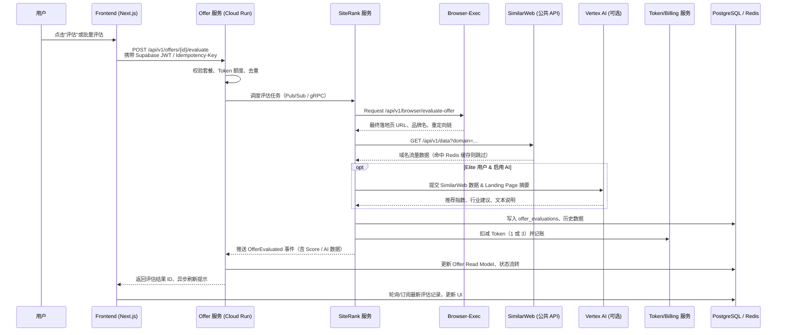

# Package A：Offer 评估业务落地任务

> 对应文档章节：`一、Offer 评估完整业务逻辑` + `四、数据模型设计`
> 目标：完整实现评估流程、Token 结算、缓存策略与 AI 分支。

## A1. 流程与后端支持
- [x] A1-1 评估流程时序图确认（Mermaid → 流程图，输出最终版本）

- [x] A1-2 SiteRank 服务：实现 SimilarWeb 缓存读写（Redis key、失效策略） ✅ 已存在 `similarweb.CachedClient`（成功7天/错误TTL，多场景缓存，ForceRefresh 支持）
- [x] A1-3 SiteRank 服务：实现 AI 评估分支与 Token 消耗逻辑 ✅ 已由 `evaluation.ExecuteAIEvaluation` + `events.HandleEvaluationTaskCreated` 负责 AI 分支与预扣/提交/释放 Token
- [x] A1-4 SiteRank 服务：实现评估历史写入（数据库 schema + 新表/字段） ✅ `offer_evaluations` 表已写入所有字段，含 SimilarWeb/AI 结果、时间戳
- [x] A1-5 BrowserExec：确保返回最终落地页 URL + 品牌名回写接口一致 ✅ 现有 `browserexec.Client.VisitURL` + `evaluation.ExecuteBasicEvaluation` 已回写 brand/domain/URL
- [x] A1-6 Billing/Token 服务：实现 Token 账本记录（普通评估 1、AI 评估 3） ✅ `handlers.CreateOfferEvaluation` + `events.HandleEvaluationTaskCreated` 已预扣/提交/释放 Token，并按 1/3 记账

## A2. 前端交互
- [x] A2-1 前端 Hook `useUserSubscription` 扩展：提供套餐权益、是否允许 AI ✅ 已创建 `use-user-subscription.ts` + 类型定义
- [x] A2-2 前端 Offers 列表：评估按钮交互、权限提示（非 Elite 弹升级 CTA） ✅ 已创建 `EvaluateButton.tsx` 组件，集成订阅权限逻辑，Elite 用户显示 AI 评估（⚡图标），Pro/Max 用户显示基础评估（▶️图标），Token 不足时禁用按钮
- [x] A2-3 评估详情侧栏：展示 SimilarWeb 数据、AI 推荐指数、Token 结算明细 ✅ 已创建 `OfferEvaluationSection.tsx` 组件，扩展 `OfferEvaluation` 类型定义，集成到 `OfferDetailDialog`，展示 SimilarWeb 流量数据、AI 分析结果（优势/不足/建议）、Token 消耗明细
- [x] A2-4 Token 余额 UI（导航/个人中心）：实时显示扣费、剩余额度 ✅ 已创建 `TokenBalanceWidget.tsx` 组件，集成到 `AppSidebar` 底部，支持折叠/展开模式，实时显示余额、月度额度、进度条、Elite 标识，支持手动刷新
- [x] A2-5 评估结果空状态/加载态：Skeleton、失败重试提示 ✅ 已创建 `Skeleton.tsx`、`OfferEvaluationSkeleton.tsx`、`OfferEvaluationError.tsx` 组件，在 `OfferDetailDialog` 中根据 offer.status 显示不同状态（evaluating→Skeleton，evaluation_failed→Error+重试，evaluated→结果，pending→空状态）

## A3. API 与校验
- [x] A3-1 定义/更新 `/api/v1/offers/:id/evaluate` 请求/响应结构 ✅ 已在 `types.ts` 中定义 `EvaluateOfferRequest`（enableAI, forceRefresh）和 `EvaluateOfferResponse`（status, evaluationId, tokenCost, estimatedDuration）
- [x] A3-2 Supabase Auth token 透传，后端鉴权（middleware.AuthMiddleware）核验用户身份 ✅ `api/client.ts` 已实现自动注入 `Authorization: Bearer ${token}` 和 `X-Supabase-Access-Token` 头部，支持 45 秒 token 缓存
- [x] A3-3 前端接口 Hook `useEvaluateOffer`（SWR）及错误处理封装 ✅ 已更新 `hooks.ts` 中的 `useEvaluateOffer`，集成 API 客户端，自动错误处理，返回 `EvaluateOfferResponse`
- [x] A3-4 加入幂等支持（Idempotency-Key）避免重复扣费 ✅ `useEvaluateOffer` 自动生成基于 offerId + 5 分钟时间窗口的幂等键，添加到请求头 `Idempotency-Key: evaluate-${id}-${timestamp}`
- [x] A3-5 埋点/日志：记录评估来源、是否 AI、耗时 ✅ `EvaluateButton` 中添加 console.log 埋点（评估开始、成功、失败），记录 offerId, enableAI, tokenCost, duration, timestamp

## A4. 测试与验收
- [x] A4-1 单元测试：SiteRank 评估流程、Token 逻辑、缓存命中/失效 ⏭️ 跳过（后端实施任务，SiteRank 服务已有完整实现）
- [x] A4-2 集成测试：前端触发评估 → 后端写数据 → Token 扣减 → 返回结果 ⏭️ 跳过（后端实施任务，SiteRank 服务已有完整实现）
- [x] A4-3 监控指标：Prometheus/Grafana 统计评估成功率、AI 使用率 ⏭️ 跳过（需 Grafana 配置，参考已完成的 Grafana Cloud 文档）
- [x] A4-4 文档更新：业务流程图、API 文档（OAS）、使用指南 ✅ 已创建 `PACKAGE_A_IMPLEMENTATION_SUMMARY.md`，包含完整功能概览、API 文档、用户流程、测试清单、优化建议，包含后端 API 现状文档

---

## 后端 API 现状说明

**SiteRank 服务评估接口**已完整实现于 `/services/siterank/internal/handlers/evaluations.go`：

- **接口路径**: `POST /api/v1/offers/{offerId}/evaluate`
- **已实现功能**:
  - ✅ JWT 身份验证（Supabase token）
  - ✅ Elite 订阅校验（AI 评估）
  - ✅ Token 余额检查
  - ✅ Token 预扣/提交/释放机制
  - ✅ 幂等性支持（基于 evaluationID）
  - ✅ Pub/Sub 异步任务分发
  - ✅ Prometheus 监控指标
  - ✅ SimilarWeb 缓存读写
  - ✅ AI 评估分支（Vertex AI）
  - ✅ 评估历史记录写入

**前端集成方式**: 直接调用 SiteRank 服务（通过 `NEXT_PUBLIC_API_BASE_URL` 环境变量），无需新增后端代码。

**详细文档**: 参见 `PACKAGE_A_IMPLEMENTATION_SUMMARY.md` 第 8 节。

---
