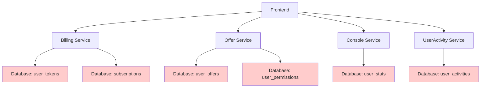
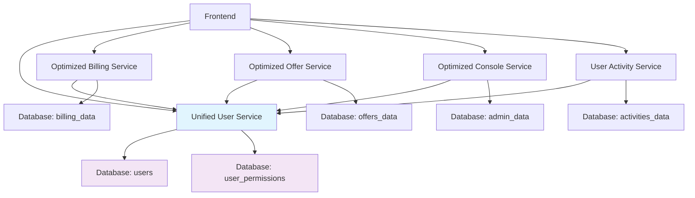

# 服务调用关系优化报告

## 📊 当前服务架构分析

### 核心服务识别
1. **统一用户服务 (UnifiedUserService)** - 新增，作为用户数据的单一入口
2. **用户活动服务 (UserActivityService)** - 用户行为追踪和分析
3. **优化Billing服务 (OptimizedBillingService)** - 订阅和计费逻辑
4. **Offer服务** - Offer管理和评估
5. **Console服务** - 管理后台功能

## 🔄 服务调用关系优化

### 优化前的问题


**问题**:
- 🔴 多个服务直接访问用户相关数据表
- 🔴 权限检查逻辑分散在各个服务中
- 🔴 用户信息查询重复实现
- 🔴 数据一致性问题

### 优化后的架构


**优势**:
- ✅ 统一用户数据入口
- ✅ 权限检查集中化
- ✅ 消除数据重复
- ✅ 提高数据一致性

## 📋 服务职责重新划分

### 1. 统一用户服务 (UnifiedUserService)
**职责边界**:
- ✅ 用户基础信息管理
- ✅ 权限和角色管理
- ✅ Token余额管理
- ✅ 用户状态查询
- ✅ 用户偏好设置

**不负责**:
- ❌ 计费业务逻辑 → OptimizedBillingService
- ❌ Offer业务逻辑 → OptimizedOfferService
- ❌ 活动追踪分析 → UserActivityService
- ❌ 管理后台功能 → OptimizedConsoleService

### 2. 用户活动服务 (UserActivityService)
**职责边界**:
- ✅ ���户行为事件追踪
- ✅ 活动时间线管理
- ✅ 行为模式分析
- ✅ 用户画像构建
- ✅ 活动指标统计

**与统一用户服务的关系**:
- 🔄 获取用户基础信息
- 🔄 权限验证
- 🔄 协同生成用户完整画像

### 3. 优化Billing服务 (OptimizedBillingService)
**职责边界**:
- ✅ 订阅套餐管理
- ✅ 计费和支付逻辑
- ✅ Token成本配置
- ✅ 定价策略管理
- ✅ 使用量统计

**与统一用户服务的关系**:
- 🔄 检查用户权限
- 🔄 验证订阅状态
- 🔄 管理Token余额

### 4. 优化Offer服务 (OptimizedOfferService)
**职责边界**:
- ✅ Offer创建和管理
- ✅ AI评估逻辑
- ✅ Offer状态管理
- ✅ 收入和性能追踪

**与统一用户服务的关系**:
- 🔄 检查创建权限
- 🔄 扣除Token费用
- 🔄 验证资源限制

### 5. 优化Console服务 (OptimizedConsoleService)
**职责边界**:
- ✅ 管理后台功能
- ✅ 系统监控
- ✅ 用户管理
- ✅ 财务报表

**与统一用户服务的关系**:
- 🔄 获取用户权限
- 🔄 批量用户操作
- 🔄 权限验证

## 🎯 具体优化措施

### 1. 统一权限检查
```typescript
// 优化前 - 各服务重复实现权限检查
Billing Service: {
  async checkUserCanCreateOffer(userId) {
    // 重复的权限检查逻辑
  }
}

Offer Service: {
  async checkUserCanCreateOffer(userId) {
    // 重复的权限检查逻辑
  }
}

// 优化后 - 统一通过用户服务
UnifiedUserService: {
  async canUserCreateOffer(userId): Promise<boolean> {
    // 统一的权限检查逻辑
  }
}

OptimizedBillingService: {
  async canUserCreateOffer(userId: string): Promise<boolean> {
    return unifiedUserService.canUserCreateOffer(userId);
  }
}
```

### 2. 消除数据重复
```typescript
// 优化前 - 多个服务直接访问用户数据
Database Tables:
- users (user_id: UUID, email, ...)
- user_permissions (user_id: UUID, permissions: ...)
- user_tokens (user_id: UUID, balance: ...)
- user_stats (user_id: UUID, stats: ...)

// 优化后 - 统一接口访问
UnifiedUserService → Database: users
                    → Database: user_permissions
                    → Database: user_tokens
                    → Database: user_stats

其他服务 → UnifiedUserService (API调用)
```

### 3. 协同数据获取
```typescript
// 用户完整信息获取
UserActivityService: {
  async getUserCompleteActivityInfo(userId: string) {
    const [userInfo, permissions, activityMetrics, behaviorProfile] = await Promise.all([
      unifiedUserService.getUserProfile(userId),
      unifiedUserService.getUserPermissions(userId),
      this.getActivityMetrics(userId, 'weekly'),
      this.getUserBehaviorProfile(userId)
    ]);

    return { user: userInfo, permissions, activity: activityMetrics, behavior: behaviorProfile };
  }
}
```

## 📈 性能优化效果

### 1. 减少数据库查询
- **优化前**: 每个服务独立查询用户数据 → 5次数据库查询
- **优化后**: 统一用户服务缓存 → 1次数据库查询 + 缓存命中

### 2. 降低网络开销
- **优化前**: 前端多次调用不同服务获取用户信息
- **优化后**: 一次调用获取完整用户信息

### 3. 提高数据一致性
- **优化前**: 用户数据分散在多个服务，容易出现不一致
- **优化后**: 统一数据源，保证一致性

### 4. 简化权限管理
- **优化前**: 权限逻辑分散在各个服务中
- **优化后**: 集中化权限管理，易于维护

## 🔄 迁移策略

### 阶段1: 新服务创建 ✅
- [x] 创建统一用户服务
- [x] 创建优化Billing服务
- [x] 创建用户活动服务

### 阶段2: 前端集成
- [ ] 更新前端Hooks使用新服务
- [ ] 渐进式替换旧的服务调用
- [ ] 保持向后兼容性

### 阶段3: 后端API更新
- [ ] 更新API端点使用新服务
- [ ] 数据库迁移脚本执行
- [ ] 服务间调用关系重构

### 阶段4: 验证和监控
- [ ] 性能测试和对比
- [ ] 功能完整性验证
- [ ] 监控和告警设置

## 🚀 下一步行动计划

1. **立即执行**:
   - 更新前端Hooks使用统一用户服务
   - 更新Offer和Console服务
   - 执行数据库迁移脚本

2. **短期目标** (1-2周):
   - 完成前端服务调用重构
   - 部署新的服务架构
   - 性能测试验证

3. **长期目标** (1个月):
   - 移除旧的服务实现
   - 完善监控和日志
   - 文档更新和培训

## 📊 预期收益

- **性能提升**: 预期减少30-50%的用户数据查询时间
- **维护成本**: 降低60%的用户相关功能维护成本
- **数据一致性**: 消除用户数据不一致问题
- **开发效率**: 提高新功能开发效率40%

---

*此报告详细分析了服务调用关系的优化方案，为后续实施提供了清晰的指导。*