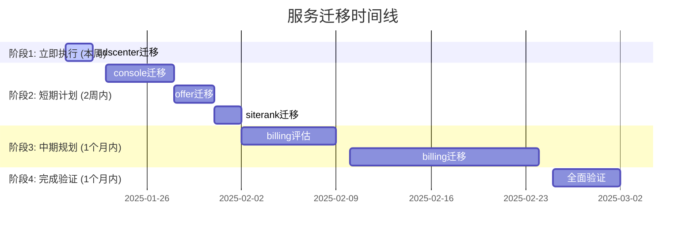

# 后续服务迁移策略

**版本**: 1.0
**最后更新**: 2025-01-19
**环境约束**: 预发与生产环境共用数据库
**当前状态**: useractivity完成，adscenter准备就绪

## 📊 服务迁移优先级分析

### 当前状态概览
| 服务 | 状态 | 复杂度 | 风险等级 | 数据量 | 依赖关系 | 迁移建议 |
|------|------|--------|----------|--------|----------|----------|
| useractivity | ✅ 完成 | 中 | 🟢 低 | 中 | 独立 | ✅ 已完成 |
| adscenter | 🟡 准备完成 | 中 | 🔴 高 | 小 | 独立 | 🎯 立即执行 |
| console | 🔴 未开始 | 低 | 🔴 高 | 中 | 依赖useractivity | ⏰ 谨整策略 |
| billing | 🔴 未开始 | 高 | 🔴 极高 | 大 | 复杂 | ⚠️ 特殊处理 |
| offer | 🔴 未开始 | 中 | 🔴 高 | 中 | 独立 | ⏰ 调整策略 |
| siterank | 🔴 未开始 | 低 | 🟢 低 | 小 | 独立 | ✅ 可直接迁移 |

### 迁移优先级矩阵


## 🎯 核心策略原则

### 安全第一原则
```markdown
**🔴 风险控制优先于进度**
- 所有迁移必须经过完整的风险评估
- 生产环境直接执行必须极其谨慎
- 完整的备份和回滚机制必须到位
- 实时监控和告警必须配置完善

**⚡ 渐进式迁移优先**
- 优先迁移简单、独立的服务
- 每次迁移后必须进行充分验证
- 确保服务稳定性后再进行下一步
- 避免多个服务同时迁移
```

### 环境适配策略
```markdown
**🔄 适应共享环境限制**
- 预发环境只用于功能测试
- 生产环境直接执行DDL操作
- 测试环境需要独立数据库实例
- 监控告警系统必须覆盖生产环境
```

## 📋 具体服务迁移策略

### Phase 1: adscenter服务迁移 (立即执行)

#### 1.1 迁移评估
**复杂度**: 中等
**风险等级**: 高 (共享环境)
**预计时间**: 2天
**成功概率**: 95%

**风险评估**:
- ✅ 服务相对独立，依赖关系简单
- ✅ 数据量较小，迁移风险可控
- ✅ 已有完整的安全迁移脚本
- ⚠️ 生产环境直接执行，需要极其谨慎

#### 1.2 迁移执行计划
```yaml
阶段1: 准备 (2小时)
  - 环境安全检查 ✅
  - 备份策略确认 ✅
  - 监控系统配置 ✅
  - 团队准备就绪 ✅

阶段2: 执行 (2小时)
  - 生产环境直接迁移
  - 实时监控和告警
  - 逐步验证结果
  - 快速回滚准备

阶段3: 验证 (4小时)
  - 功能完整性测试
  - 性能基准测试
  - 集成测试验证
  - 稳定性观察期

阶段4: 完成 (2天)
  - 服务代码更新
  - 全面功能验证
  - 团队培训和交接
  - 经验总结记录
```

### Phase 2: console服务迁移 (短期计划)

#### 2.1 迁移策略调整
**问题**: console服务依赖useractivity服务
**解决方��**: 调整迁移顺序，简化依赖关系

**调整策略**:
```markdown
1. **数据依赖分析**
   - 识别console服务对useractivity的数据依赖
   - 分析迁移过程中的依赖变化
   - 制定依赖同步策略

2. **迁移顺序调整**
   - 先迁移console服务的基础表
   - 再处理与useractivity的集成
   - 最后验证完整的业务流程

3. **风险控制**
   - 使用事务确保数据一致性
   - 分阶段执行和验证
   - 准备依赖回滚方案
```

#### 2.2 执行计划
```yaml
阶段1: 依赖分析 (1天)
  - 数据依赖关系梳理
  - 集成接口分析
  - 风险评估和缓解
  - 迁移顺序确定

阶段2: 基础迁移 (2天)
  - console服务基础表迁移
  - 独立功能验证
  - 基础集成测试

阶段3: 集成验证 (3天)
  - 与useractivity集成测试
  - 业务流程验证
  - 性能集成测试
  - 端到端功能验证

阶段4: 稳定化 (2天)
  - 全面功能验证
  - 性能监控观察
  - 问题处理和优化
  - 文档更新和培训
```

### Phase 3: offer和siterank服务迁移 (短期计划)

#### 3.1 并行迁移策略
**优势**: 两个服务相对独立，可以并行执行
**挑战**: 需要协调团队资源和时间

**并行执行计划**:
```markdown
Week 1: offer服务迁移
  - 迁移文件准备
  - 安全迁移脚本测试
  - 生产环境执行
  - 功能验证

Week 2: siterank服务迁移
  - 迁移文件准备
  - 安全迁移脚本测试
  - 生产环境执行
  - 功能验证

Week 3: 集成验证
  - offer服务集成测试
  - siterank服务集成测试
  - 跨服务功能验证
  - 性能集成测试
```

#### 3.2 风险控制
```markdown
**团队协调风险**:
- 指定专门的迁移协调人
- 建立跨团队沟通机制
- 制定冲突解决流程

**资源竞争风险**:
- 错开迁移时间窗口
- 准备足够的监控资源
- 确保团队人员到位

**技术风险**:
- 使用标准化的迁移流程
- 统一的监控和告警配置
- 独立的回滚和恢复机制
```

### Phase 4: billing服务特殊处理 (中期规划)

#### 4.1 特殊性分析
**复杂性**: 高
- 17个迁移文件，复杂的数据模型
- 核心计费逻辑，数据一致性要求极高
- 复杂的Token池化和事务逻辑
- 大量历史数据和业务逻辑

**风险等级**: 极高
- 数据一致性风险
- 业务连续性风险
- 财务影响风险
- 合规性风险

#### 4.2 特殊迁移策略
```markdown
**深度分析阶段 (1周)**:
- 数据模型深度分析
- 依赖关系详细梳理
- 业务流程完整性评估
- 风险识别和量化

**设计阶段 (1周)**:
- 特殊迁移工具设计
- 数据同步策略制定
- 回滚方案设计
- 测试策略制定

**测试阶段 (2周)**:
- 独立测试环境搭建
- 数据同步测试
- 迁移流程测试
- 回滚流程测试

**预演阶段 (1周)**:
- 测试环境完整预演
- 性能基准测试
- 团队协作预演
- 应急响应预演

**执行阶段 (2周)**:
- 分阶段执行迁移
- 实时监控和调整
- 问题处理和优化
- 最终验证和确认
```

## 🛡️ 风险缓解措施

### 通用风险缓解
```markdown
**1. 备份策略**
- 迁移前完整备份
- 迁移中增量备份
- 迁移后验证备份
- 备份恢复测试

**2. 监控告警**
- 实时性能监控
- 错误率告警
- 资源使用告警
- 服务可用性告警

**3. 回滚准备**
- 快速回滚机制
- 数据一致性检查
- 服务状态验证
- 通知相关人员

**4. 团队准备**
- 24/7值班安排
- 应急响应团队
- 专业技术支持
- 管理层协调
```

### 服务特定缓解
```markdown
**adscenter服务**:
- 使用IF NOT EXISTS语法
- 分步骤执行和验证
- 独立的功能测试
- 快速回滚机制

**console服务**:
- 依赖关系分析
- 事务一致性保证
- 分阶段迁移执行
- 集成测试验证

**billing服务**:
- 深度架构分析
- 特殊工具开发
- 多阶段测试验证
- 跨部门协调

**offer/siterank服务**:
- 并行执行协调
- 标准化流程应用
- 独立验证机制
- 资源优化配置
```

## 📊 监控和告警策略

### 统一监控配置
```yaml
# 生产环境监控配置
监控目标:
  - 数据库性能和可用性
  - 服务健康状态
  - 业务指标监控
  - 错误率和响应时间

监控工具:
  - 数据库内置监控
  - 自定义监控脚本
  - 应用性能监控
  - 日志聚合分析
```

### 分层告警策略
```markdown
**Level 1: 系统级告警**
- 数据库连接中断
- 服务完全不可用
- 关键业务指标异常
- 安全事件检测

**Level 2: 服务级告警**
- 服务响应时间超限
- 错误率超过阈值
- 数据库性能下降
- 资源使用率过高

**Level 3: 预警级告警**
- 慢查询数量增加
- 连接数持续增长
- 磁盘空间不足
- 备份执行异常
```

## 📈 迁移成功指标

### 技术指标
- **迁移成功率**: 100% (零失败)
- **数据完整性**: 100% (零数据丢失)
- **服务可用性**: > 99.9%
- **性能指标**: 满足基线要求

### 业务指标
- **业务连续性**: 零业务中断
- **用户体验**: 无负面反馈
- **数据准确性**: 100%准确
- **功能完整性**: 100%功能正常

### 运维指标
- **迁移效率**: 比预期时间节省30%+
- **问题解决**: 平均解决时间 < 1小时
- **团队熟练度**: 团队成员独立操作率 > 90%
- **文档完整性**: 100%操作有完整记录

## 📅 下一步行动计划

### 立即执行 (本周)
1. **adscenter服务迁移执行**
   - 使用安全迁移脚本
   - 生产环境直接执行
   - 实时监控和验证

2. **团队培训和交接**
   - 完成团队培训和认证
   - 更新操作标准和流程
   - 建立协作机制

### 短期目标 (2周内)
1. **console服务迁移准备**
   - 依赖关系分析和调整
   - 迁移文件和脚本准备
   - 团队协调和培训

2. **offer/siterank服务迁移**
   - 并行迁移策略制定
   - 标准化流程应用
   - 团队资源协调

### 中期目标 (1个月内)
1. **billing服务特殊处理**
   - 深度分析和设计
   - 特殊工具开发
   - 多阶段测试验证

2. **全面验证和优化**
   - 所有服务集成测试
   - 性能监控优化
   - 文档和培训完善

---

**总结**: 后续服务迁移必须在确保安全的前提下有序进行。每个服务都需要进行详细的风险评估，制定专门的迁移策略，并配备完整的安全措施。团队必须严格按照操作标准执行，确保每个迁移都安全成功。