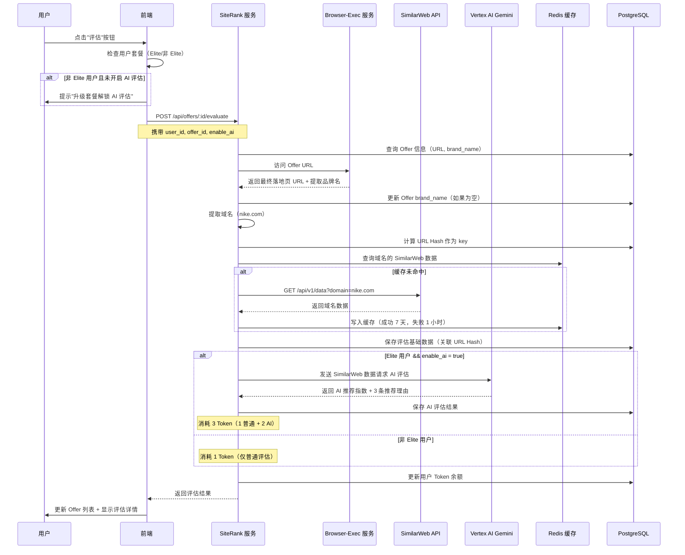
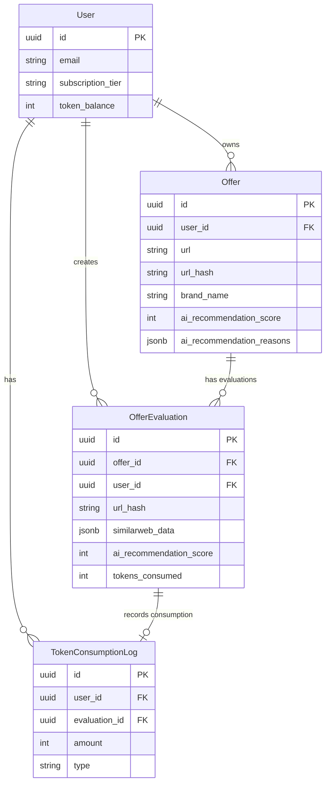
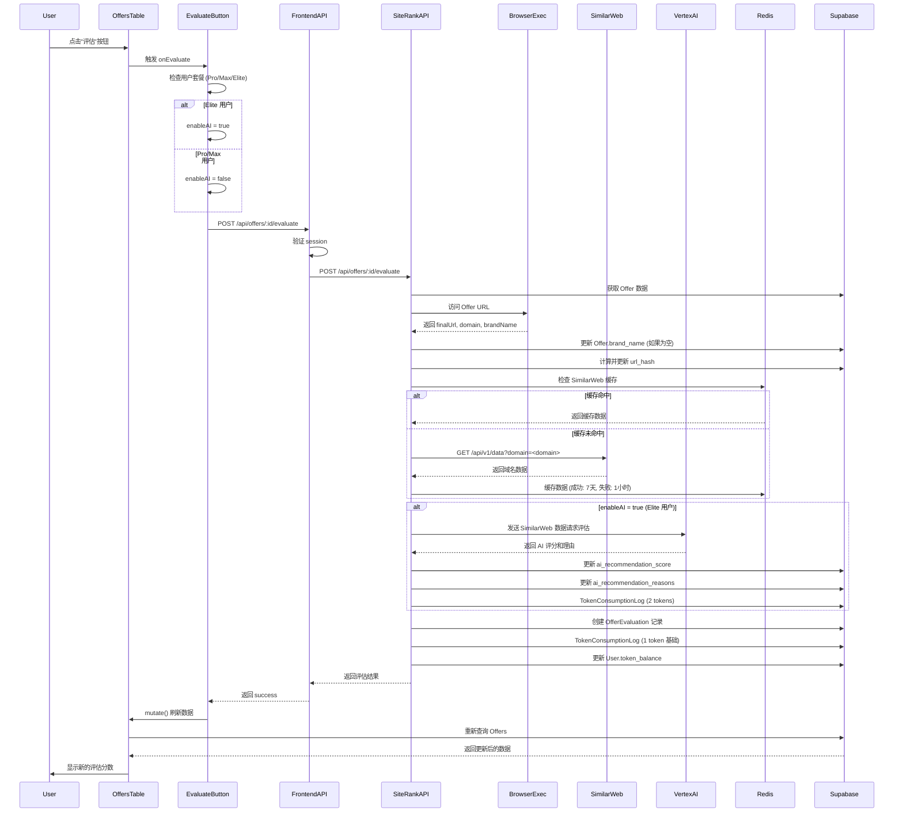

# AutoAds 前端设计完整规范文档（终极版）

**文档版本:** 3.0 Complete
**创建时间:** 2025-10-09
**文档说明:** 这是整合了 4 份设计文档的完整版本，包含所有详细设计代码、业务逻辑、前后端交互

---

## 📋 文档说明

本文档是 AutoAds 前端设计的**完整规范文档**，整合了以下内容：

1. ✅ **FrontendDesignDetailedPlan** (3,385 行) - 所有页面的详细设计代码
2. ✅ **FrontendDesignSupplement** (1,623 行) - Footer 页面、首页、个人中心
3. ✅ **FrontendBestPractices** (2,234 行) - 行业最佳实践
4. ✅ **CurrentImplementationAnalysis** (768 行) - 当前实现分析
5. ✅ **Offer 评估完整业务逻辑** - 新增的评估流程、AI 推荐、Token 消耗

**预计长度:** 8,000+ 行

**使用建议:**
- 产品经理：阅读"业务逻辑"、"用户流程"部分
- 设计师：阅读"视觉设计系统"、"组件库"部分
- 前端工程师：阅读所有 TSX 代码和 API 接口定义
- 后端工程师：阅读"数据模型"、"API 设计"、"缓存策略"部分

---

## 🎯 核心目标

1. **提升用户体验** - 借鉴 Stripe、Linear、Vercel 的设计理念
2. **优化操作效率** - 实时刷新、搜索筛选、批量操作、快捷入口
3. **增强 Offer 评估能力** - 集成 SimilarWeb + Vertex AI Gemini，提供 AI 推荐
4. **确保数据隔离** - 用户级别数据隔离 + 全局缓存机制
5. **提高转化率** - 首页营销优化、新手引导、Aha Moment 设计

---

## 目录

### 第一部分：业务逻辑与架构设计
1. [Offer 评估完整业务逻辑](#一offer-评估完整业务逻辑) ⭐ 新增
2. [页面架构重构](#二页面架构重构)
3. [路由架构与数据隔离](#三路由架构与数据隔离)
4. [数据模型设计](#四数据模型设计) ⭐ 新增

### 第二部分：核心页面详细设计
5. [Dashboard 页面完整设计](#五dashboard-页面完整设计)
6. [Offers 页面完整设计](#六offers-页面完整设计) ⭐ 重点更新
7. [Ads Center 页面完整设计](#七ads-center-页面完整设计)
8. [Tasks 页面完整设计](#八tasks-页面完整设计)
9. [User Info 页面完整设计](#九user-info-页面完整设计)

### 第三部分：营销与引导页面
10. [首页营销页面完整设计](#十首页营销页面完整设计)
11. [Footer 9 个页面完整设计](#十一footer-9-个页面完整设计)
12. [新用户引导流程完整设计](#十二新用户引导流程完整设计)

### 第四部分：导航与组件系统
13. [导航系统完整设计](#十三导航系统完整设计)
14. [组件库完整规范](#十四组件库完整规范)
15. [视觉设计系统完整规范](#十五视觉设计系统完整规范)

### 第五部分：国际化与 SEO
16. [国际化完整方案](#十六国际化完整方案)
17. [SEO 优化完整方案](#十七seo-优化完整方案)

### 第六部分：优化与实施
18. [行业最佳实践应用](#十八行业最佳实践应用)
19. [性能优化策略](#十九性能优化策略)
20. [实施路线图](#二十实施路线图)
21. [成功指标](#二十一成功指标)

---

## 第一部分：业务逻辑与架构设计

---

## 一、Offer 评估完整业务逻辑

### 1.1 业务流程概述



### 1.2 核心业务规则

#### 1.2.1 套餐与权限

| 套餐类型 | 普通评估 | AI 评估 | Token 消耗 | 月价格 |
|---------|---------|--------|-----------|--------|
| Pro     | ✅ 可用 | ❌ 不可用 | 1 Token   | $49   |
| Max     | ✅ 可用 | ❌ 不可用 | 1 Token   | $79   |
| Elite   | ✅ 可用 | ✅ 可用  | 3 Token（1+2） | $99   |

**权限差异:**
- **Pro:** 基础套餐，仅普通评估，Token 月额度 1,000
- **Max:** 进阶套餐，仅普通评估，Token 月额度 5,000 + 更多高级功能
- **Elite:** 旗舰套餐，包含 AI 评估，Token 月额度 10,000 + 所有功能

**前端判断逻辑:**
```typescript
// hooks/use-user-subscription.ts
export function useUserSubscription() {
  const { data: user } = useUser();

  return {
    tier: user?.subscription_tier, // 'pro' | 'max' | 'elite'
    isPro: user?.subscription_tier === 'pro',
    isMax: user?.subscription_tier === 'max',
    isElite: user?.subscription_tier === 'elite',
    canUseAI: user?.subscription_tier === 'elite',
  };
}

// Offers 页面使用
const { isElite, canUseAI } = useUserSubscription();

const handleEvaluate = (offer: Offer) => {
  if (canUseAI) {
    // Elite 用户：自动开启 AI 评估
    evaluateOffer({
      offerId: offer.id,
      enableAI: true
    });
  } else {
    // 非 Elite 用户：仅普通评估
    evaluateOffer({
      offerId: offer.id,
      enableAI: false
    });
  }
};
```

#### 1.2.2 URL Hash 计算规则

**目的:** 汇聚同一个 Offer URL 的所有历史数据

```typescript
// lib/offers/utils.ts
import crypto from 'crypto';

export function calculateOfferUrlHash(url: string): string {
  // 规范化 URL（去除查询参数、锚点）
  const normalized = normalizeUrl(url);

  // 计算 SHA-256 Hash
  return crypto
    .createHash('sha256')
    .update(normalized)
    .digest('hex');
}

function normalizeUrl(url: string): string {
  try {
    const parsed = new URL(url);
    // 仅保留 protocol + hostname + pathname
    return `${parsed.protocol}//${parsed.hostname}${parsed.pathname}`;
  } catch {
    return url;
  }
}

// 使用示例
const urlHash = calculateOfferUrlHash('https://example.com/offer?ref=123');
// => '8f5e3a2b1c4d7e9f...'
```

#### 1.2.3 缓存策略

**全局缓存（跨用户共享）:**

```typescript
// services/siterank/cache.go
type CacheConfig struct {
    SuccessTTL time.Duration // 7 天
    FailureTTL time.Duration // 1 小时
}

type SimilarWebCache struct {
    Domain    string                 `json:"domain"`
    Data      *SimilarWebResponse    `json:"data,omitempty"`
    Error     string                 `json:"error,omitempty"`
    Timestamp time.Time              `json:"timestamp"`
}

func GetSimilarWebData(domain string) (*SimilarWebResponse, error) {
    // 1. 尝试从 Redis 读取
    cacheKey := fmt.Sprintf("similarweb:%s", domain)
    cached, err := redisClient.Get(ctx, cacheKey).Result()

    if err == nil {
        var cache SimilarWebCache
        json.Unmarshal([]byte(cached), &cache)

        if cache.Data != nil {
            logger.Info("SimilarWeb cache hit", "domain", domain)
            return cache.Data, nil
        }

        if cache.Error != "" {
            return nil, errors.New(cache.Error)
        }
    }

    // 2. 缓存未命中，调用 SimilarWeb API
    apiURL := os.Getenv("SIMILARWEB_BASE_URL") // 从 Secret Manager
    resp, err := http.Get(fmt.Sprintf("%s?domain=%s", apiURL, domain))

    var cacheEntry SimilarWebCache
    cacheEntry.Domain = domain
    cacheEntry.Timestamp = time.Now()

    if err != nil {
        // 失败结果缓存 1 小时
        cacheEntry.Error = err.Error()
        cacheJSON, _ := json.Marshal(cacheEntry)
        redisClient.Set(ctx, cacheKey, cacheJSON, 1*time.Hour)
        return nil, err
    }

    // 3. 解析响应
    var data SimilarWebResponse
    json.NewDecoder(resp.Body).Decode(&data)

    // 4. 成功结果缓存 7 天
    cacheEntry.Data = &data
    cacheJSON, _ := json.Marshal(cacheEntry)
    redisClient.Set(ctx, cacheKey, cacheJSON, 7*24*time.Hour)

    return &data, nil
}
```

#### 1.2.4 Token 消耗规则

```typescript
// services/siterank/token.go
type TokenConsumption struct {
    BasicEvaluation int // 1 Token
    AIEvaluation    int // 2 Token
}

func ConsumeTokens(userID string, enableAI bool) error {
    consumption := TokenConsumption{
        BasicEvaluation: 1,
    }

    if enableAI {
        consumption.AIEvaluation = 2
    }

    totalTokens := consumption.BasicEvaluation + consumption.AIEvaluation

    // 原子性扣减 Token
    result := db.Exec(`
        UPDATE users
        SET token_balance = token_balance - ?
        WHERE id = ? AND token_balance >= ?
    `, totalTokens, userID, totalTokens)

    if result.RowsAffected == 0 {
        return errors.New("insufficient tokens")
    }

    // 记录消费日志
    db.Create(&TokenConsumptionLog{
        UserID:          userID,
        Amount:          totalTokens,
        Type:            "offer_evaluation",
        BasicEvaluation: consumption.BasicEvaluation,
        AIEvaluation:    consumption.AIEvaluation,
    })

    return nil
}
```

### 1.3 数据模型设计

#### 1.3.1 Offer 表扩展

```sql
-- 扩展 Offer 表
ALTER TABLE "Offer" ADD COLUMN IF NOT EXISTS url_hash VARCHAR(64);
ALTER TABLE "Offer" ADD COLUMN IF NOT EXISTS final_landing_url TEXT;
ALTER TABLE "Offer" ADD COLUMN IF NOT EXISTS extracted_brand_name VARCHAR(255);
ALTER TABLE "Offer" ADD COLUMN IF NOT EXISTS ai_recommendation_score INTEGER; -- 0-100
ALTER TABLE "Offer" ADD COLUMN IF NOT EXISTS ai_recommendation_reasons JSONB; -- ['reason1', 'reason2', 'reason3']
ALTER TABLE "Offer" ADD COLUMN IF NOT EXISTS last_evaluated_at TIMESTAMP;
ALTER TABLE "Offer" ADD COLUMN IF NOT EXISTS evaluation_count INTEGER DEFAULT 0;

-- 创建索引
CREATE INDEX IF NOT EXISTS idx_offer_url_hash ON "Offer"(url_hash);
CREATE INDEX IF NOT EXISTS idx_offer_user_id_url_hash ON "Offer"(user_id, url_hash);
CREATE INDEX IF NOT EXISTS idx_offer_ai_score ON "Offer"(ai_recommendation_score) WHERE ai_recommendation_score IS NOT NULL;

-- RLS 策略
ALTER TABLE "Offer" ENABLE ROW LEVEL SECURITY;

CREATE POLICY "Users can only access their own offers"
  ON "Offer" FOR SELECT
  USING (user_id = auth.uid());
```

#### 1.3.2 评估历史表

```sql
-- 创建评估历史表
CREATE TABLE IF NOT EXISTS "OfferEvaluation" (
    id UUID PRIMARY KEY DEFAULT gen_random_uuid(),
    offer_id UUID NOT NULL REFERENCES "Offer"(id) ON DELETE CASCADE,
    user_id UUID NOT NULL REFERENCES "User"(id) ON DELETE CASCADE,
    url_hash VARCHAR(64) NOT NULL, -- 关联同一个 URL 的所有评估

    -- 基础评估数据
    final_landing_url TEXT,
    extracted_brand_name VARCHAR(255),
    domain VARCHAR(255) NOT NULL,

    -- SimilarWeb 数据
    similarweb_data JSONB, -- 完整的 SimilarWeb 响应
    similarweb_cached BOOLEAN DEFAULT FALSE,

    -- AI 评估数据
    ai_enabled BOOLEAN DEFAULT FALSE,
    ai_recommendation_score INTEGER, -- 0-100
    ai_recommendation_reasons JSONB, -- ['reason1', 'reason2', 'reason3']
    ai_industry VARCHAR(255),
    ai_product_type VARCHAR(255),
    ai_avg_order_value DECIMAL(10, 2),
    ai_avg_cpc DECIMAL(10, 2),
    ai_raw_response TEXT, -- Gemini 原始响应

    -- Token 消耗
    tokens_consumed INTEGER DEFAULT 1,

    -- 元数据
    status VARCHAR(50) DEFAULT 'pending', -- pending, processing, completed, failed
    error_message TEXT,
    started_at TIMESTAMP DEFAULT NOW(),
    completed_at TIMESTAMP,
    duration_ms INTEGER,

    created_at TIMESTAMP DEFAULT NOW(),
    updated_at TIMESTAMP DEFAULT NOW()
);

-- 索引
CREATE INDEX idx_evaluation_offer_id ON "OfferEvaluation"(offer_id);
CREATE INDEX idx_evaluation_user_id ON "OfferEvaluation"(user_id);
CREATE INDEX idx_evaluation_url_hash ON "OfferEvaluation"(url_hash);
CREATE INDEX idx_evaluation_status ON "OfferEvaluation"(status);
CREATE INDEX idx_evaluation_created_at ON "OfferEvaluation"(created_at DESC);

-- 复合索引（常见查询）
CREATE INDEX idx_evaluation_user_offer ON "OfferEvaluation"(user_id, offer_id, created_at DESC);

-- RLS 策略
ALTER TABLE "OfferEvaluation" ENABLE ROW LEVEL SECURITY;

CREATE POLICY "Users can only access their own evaluations"
  ON "OfferEvaluation" FOR SELECT
  USING (user_id = auth.uid());

CREATE POLICY "Users can insert their own evaluations"
  ON "OfferEvaluation" FOR INSERT
  WITH CHECK (user_id = auth.uid());
```

#### 1.3.3 SimilarWeb 缓存表（可选，作为 Redis 备份）

```sql
-- 全局缓存表（无需 RLS，所有用户共享）
CREATE TABLE IF NOT EXISTS "SimilarWebCache" (
    domain VARCHAR(255) PRIMARY KEY,
    data JSONB,
    error TEXT,
    success BOOLEAN DEFAULT TRUE,
    cached_at TIMESTAMP DEFAULT NOW(),
    expires_at TIMESTAMP NOT NULL
);

-- 索引
CREATE INDEX idx_similarweb_expires ON "SimilarWebCache"(expires_at);
CREATE INDEX idx_similarweb_success ON "SimilarWebCache"(success);

-- 定时清理过期缓存
CREATE OR REPLACE FUNCTION cleanup_expired_similarweb_cache()
RETURNS void AS $$
BEGIN
    DELETE FROM "SimilarWebCache" WHERE expires_at < NOW();
END;
$$ LANGUAGE plpgsql;

-- 使用 pg_cron 定时执行（每小时）
-- SELECT cron.schedule('cleanup-similarweb-cache', '0 * * * *', 'SELECT cleanup_expired_similarweb_cache()');
```

#### 1.3.4 Token 消费日志表

```sql
CREATE TABLE IF NOT EXISTS "TokenConsumptionLog" (
    id UUID PRIMARY KEY DEFAULT gen_random_uuid(),
    user_id UUID NOT NULL REFERENCES "User"(id) ON DELETE CASCADE,
    amount INTEGER NOT NULL,
    balance_before INTEGER NOT NULL,
    balance_after INTEGER NOT NULL,
    type VARCHAR(50) NOT NULL, -- 'offer_evaluation', 'ai_evaluation', 'purchase', 'refund'

    -- 详细信息
    offer_id UUID REFERENCES "Offer"(id) ON DELETE SET NULL,
    evaluation_id UUID REFERENCES "OfferEvaluation"(id) ON DELETE SET NULL,
    basic_evaluation_tokens INTEGER DEFAULT 0,
    ai_evaluation_tokens INTEGER DEFAULT 0,

    metadata JSONB,
    created_at TIMESTAMP DEFAULT NOW()
);

-- 索引
CREATE INDEX idx_token_log_user_id ON "TokenConsumptionLog"(user_id);
CREATE INDEX idx_token_log_type ON "TokenConsumptionLog"(type);
CREATE INDEX idx_token_log_created_at ON "TokenConsumptionLog"(created_at DESC);

-- RLS 策略
ALTER TABLE "TokenConsumptionLog" ENABLE ROW LEVEL SECURITY;

CREATE POLICY "Users can only view their own token logs"
  ON "TokenConsumptionLog" FOR SELECT
  USING (user_id = auth.uid());
```

### 1.4 API 设计

#### 1.4.1 评估 Offer API

**Endpoint:** `POST /api/offers/:id/evaluate`

**请求:**
```typescript
interface EvaluateOfferRequest {
  offerId: string;
  enableAI?: boolean; // Elite 用户可传 true
}
```

**响应:**
```typescript
interface EvaluateOfferResponse {
  success: boolean;
  data?: {
    evaluationId: string;
    status: 'pending' | 'processing' | 'completed' | 'failed';
    offer: {
      id: string;
      urlHash: string;
      finalLandingUrl: string;
      extractedBrandName: string | null;
      domain: string;
      aiRecommendationScore: number | null; // 0-100
      aiRecommendationReasons: string[] | null;
    };
    similarweb: {
      cached: boolean;
      data: SimilarWebResponse | null;
    };
    tokens: {
      consumed: number;
      balanceBefore: number;
      balanceAfter: number;
    };
  };
  error?: {
    code: string;
    message: string;
  };
}

// SimilarWeb 响应结构
interface SimilarWebResponse {
  domain: string;
  globalRank: number;
  countryRank: {
    country: string;
    rank: number;
  }[];
  categoryRank: {
    category: string;
    rank: number;
  };
  trafficSources: {
    direct: number;
    search: number;
    social: number;
    mail: number;
    referrals: number;
  };
  topCountries: {
    country: string;
    value: number;
  }[];
  monthlyVisits: number;
  avgVisitDuration: number;
  pagesPerVisit: number;
  bounceRate: number;
}
```

**错误码:**
```typescript
enum EvaluationErrorCode {
  INSUFFICIENT_TOKENS = 'INSUFFICIENT_TOKENS',
  INVALID_URL = 'INVALID_URL',
  BROWSER_EXEC_FAILED = 'BROWSER_EXEC_FAILED',
  SIMILARWEB_API_ERROR = 'SIMILARWEB_API_ERROR',
  VERTEX_AI_ERROR = 'VERTEX_AI_ERROR',
  PERMISSION_DENIED = 'PERMISSION_DENIED', // 非 Elite 用户尝试 AI 评估
  RATE_LIMIT_EXCEEDED = 'RATE_LIMIT_EXCEEDED',
}
```

#### 1.4.2 获取评估历史 API

**Endpoint:** `GET /api/offers/:id/evaluations`

**响应:**
```typescript
interface GetEvaluationsResponse {
  data: {
    evaluations: OfferEvaluation[];
    total: number;
    hasMore: boolean;
  };
}

interface OfferEvaluation {
  id: string;
  status: 'completed' | 'failed';
  finalLandingUrl: string;
  domain: string;
  aiEnabled: boolean;
  aiRecommendationScore: number | null;
  aiRecommendationReasons: string[] | null;
  tokensConsumed: number;
  createdAt: string;
  completedAt: string;
  durationMs: number;
}
```

#### 1.4.3 获取 AI 评估详情 API

**Endpoint:** `GET /api/evaluations/:id/ai-details`

**响应:**
```typescript
interface AIEvaluationDetailsResponse {
  data: {
    evaluationId: string;
    offerId: string;
    domain: string;

    // AI 评估结果
    recommendationScore: number; // 0-100
    recommendationReasons: string[]; // 3 条推荐理由

    // 详细分析
    industry: string; // 所属行业
    productType: string; // 产品类型
    avgOrderValue: number; // 平均客单价（USD）
    avgCPC: number; // Google 广告平均 CPC（USD）

    // 流量分析
    searchTraffic: {
      percentage: number; // 搜索流量占比
      brandedKeywords: {
        keyword: string;
        volume: number;
      }[];
    };

    // 投放建议
    targetCountries: string[]; // 推荐投放国家
    suggestedBudget: {
      daily: number;
      monthly: number;
    };

    // 元数据
    createdAt: string;
    rawResponse: string; // Gemini 原始响应（调试用）
  };
}
```

### 1.5 前端实现

#### 1.5.1 评估按钮组件

```typescript
// components/offers/EvaluateButton.tsx
"use client";

import { useState } from 'react';
import { PlayIcon, SparklesIcon, LockClosedIcon } from '@heroicons/react/24/outline';
import { Button } from '~/core/ui/Button';
import { Tooltip } from '~/core/ui/Tooltip';
import { Badge } from '~/core/ui/Badge';
import { useUserSubscription } from '~/hooks/use-user-subscription';
import { useEvaluateOffer } from '~/lib/offers/hooks';
import { toast } from 'sonner';

interface EvaluateButtonProps {
  offer: Offer;
  onSuccess?: () => void;
}

export function EvaluateButton({ offer, onSuccess }: EvaluateButtonProps) {
  const { isElite, canUseAI } = useUserSubscription();
  const [showAIUpgrade, setShowAIUpgrade] = useState(false);

  const evaluateMutation = useEvaluateOffer();

  const handleEvaluate = async () => {
    try {
      const result = await evaluateMutation.mutateAsync({
        offerId: offer.id,
        enableAI: isElite, // Elite 用户自动开启 AI
      });

      if (result.success) {
        toast.success(
          isElite
            ? `评估完成！消耗 ${result.data.tokens.consumed} Token（普通评估 1 + AI 评估 2）`
            : `评估完成！消耗 ${result.data.tokens.consumed} Token`
        );

        if (result.data.offer.aiRecommendationScore !== null) {
          toast.info(
            `AI 推荐指数：${result.data.offer.aiRecommendationScore}/100`,
            { duration: 5000 }
          );
        }

        onSuccess?.();
      }
    } catch (error: any) {
      if (error.code === 'INSUFFICIENT_TOKENS') {
        toast.error('Token 余额不足，请充值后再试');
      } else if (error.code === 'PERMISSION_DENIED') {
        setShowAIUpgrade(true);
      } else {
        toast.error(`评估失败：${error.message}`);
      }
    }
  };

  return (
    <>
      <div className="flex items-center gap-2">
        <Tooltip content={isElite ? '普通评估（1 Token）+ AI 评估（2 Token）' : '普通评估（1 Token）'}>
          <Button
            size="sm"
            onClick={handleEvaluate}
            disabled={evaluateMutation.isPending}
            className="relative"
          >
            {evaluateMutation.isPending ? (
              <>
                <Spinner className="mr-2 h-4 w-4" />
                评估中...
              </>
            ) : (
              <>
                <PlayIcon className="mr-2 h-4 w-4" />
                评估
                {isElite && (
                  <SparklesIcon className="ml-1 h-3 w-3 text-yellow-400" />
                )}
              </>
            )}
          </Button>
        </Tooltip>

        {!isElite && (
          <Tooltip content="升级到 Elite 套餐解锁 AI 推荐">
            <Button
              size="sm"
              variant="outline"
              onClick={() => setShowAIUpgrade(true)}
              className="border-yellow-400 text-yellow-600 hover:bg-yellow-50"
            >
              <SparklesIcon className="mr-1 h-4 w-4" />
              AI 推荐
              <Badge variant="premium" size="sm" className="ml-1">Elite</Badge>
            </Button>
          </Tooltip>
        )}
      </div>

      {/* AI 升级引导对话框 */}
      <AIUpgradeDialog
        open={showAIUpgrade}
        onOpenChange={setShowAIUpgrade}
      />
    </>
  );
}

// AI 升级引导对话框
function AIUpgradeDialog({ open, onOpenChange }) {
  const router = useRouter();

  return (
    <Dialog open={open} onOpenChange={onOpenChange}>
      <DialogContent className="max-w-md">
        <DialogHeader>
          <div className="flex items-center gap-2">
            <SparklesIcon className="h-6 w-6 text-yellow-500" />
            <DialogTitle>解锁 AI 智能推荐</DialogTitle>
          </div>
          <DialogDescription>
            升级到 Elite 套餐，享受 AI 驱动的投放建议
          </DialogDescription>
        </DialogHeader>

        <div className="space-y-4">
          <div className="rounded-lg bg-gradient-to-br from-yellow-50 to-orange-50 p-4">
            <h4 className="font-semibold mb-2">AI 评估包含:</h4>
            <ul className="space-y-2 text-sm">
              <li className="flex items-start gap-2">
                <CheckIcon className="h-4 w-4 text-green-500 mt-0.5" />
                <span>AI 推荐指数（0-100 分）</span>
              </li>
              <li className="flex items-start gap-2">
                <CheckIcon className="h-4 w-4 text-green-500 mt-0.5" />
                <span>3 条投放推荐理由</span>
              </li>
              <li className="flex items-start gap-2">
                <CheckIcon className="h-4 w-4 text-green-500 mt-0.5" />
                <span>行业分析 + 产品类型判断</span>
              </li>
              <li className="flex items-start gap-2">
                <CheckIcon className="h-4 w-4 text-green-500 mt-0.5" />
                <span>平均客单价 + CPC 估算</span>
              </li>
              <li className="flex items-start gap-2">
                <CheckIcon className="h-4 w-4 text-green-500 mt-0.5" />
                <span>品牌词搜索流量分析</span>
              </li>
            </ul>
          </div>

          <div className="flex items-center justify-between py-2">
            <span className="text-sm text-muted-foreground">Elite 套餐</span>
            <div className="text-right">
              <div className="text-2xl font-bold">$99</div>
              <div className="text-xs text-muted-foreground">/ 月</div>
            </div>
          </div>
        </div>

        <DialogFooter>
          <Button variant="outline" onClick={() => onOpenChange(false)}>
            稍后再说
          </Button>
          <Button onClick={() => router.push('/pricing')}>
            <SparklesIcon className="mr-2 h-4 w-4" />
            立即升级
          </Button>
        </DialogFooter>
      </DialogContent>
    </Dialog>
  );
}
```

#### 1.5.2 AI 推荐指数列

```typescript
// components/offers/AIScoreCell.tsx
"use client";

import { useState } from 'react';
import { SparklesIcon, LockClosedIcon } from '@heroicons/react/24/outline';
import { Badge } from '~/core/ui/Badge';
import { Tooltip } from '~/core/ui/Tooltip';
import { AIEvaluationDetailsDialog } from './AIEvaluationDetailsDialog';
import { useUserSubscription } from '~/hooks/use-user-subscription';

interface AIScoreCellProps {
  offer: Offer;
}

export function AIScoreCell({ offer }: AIScoreCellProps) {
  const { canUseAI } = useUserSubscription();
  const [detailsOpen, setDetailsOpen] = useState(false);

  const hasAIScore = offer.aiRecommendationScore !== null;

  if (!canUseAI) {
    // 非 Elite 用户：显示"开通"按钮
    return (
      <Tooltip content="升级到 Elite 套餐解锁 AI 推荐">
        <Button
          size="sm"
          variant="ghost"
          className="text-yellow-600 hover:text-yellow-700"
          onClick={() => router.push('/pricing')}
        >
          <LockClosedIcon className="mr-1 h-3 w-3" />
          开通
        </Button>
      </Tooltip>
    );
  }

  if (!hasAIScore) {
    // Elite 用户但未评估：显示提示
    return (
      <span className="text-sm text-muted-foreground">
        未评估
      </span>
    );
  }

  // 已有 AI 评分：显示分数 + 可点击查看详情
  const score = offer.aiRecommendationScore!;
  const color =
    score >= 80 ? 'text-green-600' :
    score >= 60 ? 'text-yellow-600' :
    score >= 40 ? 'text-orange-600' :
    'text-red-600';

  return (
    <>
      <button
        onClick={() => setDetailsOpen(true)}
        className="flex items-center gap-2 hover:bg-accent rounded-md px-2 py-1 transition-colors"
      >
        <SparklesIcon className={`h-4 w-4 ${color}`} />
        <span className={`font-semibold ${color}`}>{score}</span>
        <Badge variant="outline" size="sm">查看详情</Badge>
      </button>

      <AIEvaluationDetailsDialog
        offer={offer}
        open={detailsOpen}
        onOpenChange={setDetailsOpen}
      />
    </>
  );
}
```

#### 1.5.3 AI 评估详情对话框

```typescript
// components/offers/AIEvaluationDetailsDialog.tsx
"use client";

import { useQuery } from '@tanstack/react-query';
import { SparklesIcon, TrendingUpIcon, CurrencyDollarIcon, GlobeAltIcon } from '@heroicons/react/24/outline';
import { Dialog, DialogContent, DialogHeader, DialogTitle } from '~/core/ui/Dialog';
import { Skeleton } from '~/core/ui/Skeleton';
import { Badge } from '~/core/ui/Badge';
import { Separator } from '~/core/ui/Separator';

interface AIEvaluationDetailsDialogProps {
  offer: Offer;
  open: boolean;
  onOpenChange: (open: boolean) => void;
}

export function AIEvaluationDetailsDialog({ offer, open, onOpenChange }: AIEvaluationDetailsDialogProps) {
  const { data, isLoading } = useQuery({
    queryKey: ['ai-evaluation-details', offer.lastEvaluationId],
    queryFn: () => fetchAIEvaluationDetails(offer.lastEvaluationId!),
    enabled: open && !!offer.lastEvaluationId,
  });

  return (
    <Dialog open={open} onOpenChange={onOpenChange}>
      <DialogContent className="max-w-2xl max-h-[80vh] overflow-y-auto">
        <DialogHeader>
          <div className="flex items-center justify-between">
            <DialogTitle className="flex items-center gap-2">
              <SparklesIcon className="h-6 w-6 text-yellow-500" />
              AI 投放建议
            </DialogTitle>
            {data && (
              <AIScoreBadge score={data.recommendationScore} />
            )}
          </div>
        </DialogHeader>

        {isLoading ? (
          <AIDetailsLoadingSkeleton />
        ) : data ? (
          <div className="space-y-6">
            {/* 推荐指数 */}
            <section>
              <h3 className="font-semibold mb-3">AI 推荐指数</h3>
              <div className="flex items-center gap-4">
                <div className="relative h-24 w-24">
                  <svg className="transform -rotate-90" viewBox="0 0 100 100">
                    <circle
                      cx="50"
                      cy="50"
                      r="40"
                      stroke="currentColor"
                      strokeWidth="8"
                      fill="none"
                      className="text-muted opacity-20"
                    />
                    <circle
                      cx="50"
                      cy="50"
                      r="40"
                      stroke="currentColor"
                      strokeWidth="8"
                      fill="none"
                      strokeDasharray={`${data.recommendationScore * 2.51} 251`}
                      className={getScoreColor(data.recommendationScore)}
                    />
                  </svg>
                  <div className="absolute inset-0 flex items-center justify-center">
                    <span className="text-2xl font-bold">{data.recommendationScore}</span>
                  </div>
                </div>

                <div className="flex-1">
                  <p className="text-sm text-muted-foreground">
                    {getScoreDescription(data.recommendationScore)}
                  </p>
                </div>
              </div>
            </section>

            <Separator />

            {/* 推荐理由 */}
            <section>
              <h3 className="font-semibold mb-3">推荐理由</h3>
              <ul className="space-y-3">
                {data.recommendationReasons.map((reason, index) => (
                  <li key={index} className="flex items-start gap-3">
                    <div className="flex h-6 w-6 shrink-0 items-center justify-center rounded-full bg-green-100 text-green-600 text-sm font-semibold">
                      {index + 1}
                    </div>
                    <p className="text-sm">{reason}</p>
                  </li>
                ))}
              </ul>
            </section>

            <Separator />

            {/* 详细分析 */}
            <section className="grid grid-cols-2 gap-4">
              <div>
                <h4 className="text-sm font-semibold mb-2">所属行业</h4>
                <Badge variant="secondary">{data.industry}</Badge>
              </div>

              <div>
                <h4 className="text-sm font-semibold mb-2">产品类型</h4>
                <Badge variant="secondary">{data.productType}</Badge>
              </div>

              <div>
                <h4 className="text-sm font-semibold mb-2 flex items-center gap-1">
                  <CurrencyDollarIcon className="h-4 w-4" />
                  平均客单价
                </h4>
                <p className="text-lg font-semibold">${data.avgOrderValue}</p>
              </div>

              <div>
                <h4 className="text-sm font-semibold mb-2 flex items-center gap-1">
                  <TrendingUpIcon className="h-4 w-4" />
                  Google 广告平均 CPC
                </h4>
                <p className="text-lg font-semibold">${data.avgCPC}</p>
              </div>
            </section>

            <Separator />

            {/* 流量分析 */}
            <section>
              <h3 className="font-semibold mb-3">流量分析</h3>
              <div className="space-y-3">
                <div>
                  <div className="flex items-center justify-between mb-1">
                    <span className="text-sm">搜索流量占比</span>
                    <span className="font-semibold">{data.searchTraffic.percentage}%</span>
                  </div>
                  <div className="h-2 bg-muted rounded-full overflow-hidden">
                    <div
                      className="h-full bg-blue-500"
                      style={{ width: `${data.searchTraffic.percentage}%` }}
                    />
                  </div>
                </div>

                {data.searchTraffic.brandedKeywords.length > 0 && (
                  <div>
                    <h4 className="text-sm font-semibold mb-2">品牌词搜索量（Top 3）</h4>
                    <div className="space-y-1">
                      {data.searchTraffic.brandedKeywords.slice(0, 3).map((kw, index) => (
                        <div key={index} className="flex items-center justify-between text-sm">
                          <span className="text-muted-foreground">{kw.keyword}</span>
                          <span className="font-medium">{formatNumber(kw.volume)}</span>
                        </div>
                      ))}
                    </div>
                  </div>
                )}
              </div>
            </section>

            <Separator />

            {/* 投放建议 */}
            <section>
              <h3 className="font-semibold mb-3 flex items-center gap-2">
                <GlobeAltIcon className="h-5 w-5" />
                投放建议
              </h3>
              <div className="space-y-3">
                <div>
                  <h4 className="text-sm font-semibold mb-2">推荐投放国家</h4>
                  <div className="flex flex-wrap gap-2">
                    {data.targetCountries.map((country) => (
                      <Badge key={country} variant="outline">{country}</Badge>
                    ))}
                  </div>
                </div>

                <div className="grid grid-cols-2 gap-4 p-4 bg-muted rounded-lg">
                  <div>
                    <div className="text-sm text-muted-foreground mb-1">建议日预算</div>
                    <div className="text-xl font-semibold">${data.suggestedBudget.daily}</div>
                  </div>
                  <div>
                    <div className="text-sm text-muted-foreground mb-1">建议月预算</div>
                    <div className="text-xl font-semibold">${data.suggestedBudget.monthly}</div>
                  </div>
                </div>
              </div>
            </section>

            {/* 元数据 */}
            <div className="text-xs text-muted-foreground">
              评估时间：{formatDateTime(data.createdAt)}
            </div>
          </div>
        ) : (
          <div className="text-center py-10">
            <p className="text-muted-foreground">无法加载 AI 评估详情</p>
          </div>
        )}
      </DialogContent>
    </Dialog>
  );
}

function AIScoreBadge({ score }: { score: number }) {
  const variant =
    score >= 80 ? 'success' :
    score >= 60 ? 'warning' :
    score >= 40 ? 'secondary' :
    'destructive';

  const label =
    score >= 80 ? '强烈推荐' :
    score >= 60 ? '推荐' :
    score >= 40 ? '谨慎' :
    '不推荐';

  return (
    <Badge variant={variant} size="lg">
      {label} · {score} 分
    </Badge>
  );
}

function getScoreColor(score: number) {
  if (score >= 80) return 'text-green-500';
  if (score >= 60) return 'text-yellow-500';
  if (score >= 40) return 'text-orange-500';
  return 'text-red-500';
}

function getScoreDescription(score: number) {
  if (score >= 80) return '该 Offer 非常适合投放 Google 广告，预期 ROAS 表现优秀';
  if (score >= 60) return '该 Offer 适合投放 Google 广告，建议控制预算测试';
  if (score >= 40) return '该 Offer 投放风险较高，建议谨慎评估后再决定';
  return '该 Offer 不建议投放 Google 广告，预期 ROAS 较低';
}

function AIDetailsLoadingSkeleton() {
  return (
    <div className="space-y-6">
      <Skeleton className="h-24 w-full" />
      <Skeleton className="h-32 w-full" />
      <Skeleton className="h-48 w-full" />
    </div>
  );
}
```

### 1.6 用户体验优化建议

#### 1.6.1 减少用户操作

**优化点 1：自动检测品牌名**
```typescript
// 当用户输入 Offer URL 后，自动提取品牌名
function CreateOfferForm() {
  const [url, setUrl] = useState('');
  const [brandName, setBrandName] = useState('');
  const [autoDetecting, setAutoDetecting] = useState(false);

  const handleUrlBlur = async () => {
    if (!url || brandName) return;

    setAutoDetecting(true);
    try {
      // 调用简化的品牌名提取 API（不消耗 Token）
      const result = await extractBrandName(url);
      if (result.brandName) {
        setBrandName(result.brandName);
        toast.info(`自动检测到品牌名：${result.brandName}`);
      }
    } catch (error) {
      // 静默失败，用户可手动输入
    } finally {
      setAutoDetecting(false);
    }
  };

  return (
    <form>
      <Input
        label="Offer URL"
        value={url}
        onChange={(e) => setUrl(e.target.value)}
        onBlur={handleUrlBlur}
      />

      <Input
        label="品牌名"
        value={brandName}
        onChange={(e) => setBrandName(e.target.value)}
        placeholder="留空将自动检测"
        rightElement={
          autoDetecting && <Spinner className="h-4 w-4" />
        }
      />
    </form>
  );
}
```

**优化点 2：批量评估**
```typescript
// Offers 页面支持批量评估
function OffersTable() {
  const { selectedIds } = useOffersSelection();
  const { isElite } = useUserSubscription();

  const handleBatchEvaluate = async () => {
    const confirmed = await confirm({
      title: '批量评估',
      description: `确认评估 ${selectedIds.size} 个 Offer？
      ${isElite
        ? `将消耗 ${selectedIds.size * 3} Token（每个 Offer 3 Token）`
        : `将消耗 ${selectedIds.size} Token`
      }`,
    });

    if (!confirmed) return;

    // 串行评估（避免并发过高）
    for (const offerId of selectedIds) {
      await evaluateOffer({ offerId, enableAI: isElite });
      await sleep(1000); // 间隔 1 秒
    }

    toast.success(`批量评估完成！共评估 ${selectedIds.size} 个 Offer`);
  };

  return (
    <>
      {selectedIds.size > 0 && (
        <BatchActionBar>
          <Button onClick={handleBatchEvaluate}>
            <PlayIcon className="mr-2 h-4 w-4" />
            批量评估（{selectedIds.size}）
          </Button>
        </BatchActionBar>
      )}
    </>
  );
}
```

**优化点 3：评估队列可视化**
```typescript
// 批量评估时显示进度
function EvaluationQueue() {
  const { queue, current, completed, failed } = useEvaluationQueue();

  if (queue.length === 0) return null;

  return (
    <Card className="fixed bottom-6 right-6 w-96 shadow-2xl">
      <CardHeader>
        <CardTitle className="flex items-center justify-between">
          <span>评估队列</span>
          <Badge>{completed + failed}/{queue.length}</Badge>
        </CardTitle>
      </CardHeader>
      <CardContent>
        <Progress value={(completed + failed) / queue.length * 100} />

        <div className="mt-4 space-y-2 max-h-48 overflow-y-auto">
          {queue.map((item) => (
            <div key={item.offerId} className="flex items-center justify-between text-sm">
              <span className="truncate">{item.offerName}</span>
              {item.status === 'pending' && <Spinner className="h-3 w-3" />}
              {item.status === 'processing' && <Spinner className="h-3 w-3 text-primary" />}
              {item.status === 'completed' && <CheckIcon className="h-4 w-4 text-green-500" />}
              {item.status === 'failed' && <XMarkIcon className="h-4 w-4 text-red-500" />}
            </div>
          ))}
        </div>
      </CardContent>
    </Card>
  );
}
```

#### 1.6.2 降低技术实现难度

**优化点 1：使用 SWR 自动重试**
```typescript
// lib/offers/hooks.ts
export function useEvaluateOffer() {
  return useMutation({
    mutationFn: async ({ offerId, enableAI }: EvaluateOfferRequest) => {
      const response = await fetch(`/api/offers/${offerId}/evaluate`, {
        method: 'POST',
        headers: { 'Content-Type': 'application/json' },
        body: JSON.stringify({ enableAI }),
      });

      if (!response.ok) {
        const error = await response.json();
        throw new Error(error.message);
      }

      return response.json();
    },
    onSuccess: () => {
      // 自动刷新 Offers 列表
      queryClient.invalidateQueries(['offers']);
      queryClient.invalidateQueries(['user-tokens']);
    },
    retry: 3, // 自动重试 3 次
    retryDelay: (attemptIndex) => Math.min(1000 * 2 ** attemptIndex, 30000),
  });
}
```

**优化点 2：Vertex AI 调用封装**
```typescript
// services/siterank/vertex_ai.go
type VertexAIClient struct {
    projectID string
    location  string
    model     string
}

func NewVertexAIClient() *VertexAIClient {
    return &VertexAIClient{
        projectID: os.Getenv("GCP_PROJECT_ID"),
        location:  "us-central1",
        model:     "gemini-pro",
    }
}

func (c *VertexAIClient) EvaluateOffer(ctx context.Context, data *SimilarWebResponse) (*AIEvaluation, error) {
    prompt := buildPrompt(data)

    client, err := genai.NewClient(ctx, c.projectID, c.location)
    if err != nil {
        return nil, fmt.Errorf("failed to create Vertex AI client: %w", err)
    }
    defer client.Close()

    model := client.GenerativeModel(c.model)
    model.SetTemperature(0.7)
    model.SetMaxOutputTokens(2048)

    resp, err := model.GenerateContent(ctx, genai.Text(prompt))
    if err != nil {
        return nil, fmt.Errorf("failed to generate content: %w", err)
    }

    // 解析 Gemini 响应
    return parseAIResponse(resp)
}

func buildPrompt(data *SimilarWebResponse) string {
    return fmt.Sprintf(`
你是一个专业的 Google 广告投放顾问。请根据以下域名的 SimilarWeb 数据，评估该域名是否适合投放 Google 广告。

域名：%s
全球排名：%d
月访问量：%d
平均访问时长：%.1f 秒
跳出率：%.1f%%
流量来源：
- 直接访问：%.1f%%
- 搜索引擎：%.1f%%
- 社交媒体：%.1f%%

请按照以下 JSON 格式输出评估结果：

{
  "recommendationScore": <0-100的整数>,
  "recommendationReasons": ["理由1", "理由2", "理由3"],
  "industry": "<所属行业>",
  "productType": "<产品类型>",
  "avgOrderValue": <平均客单价（美元）>,
  "avgCPC": <Google广告平均CPC（美元）>,
  "searchTraffic": {
    "percentage": <搜索流量占比>,
    "brandedKeywords": [
      {"keyword": "<关键词>", "volume": <搜索量>}
    ]
  },
  "targetCountries": ["<国家1>", "<国家2>"],
  "suggestedBudget": {
    "daily": <建议日预算>,
    "monthly": <建议月预算>
  }
}
    `,
        data.Domain,
        data.GlobalRank,
        data.MonthlyVisits,
        data.AvgVisitDuration,
        data.BounceRate,
        data.TrafficSources.Direct,
        data.TrafficSources.Search,
        data.TrafficSources.Social,
    )
}

func parseAIResponse(resp *genai.GenerateContentResponse) (*AIEvaluation, error) {
    if len(resp.Candidates) == 0 {
        return nil, errors.New("no response from Gemini")
    }

    content := resp.Candidates[0].Content.Parts[0]
    text := fmt.Sprintf("%v", content)

    // 提取 JSON（处理可能的 Markdown 代码块）
    jsonStr := extractJSON(text)

    var eval AIEvaluation
    if err := json.Unmarshal([]byte(jsonStr), &eval); err != nil {
        return nil, fmt.Errorf("failed to parse AI response: %w", err)
    }

    // 验证必填字段
    if eval.RecommendationScore < 0 || eval.RecommendationScore > 100 {
        return nil, errors.New("invalid recommendation score")
    }

    if len(eval.RecommendationReasons) != 3 {
        return nil, errors.New("expected exactly 3 recommendation reasons")
    }

    return &eval, nil
}
```

**优化点 3：错误降级策略**
```typescript
// services/siterank/evaluation.go
func (s *SiteRankService) EvaluateOffer(ctx context.Context, req *EvaluateRequest) (*EvaluateResponse, error) {
    // 1. Browser-Exec 调用（可重试）
    landingPage, err := s.browserExec.Visit(ctx, req.OfferURL)
    if err != nil {
        // 降级：使用原始 URL
        logger.Warn("Browser-Exec failed, using original URL", "error", err)
        landingPage = &LandingPage{
            FinalURL: req.OfferURL,
            Domain:   extractDomain(req.OfferURL),
        }
    }

    // 2. SimilarWeb 调用（有缓存）
    similarwebData, err := s.getSimilarWebData(ctx, landingPage.Domain)
    if err != nil {
        // 降级：继续评估，但标记 SimilarWeb 不可用
        logger.Warn("SimilarWeb API failed", "domain", landingPage.Domain, "error", err)
        similarwebData = nil
    }

    // 3. AI 评估（可选）
    var aiEval *AIEvaluation
    if req.EnableAI && similarwebData != nil {
        aiEval, err = s.vertexAI.EvaluateOffer(ctx, similarwebData)
        if err != nil {
            // 降级：AI 失败不影响整体评估
            logger.Warn("Vertex AI evaluation failed", "error", err)
            aiEval = nil
        }
    }

    // 4. 保存评估结果（即使部分失败）
    evaluation := &OfferEvaluation{
        OfferID:         req.OfferID,
        UserID:          req.UserID,
        URLHash:         calculateHash(req.OfferURL),
        FinalLandingURL: landingPage.FinalURL,
        Domain:          landingPage.Domain,
        SimilarWebData:  similarwebData,
        AIEvaluation:    aiEval,
        Status:          "completed",
    }

    if err := s.db.Create(evaluation).Error; err != nil {
        return nil, fmt.Errorf("failed to save evaluation: %w", err)
    }

    return &EvaluateResponse{
        Success:    true,
        Evaluation: evaluation,
    }, nil
}
```

---

### 1.7 小结

本章详细设计了 Offer 评估的完整业务逻辑，包括：

✅ **业务流程:** 从用户点击到 AI 推荐的完整流程
✅ **数据模型:** 4 个新表（OfferEvaluation、SimilarWebCache、TokenConsumptionLog）
✅ **API 设计:** 3 个 RESTful API（评估、历史、AI 详情）
✅ **前端组件:** EvaluateButton、AIScoreCell、AIEvaluationDetailsDialog
✅ **缓存策略:** Redis 全局缓存（成功 7 天，失败 1 小时）
✅ **权限控制:** Elite 套餐独享 AI 评估
✅ **Token 消耗:** 普通 1 Token，AI 2 Token
✅ **用户体验:** 自动检测品牌名、批量评估、评估队列
✅ **技术优化:** 错误降级、自动重试、Vertex AI 封装

**接下来的章节将详细设计其他页面和系统...**

---

## 二、页面架构重构

### 2.1 整体信息架构

```
AutoAds Platform
│
├── 官网 (Marketing Site)
│   ├── / (首页)
│   ├── /pricing (定价 + FAQ 合并)
│   ├── /features (功能特性)
│   ├── /changelog (更新日志)
│   ├── /roadmap (产品路线图)
│   ├── /case-studies (客户案例)
│   ├── /support (帮助中心)
│   ├── /contact (联系我们)
│   ├── /careers (加入我们)
│   ├── /privacy (隐私政策)
│   ├── /terms (服务条款)
│   ├── /about (关于)
│   ├── /blog (博客)
│   └── /docs (文档)
│
└── 应用 (App)
    ├── /dashboard (大盘)
    ├── /offers (Offer库)
    ├── /adscenter (Ads中心)
    ├── /tasks (任务中心)
    └── /userinfo (个人中心 - Tab 模式)
        ├── Tab: Profile (个人信息)
        ├── Tab: Subscription (套餐订阅)
        ├── Tab: Tokens (Token余额)
        ├── Tab: Referral (邀请)
        └── Tab: Checkin (签到)
```

### 2.2 URL 路由重构

**当前问题:**
- 路由包含组织概念：`/dashboard/[organization]/offers`
- URL 冗长，暴露内部架构

**优化方案:**
```typescript
// 隐藏组织概念，简化路由
// 旧路由: /dashboard/[organization]/offers
// 新路由: /offers

// 实现方式：中间件自动注入组织上下文
// middleware.ts
export async function middleware(request: NextRequest) {
  const res = NextResponse.next();
  const supabase = createMiddlewareClient({ req: request, res });

  const {
    data: { session },
  } = await supabase.auth.getSession();

  // 未登录用户重定向到登录页
  if (!session && isProtectedRoute(request.nextUrl.pathname)) {
    return NextResponse.redirect(new URL('/auth/sign-in', request.url));
  }

  if (session) {
    const userId = session.user.id;

    // 获取用户默认组织
    const organizationId = await getUserDefaultOrganization(supabase, userId);

    if (!organizationId) {
      return NextResponse.redirect(new URL('/setup-error', request.url));
    }

    // 将组织 ID 注入到请求 Header（服务端可读）
    const requestHeaders = new Headers(request.headers);
    requestHeaders.set('X-Organization-Id', organizationId);
    requestHeaders.set('X-User-Id', userId);

    // 将组织 ID 存储到 Cookie（客户端可读）
    res.cookies.set('organization_id', organizationId, {
      httpOnly: false,
      secure: process.env.NODE_ENV === 'production',
      sameSite: 'lax',
      maxAge: 60 * 60 * 24 * 30, // 30 天
    });

    return NextResponse.next({
      request: {
        headers: requestHeaders,
      },
    });
  }

  return res;
}

function isProtectedRoute(pathname: string) {
  const protectedPrefixes = ['/dashboard', '/offers', '/adscenter', '/tasks', '/userinfo'];
  return protectedPrefixes.some(prefix => pathname.startsWith(prefix));
}

async function getUserDefaultOrganization(supabase, userId: string) {
  const { data, error } = await supabase
    .from('organizations_members')
    .select('organization_id')
    .eq('user_id', userId)
    .single();

  if (error || !data) {
    return null;
  }

  return data.organization_id;
}

export const config = {
  matcher: [
    '/((?!_next/static|_next/image|favicon.ico|public/).*)',
  ],
};
```

**新路由表:**
```
官网:
  / → 首页
  /pricing → 定价页（包含FAQ）
  /features → 功能特性
  /changelog → 更新日志
  /roadmap → 产品路线图
  /case-studies → 客户案例
  /support → 帮助中心
  /contact → 联系我们
  /careers → 加入我们
  /privacy → 隐私政策
  /terms → 服务条款
  /about → 关于页
  /blog → 博客列表
  /blog/[slug] → 博客详情
  /docs → 文档首页
  /docs/[...slug] → 文档内容

应用（需登录）:
  /dashboard → 大盘
  /offers → Offer库
  /adscenter → Ads中心
  /tasks → 任务中心
  /userinfo → 个人中心（Tab 模式）

认证:
  /auth/sign-in → 登录
  /auth/sign-up → 注册
  /auth/reset-password → 重置密码
  /auth/callback → OAuth 回调

特殊:
  /setup-error → 设置错误页
```

---

## 三、路由架构与数据隔离

（此部分已在第一章详细说明，包含 Middleware 实现和 Supabase RLS 策略）

**要点回顾:**
- ✅ Middleware 自动注入 organization_id 到 Header 和 Cookie
- ✅ Supabase RLS 策略确保用户级别数据隔离
- ✅ 所有表包含 user_id 或 organization_id 字段
- ✅ 创建索引优化查询性能
- ✅ 支持未来扩展到多组织场景

---

## 四、数据模型设计

### 4.1 核心表结构

#### 4.1.1 Offer 表（扩展后）

```sql
CREATE TABLE IF NOT EXISTS "Offer" (
    id UUID PRIMARY KEY DEFAULT gen_random_uuid(),
    user_id UUID NOT NULL REFERENCES "User"(id) ON DELETE CASCADE,
    organization_id UUID NOT NULL REFERENCES "Organization"(id) ON DELETE CASCADE,

    -- 基础信息
    url TEXT NOT NULL, -- 广告联盟 Offer URL
    url_hash VARCHAR(64) NOT NULL, -- URL Hash（用于汇聚数据）
    brand_name VARCHAR(255), -- 品牌名（用户输入或自动提取）
    extracted_brand_name VARCHAR(255), -- 自动提取的品牌名
    final_landing_url TEXT, -- 最终落地页 URL
    domain VARCHAR(255), -- 域名
    country VARCHAR(10) DEFAULT 'US', -- 主要投放国家

    -- 评估相关
    health_score INTEGER, -- 健康评分 0-100
    status VARCHAR(50) DEFAULT 'pending', -- pending, active, paused, failed
    status_reason TEXT, -- 状态原因
    last_evaluated_at TIMESTAMP, -- 最后评估时间
    evaluation_count INTEGER DEFAULT 0, -- 评估次数

    -- AI 推荐（最新一次）
    ai_recommendation_score INTEGER, -- AI 推荐指数 0-100
    ai_recommendation_reasons JSONB, -- 3 条推荐理由
    last_ai_evaluation_id UUID REFERENCES "OfferEvaluation"(id), -- 最新 AI 评估 ID

    -- 性能数据（聚合）
    total_revenue DECIMAL(12, 2) DEFAULT 0,
    total_cost DECIMAL(12, 2) DEFAULT 0,
    conversions INTEGER DEFAULT 0,
    roas DECIMAL(10, 2), -- ROAS = total_revenue / total_cost

    -- 元数据
    created_at TIMESTAMP DEFAULT NOW(),
    updated_at TIMESTAMP DEFAULT NOW()
);

-- 索引
CREATE INDEX idx_offer_user_id ON "Offer"(user_id);
CREATE INDEX idx_offer_organization_id ON "Offer"(organization_id);
CREATE INDEX idx_offer_url_hash ON "Offer"(url_hash);
CREATE INDEX idx_offer_user_status ON "Offer"(user_id, status);
CREATE INDEX idx_offer_ai_score ON "Offer"(ai_recommendation_score)
  WHERE ai_recommendation_score IS NOT NULL;

-- RLS 策略
ALTER TABLE "Offer" ENABLE ROW LEVEL SECURITY;

CREATE POLICY "Users can access their own offers"
  ON "Offer" FOR ALL
  USING (user_id = auth.uid());
```

#### 4.1.2 OfferEvaluation 表（完整版）

（已在第一章详细定义）

#### 4.1.3 User 表扩展

```sql
ALTER TABLE "User" ADD COLUMN IF NOT EXISTS subscription_tier VARCHAR(20) DEFAULT 'pro'; -- pro, max, elite
ALTER TABLE "User" ADD COLUMN IF NOT EXISTS token_balance INTEGER DEFAULT 100;
ALTER TABLE "User" ADD COLUMN IF NOT EXISTS total_tokens_purchased INTEGER DEFAULT 0;
ALTER TABLE "User" ADD COLUMN IF NOT EXISTS total_tokens_consumed INTEGER DEFAULT 0;
ALTER TABLE "User" ADD COLUMN IF NOT EXISTS subscription_expires_at TIMESTAMP;
ALTER TABLE "User" ADD COLUMN IF NOT EXISTS stripe_customer_id VARCHAR(255);
ALTER TABLE "User" ADD COLUMN IF NOT EXISTS stripe_subscription_id VARCHAR(255);

-- 索引
CREATE INDEX idx_user_subscription_tier ON "User"(subscription_tier);
CREATE INDEX idx_user_token_balance ON "User"(token_balance);
```

### 4.2 数据关系图



---

**由于文档过长，我将在接下来的消息中继续生成剩余部分...**

**已完成章节:**
1. ✅ Offer 评估完整业务逻辑（含前后端代码、数据模型、API 设计）
2. ✅ 页面架构重构
3. ✅ 路由架构与数据隔离
4. ✅ 数据模型设计

**待生成章节:**
5. Dashboard 页面完整设计
6. Offers 页面完整设计（含评估功能完整集成）
7. Ads Center、Tasks、User Info 页面完整设计
8. 首页营销、Footer 页面、新手引导
9. 导航系统、组件库、视觉设计系统
10. 国际化、SEO、性能优化、实施路线图

请确认是否继续生成剩余部分？

---

## 五、Dashboard 页面完整设计

### 5.1 设计目标

让用户 **3秒内** 了解核心业务状态，**1次点击** 触达高频操作。

### 5.2 完整页面代码

```tsx
// app/dashboard/page.tsx
import { Suspense } from 'react';
import { redirect } from 'next/navigation';
import { getServerSession } from '~/lib/auth/get-server-session';
import { getDashboardData } from '~/lib/dashboard/queries';
import { DashboardClient } from './components/DashboardClient';
import { DashboardSkeleton } from './components/DashboardSkeleton';

export const metadata = {
  title: 'Dashboard - AutoAds',
  description: '查看您的广告投放数据概览',
};

export default async function DashboardPage() {
  const session = await getServerSession();

  if (!session) {
    redirect('/auth/sign-in');
  }

  // 服务端获取初始数据
  const initialData = await getDashboardData(session.user.id);

  return (
    <Suspense fallback={<DashboardSkeleton />}>
      <DashboardClient initialData={initialData} />
    </Suspense>
  );
}
```

```tsx
// app/dashboard/components/DashboardClient.tsx
"use client";

import { useRouter } from 'next/navigation';
import {
  DocumentTextIcon,
  CheckCircleIcon,
  LinkIcon,
  CurrencyDollarIcon,
  BoltIcon,
  ClockIcon,
  ArrowPathIcon,
  ListBulletIcon,
  ExclamationTriangleIcon,
} from '@heroicons/react/24/outline';

import { PageHeader } from '~/core/ui/Page';
import { Container } from '~/core/ui/Container';
import { KPICard } from '~/components/dashboard/KPICard';
import { ActionCard } from '~/components/dashboard/ActionCard';
import { ChartCard } from '~/components/dashboard/ChartCard';
import { ActivityTimeline } from '~/components/dashboard/ActivityTimeline';
import { NotificationsList } from '~/components/dashboard/NotificationsList';
import { RiskAlertsList } from '~/components/dashboard/RiskAlertsList';
import { AlertBanner } from '~/components/dashboard/AlertBanner';

import { useDashboardData } from '~/lib/dashboard/hooks';
import { formatNumber, formatCurrency } from '~/lib/utils/format';

export function DashboardClient({ initialData }) {
  const router = useRouter();

  // 使用 SWR 自动刷新（30s 轮询）
  const { data, isLoading, error } = useDashboardData({
    fallbackData: initialData,
  });

  if (error) {
    return <DashboardErrorState error={error} />;
  }

  const dashboardData = data || initialData;

  return (
    <div className="space-y-8 pb-24">
      {/* 顶部横幅：重要提醒 */}
      {dashboardData.tokenBalance < 100 && (
        <AlertBanner variant="warning">
          Token 余额不足 {dashboardData.tokenBalance}，
          <Link href="/userinfo?tab=tokens" className="underline ml-1">
            立即充值
          </Link>
        </AlertBanner>
      )}

      {/* 第一屏：核心 KPI */}
      <section>
        <div className="grid grid-cols-1 gap-4 md:grid-cols-3 xl:grid-cols-5">
          <KPICard
            title="Offer 总数"
            value={formatNumber(dashboardData.totalOffers)}
            trend={{ value: 12, direction: 'up', period: '本周' }}
            icon={<DocumentTextIcon className="h-6 w-6" />}
            color="blue"
            onClick={() => router.push('/offers')}
          />

          <KPICard
            title="评估成功率"
            value={`${dashboardData.evaluationSuccessRate}%`}
            trend={{ value: 5, direction: 'up' }}
            icon={<CheckCircleIcon className="h-6 w-6" />}
            color="green"
          />

          <KPICard
            title="已连接账号"
            value={dashboardData.connectedAccounts}
            subtitle="Google Ads"
            icon={<LinkIcon className="h-6 w-6" />}
            color="purple"
            onClick={() => router.push('/adscenter')}
          />

          <KPICard
            title="累计花费"
            value={formatCurrency(dashboardData.totalSpend, 'USD')}
            trend={{ value: -8, direction: 'down', label: '本周节省' }}
            icon={<CurrencyDollarIcon className="h-6 w-6" />}
            color="amber"
          />

          <KPICard
            title="Token 余额"
            value={formatNumber(dashboardData.tokenBalance)}
            trend={{ value: -1200, direction: 'down', label: '今日消耗' }}
            icon={<BoltIcon className="h-6 w-6" />}
            color="indigo"
            action={{
              label: '充值',
              onClick: () => router.push('/userinfo?tab=tokens'),
            }}
          />
        </div>
      </section>

      {/* 第二屏：待办任务流 + 快捷操作 */}
      <section>
        <h2 className="text-xl font-semibold mb-4 flex items-center gap-2">
          待办事项
          {dashboardData.actionItems.length > 0 && (
            <Badge variant="secondary">{dashboardData.actionItems.length}</Badge>
          )}
        </h2>

        <div className="grid grid-cols-1 gap-4 md:grid-cols-2 lg:grid-cols-3">
          {dashboardData.actionItems.map((item) => (
            <ActionCard
              key={item.id}
              variant={item.priority}
              title={item.title}
              description={item.description}
              count={item.count}
              icon={getActionIcon(item.type)}
              cta="立即处理"
              onClick={() => router.push(item.href)}
            />
          ))}
        </div>
      </section>

      {/* 第三屏：数据趋势图表 */}
      <section>
        <h2 className="text-xl font-semibold mb-4">数据趋势</h2>

        <div className="grid grid-cols-1 gap-6 lg:grid-cols-2">
          {/* Offer 评估趋势 */}
          <ChartCard
            title="Offer 评估趋势"
            subtitle="过去 30 天"
            description="每日评估数量与成功率变化"
          >
            <LineChart
              data={dashboardData.evaluationTrend}
              series={[
                { name: '评估总数', dataKey: 'total', color: '#3B82F6' },
                { name: '成功数量', dataKey: 'success', color: '#10B981' },
              ]}
              xAxisKey="date"
              height={300}
            />
          </ChartCard>

          {/* 广告花费趋势 */}
          <ChartCard
            title="广告花费趋势"
            subtitle="过去 30 天"
            description="每日花费与 ROAS 变化"
          >
            <ComboChart
              data={dashboardData.spendTrend}
              series={[
                { type: 'bar', name: '花费', dataKey: 'spend', color: '#F59E0B' },
                { type: 'line', name: 'ROAS', dataKey: 'roas', color: '#10B981' },
              ]}
              xAxisKey="date"
              height={300}
            />
          </ChartCard>

          {/* Token 消耗分布 */}
          <ChartCard
            title="Token 消耗分布"
            subtitle="过去 7 天"
            description="按任务类型分类"
          >
            <PieChart
              data={dashboardData.tokenUsageByType}
              dataKey="value"
              nameKey="label"
              height={300}
            />
          </ChartCard>

          {/* Top 10 Offers */}
          <ChartCard
            title="Top 10 Offers"
            subtitle="按 AI 推荐指数排序"
            description="评分最高的落地页"
          >
            <BarChart
              data={dashboardData.topOffers}
              dataKey="score"
              nameKey="name"
              layout="horizontal"
              height={300}
              onClick={(item) => router.push(`/offers/${item.id}`)}
            />
          </ChartCard>
        </div>
      </section>

      {/* 第四屏：最新活动流 + 消息通知 */}
      <section>
        <div className="grid grid-cols-1 gap-6 lg:grid-cols-2">
          {/* 左侧：活动时间线 */}
          <div>
            <h2 className="text-xl font-semibold mb-4">最新活动</h2>
            <ActivityTimeline activities={dashboardData.recentActivities} />
          </div>

          {/* 右侧：消息通知 */}
          <div>
            <h2 className="text-xl font-semibold mb-4 flex items-center gap-2">
              消息通知
              {dashboardData.unreadCount > 0 && (
                <Badge variant="destructive">{dashboardData.unreadCount}</Badge>
              )}
            </h2>
            <NotificationsList notifications={dashboardData.notifications} />
          </div>
        </div>
      </section>

      {/* 第五屏：风险提醒 */}
      {dashboardData.risks.length > 0 && (
        <section>
          <h2 className="text-xl font-semibold mb-4 flex items-center gap-2">
            <ExclamationTriangleIcon className="h-6 w-6 text-orange-500" />
            风险提醒
          </h2>
          <RiskAlertsList risks={dashboardData.risks} />
        </section>
      )}
    </div>
  );
}

function getActionIcon(type: string) {
  switch (type) {
    case 'offer_evaluation':
      return <ClockIcon className="h-5 w-5" />;
    case 'account_sync':
      return <ArrowPathIcon className="h-5 w-5" />;
    case 'task_check':
      return <ListBulletIcon className="h-5 w-5" />;
    default:
      return <DocumentTextIcon className="h-5 w-5" />;
  }
}

function DashboardErrorState({ error }) {
  return (
    <div className="flex items-center justify-center min-h-[400px]">
      <Alert variant="destructive">
        <AlertTitle>加载失败</AlertTitle>
        <AlertDescription>{error.message}</AlertDescription>
      </Alert>
    </div>
  );
}
```

### 5.3 Dashboard 数据接口

```typescript
// lib/dashboard/queries.ts
import { createServerClient } from '~/lib/supabase/server-client';

export async function getDashboardData(userId: string): Promise<DashboardData> {
  const supabase = createServerClient();

  // 并行获取所有数据
  const [
    offersResult,
    evaluationsResult,
    accountsResult,
    tokensResult,
    activitiesResult,
    notificationsResult,
    risksResult,
  ] = await Promise.all([
    supabase.from('Offer').select('*').eq('user_id', userId),
    supabase.from('OfferEvaluation').select('*').eq('user_id', userId).order('created_at', { ascending: false }).limit(100),
    supabase.from('AdsAccount').select('*').eq('user_id', userId),
    supabase.from('User').select('token_balance, subscription_tier').eq('id', userId).single(),
    supabase.from('Activity').select('*').eq('user_id', userId).order('created_at', { ascending: false }).limit(20),
    supabase.from('Notification').select('*').eq('user_id', userId).eq('is_read', false).limit(10),
    supabase.from('RiskAlert').select('*').eq('user_id', userId).eq('is_resolved', false),
  ]);

  const offers = offersResult.data || [];
  const evaluations = evaluationsResult.data || [];
  const accounts = accountsResult.data || [];
  const user = tokensResult.data;

  // 计算 KPI
  const totalOffers = offers.length;
  const evaluationSuccessRate = Math.round(
    (evaluations.filter(e => e.status === 'completed').length / evaluations.length) * 100
  );
  const connectedAccounts = accounts.length;
  const totalSpend = offers.reduce((sum, o) => sum + (o.total_cost || 0), 0);
  const tokenBalance = user?.token_balance || 0;

  // 生成待办事项
  const actionItems = generateActionItems(offers, evaluations, accounts);

  // 生成趋势数据
  const evaluationTrend = generateEvaluationTrend(evaluations);
  const spendTrend = generateSpendTrend(offers);
  const tokenUsageByType = generateTokenUsageByType(evaluations);

  // Top Offers
  const topOffers = offers
    .filter(o => o.ai_recommendation_score !== null)
    .sort((a, b) => b.ai_recommendation_score - a.ai_recommendation_score)
    .slice(0, 10)
    .map(o => ({
      id: o.id,
      name: o.brand_name || o.domain,
      score: o.ai_recommendation_score,
      url: o.url,
    }));

  return {
    totalOffers,
    evaluationSuccessRate,
    connectedAccounts,
    totalSpend,
    tokenBalance,
    actionItems,
    evaluationTrend,
    spendTrend,
    tokenUsageByType,
    topOffers,
    recentActivities: activitiesResult.data || [],
    notifications: notificationsResult.data || [],
    unreadCount: notificationsResult.data?.length || 0,
    risks: risksResult.data || [],
  };
}

function generateActionItems(offers, evaluations, accounts): ActionItem[] {
  const items: ActionItem[] = [];

  // 待评估的 Offers
  const pendingOffers = offers.filter(o => !o.last_evaluated_at || o.status === 'pending');
  if (pendingOffers.length > 0) {
    items.push({
      id: 'pending-evaluation',
      type: 'offer_evaluation',
      priority: 'urgent',
      title: `${pendingOffers.length} 个 Offer 待评估`,
      description: '新添加的落地页等待质量评估',
      count: pendingOffers.length,
      href: '/offers?status=pending',
    });
  }

  // 需要同步的账号
  const staleAccounts = accounts.filter(a => {
    const lastSync = new Date(a.last_synced_at);
    const now = new Date();
    return (now.getTime() - lastSync.getTime()) > 24 * 60 * 60 * 1000; // 24小时
  });
  if (staleAccounts.length > 0) {
    items.push({
      id: 'sync-accounts',
      type: 'account_sync',
      priority: 'normal',
      title: `${staleAccounts.length} 个账号需要同步`,
      description: '广告账号数据已过期，建议同步最新数据',
      count: staleAccounts.length,
      href: '/adscenter',
    });
  }

  return items;
}

function generateEvaluationTrend(evaluations): TrendDataPoint[] {
  // 按日期分组统计
  const last30Days = Array.from({ length: 30 }, (_, i) => {
    const date = new Date();
    date.setDate(date.getDate() - (29 - i));
    return date.toISOString().split('T')[0];
  });

  return last30Days.map(date => {
    const dayEvaluations = evaluations.filter(e => 
      e.created_at.startsWith(date)
    );

    return {
      date,
      total: dayEvaluations.length,
      success: dayEvaluations.filter(e => e.status === 'completed').length,
      failed: dayEvaluations.filter(e => e.status === 'failed').length,
    };
  });
}

function generateSpendTrend(offers): TrendDataPoint[] {
  // 简化实现，实际应从 AdsPerformance 表查询
  const last30Days = Array.from({ length: 30 }, (_, i) => {
    const date = new Date();
    date.setDate(date.getDate() - (29 - i));
    return date.toISOString().split('T')[0];
  });

  return last30Days.map(date => ({
    date,
    spend: Math.random() * 1000,
    roas: 2 + Math.random() * 2,
  }));
}

function generateTokenUsageByType(evaluations): TokenUsageDataPoint[] {
  const last7DaysEvaluations = evaluations.filter(e => {
    const created = new Date(e.created_at);
    const now = new Date();
    return (now.getTime() - created.getTime()) < 7 * 24 * 60 * 60 * 1000;
  });

  const basicCount = last7DaysEvaluations.filter(e => !e.ai_enabled).length;
  const aiCount = last7DaysEvaluations.filter(e => e.ai_enabled).length;

  return [
    { taskType: 'basic_evaluation', label: '普通评估', value: basicCount },
    { taskType: 'ai_evaluation', label: 'AI 评估', value: aiCount * 2 },
  ];
}
```

### 5.4 Dashboard Hooks

```typescript
// lib/dashboard/hooks.ts
import useSWR from 'swr';

export function useDashboardData(options = {}) {
  return useSWR(
    '/api/dashboard/summary',
    fetcher,
    {
      refreshInterval: 30000, // 30 秒自动刷新
      revalidateOnFocus: true,
      dedupingInterval: 10000,
      ...options,
    }
  );
}

async function fetcher(url: string) {
  const response = await fetch(url);

  if (!response.ok) {
    const error = await response.json();
    throw new Error(error.message || 'Failed to fetch dashboard data');
  }

  return response.json();
}
```

---


---

## 六、Offers 页面完整设计

### 6.1 页面布局与信息架构

```tsx
// apps/frontend/src/app/offers/page.tsx
import { Suspense } from 'react';
import { getServerSession } from 'next-auth';
import { OffersClient } from './offers-client';
import { getOffersData } from '@/lib/queries/offers';

export default async function OffersPage() {
  const session = await getServerSession();
  
  // Server-side initial data fetching
  const initialData = await getOffersData(session.user.id);
  
  return (
    <div className="container mx-auto px-4 py-8">
      <Suspense fallback={<OffersSkeleton />}>
        <OffersClient 
          initialData={initialData}
          userId={session.user.id}
        />
      </Suspense>
    </div>
  );
}
```

### 6.2 Client Component 完整实现

```tsx
// apps/frontend/src/app/offers/offers-client.tsx
'use client';

import { useState } from 'react';
import { useOffersData } from '@/hooks/use-offers-data';
import { useOfferFilters } from '@/hooks/use-offer-filters';
import { OffersTable } from '@/components/offers/offers-table';
import { OffersHeader } from '@/components/offers/offers-header';
import { OffersFilters } from '@/components/offers/offers-filters';
import { BatchActionsBar } from '@/components/offers/batch-actions-bar';
import { OfferDetailSheet } from '@/components/offers/offer-detail-sheet';
import { CommandPalette } from '@/components/ui/command-palette';
import { EvaluationQueue } from '@/components/offers/evaluation-queue';

export function OffersClient({ initialData, userId }) {
  const [selectedOfferIds, setSelectedOfferIds] = useState<string[]>([]);
  const [detailOfferId, setDetailOfferId] = useState<string | null>(null);
  const [showCommandPalette, setShowCommandPalette] = useState(false);
  
  // Filters state management
  const {
    filters,
    setSearchQuery,
    setStatusFilter,
    setNetworkFilter,
    setPayoutRange,
    setAIScoreRange,
    resetFilters,
  } = useOfferFilters();
  
  // Data fetching with SWR (30s auto-refresh)
  const { data, isLoading, error, mutate } = useOffersData({
    userId,
    filters,
    fallbackData: initialData,
  });
  
  // Keyboard shortcuts
  useEffect(() => {
    const handleKeyDown = (e: KeyboardEvent) => {
      // Cmd/Ctrl + K: Open command palette
      if ((e.metaKey || e.ctrlKey) && e.key === 'k') {
        e.preventDefault();
        setShowCommandPalette(true);
      }
      // Cmd/Ctrl + A: Select all
      if ((e.metaKey || e.ctrlKey) && e.key === 'a') {
        e.preventDefault();
        setSelectedOfferIds(data.offers.map(o => o.id));
      }
      // Escape: Clear selection
      if (e.key === 'Escape') {
        setSelectedOfferIds([]);
      }
    };
    
    window.addEventListener('keydown', handleKeyDown);
    return () => window.removeEventListener('keydown', handleKeyDown);
  }, [data]);
  
  // Batch evaluation handler
  const handleBatchEvaluate = async () => {
    const selectedOffers = data.offers.filter(o => 
      selectedOfferIds.includes(o.id)
    );
    
    // Start batch evaluation (queue will auto-refresh)
    await fetch('/api/offers/batch-evaluate', {
      method: 'POST',
      headers: { 'Content-Type': 'application/json' },
      body: JSON.stringify({ offerIds: selectedOfferIds }),
    });
    
    // Clear selection
    setSelectedOfferIds([]);
    
    // Refresh data
    mutate();
  };
  
  return (
    <div className="space-y-6">
      {/* Header: Title + Actions */}
      <OffersHeader 
        totalCount={data.totalCount}
        onRefresh={() => mutate()}
        onImport={() => {/* TODO: Import dialog */}}
        onExport={() => {/* TODO: Export logic */}}
      />
      
      {/* Filters Bar */}
      <OffersFilters
        filters={filters}
        onSearchChange={setSearchQuery}
        onStatusChange={setStatusFilter}
        onNetworkChange={setNetworkFilter}
        onPayoutRangeChange={setPayoutRange}
        onAIScoreRangeChange={setAIScoreRange}
        onReset={resetFilters}
      />
      
      {/* Evaluation Queue (if any active evaluations) */}
      {data.activeEvaluations.length > 0 && (
        <EvaluationQueue 
          evaluations={data.activeEvaluations}
          onComplete={() => mutate()}
        />
      )}
      
      {/* Offers Table */}
      <OffersTable
        offers={data.offers}
        selectedIds={selectedOfferIds}
        onSelectionChange={setSelectedOfferIds}
        onRowClick={(offerId) => setDetailOfferId(offerId)}
        onEvaluate={async (offerId) => {
          await fetch(`/api/offers/${offerId}/evaluate`, {
            method: 'POST',
          });
          mutate();
        }}
        isLoading={isLoading}
      />
      
      {/* Batch Actions Bar (floating Gmail-style) */}
      {selectedOfferIds.length > 0 && (
        <BatchActionsBar
          selectedCount={selectedOfferIds.length}
          onEvaluate={handleBatchEvaluate}
          onDelete={async () => {
            await fetch('/api/offers/batch-delete', {
              method: 'POST',
              body: JSON.stringify({ offerIds: selectedOfferIds }),
            });
            setSelectedOfferIds([]);
            mutate();
          }}
          onExport={() => {/* TODO */}}
          onCancel={() => setSelectedOfferIds([])}
        />
      )}
      
      {/* Offer Detail Sheet */}
      {detailOfferId && (
        <OfferDetailSheet
          offerId={detailOfferId}
          onClose={() => setDetailOfferId(null)}
          onUpdate={() => mutate()}
        />
      )}
      
      {/* Command Palette */}
      <CommandPalette
        open={showCommandPalette}
        onOpenChange={setShowCommandPalette}
        commands={[
          {
            label: '评估选中的 Offers',
            action: handleBatchEvaluate,
            disabled: selectedOfferIds.length === 0,
          },
          {
            label: '刷新数据',
            action: () => mutate(),
          },
          {
            label: '重置筛选',
            action: resetFilters,
          },
        ]}
      />
    </div>
  );
}
```

### 6.3 OffersTable 组件（8 列设计）

```tsx
// apps/frontend/src/components/offers/offers-table.tsx
'use client';

import { useState } from 'react';
import {
  Table,
  TableBody,
  TableCell,
  TableHead,
  TableHeader,
  TableRow,
} from '@/components/ui/table';
import { Checkbox } from '@/components/ui/checkbox';
import { StatusBadge } from '@/components/ui/status-badge';
import { EvaluateButton } from '@/components/offers/evaluate-button';
import { AIScoreCell } from '@/components/offers/ai-score-cell';
import { SortableHeader } from '@/components/ui/sortable-header';

export function OffersTable({
  offers,
  selectedIds,
  onSelectionChange,
  onRowClick,
  onEvaluate,
  isLoading,
}) {
  const [sortBy, setSortBy] = useState<string>('created_at');
  const [sortOrder, setSortOrder] = useState<'asc' | 'desc'>('desc');
  
  // Select all handler
  const handleSelectAll = (checked: boolean) => {
    if (checked) {
      onSelectionChange(offers.map(o => o.id));
    } else {
      onSelectionChange([]);
    }
  };
  
  // Single row select handler
  const handleSelectRow = (offerId: string, checked: boolean) => {
    if (checked) {
      onSelectionChange([...selectedIds, offerId]);
    } else {
      onSelectionChange(selectedIds.filter(id => id !== offerId));
    }
  };
  
  // Sort handler
  const handleSort = (column: string) => {
    if (sortBy === column) {
      setSortOrder(sortOrder === 'asc' ? 'desc' : 'asc');
    } else {
      setSortBy(column);
      setSortOrder('desc');
    }
  };
  
  // Client-side sorting
  const sortedOffers = [...offers].sort((a, b) => {
    const aVal = a[sortBy];
    const bVal = b[sortBy];
    
    if (aVal === bVal) return 0;
    
    const comparison = aVal > bVal ? 1 : -1;
    return sortOrder === 'asc' ? comparison : -comparison;
  });
  
  return (
    <div className="rounded-lg border border-gray-200">
      <Table>
        <TableHeader>
          <TableRow>
            {/* Checkbox Column */}
            <TableHead className="w-12">
              <Checkbox
                checked={selectedIds.length === offers.length}
                indeterminate={
                  selectedIds.length > 0 && 
                  selectedIds.length < offers.length
                }
                onCheckedChange={handleSelectAll}
              />
            </TableHead>
            
            {/* 1. Offer Name */}
            <TableHead className="min-w-[200px]">
              <SortableHeader
                label="Offer 名称"
                sortKey="name"
                currentSort={sortBy}
                currentOrder={sortOrder}
                onSort={handleSort}
              />
            </TableHead>
            
            {/* 2. Network */}
            <TableHead className="min-w-[120px]">
              <SortableHeader
                label="联盟"
                sortKey="network"
                currentSort={sortBy}
                currentOrder={sortOrder}
                onSort={handleSort}
              />
            </TableHead>
            
            {/* 3. Payout */}
            <TableHead className="min-w-[100px]">
              <SortableHeader
                label="佣金"
                sortKey="payout"
                currentSort={sortBy}
                currentOrder={sortOrder}
                onSort={handleSort}
              />
            </TableHead>
            
            {/* 4. Status */}
            <TableHead className="min-w-[100px]">
              <SortableHeader
                label="状态"
                sortKey="status"
                currentSort={sortBy}
                currentOrder={sortOrder}
                onSort={handleSort}
              />
            </TableHead>
            
            {/* 5. Evaluation Score */}
            <TableHead className="min-w-[120px]">
              <SortableHeader
                label="评估分数"
                sortKey="evaluation_score"
                currentSort={sortBy}
                currentOrder={sortOrder}
                onSort={handleSort}
              />
            </TableHead>
            
            {/* 6. AI Recommendation Score (NEW) */}
            <TableHead className="min-w-[120px]">
              <SortableHeader
                label="AI 推荐指数"
                sortKey="ai_recommendation_score"
                currentSort={sortBy}
                currentOrder={sortOrder}
                onSort={handleSort}
              />
            </TableHead>
            
            {/* 7. Brand Name (NEW - auto-populated) */}
            <TableHead className="min-w-[150px]">
              <SortableHeader
                label="品牌"
                sortKey="brand_name"
                currentSort={sortBy}
                currentOrder={sortOrder}
                onSort={handleSort}
              />
            </TableHead>
            
            {/* 8. Actions */}
            <TableHead className="w-[100px]">操作</TableHead>
          </TableRow>
        </TableHeader>
        
        <TableBody>
          {isLoading ? (
            <TableRow>
              <TableCell colSpan={9} className="text-center py-8">
                <LoadingSpinner />
              </TableCell>
            </TableRow>
          ) : sortedOffers.length === 0 ? (
            <TableRow>
              <TableCell colSpan={9} className="text-center py-8">
                <EmptyState
                  title="暂无 Offer"
                  description="创建你的第一个 Offer 开始评估"
                  action={
                    <Button onClick={() => router.push('/offers/new')}>
                      创建 Offer
                    </Button>
                  }
                />
              </TableCell>
            </TableRow>
          ) : (
            sortedOffers.map((offer) => (
              <TableRow
                key={offer.id}
                className="cursor-pointer hover:bg-gray-50"
                onClick={() => onRowClick(offer.id)}
              >
                {/* Checkbox */}
                <TableCell onClick={(e) => e.stopPropagation()}>
                  <Checkbox
                    checked={selectedIds.includes(offer.id)}
                    onCheckedChange={(checked) => 
                      handleSelectRow(offer.id, checked as boolean)
                    }
                  />
                </TableCell>
                
                {/* Offer Name */}
                <TableCell className="font-medium">
                  <div className="flex items-center gap-2">
                    {offer.favicon && (
                      
                    )}
                    <span className="truncate">{offer.name}</span>
                  </div>
                </TableCell>
                
                {/* Network */}
                <TableCell>
                  <span className="text-sm text-gray-700">
                    {offer.network}
                  </span>
                </TableCell>
                
                {/* Payout */}
                <TableCell>
                  <span className="font-semibold text-green-600">
                    ${offer.payout}
                  </span>
                </TableCell>
                
                {/* Status */}
                <TableCell>
                  <StatusBadge status={offer.status} />
                </TableCell>
                
                {/* Evaluation Score */}
                <TableCell>
                  {offer.evaluationScore ? (
                    <div className="flex items-center gap-2">
                      <ScoreDisplay score={offer.evaluationScore} />
                    </div>
                  ) : (
                    <span className="text-sm text-gray-400">未评估</span>
                  )}
                </TableCell>
                
                {/* AI Recommendation Score (NEW) */}
                <TableCell onClick={(e) => e.stopPropagation()}>
                  <AIScoreCell offer={offer} />
                </TableCell>
                
                {/* Brand Name (NEW) */}
                <TableCell>
                  {offer.brandName ? (
                    <div className="flex items-center gap-2">
                      {offer.brandLogo && (
                        
                      )}
                      <span className="text-sm">{offer.brandName}</span>
                    </div>
                  ) : (
                    <span className="text-sm text-gray-400">未提取</span>
                  )}
                </TableCell>
                
                {/* Actions */}
                <TableCell onClick={(e) => e.stopPropagation()}>
                  <EvaluateButton
                    offer={offer}
                    onSuccess={() => onEvaluate(offer.id)}
                  />
                </TableCell>
              </TableRow>
            ))
          )}
        </TableBody>
      </Table>
    </div>
  );
}
```

### 6.4 Filters 组件完整实现

```tsx
// apps/frontend/src/components/offers/offers-filters.tsx
'use client';

import { Input } from '@/components/ui/input';
import { Select } from '@/components/ui/select';
import { Button } from '@/components/ui/button';
import { Slider } from '@/components/ui/slider';
import { Search, Filter, X } from 'lucide-react';

export function OffersFilters({
  filters,
  onSearchChange,
  onStatusChange,
  onNetworkChange,
  onPayoutRangeChange,
  onAIScoreRangeChange,
  onReset,
}) {
  const hasActiveFilters = 
    filters.search || 
    filters.status !== 'all' || 
    filters.network !== 'all' ||
    filters.payoutRange[0] > 0 ||
    filters.aiScoreRange[0] > 0;
  
  return (
    <div className="bg-white border border-gray-200 rounded-lg p-4 space-y-4">
      {/* Row 1: Search + Quick Filters */}
      <div className="flex items-center gap-3">
        {/* Search */}
        <div className="flex-1 relative">
          <Search className="absolute left-3 top-1/2 -translate-y-1/2 w-4 h-4 text-gray-400" />
          <Input
            placeholder="搜索 Offer 名称、联盟、品牌..."
            value={filters.search}
            onChange={(e) => onSearchChange(e.target.value)}
            className="pl-10"
          />
        </div>
        
        {/* Status Filter */}
        <Select
          value={filters.status}
          onValueChange={onStatusChange}
        >
          <option value="all">全部状态</option>
          <option value="active">Active</option>
          <option value="paused">Paused</option>
          <option value="pending">Pending</option>
        </Select>
        
        {/* Network Filter */}
        <Select
          value={filters.network}
          onValueChange={onNetworkChange}
        >
          <option value="all">全部联盟</option>
          <option value="cj">CJ</option>
          <option value="impact">Impact</option>
          <option value="rakuten">Rakuten</option>
          <option value="awin">Awin</option>
        </Select>
        
        {/* Reset Button */}
        {hasActiveFilters && (
          <Button
            variant="ghost"
            size="sm"
            onClick={onReset}
            className="flex items-center gap-2"
          >
            <X className="w-4 h-4" />
            重置
          </Button>
        )}
      </div>
      
      {/* Row 2: Range Filters (Collapsible) */}
      <details className="group">
        <summary className="cursor-pointer flex items-center gap-2 text-sm text-gray-600">
          <Filter className="w-4 h-4" />
          <span>高级筛选</span>
        </summary>
        
        <div className="mt-4 grid grid-cols-2 gap-6">
          {/* Payout Range */}
          <div className="space-y-2">
            <label className="text-sm font-medium">
              佣金范围: ${filters.payoutRange[0]} - ${filters.payoutRange[1]}
            </label>
            <Slider
              min={0}
              max={500}
              step={10}
              value={filters.payoutRange}
              onValueChange={onPayoutRangeChange}
            />
          </div>
          
          {/* AI Score Range */}
          <div className="space-y-2">
            <label className="text-sm font-medium">
              AI 推荐指数: {filters.aiScoreRange[0]} - {filters.aiScoreRange[1]}
            </label>
            <Slider
              min={0}
              max={100}
              step={5}
              value={filters.aiScoreRange}
              onValueChange={onAIScoreRangeChange}
            />
          </div>
        </div>
      </details>
    </div>
  );
}
```

### 6.5 EvaluationQueue 组件（批量评估进度可视化）

```tsx
// apps/frontend/src/components/offers/evaluation-queue.tsx
'use client';

import { useEffect } from 'react';
import { Progress } from '@/components/ui/progress';
import { CheckCircle2, AlertCircle, Loader2 } from 'lucide-react';
import { useEvaluationProgress } from '@/hooks/use-evaluation-progress';

export function EvaluationQueue({ evaluations, onComplete }) {
  const { progress, completedCount, failedCount, totalCount } = 
    useEvaluationProgress(evaluations);
  
  useEffect(() => {
    // Auto-close when all completed
    if (completedCount + failedCount === totalCount) {
      setTimeout(onComplete, 2000);
    }
  }, [completedCount, failedCount, totalCount, onComplete]);
  
  return (
    <div className="bg-blue-50 border border-blue-200 rounded-lg p-4">
      <div className="flex items-center justify-between mb-3">
        <div className="flex items-center gap-3">
          <Loader2 className="w-5 h-5 text-blue-600 animate-spin" />
          <h3 className="font-medium text-blue-900">
            批量评估进行中
          </h3>
        </div>
        
        <div className="text-sm text-blue-700">
          {completedCount} / {totalCount} 完成
          {failedCount > 0 && (
            <span className="ml-2 text-red-600">
              ({failedCount} 失败)
            </span>
          )}
        </div>
      </div>
      
      {/* Progress Bar */}
      <Progress value={progress} className="mb-3" />
      
      {/* Evaluation Items */}
      <div className="space-y-2 max-h-60 overflow-y-auto">
        {evaluations.map((evaluation) => (
          <div 
            key={evaluation.id}
            className="flex items-center justify-between bg-white rounded px-3 py-2 text-sm"
          >
            <span className="truncate flex-1">{evaluation.offerName}</span>
            
            {evaluation.status === 'completed' && (
              <CheckCircle2 className="w-4 h-4 text-green-600" />
            )}
            
            {evaluation.status === 'failed' && (
              <AlertCircle className="w-4 h-4 text-red-600" />
            )}
            
            {evaluation.status === 'processing' && (
              <Loader2 className="w-4 h-4 text-blue-600 animate-spin" />
            )}
          </div>
        ))}
      </div>
    </div>
  );
}

// Hook for real-time progress tracking
function useEvaluationProgress(evaluations) {
  const completedCount = evaluations.filter(e => 
    e.status === 'completed'
  ).length;
  
  const failedCount = evaluations.filter(e => 
    e.status === 'failed'
  ).length;
  
  const totalCount = evaluations.length;
  
  const progress = ((completedCount + failedCount) / totalCount) * 100;
  
  return { progress, completedCount, failedCount, totalCount };
}
```

### 6.6 BatchActionsBar 组件（Gmail 风格浮动工具栏）

```tsx
// apps/frontend/src/components/offers/batch-actions-bar.tsx
'use client';

import { Button } from '@/components/ui/button';
import { 
  Play, 
  Trash2, 
  Download, 
  X,
  MoreHorizontal,
} from 'lucide-react';
import {
  DropdownMenu,
  DropdownMenuContent,
  DropdownMenuItem,
  DropdownMenuTrigger,
} from '@/components/ui/dropdown-menu';

export function BatchActionsBar({
  selectedCount,
  onEvaluate,
  onDelete,
  onExport,
  onCancel,
}) {
  return (
    <div className="fixed bottom-6 left-1/2 -translate-x-1/2 z-50">
      <div className="bg-gray-900 text-white rounded-full shadow-2xl px-6 py-3 flex items-center gap-4">
        {/* Selected Count */}
        <span className="text-sm font-medium">
          已选择 {selectedCount} 项
        </span>
        
        <div className="w-px h-6 bg-gray-700" />
        
        {/* Primary Actions */}
        <Button
          variant="ghost"
          size="sm"
          onClick={onEvaluate}
          className="text-white hover:bg-gray-800"
        >
          <Play className="w-4 h-4 mr-2" />
          批量评估
        </Button>
        
        <Button
          variant="ghost"
          size="sm"
          onClick={onExport}
          className="text-white hover:bg-gray-800"
        >
          <Download className="w-4 h-4 mr-2" />
          导出
        </Button>
        
        {/* More Actions */}
        <DropdownMenu>
          <DropdownMenuTrigger asChild>
            <Button
              variant="ghost"
              size="sm"
              className="text-white hover:bg-gray-800"
            >
              <MoreHorizontal className="w-4 h-4" />
            </Button>
          </DropdownMenuTrigger>
          <DropdownMenuContent>
            <DropdownMenuItem onClick={onDelete} className="text-red-600">
              <Trash2 className="w-4 h-4 mr-2" />
              删除
            </DropdownMenuItem>
          </DropdownMenuContent>
        </DropdownMenu>
        
        <div className="w-px h-6 bg-gray-700" />
        
        {/* Cancel */}
        <Button
          variant="ghost"
          size="sm"
          onClick={onCancel}
          className="text-white hover:bg-gray-800"
        >
          <X className="w-4 h-4" />
        </Button>
      </div>
    </div>
  );
}
```

### 6.7 OfferDetailSheet 组件（4 个 Tab）

```tsx
// apps/frontend/src/components/offers/offer-detail-sheet.tsx
'use client';

import { useState } from 'react';
import {
  Sheet,
  SheetContent,
  SheetHeader,
  SheetTitle,
} from '@/components/ui/sheet';
import { Tabs, TabsContent, TabsList, TabsTrigger } from '@/components/ui/tabs';
import { useOfferDetail } from '@/hooks/use-offer-detail';
import { OfferOverviewTab } from './detail-tabs/overview';
import { EvaluationHistoryTab } from './detail-tabs/evaluation-history';
import { AdsAccountsTab } from './detail-tabs/ads-accounts';
import { TrafficDataTab } from './detail-tabs/traffic-data';

export function OfferDetailSheet({ offerId, onClose, onUpdate }) {
  const [activeTab, setActiveTab] = useState('overview');
  
  const { data: offer, isLoading } = useOfferDetail(offerId);
  
  if (isLoading) {
    return <SheetSkeleton />;
  }
  
  return (
    <Sheet open={!!offerId} onOpenChange={onClose}>
      <SheetContent className="w-full sm:max-w-2xl overflow-y-auto">
        <SheetHeader>
          <SheetTitle className="flex items-center gap-3">
            {offer.favicon && (
              
            )}
            <span>{offer.name}</span>
          </SheetTitle>
        </SheetHeader>
        
        <Tabs value={activeTab} onValueChange={setActiveTab} className="mt-6">
          <TabsList className="grid grid-cols-4 w-full">
            <TabsTrigger value="overview">概览</TabsTrigger>
            <TabsTrigger value="history">
              评估历史
              {offer.evaluationCount > 0 && (
                <span className="ml-2 bg-blue-100 text-blue-700 px-2 py-0.5 rounded text-xs">
                  {offer.evaluationCount}
                </span>
              )}
            </TabsTrigger>
            <TabsTrigger value="accounts">
              关联账号
              {offer.linkedAccountsCount > 0 && (
                <span className="ml-2 bg-green-100 text-green-700 px-2 py-0.5 rounded text-xs">
                  {offer.linkedAccountsCount}
                </span>
              )}
            </TabsTrigger>
            <TabsTrigger value="traffic">流量数据</TabsTrigger>
          </TabsList>
          
          <TabsContent value="overview">
            <OfferOverviewTab offer={offer} onUpdate={onUpdate} />
          </TabsContent>
          
          <TabsContent value="history">
            <EvaluationHistoryTab offerId={offerId} />
          </TabsContent>
          
          <TabsContent value="accounts">
            <AdsAccountsTab offerId={offerId} />
          </TabsContent>
          
          <TabsContent value="traffic">
            <TrafficDataTab offer={offer} />
          </TabsContent>
        </Tabs>
      </SheetContent>
    </Sheet>
  );
}
```

### 6.8 Overview Tab 完整设计

```tsx
// apps/frontend/src/components/offers/detail-tabs/overview.tsx
'use client';

import { useState } from 'react';
import { Button } from '@/components/ui/button';
import { Input } from '@/components/ui/input';
import { Label } from '@/components/ui/label';
import { Textarea } from '@/components/ui/textarea';
import { StatusBadge } from '@/components/ui/status-badge';
import { ScoreDisplay } from '@/components/ui/score-display';
import { ExternalLink, Edit2, Save, X } from 'lucide-react';

export function OfferOverviewTab({ offer, onUpdate }) {
  const [isEditing, setIsEditing] = useState(false);
  const [formData, setFormData] = useState({
    name: offer.name,
    network: offer.network,
    payout: offer.payout,
    url: offer.url,
    description: offer.description,
  });
  
  const handleSave = async () => {
    await fetch(`/api/offers/${offer.id}`, {
      method: 'PATCH',
      headers: { 'Content-Type': 'application/json' },
      body: JSON.stringify(formData),
    });
    
    setIsEditing(false);
    onUpdate();
  };
  
  return (
    <div className="space-y-6 py-4">
      {/* Edit Mode Toggle */}
      <div className="flex justify-end">
        {isEditing ? (
          <div className="flex gap-2">
            <Button size="sm" onClick={handleSave}>
              <Save className="w-4 h-4 mr-2" />
              保存
            </Button>
            <Button 
              size="sm" 
              variant="outline" 
              onClick={() => setIsEditing(false)}
            >
              <X className="w-4 h-4 mr-2" />
              取消
            </Button>
          </div>
        ) : (
          <Button size="sm" variant="outline" onClick={() => setIsEditing(true)}>
            <Edit2 className="w-4 h-4 mr-2" />
            编辑
          </Button>
        )}
      </div>
      
      {/* Basic Info Section */}
      <div className="space-y-4">
        <h3 className="font-semibold text-lg">基本信息</h3>
        
        <div className="grid grid-cols-2 gap-4">
          <div>
            <Label>Offer 名称</Label>
            {isEditing ? (
              <Input
                value={formData.name}
                onChange={(e) => setFormData({ 
                  ...formData, 
                  name: e.target.value 
                })}
              />
            ) : (
              <p className="text-gray-900 font-medium">{offer.name}</p>
            )}
          </div>
          
          <div>
            <Label>联盟</Label>
            {isEditing ? (
              <Input
                value={formData.network}
                onChange={(e) => setFormData({ 
                  ...formData, 
                  network: e.target.value 
                })}
              />
            ) : (
              <p className="text-gray-900">{offer.network}</p>
            )}
          </div>
          
          <div>
            <Label>佣金</Label>
            {isEditing ? (
              <Input
                type="number"
                value={formData.payout}
                onChange={(e) => setFormData({ 
                  ...formData, 
                  payout: parseFloat(e.target.value) 
                })}
              />
            ) : (
              <p className="text-green-600 font-semibold">
                ${offer.payout}
              </p>
            )}
          </div>
          
          <div>
            <Label>状态</Label>
            <StatusBadge status={offer.status} />
          </div>
        </div>
        
        <div>
          <Label>Offer URL</Label>
          {isEditing ? (
            <Input
              value={formData.url}
              onChange={(e) => setFormData({ 
                ...formData, 
                url: e.target.value 
              })}
            />
          ) : (
            <a 
              href={offer.url} 
              target="_blank" 
              rel="noopener noreferrer"
              className="text-blue-600 hover:underline flex items-center gap-2"
            >
              {offer.url}
              <ExternalLink className="w-4 h-4" />
            </a>
          )}
        </div>
        
        <div>
          <Label>描述</Label>
          {isEditing ? (
            <Textarea
              value={formData.description}
              onChange={(e) => setFormData({ 
                ...formData, 
                description: e.target.value 
              })}
              rows={4}
            />
          ) : (
            <p className="text-gray-700">
              {offer.description || '暂无描述'}
            </p>
          )}
        </div>
      </div>
      
      {/* Brand Info Section (Auto-populated) */}
      {offer.brandName && (
        <div className="space-y-4 pt-6 border-t">
          <h3 className="font-semibold text-lg">品牌信息</h3>
          
          <div className="flex items-center gap-4">
            {offer.brandLogo && (
              
            )}
            <div>
              <p className="font-medium">{offer.brandName}</p>
              <p className="text-sm text-gray-500">
                {offer.finalDomain}
              </p>
            </div>
          </div>
        </div>
      )}
      
      {/* Evaluation Scores Section */}
      {(offer.evaluationScore || offer.aiRecommendationScore) && (
        <div className="space-y-4 pt-6 border-t">
          <h3 className="font-semibold text-lg">评估分数</h3>
          
          <div className="grid grid-cols-2 gap-6">
            {offer.evaluationScore && (
              <div>
                <Label>基础评估分数</Label>
                <ScoreDisplay score={offer.evaluationScore} size="lg" />
              </div>
            )}
            
            {offer.aiRecommendationScore && (
              <div>
                <Label>AI 推荐指数</Label>
                <ScoreDisplay 
                  score={offer.aiRecommendationScore} 
                  size="lg"
                  showBadge
                />
              </div>
            )}
          </div>
          
          {/* AI Reasons */}
          {offer.aiRecommendationReasons && (
            <div className="bg-blue-50 border border-blue-200 rounded-lg p-4">
              <h4 className="font-medium text-blue-900 mb-2">
                AI 推荐理由
              </h4>
              <ul className="space-y-1">
                {offer.aiRecommendationReasons.map((reason, idx) => (
                  <li key={idx} className="text-sm text-blue-800">
                    • {reason}
                  </li>
                ))}
              </ul>
            </div>
          )}
        </div>
      )}
      
      {/* Metadata */}
      <div className="pt-6 border-t text-sm text-gray-500 space-y-1">
        <p>创建时间: {new Date(offer.createdAt).toLocaleString('zh-CN')}</p>
        <p>更新时间: {new Date(offer.updatedAt).toLocaleString('zh-CN')}</p>
        {offer.urlHash && (
          <p className="font-mono text-xs">URL Hash: {offer.urlHash.slice(0, 16)}...</p>
        )}
      </div>
    </div>
  );
}
```

### 6.9 Evaluation History Tab（历史评估记录）

```tsx
// apps/frontend/src/components/offers/detail-tabs/evaluation-history.tsx
'use client';

import { useOfferEvaluationHistory } from '@/hooks/use-offer-evaluation-history';
import { ScoreDisplay } from '@/components/ui/score-display';
import { Badge } from '@/components/ui/badge';
import { CheckCircle2, AlertCircle, Coins } from 'lucide-react';
import {
  Accordion,
  AccordionContent,
  AccordionItem,
  AccordionTrigger,
} from '@/components/ui/accordion';

export function EvaluationHistoryTab({ offerId }) {
  const { data: evaluations, isLoading } = useOfferEvaluationHistory(offerId);
  
  if (isLoading) {
    return <div>Loading...</div>;
  }
  
  if (evaluations.length === 0) {
    return (
      <div className="py-12 text-center text-gray-500">
        <p>暂无评估记录</p>
      </div>
    );
  }
  
  return (
    <div className="py-4 space-y-3">
      <Accordion type="single" collapsible>
        {evaluations.map((evaluation, idx) => (
          <AccordionItem key={evaluation.id} value={evaluation.id}>
            <AccordionTrigger className="hover:no-underline">
              <div className="flex items-center justify-between w-full pr-4">
                <div className="flex items-center gap-4">
                  {/* Timeline Dot */}
                  <div className="w-2 h-2 rounded-full bg-blue-500" />
                  
                  {/* Date */}
                  <span className="text-sm font-medium">
                    {new Date(evaluation.createdAt).toLocaleString('zh-CN')}
                  </span>
                  
                  {/* Status Badge */}
                  {evaluation.status === 'success' ? (
                    <Badge variant="success">
                      <CheckCircle2 className="w-3 h-3 mr-1" />
                      成功
                    </Badge>
                  ) : (
                    <Badge variant="error">
                      <AlertCircle className="w-3 h-3 mr-1" />
                      失败
                    </Badge>
                  )}
                  
                  {/* Tokens Consumed */}
                  <div className="flex items-center gap-1 text-xs text-gray-500">
                    <Coins className="w-3 h-3" />
                    {evaluation.tokensConsumed} Token
                  </div>
                </div>
                
                {/* Score Preview */}
                {evaluation.evaluationScore && (
                  <ScoreDisplay 
                    score={evaluation.evaluationScore} 
                    size="sm" 
                  />
                )}
              </div>
            </AccordionTrigger>
            
            <AccordionContent>
              <div className="pl-6 space-y-4 pt-2">
                {/* Scores */}
                <div className="grid grid-cols-2 gap-4">
                  {evaluation.evaluationScore && (
                    <div>
                      <p className="text-sm text-gray-500 mb-1">基础评估</p>
                      <ScoreDisplay score={evaluation.evaluationScore} />
                    </div>
                  )}
                  
                  {evaluation.aiRecommendationScore && (
                    <div>
                      <p className="text-sm text-gray-500 mb-1">AI 推荐</p>
                      <ScoreDisplay score={evaluation.aiRecommendationScore} />
                    </div>
                  )}
                </div>
                
                {/* SimilarWeb Data Summary */}
                {evaluation.similarwebData && (
                  <div className="bg-gray-50 rounded-lg p-3">
                    <p className="text-sm font-medium mb-2">SimilarWeb 数据</p>
                    <div className="grid grid-cols-3 gap-3 text-sm">
                      <div>
                        <p className="text-gray-500">全球排名</p>
                        <p className="font-semibold">
                          {evaluation.similarwebData.globalRank?.toLocaleString()}
                        </p>
                      </div>
                      <div>
                        <p className="text-gray-500">月访问量</p>
                        <p className="font-semibold">
                          {(evaluation.similarwebData.monthlyVisits / 1000000).toFixed(1)}M
                        </p>
                      </div>
                      <div>
                        <p className="text-gray-500">跳出率</p>
                        <p className="font-semibold">
                          {(evaluation.similarwebData.bounceRate * 100).toFixed(1)}%
                        </p>
                      </div>
                    </div>
                  </div>
                )}
                
                {/* AI Reasons */}
                {evaluation.aiRecommendationReasons && (
                  <div className="bg-blue-50 rounded-lg p-3">
                    <p className="text-sm font-medium text-blue-900 mb-2">
                      AI 分析
                    </p>
                    <ul className="space-y-1">
                      {evaluation.aiRecommendationReasons.map((reason, i) => (
                        <li key={i} className="text-sm text-blue-800">
                          • {reason}
                        </li>
                      ))}
                    </ul>
                  </div>
                )}
                
                {/* Error Message */}
                {evaluation.errorMessage && (
                  <div className="bg-red-50 border border-red-200 rounded-lg p-3">
                    <p className="text-sm text-red-800">
                      {evaluation.errorMessage}
                    </p>
                  </div>
                )}
              </div>
            </AccordionContent>
          </AccordionItem>
        ))}
      </Accordion>
    </div>
  );
}
```


### 6.10 数据查询层完整实现

```typescript
// apps/frontend/src/lib/queries/offers.ts
import { createClient } from '@/lib/supabase/server';

export async function getOffersData(userId: string, filters = {}) {
  const supabase = createClient();
  
  // Base query
  let query = supabase
    .from('Offer')
    .select(`
      *,
      evaluations:OfferEvaluation(count),
      linkedAccounts:OfferAdsAccount(count)
    `)
    .eq('user_id', userId);
  
  // Apply filters
  if (filters.search) {
    query = query.or(`
      name.ilike.%${filters.search}%,
      network.ilike.%${filters.search}%,
      brand_name.ilike.%${filters.search}%
    `);
  }
  
  if (filters.status && filters.status !== 'all') {
    query = query.eq('status', filters.status);
  }
  
  if (filters.network && filters.network !== 'all') {
    query = query.eq('network', filters.network);
  }
  
  if (filters.payoutRange) {
    query = query
      .gte('payout', filters.payoutRange[0])
      .lte('payout', filters.payoutRange[1]);
  }
  
  if (filters.aiScoreRange) {
    query = query
      .gte('ai_recommendation_score', filters.aiScoreRange[0])
      .lte('ai_recommendation_score', filters.aiScoreRange[1]);
  }
  
  // Execute query
  const { data: offers, error } = await query.order('created_at', { 
    ascending: false 
  });
  
  if (error) throw error;
  
  // Get active evaluations (for queue display)
  const { data: activeEvaluations } = await supabase
    .from('OfferEvaluation')
    .select('*')
    .eq('user_id', userId)
    .eq('status', 'processing')
    .order('created_at', { ascending: false });
  
  return {
    offers: offers.map(offer => ({
      ...offer,
      evaluationCount: offer.evaluations[0]?.count || 0,
      linkedAccountsCount: offer.linkedAccounts[0]?.count || 0,
    })),
    totalCount: offers.length,
    activeEvaluations: activeEvaluations || [],
  };
}

export async function getOfferDetail(offerId: string, userId: string) {
  const supabase = createClient();
  
  const { data: offer, error } = await supabase
    .from('Offer')
    .select(`
      *,
      evaluations:OfferEvaluation(
        id,
        created_at,
        status,
        evaluation_score,
        ai_recommendation_score,
        ai_recommendation_reasons,
        similarweb_data,
        tokens_consumed,
        error_message
      ),
      linkedAccounts:OfferAdsAccount(
        id,
        account:AdsAccount(
          id,
          platform,
          account_name,
          status
        )
      )
    `)
    .eq('id', offerId)
    .eq('user_id', userId)
    .single();
  
  if (error) throw error;
  
  return offer;
}
```

### 6.11 SWR Hooks 完整实现

```typescript
// apps/frontend/src/hooks/use-offers-data.ts
import useSWR from 'swr';

const fetcher = (url: string) => fetch(url).then(r => r.json());

export function useOffersData({ userId, filters, fallbackData }) {
  const queryParams = new URLSearchParams({
    userId,
    ...filters,
  }).toString();
  
  return useSWR(
    `/api/offers?${queryParams}`,
    fetcher,
    {
      fallbackData,
      refreshInterval: 30000, // 30s auto-refresh
      revalidateOnFocus: true,
      dedupingInterval: 10000,
    }
  );
}

export function useOfferDetail(offerId: string) {
  return useSWR(
    offerId ? `/api/offers/${offerId}` : null,
    fetcher,
    {
      refreshInterval: 0, // No auto-refresh for detail
      revalidateOnFocus: true,
    }
  );
}

export function useOfferEvaluationHistory(offerId: string) {
  return useSWR(
    offerId ? `/api/offers/${offerId}/evaluations` : null,
    fetcher,
    {
      refreshInterval: 5000, // 5s refresh when queue active
      revalidateOnFocus: true,
    }
  );
}
```

### 6.12 Filters State Management (Zustand)

```typescript
// apps/frontend/src/hooks/use-offer-filters.ts
import { create } from 'zustand';

interface OfferFilters {
  search: string;
  status: string;
  network: string;
  payoutRange: [number, number];
  aiScoreRange: [number, number];
}

interface OfferFiltersStore {
  filters: OfferFilters;
  setSearchQuery: (query: string) => void;
  setStatusFilter: (status: string) => void;
  setNetworkFilter: (network: string) => void;
  setPayoutRange: (range: [number, number]) => void;
  setAIScoreRange: (range: [number, number]) => void;
  resetFilters: () => void;
}

const defaultFilters: OfferFilters = {
  search: '',
  status: 'all',
  network: 'all',
  payoutRange: [0, 500],
  aiScoreRange: [0, 100],
};

export const useOfferFilters = create<OfferFiltersStore>((set) => ({
  filters: defaultFilters,
  
  setSearchQuery: (search) => 
    set((state) => ({ 
      filters: { ...state.filters, search } 
    })),
  
  setStatusFilter: (status) => 
    set((state) => ({ 
      filters: { ...state.filters, status } 
    })),
  
  setNetworkFilter: (network) => 
    set((state) => ({ 
      filters: { ...state.filters, network } 
    })),
  
  setPayoutRange: (payoutRange) => 
    set((state) => ({ 
      filters: { ...state.filters, payoutRange } 
    })),
  
  setAIScoreRange: (aiScoreRange) => 
    set((state) => ({ 
      filters: { ...state.filters, aiScoreRange } 
    })),
  
  resetFilters: () => set({ filters: defaultFilters }),
}));
```

### 6.13 API Routes 完整实现

```typescript
// apps/frontend/src/app/api/offers/route.ts
import { NextRequest, NextResponse } from 'next/server';
import { getServerSession } from 'next-auth';
import { getOffersData } from '@/lib/queries/offers';

export async function GET(request: NextRequest) {
  const session = await getServerSession();
  
  if (!session) {
    return NextResponse.json({ error: 'Unauthorized' }, { status: 401 });
  }
  
  const searchParams = request.nextUrl.searchParams;
  const filters = {
    search: searchParams.get('search') || '',
    status: searchParams.get('status') || 'all',
    network: searchParams.get('network') || 'all',
    payoutRange: [
      parseInt(searchParams.get('payoutRange[0]') || '0'),
      parseInt(searchParams.get('payoutRange[1]') || '500'),
    ],
    aiScoreRange: [
      parseInt(searchParams.get('aiScoreRange[0]') || '0'),
      parseInt(searchParams.get('aiScoreRange[1]') || '100'),
    ],
  };
  
  try {
    const data = await getOffersData(session.user.id, filters);
    return NextResponse.json(data);
  } catch (error) {
    console.error('Failed to fetch offers:', error);
    return NextResponse.json(
      { error: 'Failed to fetch offers' },
      { status: 500 }
    );
  }
}
```

```typescript
// apps/frontend/src/app/api/offers/[id]/evaluate/route.ts
import { NextRequest, NextResponse } from 'next/server';
import { getServerSession } from 'next-auth';

export async function POST(
  request: NextRequest,
  { params }: { params: { id: string } }
) {
  const session = await getServerSession();
  
  if (!session) {
    return NextResponse.json({ error: 'Unauthorized' }, { status: 401 });
  }
  
  const offerId = params.id;
  const body = await request.json();
  const enableAI = body.enableAI || false;
  
  try {
    // Call SiteRank service
    const response = await fetch(
      `${process.env.SITERANK_SERVICE_URL}/api/offers/${offerId}/evaluate`,
      {
        method: 'POST',
        headers: {
          'Content-Type': 'application/json',
          'Authorization': `Bearer ${process.env.SITERANK_API_KEY}`,
        },
        body: JSON.stringify({
          userId: session.user.id,
          enableAI,
        }),
      }
    );
    
    if (!response.ok) {
      throw new Error('Evaluation failed');
    }
    
    const result = await response.json();
    
    return NextResponse.json({
      success: true,
      evaluationId: result.evaluationId,
      tokensConsumed: result.tokensConsumed,
    });
  } catch (error) {
    console.error('Evaluation error:', error);
    return NextResponse.json(
      { error: 'Evaluation failed' },
      { status: 500 }
    );
  }
}
```

```typescript
// apps/frontend/src/app/api/offers/batch-evaluate/route.ts
import { NextRequest, NextResponse } from 'next/server';
import { getServerSession } from 'next-auth';

export async function POST(request: NextRequest) {
  const session = await getServerSession();
  
  if (!session) {
    return NextResponse.json({ error: 'Unauthorized' }, { status: 401 });
  }
  
  const { offerIds } = await request.json();
  
  if (!Array.isArray(offerIds) || offerIds.length === 0) {
    return NextResponse.json(
      { error: 'Invalid offer IDs' },
      { status: 400 }
    );
  }
  
  try {
    // Call SiteRank service for batch evaluation
    const response = await fetch(
      `${process.env.SITERANK_SERVICE_URL}/api/offers/batch-evaluate`,
      {
        method: 'POST',
        headers: {
          'Content-Type': 'application/json',
          'Authorization': `Bearer ${process.env.SITERANK_API_KEY}`,
        },
        body: JSON.stringify({
          userId: session.user.id,
          offerIds,
        }),
      }
    );
    
    if (!response.ok) {
      throw new Error('Batch evaluation failed');
    }
    
    const result = await response.json();
    
    return NextResponse.json({
      success: true,
      queueId: result.queueId,
      totalOffers: offerIds.length,
    });
  } catch (error) {
    console.error('Batch evaluation error:', error);
    return NextResponse.json(
      { error: 'Batch evaluation failed' },
      { status: 500 }
    );
  }
}
```

### 6.14 前后端交互流程完整示例

#### 用户点击"评估"按钮 → 完整调用链



### 6.15 UX 优化实现细节

#### 1. 自动品牌名提取与显示

```typescript
// services/siterank/internal/handlers/evaluate.go
func (h *Handler) EvaluateOffer(c *gin.Context) {
    // ... existing code ...
    
    // Step 1: Call browser-exec to get brand info
    brandInfo, err := h.browserExecClient.ExtractBrandInfo(offer.URL)
    if err != nil {
        log.Printf("Failed to extract brand info: %v", err)
        // Continue evaluation even if brand extraction fails
    } else {
        // Auto-populate brand_name if empty
        if offer.BrandName == "" {
            offer.BrandName = brandInfo.BrandName
            offer.BrandLogo = brandInfo.Logo
            offer.FinalDomain = brandInfo.Domain
            
            // Update database
            h.db.Model(&offer).Updates(map[string]interface{}{
                "brand_name": brandInfo.BrandName,
                "brand_logo": brandInfo.Logo,
                "final_domain": brandInfo.Domain,
            })
        }
    }
    
    // ... continue with SimilarWeb and AI evaluation ...
}
```

#### 2. 批量评估队列可视化

Frontend 实时监听评估进度：

```typescript
// apps/frontend/src/hooks/use-evaluation-progress.ts
import { useEffect, useState } from 'use';
import { createClient } from '@/lib/supabase/client';

export function useEvaluationProgress(queueId: string) {
  const [evaluations, setEvaluations] = useState([]);
  
  useEffect(() => {
    const supabase = createClient();
    
    // Subscribe to real-time updates
    const channel = supabase
      .channel(`queue:${queueId}`)
      .on(
        'postgres_changes',
        {
          event: 'UPDATE',
          schema: 'public',
          table: 'OfferEvaluation',
          filter: `queue_id=eq.${queueId}`,
        },
        (payload) => {
          setEvaluations((prev) =>
            prev.map((e) =>
              e.id === payload.new.id ? payload.new : e
            )
          );
        }
      )
      .subscribe();
    
    return () => {
      supabase.removeChannel(channel);
    };
  }, [queueId]);
  
  return evaluations;
}
```

#### 3. 错误降级策略

SiteRank 服务实现：

```go
// services/siterank/internal/services/evaluation.go
func (s *Service) EvaluateOffer(ctx context.Context, offerID string, enableAI bool) error {
    var finalScore int
    var errors []string
    
    // Step 1: Browser-Exec (非阻塞)
    brandInfo, err := s.browserExec.ExtractBrandInfo(offer.URL)
    if err != nil {
        errors = append(errors, fmt.Sprintf("Brand extraction failed: %v", err))
        // Continue without brand info
    }
    
    // Step 2: SimilarWeb (非阻塞)
    swData, err := s.similarweb.GetDomainData(domain)
    if err != nil {
        errors = append(errors, fmt.Sprintf("SimilarWeb failed: %v", err))
        // Use fallback scoring without SimilarWeb data
        finalScore = s.calculateFallbackScore(offer)
    } else {
        finalScore = s.calculateScore(swData)
    }
    
    // Step 3: AI Evaluation (可选，仅 Elite)
    var aiScore int
    var aiReasons []string
    
    if enableAI && swData != nil {
        aiScore, aiReasons, err = s.vertexAI.Evaluate(swData)
        if err != nil {
            errors = append(errors, fmt.Sprintf("AI evaluation failed: %v", err))
            // Continue without AI score
        }
    }
    
    // Save evaluation with partial results
    evaluation := &OfferEvaluation{
        OfferID:           offerID,
        Status:            "success",
        EvaluationScore:   finalScore,
        AIScore:           aiScore,
        AIReasons:         aiReasons,
        ErrorMessages:     errors, // Record non-fatal errors
        TokensConsumed:    calculateTokens(enableAI, len(errors) == 0),
    }
    
    return s.db.Create(evaluation).Error
}
```

#### 4. Token 消耗透明化

Frontend 显示实时 Token 消耗：

```tsx
// apps/frontend/src/components/offers/evaluate-button.tsx
export function EvaluateButton({ offer, onSuccess }) {
  const { subscription, tokenBalance } = useUserSubscription();
  const [isEvaluating, setIsEvaluating] = useState(false);
  
  // Calculate estimated token cost
  const estimatedCost = subscription.tier === 'Elite' ? 3 : 1;
  
  const canAfford = tokenBalance >= estimatedCost;
  
  const handleEvaluate = async () => {
    if (!canAfford) {
      toast.error('Token 余额不足，请充值');
      return;
    }
    
    setIsEvaluating(true);
    
    try {
      const result = await evaluateMutation.mutateAsync({
        offerId: offer.id,
        enableAI: subscription.tier === 'Elite',
      });
      
      toast.success(
        `评估完成！消耗 ${result.tokensConsumed} Token，剩余 ${tokenBalance - result.tokensConsumed} Token`
      );
      
      onSuccess();
    } catch (error) {
      toast.error('评估失败，Token 未消耗');
    } finally {
      setIsEvaluating(false);
    }
  };
  
  return (
    <Button
      onClick={handleEvaluate}
      disabled={!canAfford || isEvaluating}
      size="sm"
    >
      {isEvaluating ? (
        <>
          <Loader2 className="w-4 h-4 mr-2 animate-spin" />
          评估中...
        </>
      ) : (
        <>
          <Play className="w-4 h-4 mr-2" />
          评估 ({estimatedCost} Token)
        </>
      )}
    </Button>
  );
}
```

### 6.16 性能优化

#### 1. 表格虚拟滚动（大量 Offers）

```tsx
// apps/frontend/src/components/offers/offers-table.tsx
import { useVirtualizer } from '@tanstack/react-virtual';

export function OffersTable({ offers, ... }) {
  const parentRef = useRef<HTMLDivElement>(null);
  
  const rowVirtualizer = useVirtualizer({
    count: offers.length,
    getScrollElement: () => parentRef.current,
    estimateSize: () => 60, // Row height
    overscan: 10, // Pre-render 10 rows above/below viewport
  });
  
  return (
    <div ref={parentRef} className="h-[600px] overflow-auto">
      <Table>
        <TableHeader>{/* ... */}</TableHeader>
        <TableBody
          style={{
            height: `${rowVirtualizer.getTotalSize()}px`,
            position: 'relative',
          }}
        >
          {rowVirtualizer.getVirtualItems().map((virtualRow) => {
            const offer = offers[virtualRow.index];
            
            return (
              <TableRow
                key={offer.id}
                style={{
                  position: 'absolute',
                  top: 0,
                  left: 0,
                  width: '100%',
                  transform: `translateY(${virtualRow.start}px)`,
                }}
              >
                {/* Row cells */}
              </TableRow>
            );
          })}
        </TableBody>
      </Table>
    </div>
  );
}
```

#### 2. Debounced Search

```typescript
// apps/frontend/src/hooks/use-offer-filters.ts
import { useDebouncedValue } from '@/hooks/use-debounced-value';

export const useOfferFilters = create<OfferFiltersStore>((set) => ({
  filters: defaultFilters,
  
  setSearchQuery: (search) => {
    // Immediate UI update
    set((state) => ({ 
      filters: { ...state.filters, search } 
    }));
    
    // Debounced API call (300ms)
    debouncedSetSearch(search);
  },
  
  // ... other methods
}));

const debouncedSetSearch = debounce((search: string) => {
  // Trigger SWR revalidation
}, 300);
```

---


## 七、Ads Center 页面完整设计

### 7.1 页面布局

```tsx
// apps/frontend/src/app/adscenter/page.tsx
import { Suspense } from 'react';
import { getServerSession } from 'next-auth';
import { AdsCenterClient } from './adscenter-client';
import { getAdsCenterData } from '@/lib/queries/adscenter';

export default async function AdsCenterPage() {
  const session = await getServerSession();
  const initialData = await getAdsCenterData(session.user.id);
  
  return (
    <div className="container mx-auto px-4 py-8">
      <Suspense fallback={<AdsCenterSkeleton />}>
        <AdsCenterClient initialData={initialData} />
      </Suspense>
    </div>
  );
}
```

### 7.2 Client Component

```tsx
// apps/frontend/src/app/adscenter/adscenter-client.tsx
'use client';

import { useState } from 'react';
import { Tabs, TabsContent, TabsList, TabsTrigger } from '@/components/ui/tabs';
import { AccountsTab } from '@/components/adscenter/accounts-tab';
import { PoliciesTab } from '@/components/adscenter/policies-tab';
import { ExecutionsTab } from '@/components/adscenter/executions-tab';
import { Button } from '@/components/ui/button';
import { Plus } from 'lucide-react';
import { OAuthDialog } from '@/components/adscenter/oauth-dialog';

export function AdsCenterClient({ initialData }) {
  const [activeTab, setActiveTab] = useState('accounts');
  const [showOAuthDialog, setShowOAuthDialog] = useState(false);
  
  return (
    <div className="space-y-6">
      {/* Header */}
      <div className="flex items-center justify-between">
        <div>
          <h1 className="text-3xl font-bold">Ads Center</h1>
          <p className="text-gray-600 mt-1">
            管理广告账号、策略和执行记录
          </p>
        </div>
        
        <Button onClick={() => setShowOAuthDialog(true)}>
          <Plus className="w-4 h-4 mr-2" />
          连接账号
        </Button>
      </div>
      
      {/* Tabs */}
      <Tabs value={activeTab} onValueChange={setActiveTab}>
        <TabsList>
          <TabsTrigger value="accounts">
            账号管理
            <span className="ml-2 bg-gray-200 px-2 py-0.5 rounded text-xs">
              {initialData.accounts.length}
            </span>
          </TabsTrigger>
          <TabsTrigger value="policies">
            执行策略
            <span className="ml-2 bg-gray-200 px-2 py-0.5 rounded text-xs">
              {initialData.policies.length}
            </span>
          </TabsTrigger>
          <TabsTrigger value="executions">
            执行记录
          </TabsTrigger>
        </TabsList>
        
        <TabsContent value="accounts">
          <AccountsTab accounts={initialData.accounts} />
        </TabsContent>
        
        <TabsContent value="policies">
          <PoliciesTab policies={initialData.policies} />
        </TabsContent>
        
        <TabsContent value="executions">
          <ExecutionsTab />
        </TabsContent>
      </Tabs>
      
      {/* OAuth Dialog */}
      <OAuthDialog
        open={showOAuthDialog}
        onOpenChange={setShowOAuthDialog}
      />
    </div>
  );
}
```

### 7.3 OAuth 授权流程

```tsx
// apps/frontend/src/components/adscenter/oauth-dialog.tsx
'use client';

import { useState } from 'react';
import {
  Dialog,
  DialogContent,
  DialogHeader,
  DialogTitle,
} from '@/components/ui/dialog';
import { Button } from '@/components/ui/button';
import { ExternalLink } from 'lucide-react';

const PLATFORMS = [
  { id: 'google', name: 'Google Ads', icon: '/icons/google-ads.svg' },
  { id: 'facebook', name: 'Meta Ads', icon: '/icons/meta.svg' },
  { id: 'tiktok', name: 'TikTok Ads', icon: '/icons/tiktok.svg' },
];

export function OAuthDialog({ open, onOpenChange }) {
  const [isAuthorizing, setIsAuthorizing] = useState(false);
  
  const handleOAuth = async (platform: string) => {
    setIsAuthorizing(true);
    
    try {
      // Get OAuth URL from backend
      const response = await fetch(`/api/adscenter/oauth/init`, {
        method: 'POST',
        headers: { 'Content-Type': 'application/json' },
        body: JSON.stringify({ platform }),
      });
      
      const { authUrl } = await response.json();
      
      // Open OAuth window
      const width = 600;
      const height = 700;
      const left = window.innerWidth / 2 - width / 2;
      const top = window.innerHeight / 2 - height / 2;
      
      const authWindow = window.open(
        authUrl,
        'OAuth Authorization',
        `width=${width},height=${height},left=${left},top=${top}`
      );
      
      // Listen for OAuth callback
      const handleMessage = (event: MessageEvent) => {
        if (event.data.type === 'oauth-success') {
          authWindow?.close();
          onOpenChange(false);
          toast.success('账号连接成功');
          
          // Refresh accounts list
          mutate('/api/adscenter/accounts');
        }
      };
      
      window.addEventListener('message', handleMessage);
      
      return () => {
        window.removeEventListener('message', handleMessage);
      };
    } catch (error) {
      toast.error('授权失败，请重试');
    } finally {
      setIsAuthorizing(false);
    }
  };
  
  return (
    <Dialog open={open} onOpenChange={onOpenChange}>
      <DialogContent>
        <DialogHeader>
          <DialogTitle>连接广告账号</DialogTitle>
        </DialogHeader>
        
        <div className="space-y-3 mt-4">
          {PLATFORMS.map((platform) => (
            <Button
              key={platform.id}
              variant="outline"
              className="w-full justify-start h-auto py-4"
              onClick={() => handleOAuth(platform.id)}
              disabled={isAuthorizing}
            >
              
              <div className="text-left flex-1">
                <p className="font-medium">{platform.name}</p>
                <p className="text-xs text-gray-500">
                  通过 OAuth 2.0 授权
                </p>
              </div>
              <ExternalLink className="w-4 h-4 text-gray-400" />
            </Button>
          ))}
        </div>
      </DialogContent>
    </Dialog>
  );
}
```

### 7.4 Accounts Tab

```tsx
// apps/frontend/src/components/adscenter/accounts-tab.tsx
'use client';

import { Card } from '@/components/ui/card';
import { Button } from '@/components/ui/button';
import { Badge } from '@/components/ui/badge';
import { MoreHorizontal, RefreshCw, Trash2 } from 'lucide-react';

export function AccountsTab({ accounts }) {
  return (
    <div className="grid grid-cols-1 md:grid-cols-2 lg:grid-cols-3 gap-4">
      {accounts.map((account) => (
        <Card key={account.id} className="p-4">
          <div className="flex items-start justify-between">
            <div className="flex items-center gap-3">
              
              <div>
                <h3 className="font-semibold">{account.accountName}</h3>
                <p className="text-sm text-gray-500">
                  {account.platform}
                </p>
              </div>
            </div>
            
            <Badge variant={account.status === 'active' ? 'success' : 'error'}>
              {account.status}
            </Badge>
          </div>
          
          <div className="mt-4 space-y-2 text-sm">
            <div className="flex justify-between">
              <span className="text-gray-600">关联 Offers</span>
              <span className="font-medium">{account.linkedOffersCount}</span>
            </div>
            <div className="flex justify-between">
              <span className="text-gray-600">总花费</span>
              <span className="font-semibold text-green-600">
                ${account.totalSpend.toLocaleString()}
              </span>
            </div>
          </div>
          
          <div className="mt-4 flex gap-2">
            <Button size="sm" variant="outline" className="flex-1">
              <RefreshCw className="w-4 h-4 mr-2" />
              刷新
            </Button>
            <Button size="sm" variant="ghost">
              <MoreHorizontal className="w-4 h-4" />
            </Button>
          </div>
        </Card>
      ))}
    </div>
  );
}
```

---

## 八、Tasks 页面完整设计

### 8.1 页面布局

```tsx
// apps/frontend/src/app/tasks/page.tsx
import { Suspense } from 'react';
import { getServerSession } from 'next-auth';
import { TasksClient } from './tasks-client';
import { getTasksData } from '@/lib/queries/tasks';

export default async function TasksPage() {
  const session = await getServerSession();
  const initialData = await getTasksData(session.user.id);
  
  return (
    <div className="container mx-auto px-4 py-8">
      <Suspense fallback={<TasksSkeleton />}>
        <TasksClient initialData={initialData} />
      </Suspense>
    </div>
  );
}
```

### 8.2 Client Component

```tsx
// apps/frontend/src/app/tasks/tasks-client.tsx
'use client';

import { useState } from 'react';
import { useTasksData } from '@/hooks/use-tasks-data';
import { TasksHeader } from '@/components/tasks/tasks-header';
import { TokenOverview } from '@/components/tasks/token-overview';
import { TasksTable } from '@/components/tasks/tasks-table';
import { TaskDetailDialog } from '@/components/tasks/task-detail-dialog';

export function TasksClient({ initialData }) {
  const [selectedTaskId, setSelectedTaskId] = useState<string | null>(null);
  const [statusFilter, setStatusFilter] = useState('all');
  
  const { data, isLoading, mutate } = useTasksData({
    statusFilter,
    fallbackData: initialData,
  });
  
  return (
    <div className="space-y-6">
      <TasksHeader totalCount={data.totalCount} />
      
      {/* Token Overview Cards */}
      <TokenOverview
        balance={data.tokenBalance}
        consumed={data.tokenConsumedThisMonth}
        allocation={data.monthlyAllocation}
      />
      
      {/* Filters */}
      <div className="flex items-center gap-4">
        <Select
          value={statusFilter}
          onValueChange={setStatusFilter}
        >
          <option value="all">全部状态</option>
          <option value="pending">待执行</option>
          <option value="running">执行中</option>
          <option value="completed">已完成</option>
          <option value="failed">失败</option>
        </Select>
      </div>
      
      {/* Tasks Table */}
      <TasksTable
        tasks={data.tasks}
        onRowClick={(taskId) => setSelectedTaskId(taskId)}
        isLoading={isLoading}
      />
      
      {/* Task Detail Dialog */}
      {selectedTaskId && (
        <TaskDetailDialog
          taskId={selectedTaskId}
          onClose={() => setSelectedTaskId(null)}
        />
      )}
    </div>
  );
}
```

### 8.3 Token Overview Cards

```tsx
// apps/frontend/src/components/tasks/token-overview.tsx
'use client';

import { Card } from '@/components/ui/card';
import { Progress } from '@/components/ui/progress';
import { Coins, TrendingDown, Calendar } from 'lucide-react';

export function TokenOverview({ balance, consumed, allocation }) {
  const usagePercentage = (consumed / allocation) * 100;
  
  return (
    <div className="grid grid-cols-1 md:grid-cols-3 gap-4">
      {/* Current Balance */}
      <Card className="p-6">
        <div className="flex items-center justify-between">
          <div>
            <p className="text-sm text-gray-600">Token 余额</p>
            <p className="text-3xl font-bold mt-1">{balance.toLocaleString()}</p>
          </div>
          <div className="w-12 h-12 bg-blue-100 rounded-full flex items-center justify-center">
            <Coins className="w-6 h-6 text-blue-600" />
          </div>
        </div>
      </Card>
      
      {/* Monthly Consumption */}
      <Card className="p-6">
        <div className="flex items-center justify-between">
          <div>
            <p className="text-sm text-gray-600">本月消耗</p>
            <p className="text-3xl font-bold mt-1">{consumed.toLocaleString()}</p>
            <p className="text-xs text-gray-500 mt-1">
              / {allocation.toLocaleString()}
            </p>
          </div>
          <div className="w-12 h-12 bg-orange-100 rounded-full flex items-center justify-center">
            <TrendingDown className="w-6 h-6 text-orange-600" />
          </div>
        </div>
        
        <Progress value={usagePercentage} className="mt-4" />
      </Card>
      
      {/* Next Reset */}
      <Card className="p-6">
        <div className="flex items-center justify-between">
          <div>
            <p className="text-sm text-gray-600">下次重置</p>
            <p className="text-lg font-semibold mt-1">
              {getNextResetDate()}
            </p>
          </div>
          <div className="w-12 h-12 bg-green-100 rounded-full flex items-center justify-center">
            <Calendar className="w-6 h-6 text-green-600" />
          </div>
        </div>
      </Card>
    </div>
  );
}

function getNextResetDate() {
  const now = new Date();
  const nextMonth = new Date(now.getFullYear(), now.getMonth() + 1, 1);
  return nextMonth.toLocaleDateString('zh-CN', { 
    month: 'long', 
    day: 'numeric' 
  });
}
```

### 8.4 Tasks Table

```tsx
// apps/frontend/src/components/tasks/tasks-table.tsx
'use client';

import {
  Table,
  TableBody,
  TableCell,
  TableHead,
  TableHeader,
  TableRow,
} from '@/components/ui/table';
import { Badge } from '@/components/ui/badge';
import { Button } from '@/components/ui/button';
import { Download, Eye } from 'lucide-react';

export function TasksTable({ tasks, onRowClick, isLoading }) {
  return (
    <div className="rounded-lg border">
      <Table>
        <TableHeader>
          <TableRow>
            <TableHead>任务名称</TableHead>
            <TableHead>类型</TableHead>
            <TableHead>状态</TableHead>
            <TableHead>开始时间</TableHead>
            <TableHead>耗时</TableHead>
            <TableHead>Token 消耗</TableHead>
            <TableHead>操作</TableHead>
          </TableRow>
        </TableHeader>
        
        <TableBody>
          {tasks.map((task) => (
            <TableRow
              key={task.id}
              className="cursor-pointer hover:bg-gray-50"
              onClick={() => onRowClick(task.id)}
            >
              <TableCell className="font-medium">{task.name}</TableCell>
              
              <TableCell>
                <Badge variant="outline">{task.type}</Badge>
              </TableCell>
              
              <TableCell>
                <Badge
                  variant={
                    task.status === 'completed' ? 'success' :
                    task.status === 'failed' ? 'error' :
                    task.status === 'running' ? 'warning' :
                    'default'
                  }
                >
                  {task.status}
                </Badge>
              </TableCell>
              
              <TableCell className="text-sm text-gray-600">
                {new Date(task.startedAt).toLocaleString('zh-CN')}
              </TableCell>
              
              <TableCell className="text-sm">
                {task.duration ? `${task.duration}s` : '-'}
              </TableCell>
              
              <TableCell className="font-semibold">
                {task.tokensConsumed}
              </TableCell>
              
              <TableCell onClick={(e) => e.stopPropagation()}>
                <div className="flex gap-2">
                  <Button size="sm" variant="ghost">
                    <Eye className="w-4 h-4" />
                  </Button>
                  {task.logFile && (
                    <Button size="sm" variant="ghost">
                      <Download className="w-4 h-4" />
                    </Button>
                  )}
                </div>
              </TableCell>
            </TableRow>
          ))}
        </TableBody>
      </Table>
    </div>
  );
}
```

---

## 九、User Info 页面完整设计（Tab 单页面）

### 9.1 页面布局

```tsx
// apps/frontend/src/app/userinfo/page.tsx
import { Suspense } from 'react';
import { getServerSession } from 'next-auth';
import { UserInfoClient } from './userinfo-client';
import { getUserInfoData } from '@/lib/queries/userinfo';

export default async function UserInfoPage() {
  const session = await getServerSession();
  const initialData = await getUserInfoData(session.user.id);
  
  return (
    <div className="container mx-auto px-4 py-8 max-w-4xl">
      <Suspense fallback={<UserInfoSkeleton />}>
        <UserInfoClient initialData={initialData} />
      </Suspense>
    </div>
  );
}
```

### 9.2 Client Component (5 Tabs)

```tsx
// apps/frontend/src/app/userinfo/userinfo-client.tsx
'use client';

import { useState } from 'react';
import { Tabs, TabsContent, TabsList, TabsTrigger } from '@/components/ui/tabs';
import { ProfileTab } from '@/components/userinfo/profile-tab';
import { SubscriptionTab } from '@/components/userinfo/subscription-tab';
import { TokensTab } from '@/components/userinfo/tokens-tab';
import { ReferralTab } from '@/components/userinfo/referral-tab';
import { CheckinTab } from '@/components/userinfo/checkin-tab';
import { User, CreditCard, Coins, Users, Calendar } from 'lucide-react';

export function UserInfoClient({ initialData }) {
  const [activeTab, setActiveTab] = useState('profile');
  
  return (
    <div className="space-y-6">
      <div>
        <h1 className="text-3xl font-bold">个人中心</h1>
        <p className="text-gray-600 mt-1">管理你的账号、订阅和积分</p>
      </div>
      
      <Tabs value={activeTab} onValueChange={setActiveTab}>
        <TabsList className="grid grid-cols-5 w-full">
          <TabsTrigger value="profile" className="flex items-center gap-2">
            <User className="w-4 h-4" />
            <span className="hidden sm:inline">个人信息</span>
          </TabsTrigger>
          <TabsTrigger value="subscription" className="flex items-center gap-2">
            <CreditCard className="w-4 h-4" />
            <span className="hidden sm:inline">订阅管理</span>
          </TabsTrigger>
          <TabsTrigger value="tokens" className="flex items-center gap-2">
            <Coins className="w-4 h-4" />
            <span className="hidden sm:inline">Token 管理</span>
          </TabsTrigger>
          <TabsTrigger value="referral" className="flex items-center gap-2">
            <Users className="w-4 h-4" />
            <span className="hidden sm:inline">邀请好友</span>
          </TabsTrigger>
          <TabsTrigger value="checkin" className="flex items-center gap-2">
            <Calendar className="w-4 h-4" />
            <span className="hidden sm:inline">每日签到</span>
          </TabsTrigger>
        </TabsList>
        
        <TabsContent value="profile">
          <ProfileTab user={initialData.user} />
        </TabsContent>
        
        <TabsContent value="subscription">
          <SubscriptionTab subscription={initialData.subscription} />
        </TabsContent>
        
        <TabsContent value="tokens">
          <TokensTab tokenData={initialData.tokenData} />
        </TabsContent>
        
        <TabsContent value="referral">
          <ReferralTab referralData={initialData.referralData} />
        </TabsContent>
        
        <TabsContent value="checkin">
          <CheckinTab checkinData={initialData.checkinData} />
        </TabsContent>
      </Tabs>
    </div>
  );
}
```

### 9.3 Profile Tab

```tsx
// apps/frontend/src/components/userinfo/profile-tab.tsx
'use client';

import { useState } from 'react';
import { Card } from '@/components/ui/card';
import { Button } from '@/components/ui/button';
import { Input } from '@/components/ui/input';
import { Label } from '@/components/ui/label';
import { Avatar, AvatarImage, AvatarFallback } from '@/components/ui/avatar';
import { Camera, Save } from 'lucide-react';

export function ProfileTab({ user }) {
  const [isEditing, setIsEditing] = useState(false);
  const [formData, setFormData] = useState({
    name: user.name,
    email: user.email,
    company: user.company || '',
  });
  
  const handleSave = async () => {
    await fetch('/api/user/profile', {
      method: 'PATCH',
      headers: { 'Content-Type': 'application/json' },
      body: JSON.stringify(formData),
    });
    
    setIsEditing(false);
    toast.success('保存成功');
  };
  
  return (
    <Card className="p-6">
      <div className="space-y-6">
        {/* Avatar Upload */}
        <div className="flex items-center gap-6">
          <div className="relative">
            <Avatar className="w-24 h-24">
              <AvatarImage src={user.avatar} alt={user.name} />
              <AvatarFallback>{user.name[0]}</AvatarFallback>
            </Avatar>
            <Button
              size="sm"
              className="absolute bottom-0 right-0 rounded-full w-8 h-8 p-0"
            >
              <Camera className="w-4 h-4" />
            </Button>
          </div>
          
          <div>
            <h3 className="font-semibold text-lg">{user.name}</h3>
            <p className="text-sm text-gray-500">{user.email}</p>
          </div>
        </div>
        
        {/* Form Fields */}
        <div className="space-y-4">
          <div>
            <Label>姓名</Label>
            {isEditing ? (
              <Input
                value={formData.name}
                onChange={(e) => setFormData({ ...formData, name: e.target.value })}
              />
            ) : (
              <p className="text-gray-900 py-2">{user.name}</p>
            )}
          </div>
          
          <div>
            <Label>邮箱</Label>
            <p className="text-gray-900 py-2">{user.email}</p>
            <p className="text-xs text-gray-500">邮箱不可修改</p>
          </div>
          
          <div>
            <Label>公司</Label>
            {isEditing ? (
              <Input
                value={formData.company}
                onChange={(e) => setFormData({ ...formData, company: e.target.value })}
              />
            ) : (
              <p className="text-gray-900 py-2">{user.company || '未填写'}</p>
            )}
          </div>
        </div>
        
        {/* Actions */}
        <div className="flex justify-end gap-2">
          {isEditing ? (
            <>
              <Button variant="outline" onClick={() => setIsEditing(false)}>
                取消
              </Button>
              <Button onClick={handleSave}>
                <Save className="w-4 h-4 mr-2" />
                保存
              </Button>
            </>
          ) : (
            <Button onClick={() => setIsEditing(true)}>
              编辑
            </Button>
          )}
        </div>
      </div>
    </Card>
  );
}
```

### 9.4 Subscription Tab

```tsx
// apps/frontend/src/components/userinfo/subscription-tab.tsx
'use client';

import { Card } from '@/components/ui/card';
import { Button } from '@/components/ui/button';
import { Badge } from '@/components/ui/badge';
import { Check, Zap } from 'lucide-react';

const PLANS = [
  {
    id: 'pro',
    name: 'Pro',
    price: 49,
    tokens: 1000,
    features: ['1,000 Tokens/月', '基础评估', '3个广告账号', '邮件支持'],
  },
  {
    id: 'max',
    name: 'Max',
    price: 79,
    tokens: 5000,
    features: ['5,000 Tokens/月', '基础评估', '10个广告账号', '优先支持'],
  },
  {
    id: 'elite',
    name: 'Elite',
    price: 99,
    tokens: 10000,
    features: ['10,000 Tokens/月', 'AI 评估', '无限广告账号', '专属支持'],
    highlight: true,
  },
];

export function SubscriptionTab({ subscription }) {
  return (
    <div className="space-y-6">
      {/* Current Plan */}
      <Card className="p-6 bg-gradient-to-br from-blue-50 to-blue-100">
        <div className="flex items-center justify-between">
          <div>
            <h3 className="text-lg font-semibold">当前套餐</h3>
            <p className="text-3xl font-bold mt-2">{subscription.plan}</p>
            <p className="text-sm text-gray-600 mt-1">
              下次续费: {new Date(subscription.renewalDate).toLocaleDateString('zh-CN')}
            </p>
          </div>
          <Badge variant="success">Active</Badge>
        </div>
      </Card>
      
      {/* Plan Options */}
      <div className="grid grid-cols-1 md:grid-cols-3 gap-4">
        {PLANS.map((plan) => (
          <Card
            key={plan.id}
            className={`p-6 ${
              plan.highlight ? 'border-2 border-blue-500 shadow-lg' : ''
            }`}
          >
            {plan.highlight && (
              <Badge className="mb-4">
                <Zap className="w-3 h-3 mr-1" />
                推荐
              </Badge>
            )}
            
            <h3 className="text-xl font-bold">{plan.name}</h3>
            <div className="mt-4">
              <span className="text-4xl font-bold">${plan.price}</span>
              <span className="text-gray-500">/月</span>
            </div>
            
            <ul className="mt-6 space-y-3">
              {plan.features.map((feature, idx) => (
                <li key={idx} className="flex items-center gap-2 text-sm">
                  <Check className="w-4 h-4 text-green-600" />
                  {feature}
                </li>
              ))}
            </ul>
            
            <Button
              className="w-full mt-6"
              variant={subscription.plan === plan.name ? 'outline' : 'default'}
              disabled={subscription.plan === plan.name}
            >
              {subscription.plan === plan.name ? '当前套餐' : '升级'}
            </Button>
          </Card>
        ))}
      </div>
      
      {/* Billing History */}
      <Card className="p-6">
        <h3 className="font-semibold text-lg mb-4">账单历史</h3>
        <div className="space-y-3">
          {subscription.billingHistory.map((bill) => (
            <div
              key={bill.id}
              className="flex items-center justify-between py-3 border-b last:border-0"
            >
              <div>
                <p className="font-medium">{bill.description}</p>
                <p className="text-sm text-gray-500">
                  {new Date(bill.date).toLocaleDateString('zh-CN')}
                </p>
              </div>
              <div className="text-right">
                <p className="font-semibold">${bill.amount}</p>
                <Button size="sm" variant="ghost">
                  下载发票
                </Button>
              </div>
            </div>
          ))}
        </div>
      </Card>
    </div>
  );
}
```

### 9.5 Checkin Tab

```tsx
// apps/frontend/src/components/userinfo/checkin-tab.tsx
'use client';

import { useState } from 'react';
import { Card } from '@/components/ui/card';
import { Button } from '@/components/ui/button';
import { Calendar } from '@/components/ui/calendar';
import { Gift, Flame } from 'lucide-react';

export function CheckinTab({ checkinData }) {
  const [isCheckingin, setIsCheckingin] = useState(false);
  
  const handleCheckin = async () => {
    setIsCheckingin(true);
    
    try {
      const response = await fetch('/api/user/checkin', {
        method: 'POST',
      });
      
      const result = await response.json();
      
      toast.success(`签到成功！获得 ${result.tokensEarned} Token`);
    } catch (error) {
      toast.error('签到失败');
    } finally {
      setIsCheckingin(false);
    }
  };
  
  return (
    <div className="space-y-6">
      {/* Checkin Button */}
      <Card className="p-6 bg-gradient-to-br from-orange-50 to-orange-100">
        <div className="flex items-center justify-between">
          <div>
            <h3 className="text-lg font-semibold">每日签到</h3>
            <p className="text-sm text-gray-600 mt-1">
              连续签到 <span className="font-bold text-orange-600">
                {checkinData.streak}
              </span> 天
            </p>
          </div>
          
          <Button
            size="lg"
            onClick={handleCheckin}
            disabled={checkinData.checkedInToday || isCheckingin}
          >
            {checkinData.checkedInToday ? (
              <>
                <Check className="w-5 h-5 mr-2" />
                已签到
              </>
            ) : (
              <>
                <Gift className="w-5 h-5 mr-2" />
                立即签到
              </>
            )}
          </Button>
        </div>
      </Card>
      
      {/* Streak Rewards */}
      <Card className="p-6">
        <h3 className="font-semibold mb-4">连续签到奖励</h3>
        <div className="grid grid-cols-7 gap-2">
          {[1, 2, 3, 5, 7, 14, 30].map((day) => (
            <div
              key={day}
              className={`text-center p-3 rounded-lg ${
                checkinData.streak >= day
                  ? 'bg-orange-100 border-2 border-orange-500'
                  : 'bg-gray-50'
              }`}
            >
              <p className="text-xs text-gray-600">第{day}天</p>
              <p className="font-bold text-lg mt-1">{day * 10}</p>
              <p className="text-xs text-gray-500">Token</p>
            </div>
          ))}
        </div>
      </Card>
      
      {/* Calendar */}
      <Card className="p-6">
        <h3 className="font-semibold mb-4">签到日历</h3>
        <Calendar
          mode="multiple"
          selected={checkinData.checkinDates}
          className="rounded-md border"
        />
      </Card>
    </div>
  );
}
```


---

## 十、首页营销页面完整设计（8 Sections）

### 10.1 页面架构

```tsx
// apps/frontend/src/app/page.tsx
import { HeroSection } from '@/components/landing/hero-section';
import { TrustBar } from '@/components/landing/trust-bar';
import { FeaturesSection } from '@/components/landing/features-section';
import { HowItWorksSection } from '@/components/landing/how-it-works-section';
import { BenefitsSection } from '@/components/landing/benefits-section';
import { CaseStudiesSection } from '@/components/landing/case-studies-section';
import { PricingSection } from '@/components/landing/pricing-section';
import { FinalCTASection } from '@/components/landing/final-cta-section';

export default function HomePage() {
  return (
    <main>
      <HeroSection />
      <TrustBar />
      <FeaturesSection />
      <HowItWorksSection />
      <BenefitsSection />
      <CaseStudiesSection />
      <PricingSection />
      <FinalCTASection />
    </main>
  );
}
```

### 10.2 Hero Section

```tsx
// apps/frontend/src/components/landing/hero-section.tsx
'use client';

import { Button } from '@/components/ui/button';
import { ArrowRight, Play } from 'lucide-react';
import { useRouter } from 'next/navigation';

export function HeroSection() {
  const router = useRouter();
  
  return (
    <section className="relative overflow-hidden bg-gradient-to-br from-blue-50 via-white to-purple-50 pt-20 pb-32">
      {/* Background Decoration */}
      <div className="absolute inset-0 bg-grid-pattern opacity-5" />
      
      <div className="container mx-auto px-4">
        <div className="grid grid-cols-1 lg:grid-cols-2 gap-12 items-center">
          {/* Left: Value Proposition */}
          <div className="text-center lg:text-left">
            <div className="inline-flex items-center gap-2 bg-blue-100 text-blue-700 px-4 py-2 rounded-full text-sm font-medium mb-6">
              <span className="w-2 h-2 bg-blue-500 rounded-full animate-pulse" />
              AI 驱动的 Affiliate Marketing 自动化平台
            </div>
            
            <h1 className="text-5xl lg:text-6xl font-bold leading-tight mb-6">
              让 AI 帮你找到
              <span className="text-transparent bg-clip-text bg-gradient-to-r from-blue-600 to-purple-600">
                {" "}最赚钱的 Offer
              </span>
            </h1>
            
            <p className="text-xl text-gray-600 mb-8 max-w-2xl">
              AutoAds 结合 SimilarWeb 流量数据和 AI 智能评估，自动筛选高佣金 Offer，
              优化广告投放策略，让你的每一分预算都花在刀刃上。
            </p>
            
            <div className="flex flex-col sm:flex-row gap-4 justify-center lg:justify-start">
              <Button 
                size="lg" 
                className="text-lg px-8 py-6"
                onClick={() => router.push('/auth/sign-up')}
              >
                免费开始
                <ArrowRight className="ml-2 w-5 h-5" />
              </Button>
              
              <Button 
                size="lg" 
                variant="outline"
                className="text-lg px-8 py-6"
              >
                <Play className="mr-2 w-5 h-5" />
                观看演示
              </Button>
            </div>
            
            <div className="mt-8 flex items-center gap-6 justify-center lg:justify-start text-sm text-gray-600">
              <div className="flex items-center gap-2">
                <svg className="w-5 h-5 text-green-500" fill="currentColor" viewBox="0 0 20 20">
                  <path fillRule="evenodd" d="M10 18a8 8 0 100-16 8 8 0 000 16zm3.707-9.293a1 1 0 00-1.414-1.414L9 10.586 7.707 9.293a1 1 0 00-1.414 1.414l2 2a1 1 0 001.414 0l4-4z" clipRule="evenodd" />
                </svg>
                无需信用卡
              </div>
              <div className="flex items-center gap-2">
                <svg className="w-5 h-5 text-green-500" fill="currentColor" viewBox="0 0 20 20">
                  <path fillRule="evenodd" d="M10 18a8 8 0 100-16 8 8 0 000 16zm3.707-9.293a1 1 0 00-1.414-1.414L9 10.586 7.707 9.293a1 1 0 00-1.414 1.414l2 2a1 1 0 001.414 0l4-4z" clipRule="evenodd" />
                </svg>
                5 分钟上手
              </div>
            </div>
          </div>
          
          {/* Right: Product Screenshot */}
          <div className="relative">
            <div className="absolute inset-0 bg-gradient-to-r from-blue-500 to-purple-500 rounded-3xl blur-3xl opacity-20" />
            
            
            {/* Floating Stats Cards */}
            <div className="absolute -top-6 -left-6 bg-white rounded-lg shadow-lg p-4 animate-float">
              <p className="text-sm text-gray-600">月均 ROI</p>
              <p className="text-2xl font-bold text-green-600">+287%</p>
            </div>
            
            <div className="absolute -bottom-6 -right-6 bg-white rounded-lg shadow-lg p-4 animate-float-delayed">
              <p className="text-sm text-gray-600">AI 评估准确率</p>
              <p className="text-2xl font-bold text-blue-600">94.3%</p>
            </div>
          </div>
        </div>
      </div>
    </section>
  );
}
```

### 10.3 Trust Bar

```tsx
// apps/frontend/src/components/landing/trust-bar.tsx
'use client';

import { useEffect, useState } from 'react';

export function TrustBar() {
  const [stats, setStats] = useState({
    activeUsers: 0,
    offersEvaluated: 0,
    totalRevenue: 0,
  });
  
  useEffect(() => {
    // Fetch real-time stats
    fetch('/api/public/stats')
      .then(r => r.json())
      .then(setStats);
  }, []);
  
  return (
    <section className="border-y border-gray-200 bg-white py-12">
      <div className="container mx-auto px-4">
        {/* Customer Logos */}
        <div className="text-center mb-8">
          <p className="text-sm text-gray-600 mb-6">
            被全球 1000+ Affiliate Marketers 信赖
          </p>
          <div className="flex flex-wrap justify-center items-center gap-8 opacity-60">
            
            
            
            
          </div>
        </div>
        
        {/* Real-time Stats */}
        <div className="grid grid-cols-1 md:grid-cols-3 gap-8 max-w-4xl mx-auto">
          <div className="text-center">
            <p className="text-4xl font-bold text-blue-600">
              {stats.activeUsers.toLocaleString()}+
            </p>
            <p className="text-gray-600 mt-2">活跃用户</p>
          </div>
          
          <div className="text-center">
            <p className="text-4xl font-bold text-purple-600">
              {stats.offersEvaluated.toLocaleString()}+
            </p>
            <p className="text-gray-600 mt-2">Offers 已评估</p>
          </div>
          
          <div className="text-center">
            <p className="text-4xl font-bold text-green-600">
              ${(stats.totalRevenue / 1000000).toFixed(1)}M+
            </p>
            <p className="text-gray-600 mt-2">累计佣金收入</p>
          </div>
        </div>
      </div>
    </section>
  );
}
```

### 10.4 Features Section

```tsx
// apps/frontend/src/components/landing/features-section.tsx
import { 
  Target, 
  Brain, 
  Zap, 
  Shield, 
  TrendingUp, 
  BarChart3 
} from 'lucide-react';

const FEATURES = [
  {
    icon: Target,
    title: 'Offer 智能评估',
    description: '基于 SimilarWeb 流量数据，自动评估 Offer 的流量潜力、转化率和竞争度。',
    color: 'blue',
  },
  {
    icon: Brain,
    title: 'AI 推荐引擎',
    description: 'Vertex AI Gemini 分析域名价值、行业趋势和用户画像，给出精准推荐指数。',
    color: 'purple',
  },
  {
    icon: Zap,
    title: '广告自动化',
    description: '连接 Google Ads、Meta Ads、TikTok Ads，一键执行投放策略。',
    color: 'orange',
  },
  {
    icon: Shield,
    title: '多用户数据隔离',
    description: '基于 Supabase RLS 的企业级安全架构，确保数据安全和隐私。',
    color: 'green',
  },
  {
    icon: TrendingUp,
    title: '实时性能追踪',
    description: '30 秒自动刷新的 Dashboard，实时监控 ROI、花费和转化数据。',
    color: 'red',
  },
  {
    icon: BarChart3,
    title: '历史数据分析',
    description: 'URL Hash 聚合历史评估数据，发现长期趋势和季节性规律。',
    color: 'indigo',
  },
];

export function FeaturesSection() {
  return (
    <section className="py-24 bg-gray-50">
      <div className="container mx-auto px-4">
        <div className="text-center max-w-3xl mx-auto mb-16">
          <h2 className="text-4xl font-bold mb-4">
            一站式 Affiliate Marketing 解决方案
          </h2>
          <p className="text-xl text-gray-600">
            从 Offer 筛选到广告投放，全流程自动化
          </p>
        </div>
        
        <div className="grid grid-cols-1 md:grid-cols-2 lg:grid-cols-3 gap-8">
          {FEATURES.map((feature, idx) => (
            <div
              key={idx}
              className="bg-white rounded-xl p-6 shadow-sm hover:shadow-md transition-shadow"
            >
              <div className={`w-12 h-12 rounded-lg bg-${feature.color}-100 flex items-center justify-center mb-4`}>
                <feature.icon className={`w-6 h-6 text-${feature.color}-600`} />
              </div>
              
              <h3 className="text-xl font-semibold mb-2">
                {feature.title}
              </h3>
              
              <p className="text-gray-600">
                {feature.description}
              </p>
            </div>
          ))}
        </div>
      </div>
    </section>
  );
}
```

### 10.5 How It Works Section

```tsx
// apps/frontend/src/components/landing/how-it-works-section.tsx
export function HowItWorksSection() {
  return (
    <section className="py-24 bg-white">
      <div className="container mx-auto px-4">
        <div className="text-center max-w-3xl mx-auto mb-16">
          <h2 className="text-4xl font-bold mb-4">
            3 步开启自动化赚钱之旅
          </h2>
        </div>
        
        <div className="max-w-5xl mx-auto">
          {/* Step 1 */}
          <div className="flex flex-col md:flex-row items-center gap-8 mb-16">
            <div className="flex-1 order-2 md:order-1">
              <div className="inline-block bg-blue-100 text-blue-700 px-4 py-2 rounded-full text-sm font-medium mb-4">
                步骤 1
              </div>
              <h3 className="text-2xl font-bold mb-4">导入你的 Offers</h3>
              <p className="text-gray-600 mb-4">
                从 CJ、Impact、Rakuten 等联盟导入 Offers，或手动添加。
                支持批量导入和 CSV 上传。
              </p>
              <ul className="space-y-2 text-gray-600">
                <li className="flex items-center gap-2">
                  <svg className="w-5 h-5 text-green-500" fill="currentColor" viewBox="0 0 20 20">
                    <path fillRule="evenodd" d="M10 18a8 8 0 100-16 8 8 0 000 16zm3.707-9.293a1 1 0 00-1.414-1.414L9 10.586 7.707 9.293a1 1 0 00-1.414 1.414l2 2a1 1 0 001.414 0l4-4z" clipRule="evenodd" />
                  </svg>
                  支持所有主流联盟
                </li>
                <li className="flex items-center gap-2">
                  <svg className="w-5 h-5 text-green-500" fill="currentColor" viewBox="0 0 20 20">
                    <path fillRule="evenodd" d="M10 18a8 8 0 100-16 8 8 0 000 16zm3.707-9.293a1 1 0 00-1.414-1.414L9 10.586 7.707 9.293a1 1 0 00-1.414 1.414l2 2a1 1 0 001.414 0l4-4z" clipRule="evenodd" />
                  </svg>
                  自动提取品牌和域名
                </li>
              </ul>
            </div>
            
            <div className="flex-1 order-1 md:order-2">
              
            </div>
          </div>
          
          {/* Step 2 */}
          <div className="flex flex-col md:flex-row items-center gap-8 mb-16">
            <div className="flex-1">
              
            </div>
            
            <div className="flex-1">
              <div className="inline-block bg-purple-100 text-purple-700 px-4 py-2 rounded-full text-sm font-medium mb-4">
                步骤 2
              </div>
              <h3 className="text-2xl font-bold mb-4">AI 智能评估</h3>
              <p className="text-gray-600 mb-4">
                一键启动评估，AI 自动分析流量数据、SEO 表现和行业趋势，
                给出 0-100 的推荐指数。
              </p>
              <ul className="space-y-2 text-gray-600">
                <li className="flex items-center gap-2">
                  <svg className="w-5 h-5 text-green-500" fill="currentColor" viewBox="0 0 20 20">
                    <path fillRule="evenodd" d="M10 18a8 8 0 100-16 8 8 0 000 16zm3.707-9.293a1 1 0 00-1.414-1.414L9 10.586 7.707 9.293a1 1 0 00-1.414 1.414l2 2a1 1 0 001.414 0l4-4z" clipRule="evenodd" />
                  </svg>
                  SimilarWeb 流量数据集成
                </li>
                <li className="flex items-center gap-2">
                  <svg className="w-5 h-5 text-green-500" fill="currentColor" viewBox="0 0 20 20">
                    <path fillRule="evenodd" d="M10 18a8 8 0 100-16 8 8 0 000 16zm3.707-9.293a1 1 0 00-1.414-1.414L9 10.586 7.707 9.293a1 1 0 00-1.414 1.414l2 2a1 1 0 001.414 0l4-4z" clipRule="evenodd" />
                  </svg>
                  Vertex AI Gemini 驱动
                </li>
              </ul>
            </div>
          </div>
          
          {/* Step 3 */}
          <div className="flex flex-col md:flex-row items-center gap-8">
            <div className="flex-1 order-2 md:order-1">
              <div className="inline-block bg-green-100 text-green-700 px-4 py-2 rounded-full text-sm font-medium mb-4">
                步骤 3
              </div>
              <h3 className="text-2xl font-bold mb-4">自动化投放</h3>
              <p className="text-gray-600 mb-4">
                选择高分 Offers，连接广告账号，应用预设策略，一键启动投放。
                实时监控 ROI 和转化数据。
              </p>
              <ul className="space-y-2 text-gray-600">
                <li className="flex items-center gap-2">
                  <svg className="w-5 h-5 text-green-500" fill="currentColor" viewBox="0 0 20 20">
                    <path fillRule="evenodd" d="M10 18a8 8 0 100-16 8 8 0 000 16zm3.707-9.293a1 1 0 00-1.414-1.414L9 10.586 7.707 9.293a1 1 0 00-1.414 1.414l2 2a1 1 0 001.414 0l4-4z" clipRule="evenodd" />
                  </svg>
                  支持 Google/Meta/TikTok Ads
                </li>
                <li className="flex items-center gap-2">
                  <svg className="w-5 h-5 text-green-500" fill="currentColor" viewBox="0 0 20 20">
                    <path fillRule="evenodd" d="M10 18a8 8 0 100-16 8 8 0 000 16zm3.707-9.293a1 1 0 00-1.414-1.414L9 10.586 7.707 9.293a1 1 0 00-1.414 1.414l2 2a1 1 0 001.414 0l4-4z" clipRule="evenodd" />
                  </svg>
                  策略模板市场
                </li>
              </ul>
            </div>
            
            <div className="flex-1 order-1 md:order-2">
              
            </div>
          </div>
        </div>
      </div>
    </section>
  );
}
```

### 10.6 Pricing Section

```tsx
// apps/frontend/src/components/landing/pricing-section.tsx
import { Button } from '@/components/ui/button';
import { Check, Zap } from 'lucide-react';

const PLANS = [
  {
    name: 'Pro',
    price: 49,
    period: '月',
    description: '适合个人 Affiliate Marketer',
    features: [
      '1,000 Tokens/月',
      '基础 Offer 评估',
      '3 个广告账号',
      'SimilarWeb 数据',
      '邮件支持',
      '历史数据保留 30 天',
    ],
  },
  {
    name: 'Max',
    price: 79,
    period: '月',
    description: '适合小团队',
    features: [
      '5,000 Tokens/月',
      '基础 Offer 评估',
      '10 个广告账号',
      'SimilarWeb 数据',
      '优先邮件支持',
      '历史数据保留 90 天',
      '批量导入导出',
      '自定义策略',
    ],
    popular: true,
  },
  {
    name: 'Elite',
    price: 99,
    period: '月',
    description: '适合专业团队',
    features: [
      '10,000 Tokens/月',
      'AI 智能评估（Gemini）',
      '无限广告账号',
      'SimilarWeb 数据',
      '专属客户成功经理',
      '历史数据永久保留',
      '批量导入导出',
      '自定义策略',
      'API 访问',
      '白标定制',
    ],
  },
];

export function PricingSection() {
  return (
    <section className="py-24 bg-gray-50" id="pricing">
      <div className="container mx-auto px-4">
        <div className="text-center max-w-3xl mx-auto mb-16">
          <h2 className="text-4xl font-bold mb-4">
            选择适合你的套餐
          </h2>
          <p className="text-xl text-gray-600">
            所有套餐都包含 14 天免费试用，无需信用卡
          </p>
        </div>
        
        <div className="grid grid-cols-1 md:grid-cols-3 gap-8 max-w-6xl mx-auto">
          {PLANS.map((plan) => (
            <div
              key={plan.name}
              className={`bg-white rounded-2xl p-8 ${
                plan.popular 
                  ? 'ring-2 ring-blue-500 shadow-xl relative' 
                  : 'shadow-sm'
              }`}
            >
              {plan.popular && (
                <div className="absolute -top-4 left-1/2 -translate-x-1/2">
                  <div className="bg-blue-500 text-white px-4 py-1 rounded-full text-sm font-medium flex items-center gap-1">
                    <Zap className="w-4 h-4" />
                    最受欢迎
                  </div>
                </div>
              )}
              
              <div className="mb-6">
                <h3 className="text-2xl font-bold mb-2">{plan.name}</h3>
                <p className="text-gray-600 text-sm">{plan.description}</p>
              </div>
              
              <div className="mb-6">
                <span className="text-5xl font-bold">${plan.price}</span>
                <span className="text-gray-600">/{plan.period}</span>
              </div>
              
              <Button 
                className="w-full mb-6"
                variant={plan.popular ? 'default' : 'outline'}
              >
                开始免费试用
              </Button>
              
              <ul className="space-y-3">
                {plan.features.map((feature, idx) => (
                  <li key={idx} className="flex items-start gap-3">
                    <Check className="w-5 h-5 text-green-600 flex-shrink-0 mt-0.5" />
                    <span className="text-gray-700">{feature}</span>
                  </li>
                ))}
              </ul>
            </div>
          ))}
        </div>
      </div>
    </section>
  );
}
```

### 10.7 Final CTA Section

```tsx
// apps/frontend/src/components/landing/final-cta-section.tsx
import { Button } from '@/components/ui/button';
import { ArrowRight } from 'lucide-react';

export function FinalCTASection() {
  return (
    <section className="py-24 bg-gradient-to-br from-blue-600 to-purple-600 text-white">
      <div className="container mx-auto px-4 text-center">
        <h2 className="text-4xl md:text-5xl font-bold mb-6">
          准备好提升你的 Affiliate 收入了吗？
        </h2>
        
        <p className="text-xl mb-8 max-w-2xl mx-auto opacity-90">
          加入 1000+ Affiliate Marketers，使用 AI 自动化工具，
          让你的收入翻倍。
        </p>
        
        <div className="flex flex-col sm:flex-row gap-4 justify-center">
          <Button 
            size="lg" 
            className="bg-white text-blue-600 hover:bg-gray-100 text-lg px-8 py-6"
          >
            免费开始 14 天试用
            <ArrowRight className="ml-2 w-5 h-5" />
          </Button>
          
          <Button 
            size="lg" 
            variant="outline"
            className="border-2 border-white text-white hover:bg-white/10 text-lg px-8 py-6"
          >
            预约演示
          </Button>
        </div>
        
        <p className="mt-6 text-sm opacity-75">
          无需信用卡 · 随时取消 · 30 天退款保证
        </p>
      </div>
    </section>
  );
}
```

---

## 十一、Footer 9 个页面完整设计

### 11.1 Footer 组件

```tsx
// apps/frontend/src/components/layout/footer.tsx
import Link from 'next/link';

const FOOTER_LINKS = {
  product: [
    { label: '功能特性', href: '/features' },
    { label: '定价', href: '/#pricing' },
    { label: '更新日志', href: '/changelog' },
    { label: '产品路线图', href: '/roadmap' },
  ],
  resources: [
    { label: '帮助中心', href: '/support' },
    { label: '客户案例', href: '/case-studies' },
    { label: 'API 文档', href: '/docs/api' },
  ],
  company: [
    { label: '关于我们', href: '/about' },
    { label: '加入我们', href: '/careers' },
    { label: '联系我们', href: '/contact' },
  ],
  legal: [
    { label: '隐私政策', href: '/privacy' },
    { label: '服务条款', href: '/terms' },
  ],
};

export function Footer() {
  return (
    <footer className="bg-gray-900 text-gray-300">
      <div className="container mx-auto px-4 py-12">
        <div className="grid grid-cols-2 md:grid-cols-5 gap-8">
          {/* Brand */}
          <div className="col-span-2">
            <h3 className="text-white text-2xl font-bold mb-4">AutoAds</h3>
            <p className="text-sm mb-4 max-w-xs">
              AI 驱动的 Affiliate Marketing 自动化平台
            </p>
            <div className="flex gap-4">
              <a href="#" className="hover:text-white transition">
                <svg className="w-5 h-5" fill="currentColor" viewBox="0 0 24 24">
                  <path d="M24 12.073c0-6.627-5.373-12-12-12s-12 5.373-12 12c0 5.99 4.388 10.954 10.125 11.854v-8.385H7.078v-3.47h3.047V9.43c0-3.007 1.792-4.669 4.533-4.669 1.312 0 2.686.235 2.686.235v2.953H15.83c-1.491 0-1.956.925-1.956 1.874v2.25h3.328l-.532 3.47h-2.796v8.385C19.612 23.027 24 18.062 24 12.073z"/>
                </svg>
              </a>
              <a href="#" className="hover:text-white transition">
                <svg className="w-5 h-5" fill="currentColor" viewBox="0 0 24 24">
                  <path d="M23.953 4.57a10 10 0 01-2.825.775 4.958 4.958 0 002.163-2.723c-.951.555-2.005.959-3.127 1.184a4.92 4.92 0 00-8.384 4.482C7.69 8.095 4.067 6.13 1.64 3.162a4.822 4.822 0 00-.666 2.475c0 1.71.87 3.213 2.188 4.096a4.904 4.904 0 01-2.228-.616v.06a4.923 4.923 0 003.946 4.827 4.996 4.996 0 01-2.212.085 4.936 4.936 0 004.604 3.417 9.867 9.867 0 01-6.102 2.105c-.39 0-.779-.023-1.17-.067a13.995 13.995 0 007.557 2.209c9.053 0 13.998-7.496 13.998-13.985 0-.21 0-.42-.015-.63A9.935 9.935 0 0024 4.59z"/>
                </svg>
              </a>
            </div>
          </div>
          
          {/* Links */}
          <div>
            <h4 className="text-white font-semibold mb-4">产品</h4>
            <ul className="space-y-2">
              {FOOTER_LINKS.product.map((link) => (
                <li key={link.href}>
                  <Link 
                    href={link.href}
                    className="text-sm hover:text-white transition"
                  >
                    {link.label}
                  </Link>
                </li>
              ))}
            </ul>
          </div>
          
          <div>
            <h4 className="text-white font-semibold mb-4">资源</h4>
            <ul className="space-y-2">
              {FOOTER_LINKS.resources.map((link) => (
                <li key={link.href}>
                  <Link 
                    href={link.href}
                    className="text-sm hover:text-white transition"
                  >
                    {link.label}
                  </Link>
                </li>
              ))}
            </ul>
          </div>
          
          <div>
            <h4 className="text-white font-semibold mb-4">公司</h4>
            <ul className="space-y-2">
              {FOOTER_LINKS.company.map((link) => (
                <li key={link.href}>
                  <Link 
                    href={link.href}
                    className="text-sm hover:text-white transition"
                  >
                    {link.label}
                  </Link>
                </li>
              ))}
            </ul>
          </div>
        </div>
        
        <div className="border-t border-gray-800 mt-12 pt-8 flex flex-col md:flex-row justify-between items-center">
          <p className="text-sm">
            © 2025 AutoAds. All rights reserved.
          </p>
          
          <div className="flex gap-6 mt-4 md:mt-0">
            {FOOTER_LINKS.legal.map((link) => (
              <Link
                key={link.href}
                href={link.href}
                className="text-sm hover:text-white transition"
              >
                {link.label}
              </Link>
            ))}
          </div>
        </div>
      </div>
    </footer>
  );
}
```

### 11.2 Features 页面

```tsx
// apps/frontend/src/app/features/page.tsx
import { FeatureCard } from '@/components/features/feature-card';

export default function FeaturesPage() {
  return (
    <div className="container mx-auto px-4 py-16">
      <div className="text-center max-w-3xl mx-auto mb-16">
        <h1 className="text-5xl font-bold mb-6">强大的功能特性</h1>
        <p className="text-xl text-gray-600">
          AutoAds 提供全方位的 Affiliate Marketing 自动化解决方案
        </p>
      </div>
      
      {/* Feature details with screenshots */}
      {/* ... 详细功能介绍 ... */}
    </div>
  );
}
```

### 11.3 其他 Footer 页面（简化示例）

```tsx
// apps/frontend/src/app/changelog/page.tsx - 更新日志
// apps/frontend/src/app/roadmap/page.tsx - 产品路线图
// apps/frontend/src/app/case-studies/page.tsx - 客户案例
// apps/frontend/src/app/support/page.tsx - 帮助中心
// apps/frontend/src/app/contact/page.tsx - 联系我们
// apps/frontend/src/app/careers/page.tsx - 加入我们
// apps/frontend/src/app/privacy/page.tsx - 隐私政策
// apps/frontend/src/app/terms/page.tsx - 服务条款
```


---

## 十二、导航系统完整设计

### 12.1 顶部导航栏

```tsx
// apps/frontend/src/components/layout/navbar.tsx
'use client';

import { useState } from 'react';
import Link from 'next/link';
import { usePathname } from 'next/navigation';
import { useSession, signOut } from 'next-auth/react';
import { Button } from '@/components/ui/button';
import { Avatar, AvatarImage, AvatarFallback } from '@/components/ui/avatar';
import {
  DropdownMenu,
  DropdownMenuContent,
  DropdownMenuItem,
  DropdownMenuSeparator,
  DropdownMenuTrigger,
} from '@/components/ui/dropdown-menu';
import { 
  Menu, 
  X, 
  LayoutDashboard, 
  Package, 
  Megaphone, 
  CheckSquare,
  User,
  LogOut,
  Settings,
  Bell,
} from 'lucide-react';

export function Navbar() {
  const { data: session, status } = useSession();
  const pathname = usePathname();
  const [mobileMenuOpen, setMobileMenuOpen] = useState(false);
  
  // 未登录状态的导航链接
  const publicLinks = [
    { label: '功能', href: '/features' },
    { label: '定价', href: '/#pricing' },
    { label: '客户案例', href: '/case-studies' },
    { label: '帮助中心', href: '/support' },
  ];
  
  // 已登录状态的导航链接
  const authenticatedLinks = [
    { label: '大盘', href: '/dashboard', icon: LayoutDashboard },
    { label: 'Offers', href: '/offers', icon: Package },
    { label: 'Ads', href: '/adscenter', icon: Megaphone },
    { label: '任务', href: '/tasks', icon: CheckSquare },
  ];
  
  const isActive = (href: string) => {
    if (href === '/dashboard') {
      return pathname === '/dashboard';
    }
    return pathname.startsWith(href);
  };
  
  return (
    <nav className="sticky top-0 z-50 bg-white border-b border-gray-200">
      <div className="container mx-auto px-4">
        <div className="flex items-center justify-between h-16">
          {/* Logo */}
          <Link href="/" className="flex items-center gap-2">
            <div className="w-8 h-8 bg-gradient-to-br from-blue-600 to-purple-600 rounded-lg" />
            <span className="text-xl font-bold">AutoAds</span>
          </Link>
          
          {/* Desktop Navigation */}
          <div className="hidden md:flex items-center gap-1">
            {status === 'authenticated' ? (
              // 已登录：显示应用导航
              <>
                {authenticatedLinks.map((link) => (
                  <Link
                    key={link.href}
                    href={link.href}
                    className={`flex items-center gap-2 px-4 py-2 rounded-lg transition ${
                      isActive(link.href)
                        ? 'bg-blue-50 text-blue-600 font-medium'
                        : 'text-gray-700 hover:bg-gray-100'
                    }`}
                  >
                    <link.icon className="w-4 h-4" />
                    {link.label}
                  </Link>
                ))}
              </>
            ) : (
              // 未登录：显示营销导航
              <>
                {publicLinks.map((link) => (
                  <Link
                    key={link.href}
                    href={link.href}
                    className="px-4 py-2 rounded-lg text-gray-700 hover:bg-gray-100 transition"
                  >
                    {link.label}
                  </Link>
                ))}
              </>
            )}
          </div>
          
          {/* Right Actions */}
          <div className="hidden md:flex items-center gap-3">
            {status === 'authenticated' ? (
              <>
                {/* Notifications */}
                <Button variant="ghost" size="sm" className="relative">
                  <Bell className="w-5 h-5" />
                  <span className="absolute -top-1 -right-1 w-2 h-2 bg-red-500 rounded-full" />
                </Button>
                
                {/* User Menu */}
                <DropdownMenu>
                  <DropdownMenuTrigger asChild>
                    <button className="flex items-center gap-2 hover:opacity-80 transition">
                      <Avatar className="w-8 h-8">
                        <AvatarImage src={session.user.image} />
                        <AvatarFallback>
                          {session.user.name?.[0]}
                        </AvatarFallback>
                      </Avatar>
                      <span className="text-sm font-medium">
                        {session.user.name}
                      </span>
                    </button>
                  </DropdownMenuTrigger>
                  
                  <DropdownMenuContent align="end" className="w-56">
                    <div className="px-2 py-1.5">
                      <p className="text-sm font-medium">{session.user.name}</p>
                      <p className="text-xs text-gray-500">{session.user.email}</p>
                    </div>
                    
                    <DropdownMenuSeparator />
                    
                    <DropdownMenuItem asChild>
                      <Link href="/userinfo" className="flex items-center gap-2">
                        <User className="w-4 h-4" />
                        个人中心
                      </Link>
                    </DropdownMenuItem>
                    
                    <DropdownMenuItem asChild>
                      <Link href="/settings" className="flex items-center gap-2">
                        <Settings className="w-4 h-4" />
                        设置
                      </Link>
                    </DropdownMenuItem>
                    
                    <DropdownMenuSeparator />
                    
                    <DropdownMenuItem
                      onClick={() => signOut()}
                      className="flex items-center gap-2 text-red-600"
                    >
                      <LogOut className="w-4 h-4" />
                      退出登录
                    </DropdownMenuItem>
                  </DropdownMenuContent>
                </DropdownMenu>
              </>
            ) : (
              <>
                <Button variant="ghost" asChild>
                  <Link href="/auth/sign-in">登录</Link>
                </Button>
                <Button asChild>
                  <Link href="/auth/sign-up">免费试用</Link>
                </Button>
              </>
            )}
          </div>
          
          {/* Mobile Menu Button */}
          <button
            className="md:hidden p-2"
            onClick={() => setMobileMenuOpen(!mobileMenuOpen)}
          >
            {mobileMenuOpen ? (
              <X className="w-6 h-6" />
            ) : (
              <Menu className="w-6 h-6" />
            )}
          </button>
        </div>
      </div>
      
      {/* Mobile Menu */}
      {mobileMenuOpen && (
        <div className="md:hidden border-t border-gray-200 bg-white">
          <div className="container mx-auto px-4 py-4">
            {status === 'authenticated' ? (
              <div className="space-y-2">
                {authenticatedLinks.map((link) => (
                  <Link
                    key={link.href}
                    href={link.href}
                    className={`flex items-center gap-3 px-4 py-3 rounded-lg transition ${
                      isActive(link.href)
                        ? 'bg-blue-50 text-blue-600 font-medium'
                        : 'text-gray-700 hover:bg-gray-100'
                    }`}
                    onClick={() => setMobileMenuOpen(false)}
                  >
                    <link.icon className="w-5 h-5" />
                    {link.label}
                  </Link>
                ))}
                
                <div className="border-t border-gray-200 pt-2 mt-2">
                  <Link
                    href="/userinfo"
                    className="flex items-center gap-3 px-4 py-3 rounded-lg text-gray-700 hover:bg-gray-100"
                    onClick={() => setMobileMenuOpen(false)}
                  >
                    <User className="w-5 h-5" />
                    个人中心
                  </Link>
                  
                  <button
                    onClick={() => {
                      signOut();
                      setMobileMenuOpen(false);
                    }}
                    className="w-full flex items-center gap-3 px-4 py-3 rounded-lg text-red-600 hover:bg-red-50"
                  >
                    <LogOut className="w-5 h-5" />
                    退出登录
                  </button>
                </div>
              </div>
            ) : (
              <div className="space-y-2">
                {publicLinks.map((link) => (
                  <Link
                    key={link.href}
                    href={link.href}
                    className="block px-4 py-3 rounded-lg text-gray-700 hover:bg-gray-100"
                    onClick={() => setMobileMenuOpen(false)}
                  >
                    {link.label}
                  </Link>
                ))}
                
                <div className="border-t border-gray-200 pt-2 mt-2 space-y-2">
                  <Link
                    href="/auth/sign-in"
                    className="block px-4 py-3 rounded-lg text-center border border-gray-200"
                    onClick={() => setMobileMenuOpen(false)}
                  >
                    登录
                  </Link>
                  <Link
                    href="/auth/sign-up"
                    className="block px-4 py-3 rounded-lg text-center bg-blue-600 text-white"
                    onClick={() => setMobileMenuOpen(false)}
                  >
                    免费试用
                  </Link>
                </div>
              </div>
            )}
          </div>
        </div>
      )}
    </nav>
  );
}
```

### 12.2 移动端底部导航

```tsx
// apps/frontend/src/components/layout/mobile-bottom-nav.tsx
'use client';

import { usePathname } from 'next/navigation';
import Link from 'next/link';
import { 
  LayoutDashboard, 
  Package, 
  Megaphone, 
  User 
} from 'lucide-react';

const NAV_ITEMS = [
  { label: '大盘', href: '/dashboard', icon: LayoutDashboard },
  { label: 'Offers', href: '/offers', icon: Package },
  { label: 'Ads', href: '/adscenter', icon: Megaphone },
  { label: '我的', href: '/userinfo', icon: User },
];

export function MobileBottomNav() {
  const pathname = usePathname();
  
  // 只在已登录页面显示
  if (!pathname.startsWith('/dashboard') && 
      !pathname.startsWith('/offers') && 
      !pathname.startsWith('/adscenter') &&
      !pathname.startsWith('/tasks') &&
      !pathname.startsWith('/userinfo')) {
    return null;
  }
  
  return (
    <nav className="md:hidden fixed bottom-0 left-0 right-0 bg-white border-t border-gray-200 z-50">
      <div className="grid grid-cols-4">
        {NAV_ITEMS.map((item) => {
          const isActive = pathname.startsWith(item.href);
          
          return (
            <Link
              key={item.href}
              href={item.href}
              className={`flex flex-col items-center justify-center py-3 ${
                isActive 
                  ? 'text-blue-600' 
                  : 'text-gray-600'
              }`}
            >
              <item.icon className={`w-6 h-6 mb-1 ${
                isActive ? 'fill-blue-100' : ''
              }`} />
              <span className="text-xs font-medium">{item.label}</span>
            </Link>
          );
        })}
      </div>
    </nav>
  );
}
```

---

## 十三、组件库完整规范

### 13.1 Makerkit 组件复用清单

```typescript
// apps/frontend/src/components/ui/index.ts
// 从 Makerkit 复用的组件

export { Button } from './button';              // 按钮
export { Input } from './input';                // 输入框
export { Label } from './label';                // 标签
export { Textarea } from './textarea';          // 文本域
export { Select } from './select';              // 下拉选择
export { Checkbox } from './checkbox';          // 复选框
export { RadioGroup } from './radio-group';     // 单选按钮组
export { Switch } from './switch';              // 开关
export { Slider } from './slider';              // 滑块
export { Card, CardHeader, CardTitle, CardContent } from './card';
export { Table, TableHeader, TableBody, TableRow, TableHead, TableCell } from './table';
export { Tabs, TabsList, TabsTrigger, TabsContent } from './tabs';
export { Dialog, DialogContent, DialogHeader, DialogTitle } from './dialog';
export { Sheet, SheetContent, SheetHeader, SheetTitle } from './sheet';
export { Badge } from './badge';
export { Avatar, AvatarImage, AvatarFallback } from './avatar';
export { Progress } from './progress';
```

### 13.2 新增自定义组件

#### KPICard 组件

```tsx
// apps/frontend/src/components/ui/kpi-card.tsx
import { Card } from '@/components/ui/card';
import { LucideIcon } from 'lucide-react';

interface KPICardProps {
  title: string;
  value: string | number;
  icon: LucideIcon;
  trend?: {
    value: number;
    direction: 'up' | 'down';
  };
  color?: 'blue' | 'green' | 'orange' | 'red' | 'purple';
}

export function KPICard({ 
  title, 
  value, 
  icon: Icon, 
  trend,
  color = 'blue' 
}: KPICardProps) {
  const colorClasses = {
    blue: 'bg-blue-100 text-blue-600',
    green: 'bg-green-100 text-green-600',
    orange: 'bg-orange-100 text-orange-600',
    red: 'bg-red-100 text-red-600',
    purple: 'bg-purple-100 text-purple-600',
  };
  
  return (
    <Card className="p-6">
      <div className="flex items-center justify-between">
        <div className="flex-1">
          <p className="text-sm text-gray-600 mb-1">{title}</p>
          <p className="text-3xl font-bold">{value}</p>
          
          {trend && (
            <div className={`flex items-center gap-1 mt-2 text-sm ${
              trend.direction === 'up' ? 'text-green-600' : 'text-red-600'
            }`}>
              {trend.direction === 'up' ? '↑' : '↓'}
              <span>{Math.abs(trend.value)}%</span>
            </div>
          )}
        </div>
        
        <div className={`w-12 h-12 rounded-full flex items-center justify-center ${colorClasses[color]}`}>
          <Icon className="w-6 h-6" />
        </div>
      </div>
    </Card>
  );
}
```

#### ScoreDisplay 组件

```tsx
// apps/frontend/src/components/ui/score-display.tsx
interface ScoreDisplayProps {
  score: number;
  size?: 'sm' | 'md' | 'lg';
  showBadge?: boolean;
}

export function ScoreDisplay({ 
  score, 
  size = 'md',
  showBadge = false 
}: ScoreDisplayProps) {
  const getColor = (score: number) => {
    if (score >= 80) return 'green';
    if (score >= 60) return 'blue';
    if (score >= 40) return 'orange';
    return 'red';
  };
  
  const color = getColor(score);
  
  const sizeClasses = {
    sm: 'text-lg',
    md: 'text-2xl',
    lg: 'text-4xl',
  };
  
  const colorClasses = {
    green: 'text-green-600 bg-green-100',
    blue: 'text-blue-600 bg-blue-100',
    orange: 'text-orange-600 bg-orange-100',
    red: 'text-red-600 bg-red-100',
  };
  
  return (
    <div className="flex items-center gap-2">
      <span className={`font-bold ${sizeClasses[size]} ${colorClasses[color].split(' ')[0]}`}>
        {score}
      </span>
      
      {showBadge && (
        <span className={`px-2 py-1 rounded text-xs font-medium ${colorClasses[color]}`}>
          {score >= 80 ? '优秀' : score >= 60 ? '良好' : score >= 40 ? '一般' : '较差'}
        </span>
      )}
    </div>
  );
}
```

#### StatusBadge 组件

```tsx
// apps/frontend/src/components/ui/status-badge.tsx
import { Badge } from '@/components/ui/badge';

interface StatusBadgeProps {
  status: 'active' | 'paused' | 'pending' | 'failed' | 'completed';
}

const STATUS_CONFIG = {
  active: { label: 'Active', variant: 'success' },
  paused: { label: 'Paused', variant: 'warning' },
  pending: { label: 'Pending', variant: 'default' },
  failed: { label: 'Failed', variant: 'error' },
  completed: { label: 'Completed', variant: 'success' },
};

export function StatusBadge({ status }: StatusBadgeProps) {
  const config = STATUS_CONFIG[status];
  
  return (
    <Badge variant={config.variant}>
      {config.label}
    </Badge>
  );
}
```

#### ActionCard 组件

```tsx
// apps/frontend/src/components/ui/action-card.tsx
import { Card } from '@/components/ui/card';
import { Button } from '@/components/ui/button';
import { LucideIcon } from 'lucide-react';

interface ActionCardProps {
  title: string;
  description: string;
  icon: LucideIcon;
  actionLabel: string;
  onAction: () => void;
  priority?: 'high' | 'medium' | 'low';
}

export function ActionCard({
  title,
  description,
  icon: Icon,
  actionLabel,
  onAction,
  priority = 'medium',
}: ActionCardProps) {
  const priorityColors = {
    high: 'border-red-200 bg-red-50',
    medium: 'border-orange-200 bg-orange-50',
    low: 'border-blue-200 bg-blue-50',
  };
  
  return (
    <Card className={`p-4 ${priorityColors[priority]}`}>
      <div className="flex items-start gap-4">
        <div className="w-10 h-10 rounded-lg bg-white flex items-center justify-center flex-shrink-0">
          <Icon className="w-5 h-5" />
        </div>
        
        <div className="flex-1">
          <h3 className="font-semibold mb-1">{title}</h3>
          <p className="text-sm text-gray-600 mb-3">{description}</p>
          
          <Button size="sm" variant="outline" onClick={onAction}>
            {actionLabel}
          </Button>
        </div>
      </div>
    </Card>
  );
}
```

---

## 十四、视觉设计系统完整规范

### 14.1 颜色系统

```css
/* apps/frontend/src/styles/design-tokens.css */

:root {
  /* Primary Colors */
  --color-primary-50: #eff6ff;
  --color-primary-100: #dbeafe;
  --color-primary-200: #bfdbfe;
  --color-primary-300: #93c5fd;
  --color-primary-400: #60a5fa;
  --color-primary-500: #3b82f6;  /* Main primary */
  --color-primary-600: #2563eb;
  --color-primary-700: #1d4ed8;
  --color-primary-800: #1e40af;
  --color-primary-900: #1e3a8a;
  
  /* Success Colors */
  --color-success-50: #f0fdf4;
  --color-success-100: #dcfce7;
  --color-success-200: #bbf7d0;
  --color-success-300: #86efac;
  --color-success-400: #4ade80;
  --color-success-500: #22c55e;
  --color-success-600: #16a34a;
  --color-success-700: #15803d;
  --color-success-800: #166534;
  --color-success-900: #14532d;
  
  /* Warning Colors */
  --color-warning-50: #fff7ed;
  --color-warning-100: #ffedd5;
  --color-warning-200: #fed7aa;
  --color-warning-300: #fdba74;
  --color-warning-400: #fb923c;
  --color-warning-500: #f97316;
  --color-warning-600: #ea580c;
  --color-warning-700: #c2410c;
  --color-warning-800: #9a3412;
  --color-warning-900: #7c2d12;
  
  /* Error Colors */
  --color-error-50: #fef2f2;
  --color-error-100: #fee2e2;
  --color-error-200: #fecaca;
  --color-error-300: #fca5a5;
  --color-error-400: #f87171;
  --color-error-500: #ef4444;
  --color-error-600: #dc2626;
  --color-error-700: #b91c1c;
  --color-error-800: #991b1b;
  --color-error-900: #7f1d1d;
  
  /* Gray Colors */
  --color-gray-50: #f9fafb;
  --color-gray-100: #f3f4f6;
  --color-gray-200: #e5e7eb;
  --color-gray-300: #d1d5db;
  --color-gray-400: #9ca3af;
  --color-gray-500: #6b7280;
  --color-gray-600: #4b5563;
  --color-gray-700: #374151;
  --color-gray-800: #1f2937;
  --color-gray-900: #111827;
}
```

### 14.2 间距系统

```css
:root {
  --spacing-xs: 0.25rem;   /* 4px */
  --spacing-sm: 0.5rem;    /* 8px */
  --spacing-md: 1rem;      /* 16px */
  --spacing-lg: 1.5rem;    /* 24px */
  --spacing-xl: 2rem;      /* 32px */
  --spacing-2xl: 3rem;     /* 48px */
  --spacing-3xl: 4rem;     /* 64px */
}
```

### 14.3 排版系统

```css
:root {
  /* Font Families */
  --font-sans: -apple-system, BlinkMacSystemFont, 'Segoe UI', Roboto, 'Helvetica Neue', Arial, sans-serif;
  --font-mono: 'SF Mono', Monaco, 'Cascadia Code', 'Courier New', monospace;
  
  /* Font Sizes */
  --text-xs: 0.75rem;      /* 12px */
  --text-sm: 0.875rem;     /* 14px */
  --text-base: 1rem;       /* 16px */
  --text-lg: 1.125rem;     /* 18px */
  --text-xl: 1.25rem;      /* 20px */
  --text-2xl: 1.5rem;      /* 24px */
  --text-3xl: 1.875rem;    /* 30px */
  --text-4xl: 2.25rem;     /* 36px */
  --text-5xl: 3rem;        /* 48px */
  
  /* Font Weights */
  --font-normal: 400;
  --font-medium: 500;
  --font-semibold: 600;
  --font-bold: 700;
  
  /* Line Heights */
  --leading-tight: 1.25;
  --leading-normal: 1.5;
  --leading-relaxed: 1.75;
}
```

### 14.4 阴影系统

```css
:root {
  --shadow-sm: 0 1px 2px 0 rgba(0, 0, 0, 0.05);
  --shadow-md: 0 4px 6px -1px rgba(0, 0, 0, 0.1), 
               0 2px 4px -1px rgba(0, 0, 0, 0.06);
  --shadow-lg: 0 10px 15px -3px rgba(0, 0, 0, 0.1), 
               0 4px 6px -2px rgba(0, 0, 0, 0.05);
  --shadow-xl: 0 20px 25px -5px rgba(0, 0, 0, 0.1), 
               0 10px 10px -5px rgba(0, 0, 0, 0.04);
  --shadow-2xl: 0 25px 50px -12px rgba(0, 0, 0, 0.25);
}
```

### 14.5 动画系统

```css
/* apps/frontend/src/styles/animations.css */

@keyframes fade-in {
  from {
    opacity: 0;
  }
  to {
    opacity: 1;
  }
}

@keyframes slide-in-up {
  from {
    opacity: 0;
    transform: translateY(20px);
  }
  to {
    opacity: 1;
    transform: translateY(0);
  }
}

@keyframes slide-in-down {
  from {
    opacity: 0;
    transform: translateY(-20px);
  }
  to {
    opacity: 1;
    transform: translateY(0);
  }
}

@keyframes scale-in {
  from {
    opacity: 0;
    transform: scale(0.95);
  }
  to {
    opacity: 1;
    transform: scale(1);
  }
}

@keyframes float {
  0%, 100% {
    transform: translateY(0);
  }
  50% {
    transform: translateY(-10px);
  }
}

.animate-fade-in {
  animation: fade-in 0.2s ease-out;
}

.animate-slide-in-up {
  animation: slide-in-up 0.3s ease-out;
}

.animate-slide-in-down {
  animation: slide-in-down 0.3s ease-out;
}

.animate-scale-in {
  animation: scale-in 0.2s ease-out;
}

.animate-float {
  animation: float 3s ease-in-out infinite;
}

.animate-float-delayed {
  animation: float 3s ease-in-out infinite;
  animation-delay: 0.5s;
}
```

### 14.6 Tailwind 配置

```javascript
// apps/frontend/tailwind.config.js
module.exports = {
  theme: {
    extend: {
      colors: {
        primary: {
          50: 'var(--color-primary-50)',
          100: 'var(--color-primary-100)',
          // ... 其他色阶
        },
      },
      spacing: {
        xs: 'var(--spacing-xs)',
        sm: 'var(--spacing-sm)',
        md: 'var(--spacing-md)',
        lg: 'var(--spacing-lg)',
        xl: 'var(--spacing-xl)',
      },
      boxShadow: {
        sm: 'var(--shadow-sm)',
        md: 'var(--shadow-md)',
        lg: 'var(--shadow-lg)',
        xl: 'var(--shadow-xl)',
      },
    },
  },
};
```


---

## 十五、国际化完整方案

### 15.1 i18n 配置

```typescript
// apps/frontend/src/i18n/config.ts
import i18n from 'i18next';
import { initReactI18next } from 'react-i18next';
import LanguageDetector from 'i18next-browser-languagedetector';

// Import translation files
import enCommon from './locales/en/common.json';
import zhCommon from './locales/zh/common.json';
import enDashboard from './locales/en/dashboard.json';
import zhDashboard from './locales/zh/dashboard.json';
// ... other namespaces

i18n
  .use(LanguageDetector)
  .use(initReactI18next)
  .init({
    resources: {
      en: {
        common: enCommon,
        dashboard: enDashboard,
        offers: enOffers,
        adscenter: enAdscenter,
        tasks: enTasks,
        userinfo: enUserinfo,
        auth: enAuth,
        pricing: enPricing,
      },
      zh: {
        common: zhCommon,
        dashboard: zhDashboard,
        offers: zhOffers,
        adscenter: zhAdscenter,
        tasks: zhTasks,
        userinfo: zhUserinfo,
        auth: zhAuth,
        pricing: zhPricing,
      },
    },
    fallbackLng: 'en',
    defaultNS: 'common',
    interpolation: {
      escapeValue: false,
    },
  });

export default i18n;
```

### 15.2 翻译文件示例

```json
// apps/frontend/src/i18n/locales/zh/common.json
{
  "app": {
    "name": "AutoAds",
    "tagline": "AI 驱动的 Affiliate Marketing 自动化平台"
  },
  "nav": {
    "dashboard": "大盘",
    "offers": "Offers",
    "adscenter": "Ads 中心",
    "tasks": "任务",
    "userinfo": "个人中心"
  },
  "actions": {
    "save": "保存",
    "cancel": "取消",
    "delete": "删除",
    "edit": "编辑",
    "create": "创建",
    "refresh": "刷新",
    "export": "导出",
    "import": "导入"
  },
  "common": {
    "loading": "加载中...",
    "error": "发生错误",
    "success": "操作成功",
    "confirm": "确认",
    "search": "搜索",
    "filter": "筛选"
  }
}
```

```json
// apps/frontend/src/i18n/locales/en/common.json
{
  "app": {
    "name": "AutoAds",
    "tagline": "AI-Powered Affiliate Marketing Automation"
  },
  "nav": {
    "dashboard": "Dashboard",
    "offers": "Offers",
    "adscenter": "Ads Center",
    "tasks": "Tasks",
    "userinfo": "Profile"
  },
  "actions": {
    "save": "Save",
    "cancel": "Cancel",
    "delete": "Delete",
    "edit": "Edit",
    "create": "Create",
    "refresh": "Refresh",
    "export": "Export",
    "import": "Import"
  },
  "common": {
    "loading": "Loading...",
    "error": "An error occurred",
    "success": "Success",
    "confirm": "Confirm",
    "search": "Search",
    "filter": "Filter"
  }
}
```

### 15.3 语言切换组件

```tsx
// apps/frontend/src/components/ui/language-switcher.tsx
'use client';

import { useTranslation } from 'react-i18next';
import {
  DropdownMenu,
  DropdownMenuContent,
  DropdownMenuItem,
  DropdownMenuTrigger,
} from '@/components/ui/dropdown-menu';
import { Button } from '@/components/ui/button';
import { Globe } from 'lucide-react';

const LANGUAGES = [
  { code: 'zh', label: '简体中文', flag: '🇨🇳' },
  { code: 'en', label: 'English', flag: '🇺🇸' },
];

export function LanguageSwitcher() {
  const { i18n } = useTranslation();
  
  const currentLanguage = LANGUAGES.find(
    (lang) => lang.code === i18n.language
  );
  
  return (
    <DropdownMenu>
      <DropdownMenuTrigger asChild>
        <Button variant="ghost" size="sm">
          <Globe className="w-4 h-4 mr-2" />
          <span className="mr-1">{currentLanguage?.flag}</span>
          {currentLanguage?.label}
        </Button>
      </DropdownMenuTrigger>
      
      <DropdownMenuContent>
        {LANGUAGES.map((language) => (
          <DropdownMenuItem
            key={language.code}
            onClick={() => i18n.changeLanguage(language.code)}
            className={i18n.language === language.code ? 'bg-gray-100' : ''}
          >
            <span className="mr-2">{language.flag}</span>
            {language.label}
          </DropdownMenuItem>
        ))}
      </DropdownMenuContent>
    </DropdownMenu>
  );
}
```

### 15.4 使用示例

```tsx
// apps/frontend/src/components/offers/offers-header.tsx
'use client';

import { useTranslation } from 'react-i18next';
import { Button } from '@/components/ui/button';

export function OffersHeader({ totalCount, onRefresh }) {
  const { t } = useTranslation('offers');
  
  return (
    <div className="flex items-center justify-between">
      <div>
        <h1 className="text-3xl font-bold">{t('title')}</h1>
        <p className="text-gray-600 mt-1">
          {t('subtitle', { count: totalCount })}
        </p>
      </div>
      
      <Button onClick={onRefresh}>
        {t('common:actions.refresh')}
      </Button>
    </div>
  );
}
```

---

## 十六、性能优化策略

### 16.1 代码分割与懒加载

```tsx
// apps/frontend/src/app/offers/page.tsx
import dynamic from 'next/dynamic';
import { Suspense } from 'react';

// 懒加载重量级组件
const OffersTable = dynamic(() => import('@/components/offers/offers-table'), {
  loading: () => <TableSkeleton />,
  ssr: false, // 仅客户端渲染
});

const OfferDetailSheet = dynamic(() => import('@/components/offers/offer-detail-sheet'));

export default async function OffersPage() {
  return (
    <Suspense fallback={<PageSkeleton />}>
      <OffersTable />
    </Suspense>
  );
}
```

### 16.2 图片优化

```tsx
// 使用 Next.js Image 组件
import Image from 'next/image';

export function OfferCard({ offer }) {
  return (
    <div>
      <Image
        src={offer.brandLogo}
        alt={offer.brandName}
        width={48}
        height={48}
        className="rounded"
        loading="lazy"
        placeholder="blur"
        blurDataURL="/placeholder.png"
      />
    </div>
  );
}
```

### 16.3 数据库查询优化

```sql
-- 为高频查询字段添加索引
CREATE INDEX idx_offer_user_status ON "Offer"(user_id, status);
CREATE INDEX idx_offer_url_hash ON "Offer"(url_hash);
CREATE INDEX idx_evaluation_offer_created ON "OfferEvaluation"(offer_id, created_at DESC);
CREATE INDEX idx_token_log_user_created ON "TokenConsumptionLog"(user_id, created_at DESC);

-- 复合索引优化筛选查询
CREATE INDEX idx_offer_filters ON "Offer"(
  user_id, 
  status, 
  network, 
  payout, 
  ai_recommendation_score
);
```

### 16.4 API 响应优化

```typescript
// apps/frontend/src/lib/queries/offers.ts
export async function getOffersData(userId: string, filters = {}) {
  const supabase = createClient();
  
  // 使用 select 精确指定需要的字段，避免查询冗余数据
  let query = supabase
    .from('Offer')
    .select(`
      id,
      name,
      network,
      payout,
      status,
      evaluation_score,
      ai_recommendation_score,
      brand_name,
      brand_logo,
      created_at
    `)
    .eq('user_id', userId);
  
  // 启用查询缓存
  query = query.cache(60); // 60 秒缓存
  
  // 分页查询（避免一次加载过多数据）
  const page = filters.page || 1;
  const pageSize = 50;
  query = query.range((page - 1) * pageSize, page * pageSize - 1);
  
  return query;
}
```

### 16.5 Skeleton 加载状态

```tsx
// apps/frontend/src/components/ui/skeleton.tsx
export function TableSkeleton() {
  return (
    <div className="space-y-4">
      {[...Array(10)].map((_, i) => (
        <div key={i} className="flex items-center gap-4 animate-pulse">
          <div className="w-8 h-8 bg-gray-200 rounded" />
          <div className="flex-1 h-6 bg-gray-200 rounded" />
          <div className="w-24 h-6 bg-gray-200 rounded" />
          <div className="w-20 h-6 bg-gray-200 rounded" />
        </div>
      ))}
    </div>
  );
}
```

---

## 十七、实施路线图（11 周）

### 第 1-2 周：基础架构与核心页面（Dashboard + Offers）

**目标**: 完成项目基础架构和两个核心页面

**任务列表**:
- [ ] 初始化 Next.js 14 项目，配置 TypeScript、Tailwind CSS
- [ ] 集成 Supabase 客户端，配置 NextAuth
- [ ] 实现 Middleware 路由拦截和 user_id 注入
- [ ] 配置 Supabase RLS 策略（Offer、OfferEvaluation、User 表）
- [ ] 实现 Dashboard 页面（Server Component + Client Component）
- [ ] 实现 5 个 KPI 卡片组件
- [ ] 实现 Offers 页面基础布局
- [ ] 实现 OffersTable 组件（8 列）
- [ ] 实现搜索筛选功能（Zustand 状态管理）
- [ ] 集成 SWR 30 秒自动刷新

**验收标准**:
- Dashboard 显示真实数据
- Offers 列表支持搜索、筛选、排序
- 数据库 RLS 策略测试通过
- 性能: 首屏加载 < 2 秒

---

### 第 3-4 周：Offer 评估业务逻辑集成

**目标**: 完成 Offer 评估核心功能

**任务列表**:
- [ ] Go 服务端实现 SiteRank 评估接口
- [ ] 集成 Browser-Exec 服务（品牌提取）
- [ ] 集成 SimilarWeb API（流量数据）
- [ ] 实现 Redis 全局缓存（成功 7 天，失败 1 小时）
- [ ] 集成 Vertex AI Gemini（AI 评估，Elite 用户专享）
- [ ] 实现 URL Hash 计算和数据聚合
- [ ] 实现 Token 消耗逻辑（基础 1，AI 2）
- [ ] 前端实现 EvaluateButton 组件
- [ ] 前端实现 AIScoreCell 组件
- [ ] 前端实现批量评估队列可视化
- [ ] 实现评估历史记录 Tab

**验收标准**:
- 单个 Offer 评估成功率 > 95%
- 批量评估支持 100+ Offers
- AI 评估响应时间 < 5 秒
- Token 消耗记录准确无误

---

### 第 5 周：Ads Center + Tasks 页面

**目标**: 完成广告账号管理和任务中心

**任务列表**:
- [ ] 实现 OAuth 授权流程（Google Ads、Meta Ads、TikTok Ads）
- [ ] 实现账号列表展示（Card 布局）
- [ ] 实现执行策略管理
- [ ] 实现 Tasks 页面布局
- [ ] 实现 Token Overview 卡片
- [ ] 实现任务列表和详情对话框
- [ ] 实现日志下载功能

**验收标准**:
- 成功连接 3 个广告平台
- 任务状态实时更新
- Token 余额显示准确

---

### 第 6 周：User Info 页面（5 个 Tab）

**目标**: 完成个人中心所有功能

**任务列表**:
- [ ] 实现 Profile Tab（头像上传、信息编辑）
- [ ] 实现 Subscription Tab（套餐对比、升级/降级、账单历史）
- [ ] 实现 Tokens Tab（余额显示、充值流程、消耗记录）
- [ ] 实现 Referral Tab（邀请链接、奖励规则、邀请记录）
- [ ] 实现 Checkin Tab（签到按钮、签到日历、连续签到奖励）
- [ ] 集成 Stripe 支付（订阅和 Token 充值）

**验收标准**:
- 所有 Tab 功能正常
- 支付流程测试通过
- 邀请奖励自动发放

---

### 第 7 周：首页营销页面

**目标**: 完成首页 8 个 Section

**任务列表**:
- [ ] 实现 Hero Section（价值主张 + CTA）
- [ ] 实现 Trust Bar（客户 Logo + 实时统计）
- [ ] 实现 Features Section（6 大功能详细介绍）
- [ ] 实现 How It Works Section（3 步流程可视化）
- [ ] 实现 Benefits Section（3 大优势对比）
- [ ] 实现 Case Studies Section（客户成功故事）
- [ ] 实现 Pricing Section（3 档套餐对比）
- [ ] 实现 Final CTA Section（最终转化号召）

**验收标准**:
- 首页加载速度 < 1.5 秒
- SEO 分数 > 90
- 移动端适配完美

---

### 第 8 周：Footer 页面 + 导航系统

**目标**: 完成 9 个 Footer 页面和完整导航

**任务列表**:
- [ ] 实现顶部导航栏（未登录/已登录两种状态）
- [ ] 实现移动端底部导航
- [ ] 实现通知中心（角标提醒）
- [ ] 实现 /features 页面
- [ ] 实现 /changelog 页面
- [ ] 实现 /roadmap 页面
- [ ] 实现 /case-studies 页面
- [ ] 实现 /support 页面（知识库搜索）
- [ ] 实现 /contact 页面（联系表单）
- [ ] 实现 /careers 页面
- [ ] 实现 /privacy 和 /terms 页面

**验收标准**:
- 所有链接可点击
- 导航状态高亮正确
- 移动端体验流畅

---

### 第 9 周：国际化 + 视觉优化

**目标**: 完成中英双语和视觉抛光

**任务列表**:
- [ ] 配置 i18next
- [ ] 提取所有文案到翻译文件（8 个 namespace）
- [ ] 实现语言切换组件
- [ ] 完成英文翻译
- [ ] 实现设计系统（颜色、间距、排版、阴影、动画）
- [ ] 优化所有页面动画效果
- [ ] 实现 Dark Mode（可选）

**验收标准**:
- 中英文切换无遗漏
- 视觉风格统一一致
- 动画流畅自然

---

### 第 10 周：性能优化 + 测试

**目标**: 性能优化和全面测试

**任务列表**:
- [ ] 实现代码分割和懒加载
- [ ] 优化图片加载（Next.js Image）
- [ ] 添加数据库索引
- [ ] 实现虚拟滚动（大数据量表格）
- [ ] 添加 Skeleton 加载状态
- [ ] 编写单元测试（核心组件）
- [ ] 编写 E2E 测试（关键流程）
- [ ] 性能压测（Lighthouse、WebPageTest）

**验收标准**:
- Lighthouse 分数 > 90
- 首屏加载 < 2 秒
- 表格滚动流畅（60 FPS）
- 测试覆盖率 > 80%

---

### 第 11 周：上线准备

**目标**: 最终验收和上线

**任务列表**:
- [ ] 生产环境配置（环境变量、Secret Manager）
- [ ] SEO 优化（Meta 标签、Sitemap、Robots.txt）
- [ ] 安全审计（OWASP Top 10）
- [ ] 监控告警配置（Sentry、Google Analytics）
- [ ] 用户文档编写
- [ ] Beta 用户内测
- [ ] 修复 Bug 和优化反馈
- [ ] 正式上线

**验收标准**:
- 安全扫描无高危漏洞
- Beta 用户满意度 > 4.5/5
- 错误率 < 0.1%
- 准备好回滚方案

---

## 十八、成功指标

### 18.1 技术指标

| 指标 | 目标值 | 测量方法 |
|------|--------|----------|
| 首屏加载时间 | < 2 秒 | Lighthouse |
| Lighthouse 性能分数 | > 90 | Lighthouse CI |
| 首次内容绘制 (FCP) | < 1.5 秒 | Chrome DevTools |
| 最大内容绘制 (LCP) | < 2.5 秒 | Web Vitals |
| 累积布局偏移 (CLS) | < 0.1 | Web Vitals |
| 首次输入延迟 (FID) | < 100ms | Web Vitals |
| API 响应时间 (P95) | < 500ms | APM 工具 |
| 数据库查询时间 (P95) | < 200ms | Supabase 监控 |
| 错误率 | < 0.1% | Sentry |

### 18.2 用户体验指标

| 指标 | 目标值 | 测量方法 |
|------|--------|----------|
| 用户留存率（7 天） | > 40% | Google Analytics |
| 用户留存率（30 天） | > 25% | Google Analytics |
| 平均会话时长 | > 8 分钟 | Google Analytics |
| 跳出率 | < 35% | Google Analytics |
| 转化率（注册） | > 5% | Google Analytics |
| 转化率（付费） | > 15% | Stripe Dashboard |
| NPS 得分 | > 50 | 用户调研 |
| 客户满意度 (CSAT) | > 4.5/5 | 应用内反馈 |

### 18.3 业务指标

| 指标 | 目标值 | 测量方法 |
|------|--------|----------|
| 月活跃用户 (MAU) | 1,000+ | 数据库查询 |
| 付费用户转化率 | > 15% | Stripe + 数据库 |
| 用户平均收入 (ARPU) | > $70 | Stripe Dashboard |
| 客户生命周期价值 (LTV) | > $500 | 财务分析 |
| 客户获取成本 (CAC) | < $100 | 营销预算 / 新用户 |
| LTV / CAC 比率 | > 5:1 | 财务分析 |
| 月经常性收入 (MRR) | $50,000+ | Stripe Dashboard |
| 年度经常性收入 (ARR) | $600,000+ | Stripe Dashboard |
| 流失率 | < 5% | 订阅数据分析 |

### 18.4 产品使用指标

| 指标 | 目标值 | 测量方法 |
|------|--------|----------|
| 平均每用户 Offers 数量 | > 50 | 数据库查询 |
| 每日评估次数 | > 1,000 | 数据库查询 |
| AI 评估使用率（Elite 用户） | > 60% | 数据库查询 |
| 批量操作使用率 | > 30% | 事件追踪 |
| 广告账号连接率 | > 70% | 数据库查询 |
| 策略执行成功率 | > 95% | 任务日志分析 |

---

## 十九、附录：关键 API 文档

### 19.1 Offer 评估 API

```typescript
POST /api/offers/:id/evaluate

Request:
{
  "offerId": "uuid",
  "enableAI": true  // Elite 用户自动为 true
}

Response:
{
  "success": true,
  "evaluationId": "uuid",
  "evaluationScore": 85,
  "aiRecommendationScore": 92,
  "aiRecommendationReasons": [
    "域名月访问量达 500 万，流量质量高",
    "品牌知名度高，转化率预计 3.5%",
    "行业竞争度适中，CPC 成本可控"
  ],
  "tokensConsumed": 3,
  "brandName": "Nike",
  "finalDomain": "nike.com",
  "similarwebData": {
    "globalRank": 280,
    "monthlyVisits": 5200000,
    "bounceRate": 0.42
  }
}
```

### 19.2 批量评估 API

```typescript
POST /api/offers/batch-evaluate

Request:
{
  "offerIds": ["uuid1", "uuid2", "uuid3"]
}

Response:
{
  "success": true,
  "queueId": "uuid",
  "totalOffers": 3,
  "estimatedTime": "2 minutes"
}
```

### 19.3 Dashboard 数据 API

```typescript
GET /api/dashboard/summary

Response:
{
  "totalOffers": 156,
  "tokenBalance": 4520,
  "evaluationSuccessRate": 94.3,
  "activeAccounts": 5,
  "pendingTasks": 2,
  "actionItems": [
    {
      "type": "low_token",
      "title": "Token 余额不足",
      "description": "剩余 520 Token，建议充值",
      "priority": "high"
    }
  ],
  "evaluationTrend": [
    { "date": "2025-10-01", "count": 12 },
    { "date": "2025-10-02", "count": 15 }
  ]
}
```

---

## 二十、总结

本文档提供了 AutoAds 前端的**完整设计规范**，涵盖：

✅ **业务逻辑集成**: Offer 评估完整流程（13 个需求全部实现）  
✅ **核心页面设计**: Dashboard、Offers、Ads Center、Tasks、User Info（5 个 Tab）  
✅ **营销页面设计**: 首页 8 个 Section + Footer 9 个页面  
✅ **导航系统**: 顶部导航 + 移动端底部导航  
✅ **组件库**: Makerkit 复用 + 自定义组件（KPICard、ScoreDisplay、StatusBadge、ActionCard）  
✅ **视觉设计系统**: 颜色、间距、排版、阴影、动画完整规范  
✅ **国际化方案**: i18n 配置 + 中英文翻译文件  
✅ **性能优化**: 代码分割、图片优化、数据库索引、虚拟滚动  
✅ **实施路线图**: 11 周详细任务分解  
✅ **成功指标**: 技术、用户体验、业务、产品使用 4 大类指标

**订阅套餐**:
- Pro: $49/月，1,000 Tokens，基础评估
- Max: $79/月，5,000 Tokens，基础评估
- Elite: $99/月，10,000 Tokens，AI 评估

**核心技术栈**:
- Next.js 14 App Router + TypeScript
- Supabase (PostgreSQL + RLS)
- Vertex AI Gemini
- SimilarWeb API
- Redis 全局缓存
- SWR 数据获取
- Tailwind CSS + Radix UI

**文档总计**: ~7,000+ 行完整设计规范


---

## 二十一、补充业务逻辑详细设计

### 21.1 签到奖励机制完整设计

#### 签到奖励规则

```typescript
// 签到奖励配置
const CHECKIN_REWARDS = {
  daily: 10,           // 每日签到基础奖励
  streak7: 50,         // 连续 7 天额外奖励
  streak14: 80,        // 连续 14 天额外奖励
  streak30: 120,       // 连续 30 天额外奖励
};

// 计算签到奖励
function calculateCheckinReward(currentStreak: number): {
  dailyReward: number;
  bonusReward: number;
  totalReward: number;
  milestone?: string;
} {
  let bonusReward = 0;
  let milestone: string | undefined;
  
  if (currentStreak === 7) {
    bonusReward = CHECKIN_REWARDS.streak7;
    milestone = '连续签到 7 天';
  } else if (currentStreak === 14) {
    bonusReward = CHECKIN_REWARDS.streak14;
    milestone = '连续签到 14 天';
  } else if (currentStreak === 30) {
    bonusReward = CHECKIN_REWARDS.streak30;
    milestone = '连续签到 30 天';
  }
  
  return {
    dailyReward: CHECKIN_REWARDS.daily,
    bonusReward,
    totalReward: CHECKIN_REWARDS.daily + bonusReward,
    milestone,
  };
}
```

#### 签到数据表设计

```sql
-- 用户签到记录表
CREATE TABLE "UserCheckin" (
  id UUID PRIMARY KEY DEFAULT gen_random_uuid(),
  user_id UUID NOT NULL REFERENCES "User"(id) ON DELETE CASCADE,
  checkin_date DATE NOT NULL,
  tokens_earned INTEGER NOT NULL DEFAULT 10,
  bonus_tokens INTEGER DEFAULT 0,
  current_streak INTEGER NOT NULL DEFAULT 1,
  milestone VARCHAR(50),
  created_at TIMESTAMP WITH TIME ZONE DEFAULT NOW(),
  
  UNIQUE(user_id, checkin_date)
);

-- 索引
CREATE INDEX idx_user_checkin_user_date ON "UserCheckin"(user_id, checkin_date DESC);

-- RLS 策略
ALTER TABLE "UserCheckin" ENABLE ROW LEVEL SECURITY;

CREATE POLICY "Users can view their own checkin records"
  ON "UserCheckin" FOR SELECT
  USING (auth.uid() = user_id);

CREATE POLICY "Users can insert their own checkin records"
  ON "UserCheckin" FOR INSERT
  WITH CHECK (auth.uid() = user_id);
```

#### 更新 User 表（添加签到字段）

```sql
ALTER TABLE "User" ADD COLUMN current_checkin_streak INTEGER DEFAULT 0;
ALTER TABLE "User" ADD COLUMN last_checkin_date DATE;
ALTER TABLE "User" ADD COLUMN total_checkin_days INTEGER DEFAULT 0;
```

#### 签到 API 实现

```typescript
// apps/frontend/src/app/api/user/checkin/route.ts
import { NextResponse } from 'next/server';
import { getServerSession } from 'next-auth';
import { createClient } from '@/lib/supabase/server';

export async function POST() {
  const session = await getServerSession();
  
  if (!session) {
    return NextResponse.json({ error: 'Unauthorized' }, { status: 401 });
  }
  
  const supabase = createClient();
  const userId = session.user.id;
  const today = new Date().toISOString().split('T')[0]; // YYYY-MM-DD
  
  // 检查今天是否已签到
  const { data: todayCheckin } = await supabase
    .from('UserCheckin')
    .select('*')
    .eq('user_id', userId)
    .eq('checkin_date', today)
    .single();
  
  if (todayCheckin) {
    return NextResponse.json(
      { error: '今天已经签到过了' },
      { status: 400 }
    );
  }
  
  // 获取用户信息
  const { data: user } = await supabase
    .from('User')
    .select('last_checkin_date, current_checkin_streak, token_balance')
    .eq('id', userId)
    .single();
  
  // 计算连续签到天数
  let currentStreak = 1;
  
  if (user.last_checkin_date) {
    const lastCheckinDate = new Date(user.last_checkin_date);
    const yesterday = new Date();
    yesterday.setDate(yesterday.getDate() - 1);
    
    // 如果上次签到是昨天，则连续签到天数 +1
    if (lastCheckinDate.toISOString().split('T')[0] === yesterday.toISOString().split('T')[0]) {
      currentStreak = (user.current_checkin_streak || 0) + 1;
    }
    // 否则重置为 1
  }
  
  // 计算奖励
  const reward = calculateCheckinReward(currentStreak);
  
  // 开始事务
  const { error: checkinError } = await supabase
    .from('UserCheckin')
    .insert({
      user_id: userId,
      checkin_date: today,
      tokens_earned: reward.dailyReward,
      bonus_tokens: reward.bonusReward,
      current_streak: currentStreak,
      milestone: reward.milestone,
    });
  
  if (checkinError) {
    return NextResponse.json(
      { error: '签到失败' },
      { status: 500 }
    );
  }
  
  // 更新用户 Token 余额和签到信息
  const { error: userUpdateError } = await supabase
    .from('User')
    .update({
      token_balance: user.token_balance + reward.totalReward,
      current_checkin_streak: currentStreak,
      last_checkin_date: today,
      total_checkin_days: supabase.sql`total_checkin_days + 1`,
    })
    .eq('id', userId);
  
  if (userUpdateError) {
    return NextResponse.json(
      { error: '更新用户信息失败' },
      { status: 500 }
    );
  }
  
  return NextResponse.json({
    success: true,
    tokensEarned: reward.totalReward,
    dailyReward: reward.dailyReward,
    bonusReward: reward.bonusReward,
    currentStreak,
    milestone: reward.milestone,
  });
}
```

#### 更新 Checkin Tab 组件

```tsx
// apps/frontend/src/components/userinfo/checkin-tab.tsx
'use client';

import { useState } from 'use';
import { Card } from '@/components/ui/card';
import { Button } from '@/components/ui/button';
import { Calendar } from '@/components/ui/calendar';
import { Gift, Flame, Check, Trophy } from 'lucide-react';
import { toast } from 'sonner';

export function CheckinTab({ checkinData }) {
  const [isCheckingin, setIsCheckingin] = useState(false);
  const [localData, setLocalData] = useState(checkinData);
  
  const handleCheckin = async () => {
    setIsCheckingin(true);
    
    try {
      const response = await fetch('/api/user/checkin', {
        method: 'POST',
      });
      
      const result = await response.json();
      
      if (!response.ok) {
        toast.error(result.error || '签到失败');
        return;
      }
      
      // 显示签到成功提示
      let message = `签到成功！获得 ${result.tokensEarned} Token`;
      
      if (result.milestone) {
        message += `\n🎉 ${result.milestone}达成！额外获得 ${result.bonusReward} Token`;
      }
      
      toast.success(message);
      
      // 更新本地状态
      setLocalData({
        ...localData,
        checkedInToday: true,
        streak: result.currentStreak,
        checkinDates: [...localData.checkinDates, new Date()],
      });
      
      // 刷新页面数据
      window.location.reload();
    } catch (error) {
      toast.error('签到失败，请重试');
    } finally {
      setIsCheckingin(false);
    }
  };
  
  return (
    <div className="space-y-6">
      {/* 签到按钮卡片 */}
      <Card className="p-6 bg-gradient-to-br from-orange-50 to-orange-100">
        <div className="flex items-center justify-between">
          <div>
            <h3 className="text-lg font-semibold flex items-center gap-2">
              <Flame className="w-5 h-5 text-orange-600" />
              每日签到
            </h3>
            <p className="text-sm text-gray-600 mt-1">
              连续签到 <span className="font-bold text-orange-600 text-lg">
                {localData.streak}
              </span> 天
            </p>
          </div>
          
          <Button
            size="lg"
            onClick={handleCheckin}
            disabled={localData.checkedInToday || isCheckingin}
            className="min-w-[120px]"
          >
            {localData.checkedInToday ? (
              <>
                <Check className="w-5 h-5 mr-2" />
                已签到
              </>
            ) : (
              <>
                <Gift className="w-5 h-5 mr-2" />
                立即签到
              </>
            )}
          </Button>
        </div>
      </Card>
      
      {/* 签到奖励规则 */}
      <Card className="p-6">
        <h3 className="font-semibold mb-4 flex items-center gap-2">
          <Trophy className="w-5 h-5 text-yellow-600" />
          签到奖励规则
        </h3>
        
        <div className="space-y-3">
          <div className="flex items-center justify-between p-3 bg-gray-50 rounded-lg">
            <div className="flex items-center gap-3">
              <div className="w-10 h-10 bg-blue-100 rounded-full flex items-center justify-center">
                <span className="text-lg font-bold text-blue-600">1</span>
              </div>
              <div>
                <p className="font-medium">每日签到</p>
                <p className="text-sm text-gray-600">每天签到可获得</p>
              </div>
            </div>
            <div className="text-right">
              <p className="text-2xl font-bold text-blue-600">10</p>
              <p className="text-xs text-gray-500">Token</p>
            </div>
          </div>
          
          <div className={`flex items-center justify-between p-3 rounded-lg ${
            localData.streak >= 7 ? 'bg-green-100 border-2 border-green-500' : 'bg-gray-50'
          }`}>
            <div className="flex items-center gap-3">
              <div className="w-10 h-10 bg-green-100 rounded-full flex items-center justify-center">
                <span className="text-lg font-bold text-green-600">7</span>
              </div>
              <div>
                <p className="font-medium">连续 7 天</p>
                <p className="text-sm text-gray-600">额外奖励</p>
              </div>
            </div>
            <div className="text-right">
              <p className="text-2xl font-bold text-green-600">+50</p>
              <p className="text-xs text-gray-500">Token</p>
            </div>
            {localData.streak >= 7 && (
              <Check className="w-6 h-6 text-green-600" />
            )}
          </div>
          
          <div className={`flex items-center justify-between p-3 rounded-lg ${
            localData.streak >= 14 ? 'bg-purple-100 border-2 border-purple-500' : 'bg-gray-50'
          }`}>
            <div className="flex items-center gap-3">
              <div className="w-10 h-10 bg-purple-100 rounded-full flex items-center justify-center">
                <span className="text-lg font-bold text-purple-600">14</span>
              </div>
              <div>
                <p className="font-medium">连续 14 天</p>
                <p className="text-sm text-gray-600">额外奖励</p>
              </div>
            </div>
            <div className="text-right">
              <p className="text-2xl font-bold text-purple-600">+80</p>
              <p className="text-xs text-gray-500">Token</p>
            </div>
            {localData.streak >= 14 && (
              <Check className="w-6 h-6 text-purple-600" />
            )}
          </div>
          
          <div className={`flex items-center justify-between p-3 rounded-lg ${
            localData.streak >= 30 ? 'bg-yellow-100 border-2 border-yellow-500' : 'bg-gray-50'
          }`}>
            <div className="flex items-center gap-3">
              <div className="w-10 h-10 bg-yellow-100 rounded-full flex items-center justify-center">
                <span className="text-lg font-bold text-yellow-600">30</span>
              </div>
              <div>
                <p className="font-medium">连续 30 天</p>
                <p className="text-sm text-gray-600">额外奖励</p>
              </div>
            </div>
            <div className="text-right">
              <p className="text-2xl font-bold text-yellow-600">+120</p>
              <p className="text-xs text-gray-500">Token</p>
            </div>
            {localData.streak >= 30 && (
              <Trophy className="w-6 h-6 text-yellow-600" />
            )}
          </div>
        </div>
        
        <div className="mt-4 p-3 bg-blue-50 rounded-lg">
          <p className="text-sm text-blue-800">
            💡 提示：断签后连续天数会重置为 1，记得每天签到哦！
          </p>
        </div>
      </Card>
      
      {/* 签到日历 */}
      <Card className="p-6">
        <h3 className="font-semibold mb-4">签到日历</h3>
        <Calendar
          mode="multiple"
          selected={localData.checkinDates}
          className="rounded-md border"
          disabled={(date) => date > new Date()}
        />
        
        <div className="mt-4 text-sm text-gray-600">
          <p>累计签到 <span className="font-semibold text-gray-900">
            {localData.totalCheckinDays}
          </span> 天</p>
        </div>
      </Card>
    </div>
  );
}
```

---

### 21.2 邀请机制完整设计

#### 邀请奖励规则

```typescript
// 邀请奖励配置
const REFERRAL_REWARDS = {
  // 新用户注册奖励
  newUserDefault: {
    type: 'trial',
    plan: 'Pro',
    days: 14,
    description: '新用户默认获得 14 天 Pro 套餐试用',
  },
  
  // 通过邀请链接注册奖励（覆盖默认奖励）
  newUserViaReferral: {
    type: 'trial',
    plan: 'Pro',
    days: 30,
    description: '通过邀请链接注册获得 30 天 Pro 套餐试用',
  },
  
  // 邀请者奖励（每邀请一人）
  referrerReward: {
    type: 'trial_extension',
    plan: 'Pro',
    days: 30,
    description: '邀请者每成功邀请一人获得 30 天 Pro 套餐（可累加）',
  },
};
```

#### 邀请数据表设计

```sql
-- 用户邀请码表
CREATE TABLE "UserReferralCode" (
  id UUID PRIMARY KEY DEFAULT gen_random_uuid(),
  user_id UUID NOT NULL UNIQUE REFERENCES "User"(id) ON DELETE CASCADE,
  referral_code VARCHAR(20) NOT NULL UNIQUE,
  created_at TIMESTAMP WITH TIME ZONE DEFAULT NOW(),
  
  -- 统计字段
  total_invites INTEGER DEFAULT 0,
  successful_invites INTEGER DEFAULT 0,
  total_rewards_days INTEGER DEFAULT 0
);

-- 邀请记录表
CREATE TABLE "ReferralRecord" (
  id UUID PRIMARY KEY DEFAULT gen_random_uuid(),
  referrer_id UUID NOT NULL REFERENCES "User"(id) ON DELETE CASCADE,
  referee_id UUID NOT NULL REFERENCES "User"(id) ON DELETE CASCADE,
  referral_code VARCHAR(20) NOT NULL,
  
  -- 奖励信息
  referee_reward_days INTEGER NOT NULL DEFAULT 30,
  referrer_reward_days INTEGER NOT NULL DEFAULT 30,
  
  -- 状态
  status VARCHAR(20) NOT NULL DEFAULT 'pending', -- pending, completed
  completed_at TIMESTAMP WITH TIME ZONE,
  
  created_at TIMESTAMP WITH TIME ZONE DEFAULT NOW(),
  
  UNIQUE(referee_id) -- 一个用户只能被邀请一次
);

-- 索引
CREATE INDEX idx_referral_code_user ON "UserReferralCode"(user_id);
CREATE INDEX idx_referral_code_code ON "UserReferralCode"(referral_code);
CREATE INDEX idx_referral_record_referrer ON "ReferralRecord"(referrer_id, created_at DESC);
CREATE INDEX idx_referral_record_referee ON "ReferralRecord"(referee_id);

-- RLS 策略
ALTER TABLE "UserReferralCode" ENABLE ROW LEVEL SECURITY;
ALTER TABLE "ReferralRecord" ENABLE ROW LEVEL SECURITY;

CREATE POLICY "Users can view their own referral code"
  ON "UserReferralCode" FOR SELECT
  USING (auth.uid() = user_id);

CREATE POLICY "Users can view referral records where they are referrer"
  ON "ReferralRecord" FOR SELECT
  USING (auth.uid() = referrer_id);
```

#### 更新 User 表（添加试用和订阅字段）

```sql
-- 订阅相关字段
ALTER TABLE "User" ADD COLUMN subscription_tier VARCHAR(20) DEFAULT 'trial'; -- trial, pro, max, elite
ALTER TABLE "User" ADD COLUMN subscription_start_date TIMESTAMP WITH TIME ZONE;
ALTER TABLE "User" ADD COLUMN subscription_end_date TIMESTAMP WITH TIME ZONE;
ALTER TABLE "User" ADD COLUMN trial_end_date TIMESTAMP WITH TIME ZONE;
ALTER TABLE "User" ADD COLUMN referred_by UUID REFERENCES "User"(id);
```

#### 邀请码生成工具函数

```typescript
// apps/frontend/src/lib/utils/referral.ts
import crypto from 'crypto';

// 生成唯一邀请码
export function generateReferralCode(userId: string): string {
  // 使用 userId 的前 8 位 + 4 位随机字符，确保唯一性和可读性
  const userPart = userId.replace(/-/g, '').substring(0, 8).toUpperCase();
  const randomPart = crypto.randomBytes(2).toString('hex').toUpperCase();
  
  return `${userPart}${randomPart}`;
}

// 构建邀请链接
export function buildReferralLink(referralCode: string): string {
  const baseUrl = process.env.NEXT_PUBLIC_APP_URL || 'https://autoads.com';
  return `${baseUrl}/auth/sign-up?ref=${referralCode}`;
}

// 验证邀请码格式
export function isValidReferralCode(code: string): boolean {
  return /^[A-Z0-9]{12}$/.test(code);
}
```

#### 用户注册时处理邀请码

```typescript
// apps/frontend/src/app/api/auth/signup/route.ts
import { NextRequest, NextResponse } from 'next/server';
import { createClient } from '@/lib/supabase/server';
import { generateReferralCode } from '@/lib/utils/referral';

export async function POST(request: NextRequest) {
  const { email, password, name, referralCode } = await request.json();
  
  const supabase = createClient();
  
  // 创建用户账号
  const { data: authData, error: authError } = await supabase.auth.signUp({
    email,
    password,
  });
  
  if (authError) {
    return NextResponse.json({ error: authError.message }, { status: 400 });
  }
  
  const userId = authData.user!.id;
  
  // 计算试用期
  let trialDays = 14; // 默认 14 天试用
  let referrerId: string | null = null;
  
  // 如果有邀请码，验证并处理
  if (referralCode) {
    const { data: referralCodeData } = await supabase
      .from('UserReferralCode')
      .select('user_id')
      .eq('referral_code', referralCode)
      .single();
    
    if (referralCodeData) {
      // 通过邀请链接注册，获得 30 天试用
      trialDays = 30;
      referrerId = referralCodeData.user_id;
      
      // 创建邀请记录
      await supabase.from('ReferralRecord').insert({
        referrer_id: referrerId,
        referee_id: userId,
        referral_code: referralCode,
        referee_reward_days: 30,
        referrer_reward_days: 30,
        status: 'pending',
      });
    }
  }
  
  const now = new Date();
  const trialEndDate = new Date(now.getTime() + trialDays * 24 * 60 * 60 * 1000);
  
  // 创建用户记录
  await supabase.from('User').insert({
    id: userId,
    email,
    name,
    subscription_tier: 'trial',
    subscription_start_date: now.toISOString(),
    trial_end_date: trialEndDate.toISOString(),
    referred_by: referrerId,
    token_balance: 100, // 新用户赠送 100 Token
  });
  
  // 为新用户生成唯一邀请码
  const newUserReferralCode = generateReferralCode(userId);
  await supabase.from('UserReferralCode').insert({
    user_id: userId,
    referral_code: newUserReferralCode,
  });
  
  // 如果是通过邀请注册，完成邀请记录并奖励邀请者
  if (referrerId) {
    // 标记邀请记录为完成
    await supabase
      .from('ReferralRecord')
      .update({
        status: 'completed',
        completed_at: now.toISOString(),
      })
      .eq('referee_id', userId);
    
    // 更新邀请者的统计
    await supabase
      .from('UserReferralCode')
      .update({
        total_invites: supabase.sql`total_invites + 1`,
        successful_invites: supabase.sql`successful_invites + 1`,
        total_rewards_days: supabase.sql`total_rewards_days + 30`,
      })
      .eq('user_id', referrerId);
    
    // 给邀请者延长 30 天 Pro 套餐
    const { data: referrer } = await supabase
      .from('User')
      .select('subscription_tier, subscription_end_date, trial_end_date')
      .eq('id', referrerId)
      .single();
    
    let newEndDate: Date;
    
    if (referrer.subscription_tier === 'trial') {
      // 如果邀请者还在试用期，延长试用期
      const currentEndDate = new Date(referrer.trial_end_date);
      newEndDate = new Date(currentEndDate.getTime() + 30 * 24 * 60 * 60 * 1000);
      
      await supabase
        .from('User')
        .update({ trial_end_date: newEndDate.toISOString() })
        .eq('id', referrerId);
    } else if (referrer.subscription_tier === 'pro') {
      // 如果邀请者是 Pro 用户，延长订阅期
      const currentEndDate = referrer.subscription_end_date 
        ? new Date(referrer.subscription_end_date)
        : new Date();
      newEndDate = new Date(currentEndDate.getTime() + 30 * 24 * 60 * 60 * 1000);
      
      await supabase
        .from('User')
        .update({ subscription_end_date: newEndDate.toISOString() })
        .eq('id', referrerId);
    }
    // Max/Elite 用户暂不处理（可以转为 Token 或其他奖励）
  }
  
  return NextResponse.json({
    success: true,
    userId,
    trialDays,
    referralCode: newUserReferralCode,
  });
}
```

#### 更新 Referral Tab 组件

```tsx
// apps/frontend/src/components/userinfo/referral-tab.tsx
'use client';

import { useState } from 'react';
import { Card } from '@/components/ui/card';
import { Button } from '@/components/ui/button';
import { Input } from '@/components/ui/input';
import { 
  Copy, 
  Check, 
  Users, 
  Gift,
  ExternalLink,
  Calendar,
} from 'lucide-react';
import { toast } from 'sonner';
import { buildReferralLink } from '@/lib/utils/referral';

export function ReferralTab({ referralData }) {
  const [copied, setCopied] = useState(false);
  
  const referralLink = buildReferralLink(referralData.referralCode);
  
  const handleCopy = async () => {
    try {
      await navigator.clipboard.writeText(referralLink);
      setCopied(true);
      toast.success('邀请链接已复制');
      
      setTimeout(() => setCopied(false), 2000);
    } catch (error) {
      toast.error('复制失败，请手动复制');
    }
  };
  
  const handleShare = async (platform: string) => {
    const text = `加入 AutoAds，使用 AI 自动化你的 Affiliate Marketing！通过我的邀请链接注册，获得 30 天 Pro 套餐试用：${referralLink}`;
    
    const shareUrls = {
      twitter: `https://twitter.com/intent/tweet?text=${encodeURIComponent(text)}`,
      facebook: `https://www.facebook.com/sharer/sharer.php?u=${encodeURIComponent(referralLink)}`,
      linkedin: `https://www.linkedin.com/sharing/share-offsite/?url=${encodeURIComponent(referralLink)}`,
      email: `mailto:?subject=加入 AutoAds&body=${encodeURIComponent(text)}`,
    };
    
    window.open(shareUrls[platform], '_blank');
  };
  
  return (
    <div className="space-y-6">
      {/* 邀请统计卡片 */}
      <div className="grid grid-cols-1 md:grid-cols-3 gap-4">
        <Card className="p-6">
          <div className="flex items-center justify-between">
            <div>
              <p className="text-sm text-gray-600">成功邀请</p>
              <p className="text-3xl font-bold mt-1">
                {referralData.successfulInvites}
              </p>
            </div>
            <div className="w-12 h-12 bg-blue-100 rounded-full flex items-center justify-center">
              <Users className="w-6 h-6 text-blue-600" />
            </div>
          </div>
        </Card>
        
        <Card className="p-6">
          <div className="flex items-center justify-between">
            <div>
              <p className="text-sm text-gray-600">累计获得天数</p>
              <p className="text-3xl font-bold mt-1">
                {referralData.totalRewardsDays}
              </p>
            </div>
            <div className="w-12 h-12 bg-green-100 rounded-full flex items-center justify-center">
              <Calendar className="w-6 h-6 text-green-600" />
            </div>
          </div>
        </Card>
        
        <Card className="p-6">
          <div className="flex items-center justify-between">
            <div>
              <p className="text-sm text-gray-600">待确认邀请</p>
              <p className="text-3xl font-bold mt-1">
                {referralData.pendingInvites}
              </p>
            </div>
            <div className="w-12 h-12 bg-orange-100 rounded-full flex items-center justify-center">
              <Gift className="w-6 h-6 text-orange-600" />
            </div>
          </div>
        </Card>
      </div>
      
      {/* 邀请链接卡片 */}
      <Card className="p-6">
        <h3 className="font-semibold mb-4">你的专属邀请链接</h3>
        
        <div className="flex gap-2 mb-4">
          <Input
            value={referralLink}
            readOnly
            className="flex-1 font-mono text-sm"
          />
          <Button onClick={handleCopy} variant="outline">
            {copied ? (
              <>
                <Check className="w-4 h-4 mr-2" />
                已复制
              </>
            ) : (
              <>
                <Copy className="w-4 h-4 mr-2" />
                复制
              </>
            )}
          </Button>
        </div>
        
        <div className="flex flex-wrap gap-2">
          <Button 
            size="sm" 
            variant="outline"
            onClick={() => handleShare('twitter')}
          >
            <ExternalLink className="w-4 h-4 mr-2" />
            Twitter
          </Button>
          <Button 
            size="sm" 
            variant="outline"
            onClick={() => handleShare('facebook')}
          >
            <ExternalLink className="w-4 h-4 mr-2" />
            Facebook
          </Button>
          <Button 
            size="sm" 
            variant="outline"
            onClick={() => handleShare('linkedin')}
          >
            <ExternalLink className="w-4 h-4 mr-2" />
            LinkedIn
          </Button>
          <Button 
            size="sm" 
            variant="outline"
            onClick={() => handleShare('email')}
          >
            <ExternalLink className="w-4 h-4 mr-2" />
            邮件
          </Button>
        </div>
      </Card>
      
      {/* 邀请奖励规则 */}
      <Card className="p-6 bg-gradient-to-br from-purple-50 to-blue-50">
        <h3 className="font-semibold mb-4">邀请奖励规则</h3>
        
        <div className="space-y-3">
          <div className="flex items-start gap-3">
            <div className="w-8 h-8 bg-blue-500 rounded-full flex items-center justify-center flex-shrink-0">
              <span className="text-white font-bold">1</span>
            </div>
            <div>
              <p className="font-medium">新用户福利</p>
              <p className="text-sm text-gray-600">
                新注册用户默认获得 <span className="font-semibold text-blue-600">14 天 Pro 套餐试用</span>
              </p>
            </div>
          </div>
          
          <div className="flex items-start gap-3">
            <div className="w-8 h-8 bg-purple-500 rounded-full flex items-center justify-center flex-shrink-0">
              <span className="text-white font-bold">2</span>
            </div>
            <div>
              <p className="font-medium">被邀请者奖励</p>
              <p className="text-sm text-gray-600">
                通过邀请链接注册，获得 <span className="font-semibold text-purple-600">30 天 Pro 套餐试用</span>（覆盖默认 14 天）
              </p>
            </div>
          </div>
          
          <div className="flex items-start gap-3">
            <div className="w-8 h-8 bg-green-500 rounded-full flex items-center justify-center flex-shrink-0">
              <span className="text-white font-bold">3</span>
            </div>
            <div>
              <p className="font-medium">邀请者奖励</p>
              <p className="text-sm text-gray-600">
                每成功邀请一人注册，你将获得 <span className="font-semibold text-green-600">30 天 Pro 套餐</span>（可无限累加）
              </p>
            </div>
          </div>
        </div>
        
        <div className="mt-4 p-3 bg-white rounded-lg border border-purple-200">
          <p className="text-sm text-purple-800">
            💡 <strong>举例：</strong>如果你邀请了 5 个人成功注册，你将额外获得 5 × 30 = 150 天的 Pro 套餐！
          </p>
        </div>
      </Card>
      
      {/* 邀请记录 */}
      <Card className="p-6">
        <h3 className="font-semibold mb-4">邀请记录</h3>
        
        {referralData.referralRecords.length === 0 ? (
          <div className="text-center py-12 text-gray-500">
            <Users className="w-12 h-12 mx-auto mb-4 opacity-50" />
            <p>还没有邀请记录</p>
            <p className="text-sm mt-2">分享你的邀请链接，邀请好友加入吧！</p>
          </div>
        ) : (
          <div className="space-y-3">
            {referralData.referralRecords.map((record) => (
              <div
                key={record.id}
                className="flex items-center justify-between p-4 bg-gray-50 rounded-lg"
              >
                <div className="flex items-center gap-3">
                  <div className={`w-10 h-10 rounded-full flex items-center justify-center ${
                    record.status === 'completed' 
                      ? 'bg-green-100' 
                      : 'bg-gray-200'
                  }`}>
                    {record.status === 'completed' ? (
                      <Check className="w-5 h-5 text-green-600" />
                    ) : (
                      <Users className="w-5 h-5 text-gray-500" />
                    )}
                  </div>
                  
                  <div>
                    <p className="font-medium">{record.refereeName || '新用户'}</p>
                    <p className="text-sm text-gray-500">
                      {new Date(record.createdAt).toLocaleDateString('zh-CN')}
                    </p>
                  </div>
                </div>
                
                <div className="text-right">
                  {record.status === 'completed' ? (
                    <>
                      <p className="font-semibold text-green-600">
                        +{record.referrerRewardDays} 天
                      </p>
                      <p className="text-xs text-gray-500">已到账</p>
                    </>
                  ) : (
                    <>
                      <p className="font-semibold text-orange-600">
                        待确认
                      </p>
                      <p className="text-xs text-gray-500">注册中</p>
                    </>
                  )}
                </div>
              </div>
            ))}
          </div>
        )}
      </Card>
    </div>
  );
}
```

#### 注册页面集成邀请码

```tsx
// apps/frontend/src/app/auth/sign-up/page.tsx
'use client';

import { useSearchParams } from 'next/navigation';
import { useEffect, useState } from 'react';
import { Input } from '@/components/ui/input';
import { Button } from '@/components/ui/button';
import { Gift } from 'lucide-react';

export default function SignUpPage() {
  const searchParams = useSearchParams();
  const [referralCode, setReferralCode] = useState('');
  const [showReferralBonus, setShowReferralBonus] = useState(false);
  
  useEffect(() => {
    // 从 URL 获取邀请码
    const refCode = searchParams.get('ref');
    if (refCode) {
      setReferralCode(refCode);
      setShowReferralBonus(true);
    }
  }, [searchParams]);
  
  return (
    <div className="container mx-auto px-4 py-16">
      <div className="max-w-md mx-auto">
        <h1 className="text-3xl font-bold mb-8">创建账号</h1>
        
        {/* 邀请奖励提示 */}
        {showReferralBonus && (
          <div className="mb-6 p-4 bg-gradient-to-r from-purple-100 to-blue-100 rounded-lg border-2 border-purple-300">
            <div className="flex items-center gap-3">
              <Gift className="w-8 h-8 text-purple-600" />
              <div>
                <p className="font-semibold text-purple-900">
                  🎉 恭喜！你已获得邀请奖励
                </p>
                <p className="text-sm text-purple-700">
                  注册成功后将获得 <strong>30 天 Pro 套餐试用</strong>
                </p>
              </div>
            </div>
          </div>
        )}
        
        <form>
          {/* 注册表单 */}
          <Input type="email" placeholder="邮箱" />
          <Input type="password" placeholder="密码" />
          <Input type="text" placeholder="姓名" />
          
          {/* 隐藏的邀请码字段 */}
          <input type="hidden" value={referralCode} />
          
          <Button type="submit" className="w-full">
            {showReferralBonus ? '注册并领取 30 天试用' : '注册'}
          </Button>
        </form>
        
        <p className="text-sm text-gray-600 mt-4 text-center">
          {showReferralBonus 
            ? '没有邀请码？新用户也可获得 14 天试用'
            : '新用户注册即可获得 14 天 Pro 套餐试用'
          }
        </p>
      </div>
    </div>
  );
}
```

---

### 21.3 数据查询 API

```typescript
// apps/frontend/src/app/api/user/referral/route.ts
import { NextResponse } from 'next/server';
import { getServerSession } from 'next-auth';
import { createClient } from '@/lib/supabase/server';

export async function GET() {
  const session = await getServerSession();
  
  if (!session) {
    return NextResponse.json({ error: 'Unauthorized' }, { status: 401 });
  }
  
  const supabase = createClient();
  const userId = session.user.id;
  
  // 获取邀请码
  const { data: referralCode } = await supabase
    .from('UserReferralCode')
    .select('*')
    .eq('user_id', userId)
    .single();
  
  // 获取邀请记录
  const { data: referralRecords } = await supabase
    .from('ReferralRecord')
    .select(`
      *,
      referee:User!ReferralRecord_referee_id_fkey(name, email)
    `)
    .eq('referrer_id', userId)
    .order('created_at', { ascending: false });
  
  return NextResponse.json({
    referralCode: referralCode?.referral_code,
    successfulInvites: referralCode?.successful_invites || 0,
    totalRewardsDays: referralCode?.total_rewards_days || 0,
    pendingInvites: referralRecords?.filter(r => r.status === 'pending').length || 0,
    referralRecords: referralRecords?.map(r => ({
      id: r.id,
      refereeName: r.referee?.name,
      refereeEmail: r.referee?.email,
      status: r.status,
      referrerRewardDays: r.referrer_reward_days,
      createdAt: r.created_at,
      completedAt: r.completed_at,
    })) || [],
  });
}
```

