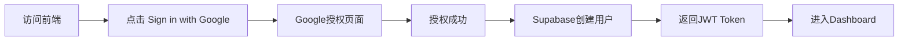

# Google OAuth 登录与角色管理指南

## 📌 核心说明

本系统采用 **Google OAuth 一键登录**，所有用户（包括管理员）都通过 Google 账号进行身份认证。

---

## 🔐 登录流程

### 用户登录体验



### 技术实现

1. **前端触发**
   ```typescript
   // 用户点击Google登录按钮
   await supabase.auth.signInWithOAuth({
     provider: 'google',
     options: {
       redirectTo: `${window.location.origin}/auth/callback`
     }
   });
   ```

2. **Supabase处理**
   - 跳转到Google OAuth授权页面
   - 用户完成Google授权
   - Google回调到Supabase
   - Supabase创建/更新用户记录
   - 生成JWT Token

3. **用户记录结构**
   ```json
   {
     "id": "953eaab0-790b-4c39-a162-85a30850a943",
     "email": "user@gmail.com",
     "app_metadata": {
       "provider": "google",
       "providers": ["google"]
     },
     "user_metadata": {
       "avatar_url": "https://lh3.googleusercontent.com/...",
       "email": "user@gmail.com",
       "full_name": "User Name",
       "provider_id": "1234567890"
     }
   }
   ```

---

## 👑 管理员设置流程

### 完整步骤

#### 步骤1: 用户首次Google登录
```
1. 访问: https://preview.example.com (preview) 或 https://www.example.com (生产)
2. 点击: "Sign in with Google"
3. 选择: 目标Google账号
4. 授权: 允许应用访问基本信息
5. 结果: 自动创建为普通用户
```

**重要**: 此时用户的 `app_metadata` 中**没有** `role` 字段

#### 步骤2: 在Supabase中设置管理员角色

**方法A: 通过Dashboard (推荐)**

1. 登录 [Supabase Dashboard](https://jzzvizacfyipzdyiqfzb.supabase.co)

2. 导航到 **Authentication** → **Users**

3. 找到目标用户（通过email识别）

4. 点击用户进入详情页

5. 找到 **App Metadata** 部分（不是User Metadata）

6. 点击编辑，添加JSON：
   ```json
   {
     "role": "super-admin",
     "provider": "google",
     "providers": ["google"]
   }
   ```

7. 保存更改

**方法B: 通过SQL**

```sql
-- 更新用户角色
UPDATE auth.users
SET raw_app_meta_data =
  raw_app_meta_data || '{"role": "super-admin"}'::jsonb
WHERE email = 'admin@gmail.com'
  AND raw_user_meta_data->>'provider' = 'google';

-- 验证更新结果
SELECT
  id,
  email,
  raw_app_meta_data->>'role' as role,
  raw_user_meta_data->>'provider' as provider,
  raw_user_meta_data->>'full_name' as name
FROM auth.users
WHERE email = 'admin@gmail.com';
```

**方法C: 通过API (Node.js)**

```javascript
const https = require('https');

const config = {
  projectRef: 'jzzvizacfyipzdyiqfzb',
  serviceRoleKey: 'YOUR_SERVICE_ROLE_KEY',
  targetEmail: 'admin@gmail.com'
};

// 查找用户
function findUser() {
  return new Promise((resolve, reject) => {
    const options = {
      hostname: `${config.projectRef}.supabase.co`,
      path: `/auth/v1/admin/users?email=${encodeURIComponent(config.targetEmail)}`,
      method: 'GET',
      headers: {
        'apikey': config.serviceRoleKey,
        'Authorization': `Bearer ${config.serviceRoleKey}`
      }
    };

    https.request(options, (res) => {
      let data = '';
      res.on('data', chunk => data += chunk);
      res.on('end', () => {
        const users = JSON.parse(data).users || [];
        const googleUser = users.find(u =>
          u.app_metadata?.provider === 'google'
        );
        resolve(googleUser);
      });
    }).on('error', reject).end();
  });
}

// 设置管理员
async function setAdmin() {
  const user = await findUser();
  if (!user) {
    throw new Error('用户未通过Google登录');
  }

  const body = JSON.stringify({
    app_metadata: { ...user.app_metadata, role: 'super-admin' }
  });

  // 更新用户 (实现略)
  console.log(`✅ ${user.email} 已设置为管理员`);
}
```

#### 步骤3: 用户重新登录

**关键**: 角色变更需要刷新JWT Token才能生效

```
方式1: 用户手动退出并重新登录
  1. 点击用户头像 → Sign Out
  2. 重新点击 "Sign in with Google"
  3. 选择相同的Google账号

方式2: 清除浏览器缓存
  1. 打开浏览器开发者工具 (F12)
  2. Application → Storage → Clear site data
  3. 刷新页面 (F5)

方式3: 编程方式刷新Token (可选)
  await supabase.auth.refreshSession();
```

---

## 🔍 验证管理员角色

### 方法1: 在Supabase Dashboard查看

```
Authentication → Users → 点击用户 → 查看 App Metadata

应该看到:
{
  "provider": "google",
  "providers": ["google"],
  "role": "super-admin"  ← 管理员标识
}
```

### 方法2: 通过SQL查询

```sql
SELECT
  email,
  raw_app_meta_data->>'role' as role,
  raw_app_meta_data->>'provider' as provider,
  created_at
FROM auth.users
WHERE raw_app_meta_data->>'role' = 'super-admin';
```

### 方法3: 在浏览器Console测试

```javascript
// 登录后在前端Console执行
const session = await supabase.auth.getSession();
const user = session.data.session?.user;

console.log('User Email:', user?.email);
console.log('Provider:', user?.app_metadata?.provider);
console.log('Role:', user?.app_metadata?.role);
console.log('Is Admin:', user?.app_metadata?.role === 'super-admin');
```

---

## ⚠️ 常见问题

### Q1: 为什么修改角色后前端没有变化？

**原因**: JWT Token是在登录时生成的，包含用户的角色信息。修改数据库不会自动更新已有的Token。

**解决方案**:
```javascript
// 方式1: 用户退出重新登录
await supabase.auth.signOut();

// 方式2: 刷新Session (推荐)
const { data, error } = await supabase.auth.refreshSession();
if (!error) {
  window.location.reload();
}
```

### Q2: 能否在用户首次登录时就设置为管理员？

**不能直接实现**，因为：
1. Google OAuth回调由Supabase处理
2. 用户创建时默认没有自定义角色
3. 必须在用户创建后手动设置

**变通方案**:
- 维护一个"预授权管理员邮箱列表"
- 使用Supabase Database Webhooks监听用户创建事件
- 自动为匹配的邮箱设置管理员角色

```sql
-- 创建触发器函数
CREATE OR REPLACE FUNCTION public.set_admin_role()
RETURNS TRIGGER AS $$
BEGIN
  -- 预授权的管理员邮箱列表
  IF NEW.email IN (
    'admin1@gmail.com',
    'admin2@gmail.com',
    'yj2008ay611@gmail.com'
  ) THEN
    NEW.raw_app_meta_data = NEW.raw_app_meta_data || '{"role": "super-admin"}'::jsonb;
  END IF;
  RETURN NEW;
END;
$$ LANGUAGE plpgsql SECURITY DEFINER;

-- 创建触发器
CREATE TRIGGER on_auth_user_created
  BEFORE INSERT ON auth.users
  FOR EACH ROW
  EXECUTE FUNCTION public.set_admin_role();
```

### Q3: 如何批量设置管理员？

```sql
-- 批量更新多个Google用户为管理员
UPDATE auth.users
SET raw_app_meta_data =
  raw_app_meta_data || '{"role": "super-admin"}'::jsonb
WHERE email = ANY(ARRAY[
  'admin1@gmail.com',
  'admin2@gmail.com',
  'admin3@gmail.com'
])
AND raw_user_meta_data->>'provider' = 'google';

-- 查看批量更新结果
SELECT
  email,
  raw_app_meta_data->>'role' as role,
  updated_at
FROM auth.users
WHERE raw_app_meta_data->>'role' = 'super-admin'
ORDER BY updated_at DESC;
```

### Q4: Google登录失败怎么办？

**检查清单**:
1. ✅ Supabase项目中是否启用了Google OAuth Provider
2. ✅ Google OAuth Client ID和Secret是否正确配置
3. ✅ 重定向URI是否在Google Console中添加
4. ✅ 用户的Google账号是否可正常访问

**Supabase配置验证**:
```
Dashboard → Authentication → Providers → Google
- Enabled: ✅
- Client ID: (已配置)
- Client Secret: (已配置)
- Authorized redirect URIs:
  - https://jzzvizacfyipzdyiqfzb.supabase.co/auth/v1/callback
```

---

## 🎯 最佳实践

### 1. 管理员邮箱管理

**推荐**: 创建一个独立表存储管理员配置

```sql
-- 创建管理员配置表
CREATE TABLE public.admin_config (
  id SERIAL PRIMARY KEY,
  email TEXT UNIQUE NOT NULL,
  granted_by UUID REFERENCES auth.users(id),
  granted_at TIMESTAMP WITH TIME ZONE DEFAULT NOW(),
  notes TEXT
);

-- 启用RLS
ALTER TABLE public.admin_config ENABLE ROW LEVEL SECURITY;

-- 只有管理员可以查看
CREATE POLICY "Admins can view admin config"
ON public.admin_config FOR SELECT
USING (
  auth.jwt()->>'app_metadata'->>'role' = 'super-admin'
);
```

### 2. 角色变更审计

```sql
-- 创建角色变更日志表
CREATE TABLE public.role_change_audit (
  id SERIAL PRIMARY KEY,
  user_id UUID NOT NULL,
  user_email TEXT NOT NULL,
  old_role TEXT,
  new_role TEXT,
  changed_by UUID REFERENCES auth.users(id),
  changed_at TIMESTAMP WITH TIME ZONE DEFAULT NOW(),
  reason TEXT
);
```

### 3. 前端用户体验优化

```typescript
// 检测角色变更并提示用户刷新
async function checkRoleUpdate() {
  const { data: session } = await supabase.auth.getSession();
  const currentRole = session?.user?.app_metadata?.role;

  // 从服务端获取最新角色
  const { data: latestUser } = await supabase.auth.getUser();
  const latestRole = latestUser?.user?.app_metadata?.role;

  if (currentRole !== latestRole) {
    // 提示用户刷新
    if (confirm('您的权限已更新，是否刷新页面以应用新权限？')) {
      await supabase.auth.refreshSession();
      window.location.reload();
    }
  }
}
```

---

## 📚 相关文档

- 📖 [RBAC实现指南](./RBAC-Implementation-Guide.md)
- 🧪 [快速测试手册](./RBAC-Quick-Test.md)
- 🏗️ [项目架构文档](./MustKnowV6.md)
- 🔐 [Supabase Auth文档](https://supabase.com/docs/guides/auth/social-login/auth-google)
