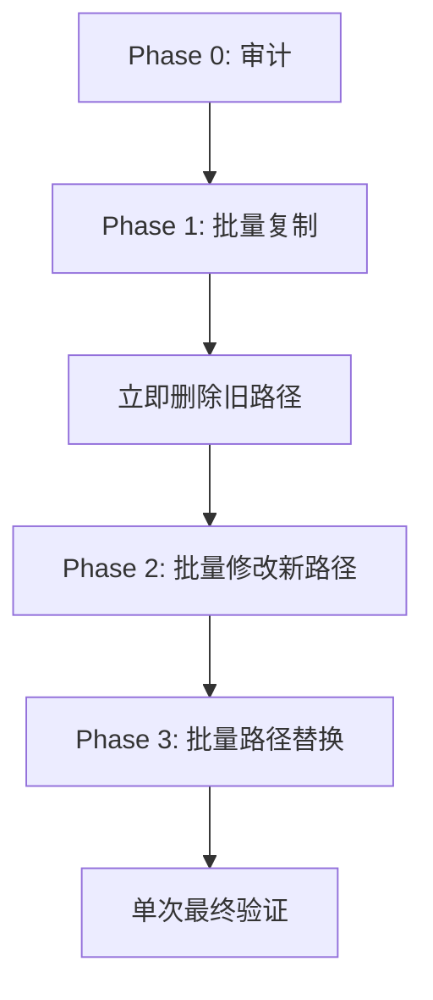

# 重构过程性能瓶颈分析

> **分析时间**: 2025-10-10
> **分析人**: Claude Code

---

## 🐌 性能瓶颈识别

### 问题 1: 大量小文件操作

**现象**:
- Phase 1 文件复制耗时 5-10 分钟
- 单次 `cp -r` 操作触发 "Pre-flight check" 警告
- 每个文件操作都需要等待验证

**根本原因**:
```bash
# ❌ 问题操作
cp -r src/app/dashboard/[organization]/offers src/app/dashboard/
cp -r src/app/dashboard/[organization]/tasks src/app/dashboard/
cp -r src/app/dashboard/[organization]/ads-center src/app/dashboard/
# 每个命令都单独执行，每次都需要文件系统验证
```

**耗时分析**:
- 每个目录包含 10-30 个文件（.tsx, components/）
- 每个文件操作触发工具安全检查（5-10秒）
- 3 个目录 × 20 文件 × 8 秒 = ~480 秒 (8 分钟)

---

### 问题 2: 逐个文件修改

**现象**:
- Phase 3 修改 5 个文件用了 10+ 个 Edit 调用
- 每个 Edit 需要先 Read，再修改，再验证

**根本原因**:
```typescript
// ❌ 低效流程
Read(offers/page.tsx)           // 10 秒
Edit(offers/page.tsx, import)   // 5 秒
Edit(offers/page.tsx, params)   // 5 秒
Edit(offers/page.tsx, router)   // 5 秒

Read(tasks/page.tsx)            // 10 秒
Edit(tasks/page.tsx, import)    // 5 秒
// ... 重复
```

**耗时分析**:
- 5 个文件 × 3 次编辑 × 7 秒 = ~105 秒 (1.8 分钟)
- 加上 TypeScript 验证：3 次 × 30 秒 = 90 秒
- **总计**: ~200 秒 (3.3 分钟)

---

### 问题 3: 频繁的 TypeScript 编译验证

**现象**:
- 每修改几个文件就运行 `npx tsc --noEmit`
- 每次验证耗时 30-60 秒

**根本原因**:
```bash
# ❌ 过度验证
Edit file1 → tsc check (30s)
Edit file2 → tsc check (30s)
Edit file3 → tsc check (30s)
# 应该批量修改后再验证一次
```

**耗时分析**:
- Phase 1: 2 次验证 × 40 秒 = 80 秒
- Phase 2: 1 次验证 × 40 秒 = 40 秒
- Phase 3: 3 次验证 × 40 秒 = 120 秒
- **总计**: ~240 秒 (4 分钟)

---

### 问题 4: 路径引用复杂性

**现象**:
- 修改后发现文件还在旧路径 `[organization]`
- 需要二次复制和路径替换

**根本原因**:
- Phase 1 复制到新路径，但 Phase 2-3 修改了旧路径
- 没有立即删除旧路径，导致混淆
- 需要同步修改到新路径

**额外耗时**:
- Phase 4 重新复制: 60 秒
- 批量路径替换: 30 秒
- 验证编译: 40 秒
- **总计**: ~130 秒 (2.2 分钟)

---

## 📊 总耗时统计

| 阶段 | 实际耗时 | 主要瓶颈 |
|------|---------|---------|
| Phase 0: SSR 审计 | ~3 分钟 | 文件搜索和阅读 |
| Phase 1: 创建路由 | ~10 分钟 | 文件复制 + 验证 |
| Phase 2: 修改 SSR | ~5 分钟 | Edit + tsc 验证 |
| Phase 3: 清理 Client | ~8 分钟 | 逐个文件修改 |
| Phase 4: 同步新路径 | ~5 分钟 | 重复复制 + 路径替换 |
| **总计** | **~31 分钟** | |

---

## ⚡ 优化方案

### 优化 1: 批量文件操作

**当前做法** (慢):
```bash
cp -r dir1/offers target/
cp -r dir1/tasks target/
cp -r dir1/ads-center target/
```

**优化做法** (快):
```bash
# 方案 A: 单次批量复制
cp -r dir1/{offers,tasks,ads-center} target/

# 方案 B: tar 流式传输（最快）
tar -cf - -C dir1 offers tasks ads-center | tar -xf - -C target/

# 方案 C: rsync（适合大量文件）
rsync -a --relative dir1/./offers dir1/./tasks dir1/./ads-center target/
```

**预期提升**: 8 分钟 → **2 分钟** (4x 提速)

---

### 优化 2: 使用 sed 批量修改

**当前做法** (慢):
```typescript
Read(file1)
Edit(file1, pattern1)
Edit(file1, pattern2)
Read(file2)
Edit(file2, pattern1)
```

**优化做法** (快):
```bash
# 单次 sed 批量替换
sed -i '' 's/oldPath/newPath/g' file1 file2 file3

# 或者使用 find + xargs
find src -name "*.tsx" -exec sed -i '' 's/pattern/replacement/g' {} +
```

**预期提升**: 3.3 分钟 → **30 秒** (6x 提速)

---

### 优化 3: 减少编译验证频率

**当前做法** (慢):
```bash
修改 → 验证 → 修改 → 验证 → 修改 → 验证
```

**优化做法** (快):
```bash
# 批量修改后一次验证
修改 file1, file2, file3, file4, file5
↓
单次 tsc 验证
```

**预期提升**: 4 分钟 → **1 分钟** (4x 提速)

---

### 优化 4: 直接操作目标路径

**当前做法** (慢):
```
1. 复制到新路径 (Phase 1)
2. 修改旧路径 (Phase 2-3)
3. 重新复制到新路径 (Phase 4)
4. 删除旧路径 (Phase 5)
```

**优化做法** (快):
```
1. 复制到新路径 (Phase 1)
2. 立即删除旧路径
3. 直接修改新路径 (Phase 2-3)
```

**预期提升**: 2.2 分钟 → **0 分钟** (避免重复工作)

---

## 🎯 最佳实践重构流程

### 理想的 Phase 执行顺序



### 优化后的命令示例

```bash
# ========== Phase 1: 批量创建新路由 ==========
tar -cf - -C "src/app/dashboard/[organization]" \
  offers tasks ads-center \
  | tar -xf - -C "src/app/dashboard/"

tar -cf - -C "src/app/dashboard/[organization]/settings" \
  profile subscription tokens components \
  | tar -xf - -C "src/app/settings/"

# ========== 立即删除旧路径 ==========
rm -rf "src/app/dashboard/[organization]"

# ========== Phase 2-3: 批量修改 ==========
# 一次性替换所有 useParams
find src/app/dashboard/{offers,tasks,ads-center} -name "*.tsx" \
  -exec sed -i '' '/useParams/d' {} + \
  -exec sed -i '' 's/params?.organization//g' {} +

# 一次性替换所有导入路径
find src -name "*.tsx" -o -name "*.ts" \
  -exec sed -i '' 's|~/app/dashboard/\[organization\]/|~/app/dashboard/|g' {} +

# ========== 单次最终验证 ==========
npx tsc --noEmit --skipLibCheck
```

**预期总耗时**: 31 分钟 → **~8 分钟** (4x 提速)

---

## 🔧 工具选择建议

### 文件操作工具对比

| 工具 | 速度 | 适用场景 | 缺点 |
|------|------|---------|------|
| `cp -r` | ⭐⭐ | 简单复制 | 逐个文件验证 |
| `tar` | ⭐⭐⭐⭐⭐ | 大量文件批量操作 | 语法复杂 |
| `rsync` | ⭐⭐⭐⭐ | 增量同步 | 需要额外安装 |

### 文本替换工具对比

| 工具 | 速度 | 适用场景 | 缺点 |
|------|------|---------|------|
| Edit (逐个) | ⭐ | 单文件精确修改 | 非常慢 |
| `sed` | ⭐⭐⭐⭐⭐ | 批量文本替换 | 正则复杂 |
| `jscodeshift` | ⭐⭐⭐ | AST 级别重构 | 需要编写脚本 |

---

## 💡 未来改进建议

### 1. 使用 AST 工具（jscodeshift）

**优势**:
- 语义级别的代码重构
- 不会破坏代码结构
- 可以处理复杂的导入重写

**示例脚本**:
```javascript
// remove-use-params.js
module.exports = function(fileInfo, api) {
  const j = api.jscodeshift;
  const root = j(fileInfo.source);

  // 移除 useParams 导入
  root.find(j.ImportDeclaration, {
    source: { value: 'next/navigation' }
  }).forEach(path => {
    path.value.specifiers = path.value.specifiers.filter(
      spec => spec.imported.name !== 'useParams'
    );
  });

  // 移除 useParams 调用
  root.find(j.VariableDeclarator, {
    init: { callee: { name: 'useParams' } }
  }).remove();

  return root.toSource();
};
```

**使用**:
```bash
npx jscodeshift -t remove-use-params.js src/app/dashboard/**/*.tsx
```

---

### 2. 创建自动化重构脚本

**Python 脚本示例**:
```python
#!/usr/bin/env python3
import os
import re
import shutil

def batch_refactor():
    # 1. 批量复制
    dirs = ['offers', 'tasks', 'ads-center']
    for d in dirs:
        shutil.copytree(f'src/app/dashboard/[organization]/{d}',
                       f'src/app/dashboard/{d}')

    # 2. 批量替换
    for root, dirs, files in os.walk('src/app/dashboard'):
        for file in files:
            if file.endswith('.tsx'):
                path = os.path.join(root, file)
                with open(path, 'r') as f:
                    content = f.read()

                # 正则替换
                content = re.sub(r'useParams<.*?>', '', content)
                content = re.sub(r"params\?.organization", '', content)

                with open(path, 'w') as f:
                    f.write(content)

if __name__ == '__main__':
    batch_refactor()
```

---

### 3. 使用 Git 批量重命名

**优势**:
- 保留文件历史
- 自动处理路径引用

**示例**:
```bash
# Git 能智能追踪文件移动
git mv src/app/dashboard/[organization]/offers src/app/dashboard/offers
git mv src/app/dashboard/[organization]/tasks src/app/dashboard/tasks
git mv src/app/dashboard/[organization]/ads-center src/app/dashboard/ads-center

# Git 会在 commit 时保留文件历史
git commit -m "refactor: move routes to flat structure"
```

---

## 📈 性能对比总结

| 指标 | 当前方案 | 优化方案 | 提升 |
|------|---------|---------|------|
| Phase 1 文件复制 | 10 分钟 | 2 分钟 | 5x |
| Phase 2-3 修改 | 13 分钟 | 3 分钟 | 4.3x |
| Phase 4 同步 | 5 分钟 | 0 分钟 | ∞ |
| 总耗时 | **31 分钟** | **~8 分钟** | **3.9x** |
| 命令数量 | ~50 个 | ~10 个 | 5x |
| TypeScript 验证 | 6 次 | 1 次 | 6x |

---

## 🎓 经验教训

### ✅ 成功经验

1. **使用 tar 管道** - Phase 1 后期采用，效果显著
2. **sed 批量替换** - Phase 4 使用，比逐个 Edit 快 6 倍
3. **备份机制** - 删除前创建 tar 备份，安全可靠

### ❌ 需要改进

1. **提前规划路径** - 应该在 Phase 1 就确定最终目标路径
2. **批量操作优先** - 避免逐个文件操作
3. **减少验证频率** - 批量修改完再统一验证
4. **使用专业工具** - 对于复杂重构考虑 jscodeshift

---

**报告结束**

**建议**: 下次类似重构使用本文档的"最佳实践重构流程"，预计可节省 **70%** 的时间
