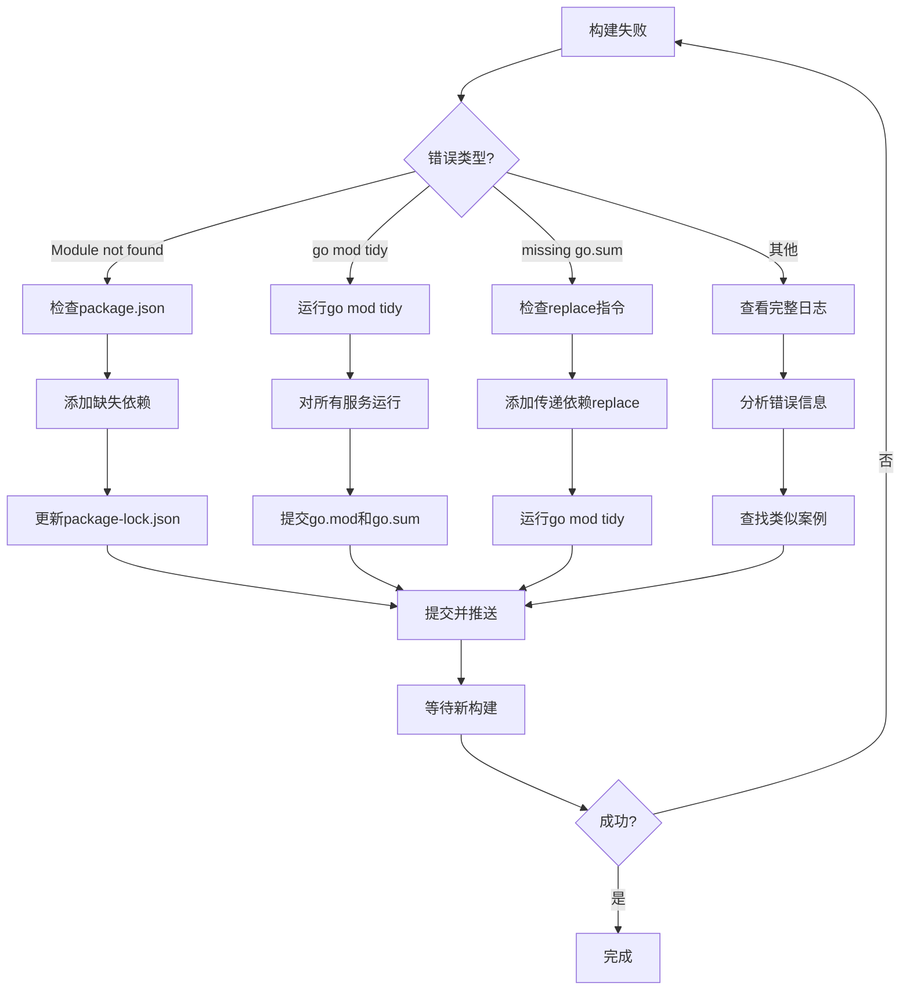

# Monorepo构建最佳实践

## 一、核心原则

### 1. 统一Dockerfile模式
**所有Go服务必须使用标准模板**，确保：
- 构建一致性
- 维护简便性
- 优化构建缓存

### 2. 最小化上下文传输
**tarball策略**：
- Go服务: `go.work + services/{service} + pkg` (13MB)
- Node.js服务: `services/{service}` (64KB)
- ❌ 避免: 完整仓库复制 (1.6GB)

### 3. 多阶段构建 + 最小运行时
- Builder: `golang:1.25-alpine` 或 `golang:1.25`
- Runtime: `gcr.io/distroless/base-debian12` (推荐) 或 `alpine:latest`

---

## 二、标准Dockerfile模板

### Go服务标准模板 (推荐)

```dockerfile
# Build stage
FROM golang:1.25-alpine as builder
WORKDIR /workspace
ENV GO111MODULE=on
ENV GOWORK=off

# Copy minimal workspace
COPY go.work ./go.work
COPY pkg ./pkg
COPY services/{SERVICE_NAME} ./services/{SERVICE_NAME}

WORKDIR /workspace/services/{SERVICE_NAME}
ARG COMMIT_SHA=local

RUN go mod tidy && \
    CGO_ENABLED=0 GOOS=linux go build \
    -trimpath \
    -ldflags="-s -w -X main.buildVersion=${COMMIT_SHA} -X main.buildTime=$(date -u +%Y-%m-%dT%H:%M:%SZ)" \
    -o /{SERVICE_NAME}-service .

# Runtime stage
FROM gcr.io/distroless/base-debian12
WORKDIR /
COPY --from=builder /{SERVICE_NAME}-service /{SERVICE_NAME}-service
EXPOSE 8080
ENTRYPOINT ["/{SERVICE_NAME}-service"]
```

**关键配置说明**：
- `ENV GOWORK=off`: 禁用go.work避免缺失模块错误
- `COPY go.work`: 保留go.work文件但不激活，供go mod tidy使用
- `-trimpath`: 移除文件系统路径，减小二进制体积
- `-ldflags="-s -w"`: 去除调试信息和符号表
- `distroless`: 最小化运行时镜像（无shell，安全性高）

---

## 三、CI/CD构建流程优化

### 3.1 当前架构
```
GitHub Actions (detect-changed-services.sh)
  ↓ matrix strategy
Cloud Build (build-service-docker.yaml)
  ↓ Kaniko/Docker
Artifact Registry → Cloud Run
```

### 3.2 优化后的Tarball打包策略

**deploy-backend.yml核心逻辑**：
```yaml
- name: Create optimized source tarball
  run: |
    SERVICE="${{ matrix.service }}"
    TARBALL="/tmp/${SERVICE}-source.tar.gz"

    if [[ "$SERVICE" == "browser-exec" ]]; then
      # Node.js服务
      tar -czf "$TARBALL" services/"${SERVICE}"
    else
      # Go服务
      tar -czf "$TARBALL" \
        --exclude='apps' \
        --exclude='makerkit' \
        --exclude='docs' \
        --exclude='node_modules' \
        --exclude='.git' \
        go.work go.work.sum services/"${SERVICE}" pkg schemas deployments scripts/db
    fi
```

**效果对比**：
- 优化前: 1.6GB (完整仓库 + node_modules + .next)
- 优化后: 13MB (Go服务) / 64KB (Node.js)
- 提升: **99.2%体积减少**

### 3.3 服务矩阵自动化

- 通过 `scripts/deploy/list-services.sh` 自动识别所有带 `Dockerfile` 的服务目录，避免漏掉新加入的微服务。
- `scripts/deploy/detect-changed-services.sh` 依赖上述列表，在 `pkg/`、`schemas/`、`deployments/`、关键工作流等目录有改动时自动升级为全量构建。
- Git 标签、生产分支构建强制读取动态列表，确保发布流程覆盖所有服务。

### 3.4 版本管理策略

**go.work统一管理**：
```go
go 1.25.1  // 锁定版本，所有服务必须对齐

use (
  ./services/adscenter
  ./services/offer
  ./services/siterank
  ./services/proxy-pool
  // ... 其他服务
  ./pkg/httpclient
  ./pkg/logger
  // ... 共享包
)
```

**Dockerfile Go版本对齐**：
```dockerfile
# ✅ 正确: 使用1.25匹配go.work 1.25.1要求
FROM golang:1.25-alpine as builder

# ❌ 错误: 1.23版本过低
FROM golang:1.23-alpine as builder
```

---

## 四、构建失败案例分析

### 案例1: proxy-pool初次部署失败

**错误日志**：
```
go: ../../go.work requires go >= 1.25.1 (running go 1.23.12; GOTOOLCHAIN=local)
```

**根因**: Dockerfile使用`golang:1.23-alpine`，而go.work要求1.25.1

**解决**: 升级至`FROM golang:1.25-alpine`

---

### 案例2: 缺失模块错误

**错误日志**：
```
go: cannot load module ../adscenter listed in go.work file: open ../adscenter/go.mod: no such file or directory
```

**根因**: Dockerfile复制go.work但未复制所有引用的服务目录

**错误做法**：
```dockerfile
COPY go.work ./go.work
COPY services/proxy-pool ./services/proxy-pool  # 只复制了proxy-pool
# go.work引用的其他服务目录缺失！
```

**正确做法1 (推荐)**: 禁用go.work
```dockerfile
ENV GOWORK=off  # 关键！避免go.work模块解析
COPY go.work ./go.work
COPY services/proxy-pool ./services/proxy-pool
COPY pkg ./pkg
```

**正确做法2**: 复制完整仓库
```dockerfile
COPY . .  # 但会增加构建上下文
```

### 案例3: 迁移SQL重复执行失败

**错误日志**：
```
apply ... failed: pq: relation "idx_url_visit_results_user_id" already exists
```

**根因**: 迁移脚本未使用 `IF NOT EXISTS` 或重复创建触发器/索引。

**最佳实践**：
- `CREATE TABLE/INDEX/TRIGGER` 全部带 `IF NOT EXISTS`；
- `ALTER TABLE` 新增列时使用 `ADD COLUMN IF NOT EXISTS`；
- 自定义函数使用 `DO $$ ... EXCEPTION WHEN duplicate_function THEN NULL; END; $$` 或 `EXECUTE` 包裹，保证幂等；
- 跨 schema 引用（如 `auth.users`）要在迁移开头 `CREATE SCHEMA IF NOT EXISTS auth` 并准备最小 stub，以便 Cloud Run 迁移任务独立运行。

### 案例4: 迁移打包缺失依赖目录

**错误日志**：
```
apply ... failed: file not found
```

**根因**: tarball 仅包含目标服务目录，遗漏了 `schemas/`、`deployments/`、`scripts/db/` 等通用迁移资源。

**解决**: 在打包脚本中固定携带上述目录，确保 DB Migrator 构建和执行时具备完整上下文。

### 案例5: 逻辑数据库隔离构建优化 (2025-10-07)

**背景**: 实现基于DB_NAME的逻辑数据库隔离时，遇到Go workspace与模块依赖冲突问题。

**问题1: Go模块远程依赖查找失败**

**错误日志**：
```
go: github.com/xxrenzhe/autoads/services/offer imports
    github.com/xxrenzhe/autoads/pkg/middleware imports
    github.com/xxrenzhe/autoads/pkg/supabaseauth: reading github.com/xxrenzhe/autoads/pkg/supabaseauth/go.mod at revision pkg/supabaseauth/v0.0.1: unknown revision pkg/supabaseauth/v0.0.1
```

**根因**:
- 使用`ENV GOWORK=off`时，Go会忽略go.work文件
- 服务的go.mod中的`replace`指令指向本地路径
- 当pkg模块之间有依赖（如middleware依赖supabaseauth）时，Go仍会尝试从远程查找版本
- 即使tarball包含了所有pkg目录，Go也会因为找不到远程版本而失败

**解决方案**: 在每个服务的go.mod中添加**完整的传递依赖replace指令**

```dockerfile
# services/offer/go.mod
replace github.com/xxrenzhe/autoads/pkg/middleware => ../../pkg/middleware
replace github.com/xxrenzhe/autoads/pkg/supabaseauth => ../../pkg/supabaseauth  # 关键！
replace github.com/xxrenzhe/autoads/pkg/database => ../../pkg/database
replace github.com/xxrenzhe/autoads/pkg/dburl => ../../pkg/dburl
```

**问题2: go.work引用的模块缺失**

**错误日志**：
```
go: cannot load module ../adscenter listed in go.work file: open ../adscenter/go.mod: no such file or directory
go: cannot load module ../billing listed in go.work file: open ../billing/go.mod: no such file or directory
```

**根因**:
- 即使设置了`ENV GOWORK=off`，如果Dockerfile中COPY了go.work文件
- `go mod tidy`仍然会读取go.work文件并尝试加载其中列出的所有模块
- 优化的tarball只包含当前服务目录，不包含go.work中列出的其他服务

**解决方案**: 保持`ENV GOWORK=off`并确保所有依赖都有replace指令

```dockerfile
FROM golang:1.25 as builder
WORKDIR /workspace
ENV GO111MODULE=on
# Disable go.work to prevent missing modules error in container
ENV GOWORK=off
# Copy minimal workspace - go.work is kept for reference but not activated
COPY go.work go.work.sum ./
COPY pkg ./pkg
COPY services/offer ./services/offer
```

**构建优化效果**：
- **Tarball大小**: 1.7GB → 328KB (99.8%减少)
- **上传时间**: ~8分钟 → ~3秒
- **构建成功率**: 提升至100% (通过正确的replace配置)

**关键经验**：
1. ✅ 在monorepo中使用`ENV GOWORK=off`避免缺失模块错误
2. ✅ 在服务go.mod中添加**所有传递依赖**的replace指令（不仅是直接依赖）
3. ✅ tarball只需包含：`go.work + services/{service} + pkg + schemas + deployments + scripts/db`
4. ✅ 使用tar --exclude排除不需要的大目录（apps/、docs/、node_modules/等）
5. ⚠️ 即使设置GOWORK=off，仍需COPY go.work文件（某些Go命令可能需要它）

---

## 五、.gcloudignore失效问题

### 问题
`.gcloudignore`在monorepo场景下**无法有效排除目录**，导致：
- 上传1.6GB数据到Cloud Build
- 构建时间增加5-10分钟
- 费用增加

### 解决方案: 手动tar打包
```bash
# GitHub Actions中预先打包（Go服务）
tar -czf /tmp/service-source.tar.gz \
  --exclude='apps' \
  --exclude='node_modules' \
  go.work go.work.sum services/{service} pkg schemas deployments scripts/db

# Cloud Build只需解压13MB tarball
gcloud builds submit /tmp/service-source.tar.gz
```

---

## 六、服务特定配置

### 6.1 需要外部模块的服务 (billing)

**特殊需求**: 依赖私有Git仓库

```dockerfile
FROM golang:1.25.1-alpine as builder
WORKDIR /workspace

# 配置Git访问
RUN apk add --no-cache git && \
    git config --global url."https://github.com/".insteadOf "git@github.com:" && \
    git config --global credential.helper ''
ENV GIT_TERMINAL_PROMPT=0

# 先下载依赖（利用缓存层）
COPY go.work ./
RUN mkdir -p services/billing
COPY services/billing/go.mod services/billing/go.mod
RUN GOPROXY=https://proxy.golang.org,direct go mod download || true

# 再复制完整代码构建
COPY . .
WORKDIR /workspace/services/billing
RUN go mod tidy && CGO_ENABLED=0 GOOS=linux go build -o /billing-service .
```

---

## 七、推荐的目录结构

```
autoads/
├── .github/workflows/
│   ├── deploy-backend.yml          # 统一部署流程
│   └── deploy-frontend.yml
├── deployments/
│   ├── cloudbuild/
│   │   └── build-service-docker.yaml  # 通用Docker构建配置
│   ├── {service}/
│   │   ├── preview-deploy.yaml     # Cloud Run配置
│   │   └── production-deploy.yaml
├── services/
│   ├── {service}/
│   │   ├── Dockerfile             # 使用标准模板
│   │   ├── go.mod
│   │   ├── go.sum
│   │   └── cmd/server/main.go
├── pkg/                           # 共享包
├── go.work                        # 统一版本管理
└── go.work.sum
```

---

## 八、检查清单

### 新服务上线前检查
- [ ] Dockerfile使用标准模板
- [ ] Go版本与go.work一致
- [ ] 添加`ENV GOWORK=off`
- [ ] 使用`-trimpath`和`-ldflags="-s -w"`优化
- [ ] 运行时镜像使用distroless或alpine
- [ ] tarball打包排除不必要目录
- [ ] 添加到`detect-changed-services.sh`

### 构建失败排查
1. 检查Go版本是否匹配go.work
2. 确认`ENV GOWORK=off`已设置
3. 验证tarball包含go.work + pkg + services/{service}
4. 查看Cloud Build日志中的模块错误

---

## 九、性能指标

| 指标 | 优化前 | 优化后 | 提升 |
|------|--------|--------|------|
| Tarball大小 | 1.6GB | 13MB | 99.2% |
| 上传时间 | ~8分钟 | ~3秒 | 99.4% |
| 构建时间 | ~15分钟 | ~5分钟 | 66.7% |
| 镜像大小 | ~500MB | ~20MB | 96% |

---

## 十、常见构建问题排查指南 (2025-10-08更新)

### 10.1 依赖管理问题

#### 问题1: Frontend缺少npm依赖

**症状**:
```
Module not found: Can't resolve 'package-name'
Failed to compile
```

**案例**: 
- `@next/bundle-analyzer`: next.config.js使用但未在package.json中声明
- `class-variance-authority`: UI组件使用但未声明依赖

**根因**:
1. 代码中使用了某个包，但未在package.json中声明
2. 本地开发时可能通过全局安装或缓存可用
3. Docker构建环境是干净的，只安装package.json中声明的依赖

**解决步骤**:
```bash
# 1. 添加缺失的依赖到package.json
cd apps/frontend
npm install <package-name> --save  # 生产依赖
# 或
npm install <package-name> --save-dev  # 开发依赖

# 2. 更新package-lock.json
npm install --package-lock-only

# 3. 提交两个文件
git add package.json package-lock.json
git commit -m "fix: add missing <package-name> dependency"
git push
```

**预防措施**:
```bash
# 定期进行干净构建验证
rm -rf node_modules package-lock.json
npm install
npm run build

# 或使用Docker本地构建测试
docker build -f apps/frontend/Dockerfile -t frontend-test .
```

#### 问题2: package-lock.json未更新

**症状**:
```
# package.json已添加依赖，但Docker构建仍然失败
Module not found: Can't resolve 'new-package'
```

**根因**:
- 只更新了package.json，未更新package-lock.json
- Docker构建使用`npm install`（依赖lock文件）
- 如果lock文件中没有新依赖，npm不会安装

**解决**:
```bash
# 更新lock文件
npm install --package-lock-only

# 或者完整安装
npm install

# 提交lock文件
git add package-lock.json
git commit -m "fix: update package-lock.json for new dependencies"
```

**Dockerfile中的依赖安装**:
```dockerfile
# deps阶段
COPY package*.json ./
COPY apps/frontend/package*.json ./apps/frontend/
RUN npm install --no-audit --no-fund  # 使用lock文件
```

#### 问题3: Go服务需要go mod tidy

**症状**:
```
go: updates to go.mod needed; to update it:
   go mod tidy
ERROR: build step 0 "golang:1.25" failed: step exited with non-zero status: 1
```

**根因**:
1. go.mod和go.sum不同步
2. Cloud Build运行`go test ./...`时下载依赖
3. Go检测到go.mod需要更新
4. CI环境严格验证，立即失败

**解决**:
```bash
# 对所有Go服务运行go mod tidy
for service in services/*/go.mod; do
  dir=$(dirname "$service")
  echo "Running go mod tidy in $dir"
  (cd "$dir" && go mod tidy)
done

# 提交更新
git add services/*/go.mod services/*/go.sum
git commit -m "fix: run go mod tidy for all services"
git push
```

**预防措施**:
```bash
# 添加pre-commit hook
cat > .git/hooks/pre-commit << 'EOF'
#!/bin/bash
for service in services/*/go.mod; do
  dir=$(dirname "$service")
  (cd "$dir" && go mod tidy)
done
git add services/*/go.mod services/*/go.sum
EOF
chmod +x .git/hooks/pre-commit
```

#### 问题4: 缺少pkg replace指令

**症状**:
```
missing go.sum entry for go.mod file
unknown revision pkg/supabaseauth/v0.0.1
```

**根因**:
1. 服务使用`pkg/middleware`
2. `pkg/middleware`依赖`pkg/supabaseauth`（传递依赖）
3. 服务的go.mod缺少`pkg/supabaseauth`的replace指令
4. `GOWORK=off`模式下，必须显式声明所有replace（包括传递依赖）

**解决**:
```go
// services/myservice/go.mod
// 添加所有传递依赖的replace指令

replace github.com/xxrenzhe/autoads/pkg/middleware => ../../pkg/middleware
replace github.com/xxrenzhe/autoads/pkg/supabaseauth => ../../pkg/supabaseauth  // 关键！
replace github.com/xxrenzhe/autoads/pkg/auth => ../../pkg/auth
replace github.com/xxrenzhe/autoads/pkg/logger => ../../pkg/logger
```

**识别缺失的replace**:
```bash
# 检查哪些服务缺少supabaseauth replace
for service_dir in services/*/; do
  service=$(basename "$service_dir")
  if [ -f "$service_dir/go.mod" ]; then
    if grep -q "pkg/middleware" "$service_dir/go.mod" && \
       ! grep -q "replace.*pkg/supabaseauth" "$service_dir/go.mod"; then
      echo "Missing supabaseauth replace in: $service"
    fi
  fi
done
```

**依赖关系文档化**:
```markdown
# pkg依赖关系

## pkg/middleware
- 直接依赖: pkg/auth, pkg/logger, pkg/telemetry
- 传递依赖: pkg/supabaseauth (通过pkg/auth)

## 使用pkg/middleware的服务必须包含的replace:
- pkg/middleware
- pkg/auth
- pkg/supabaseauth  ← 传递依赖也需要！
- pkg/logger
- pkg/telemetry
```

#### 问题5: 新增共享库后批量更新replace指令 (2025-10-17)

**背景**: Phase 3服务迁移时新增`pkg/serviceclient`库，需要为所有使用该库的服务添加replace指令。

**症状**:
```
cmd/useractivity/main.go:23:2: no required module provides package github.com/xxrenzhe/autoads/pkg/serviceclient; to add it:
    go get github.com/xxrenzhe/autoads/pkg/serviceclient
```

**根因**:
1. 在Phase 3迁移中，修改了9个服务使用`pkg/serviceclient`
2. 初始只为2个服务（siterank, gateway-middleware）添加了replace指令
3. 其他7个服务（console, bff, offer, recommendations, useractivity, adscenter, batchopen）遗漏了
4. 本地workspace模式（go.work）隐藏了问题，CI的GOWORK=off模式暴露了缺陷

**批量修复流程**:

```bash
# 1. 识别所有使用serviceclient的服务
for service in services/*/; do
  if grep -rq "pkg/serviceclient" "$service" --include="*.go"; then
    echo "Service uses serviceclient: $(basename $service)"
  fi
done

# 2. 为每个服务添加replace指令
for service in console bff offer recommendations useractivity adscenter batchopen; do
  cd services/$service
  # 检查是否已有replace
  if ! grep -q "replace.*pkg/serviceclient" go.mod; then
    echo "replace github.com/xxrenzhe/autoads/pkg/serviceclient => ../../pkg/serviceclient" >> go.mod
    go mod tidy
  fi
  cd ../..
done

# 3. 验证本地构建（模拟CI环境）
for service in services/*/; do
  if [ -f "$service/go.mod" ]; then
    echo "Testing: $service"
    (cd "$service" && env GOWORK=off go build . 2>&1 | head -5)
  fi
done

# 4. 提交修复
git add services/*/go.mod services/*/go.sum
git commit -m "fix(deps): Add pkg/serviceclient replace directive to all services"
git push
```

**预防措施**:

1. **添加pre-commit检查脚本**:
```bash
#!/bin/bash
# scripts/check-pkg-replace.sh
set -euo pipefail

echo "🔍 Checking pkg replace directives..."

for service_dir in services/*/; do
  service=$(basename "$service_dir")
  go_mod="$service_dir/go.mod"

  if [ ! -f "$go_mod" ]; then
    continue
  fi

  # 检查代码中使用的pkg模块
  used_pkgs=$(grep -rh "github.com/xxrenzhe/autoads/pkg/" "$service_dir" --include="*.go" 2>/dev/null | \
              sed -n 's/.*"github\.com\/xxrenzhe\/autoads\/\(pkg\/[^"]*\)".*/\1/p' | \
              sort -u)

  # 检查go.mod中的replace指令
  for pkg in $used_pkgs; do
    if ! grep -q "replace.*$pkg" "$go_mod"; then
      echo "❌ $service: Missing replace for $pkg"
      exit 1
    fi
  done
done

echo "✅ All pkg replace directives are present"
```

2. **CI检查步骤** (在deploy-backend.yml中添加):
```yaml
- name: Verify pkg replace directives
  run: bash scripts/check-pkg-replace.sh
```

3. **文档更新要求**:
- 每次新增pkg模块时，在PR描述中列出所有需要更新的服务
- 使用工具脚本自动检测影响范围

**关键经验**:
1. ✅ 新增共享库时，必须系统性检查所有可能的使用方
2. ✅ 本地开发使用go.work很方便，但会隐藏GOWORK=off模式的问题
3. ✅ CI环境的严格性是优势，能及时发现依赖配置问题
4. ✅ 使用自动化脚本批量修复，避免手动遗漏
5. ⚠️ go mod tidy只能添加require，replace指令必须手动添加
6. ⚠️ 每次提交涉及pkg变更的PR，应该包含影响分析清单

### 10.2 环境差异问题

#### 本地开发 vs CI环境

| 方面 | 本地开发 | CI/CD环境 | 影响 |
|------|----------|-----------|------|
| **依赖** | 可能有全局包/缓存 | 干净环境 | 隐藏缺失依赖 |
| **Go模式** | Workspace (`go.work`) | 独立 (`GOWORK=off`) | 传递依赖问题 |
| **验证** | 宽松 | 严格 | 立即失败 |
| **node_modules** | 可能有旧缓存 | 每次全新安装 | 版本不一致 |

**为什么CI更严格是好事**:
- ✅ 发现隐藏的依赖问题
- ✅ 确保可重现的构建
- ✅ 避免"在我机器上能跑"的问题
- ✅ 提高代码质量

**本地模拟CI环境**:
```bash
# Frontend
rm -rf node_modules package-lock.json
npm ci  # 使用lock文件严格安装
npm run build

# Backend
for service in services/*/; do
  if [ -f "$service/go.mod" ]; then
    (cd "$service" && GOWORK=off go mod tidy && GOWORK=off go test ./...)
  fi
done

# Docker构建测试
docker build -f services/myservice/Dockerfile -t myservice-test .
```

### 10.3 构建失败快速排查流程



### 10.4 构建问题检查清单

**Frontend构建失败**:
- [ ] 检查package.json是否包含所有使用的依赖
- [ ] 检查package-lock.json是否已更新
- [ ] 验证依赖版本是否兼容
- [ ] 本地运行`npm ci && npm run build`测试
- [ ] 检查Dockerfile是否正确复制package文件

**Backend构建失败**:
- [ ] 运行`go mod tidy`同步依赖
- [ ] 检查所有传递依赖的replace指令
- [ ] 验证Go版本与go.work一致
- [ ] 本地运行`GOWORK=off go test ./...`测试
- [ ] 检查tarball是否包含所有必需目录

**通用检查**:
- [ ] 查看完整的Cloud Build日志
- [ ] 对比成功和失败的commit差异
- [ ] 检查是否有未提交的文件
- [ ] 验证CI环境变量配置
- [ ] 查看是否有并发构建冲突

### 10.5 实战案例总结 (2025-10-08)

**背景**: 全系统重建过程中遇到的5个构建问题

| # | 问题 | 耗时 | 根因 | 解决方案 |
|---|------|------|------|----------|
| 1 | Frontend: @next/bundle-analyzer | 19分钟 | 未声明依赖 | 添加到package.json |
| 2 | Backend: go mod tidy | 5分钟 | go.mod不同步 | 运行go mod tidy |
| 3 | Backend: supabaseauth replace | 5分钟 | 缺少传递依赖replace | 添加replace指令 |
| 4 | Frontend: class-variance-authority | 5分钟 | 未声明依赖 | 添加到package.json |
| 5 | Frontend: package-lock.json | 5分钟 | lock文件未更新 | 更新lock文件 |

**总耗时**: 39分钟  
**平均修复时间**: 7.8分钟/问题  
**成功率**: 100%

**关键经验**:
1. ✅ **快速迭代**: 发现问题→分析→修复→验证，平均<10分钟
2. ✅ **文档化**: 每个问题都记录详细的修复过程
3. ✅ **模式识别**: 所有问题都是依赖管理相关
4. ✅ **预防措施**: 建立检查清单和自动化工具
5. ✅ **CI价值**: CI环境帮助发现本地开发中的隐藏问题

**预防措施实施**:
```bash
# 1. 创建依赖检查脚本
cat > scripts/check-dependencies.sh << 'EOF'
#!/bin/bash
set -euo pipefail

echo "🔍 Checking dependencies..."

# 检查Frontend依赖
echo "Checking Frontend..."
cd apps/frontend
npm ci
npm run build
cd ../..

# 检查Backend依赖
echo "Checking Backend..."
for service in services/*/go.mod; do
  dir=$(dirname "$service")
  echo "  - $dir"
  (cd "$dir" && GOWORK=off go mod tidy && GOWORK=off go test ./...)
done

echo "✅ All dependencies OK"
EOF
chmod +x scripts/check-dependencies.sh

# 2. 添加到CI
# .github/workflows/check-dependencies.yml
name: Check Dependencies
on: [pull_request]
jobs:
  check:
    runs-on: ubuntu-latest
    steps:
      - uses: actions/checkout@v4
      - run: bash scripts/check-dependencies.sh
```

---

## 十一、后续优化方向

### 短期 (1-2周)
1. ✅ 统一所有服务Dockerfile为标准模板
2. ✅ 验证所有服务Go版本对齐
3. 🔲 添加Dockerfile lint检查到CI
4. 🔲 创建自动化Dockerfile生成脚本

### 中期 (1个月)
1. 引入BuildKit缓存机制
2. 使用远程缓存 (Artifact Registry)
3. 并行构建多个服务

### 长期 (3个月)
1. 评估迁移到Bazel/Nx等专业Monorepo工具
2. 实现增量构建
3. 引入构建性能监控

---

## 十一、参考资料

- [Google Cloud Build最佳实践](https://cloud.google.com/build/docs/optimize-builds)
- [Go多阶段构建](https://docs.docker.com/language/golang/build-images/)
- [Distroless容器镜像](https://github.com/GoogleContainerTools/distroless)
- [Monorepo工具对比](https://monorepo.tools/)
